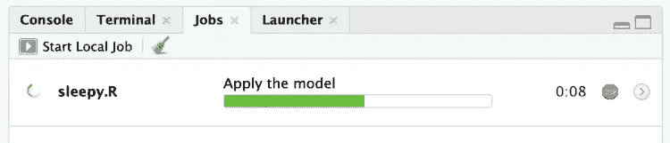
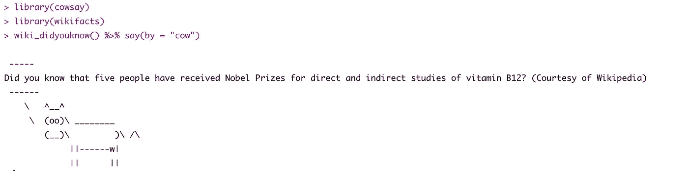
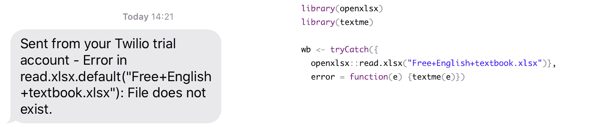

# 四种有趣的方式帮助您在研发中保持高效

> 原文：<https://towardsdatascience.com/four-fun-ways-to-help-you-stay-productive-in-r-4e9912c2363b?source=collection_archive---------61----------------------->

## 这四个想法将帮助你，如果你被困在等待长脚本完成

许多 R 程序员会证明他们坐在电脑前盯着 R 控制台，等待长脚本运行的情况。有时是因为他们担心某件事会失败，有时是因为他们在祈祷脚本会毫无错误地运行。

但是，如果您的脚本需要很长时间，您可能会变得非常低效。在您等待的同时，您可能正在编写其他 R 代码。在你的电脑上做一些其他的事情，或者甚至做一些完全不同的事情，比如去健身房，看书，或者学习一些新的东西。

这里有四个想法可以帮助你。

## 1.在你等待的时候写更多的 R 代码

许多 R 程序员——尤其是初学者——不知道如何在活动会话之外运行他们的代码，所以他们最终会在活动会话中运行他们的脚本，并等待它完成，然后才能进行更多的编码。

从 RStudio 1.2 开始，您可以利用*作业*功能。*作业*允许您在 rstu 迪奥内部的独立 R 会话中运行脚本。这将释放您的控制台，以便您可以继续处理其他代码，但也允许您在脚本运行时查看其进度。

要将脚本作为本地作业运行，请查找一个小下拉菜单，您可以在其中看到*源*按钮，然后选择“源为本地作业”。脚本运行时，您可以使用“作业”窗口中显示的绿色条来监视其进度，如果您用代码节(至少有三个尾随破折号的注释)对脚本进行注释，则“作业”窗口会在脚本中显示注释，以便您可以准确地看到脚本的位置。

RStudio 迪奥 1.2+中的“作业”窗口

## 2.在你等待的时候，学习一些新的事实

`wikifacts`包是一个简单的包，显示从维基百科主页随机选择的事实。您可以使用`install.packages("wikifacts")`从 CRAN 直接安装。

如果您偶尔将`wikifacts`中的命令插入到您的脚本中，您可以在等待脚本执行时阅读一些有趣的琐事。

对于随机事实，您只需要使用`wiki_randomfact()`，对于特定类型的事实，您可以使用`wiki_didyouknow()`、`wiki_onthisday()`和`wiki_inthenews()`。

事实将从今天的维基百科主页中提取出来，或者如果你愿意，你可以在上面的函数中指定前一个主页的日期作为参数。

`wikifacts`如果你真的想提升你的输出，你也可以很容易地进入其他有趣的显示工具，比如`cowsay`。

通过管道将 wikifacts 连接到 cowsay

## 3.多任务处理时获得通知

如果在脚本执行时你在 R 之外工作，你可以使用`beepr`包，当你的脚本完成或者某些部分完成时，你就可以播放噪声。在您安装并加载软件包之后，您可以使用`beep()`功能来播放一组简短的提示。例如，如果你像我一样是一个最终幻想迷，你会喜欢`beep("fanfare")`。

此外，`beep_on_error()`功能允许你指定一个表达式来测试，如果测试失败，你选择的声音将被播放。如果你在脚本中加入测试，这非常方便。

## 4.当您离开电脑时获得通知

当你设置了一个很长的脚本来运行，然后离开你的计算机去做别的事情，然后当你在几个小时后回来时，你发现它在五分钟后因为一些愚蠢的错误而失败了，这是多么令人沮丧。听起来熟悉吗？

有许多电子邮件包可以在你的脚本中发生事情时给你发送电子邮件，但我真的很喜欢`textme`包，它给你发送一条你选择的消息。

`textme`目前在 CRAN 上不可用，但是您可以使用`devtools::install_github("richpauloo/textme")`从 Github 安装它。您可以在这里找到完整的说明[，但基本上主要步骤如下:](https://github.com/richpauloo/textme)

1.  在这里建立一个`twilio`账户，验证自己并建立一个项目——一个试用账户就可以了。
2.  获取您的试用电话号码、SID 和令牌。
3.  使用`tm_configure()`功能输入您的凭证和您想要发送短信的目的地电话号码，即您的号码。
4.  使用`textme()`功能发送所需信息(如`textme("Awesome, your script just completed successfully!")`)。

下面是一个我如何使用`textme`来提醒我出错的例子:

左边的短信是由右边的代码发送的

编码时，你还用什么有趣的事情来帮助你避免浪费时间？

最初我是一名纯粹的数学家，后来我成为了一名心理计量学家和数据科学家。我热衷于将所有这些学科的严谨性应用到复杂的人的问题上。我也是一个编码极客和日本 RPG 的超级粉丝。在 [*LinkedIn*](https://www.linkedin.com/in/keith-mcnulty/) *或*[*Twitter*](https://twitter.com/dr_keithmcnulty)*上找我。也可以看看我在*[*drkeithmcnulty.com*](http://drkeithmcnulty.com/)*的博客。*

图片由[simpleprogrammer.com](https://simpleprogrammer.com/stuck-rut-programmer/)提供