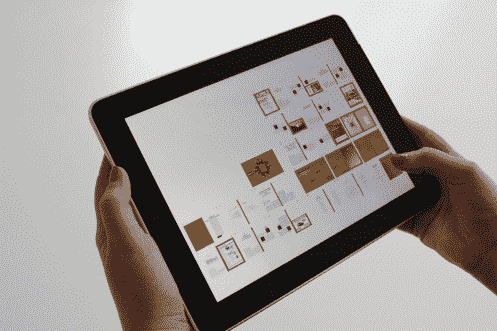

# 整合了数据科学和人种学的四个创新项目

> 原文：<https://towardsdatascience.com/four-innovative-projects-that-integrated-data-science-and-ethnography-3f469f804616?source=collection_archive---------44----------------------->

图片来自 [DarkoStojanovic](https://pixabay.com/photos/medical-appointment-doctor-563427/)

在之前的[文章](https://ethno-data.com/integrating-ethnography-and-data-science/)中，我已经讨论了整合[数据科学](https://ethno-data.com/what-is-data-science-and-machine-learning/)和[人种学](https://ethno-data.com/ethnography-summary/)的价值。在 LinkedIn 上，人们[评论](https://www.linkedin.com/posts/stephenpaff_integrating-ethnography-and-data-science-activity-6694239491533631488-DCgg/)说他们对此很感兴趣，希望听到更多关于潜在方法的细节。我回答说，“我发现解释如何进行将两者实际结合起来的研究，通过例子比抽象地演示更容易，因为如何做的细节会根据每个项目的具体需求而变化。”

在本文中，我打算这样做:分析四个在某种程度上整合了数据科学和人种学的创新项目。我希望这些能激发你的创造力，帮助你思考如何在你正在做的项目中创造性地组合它们。

# 简介:

1.没有展示模型:使用人种学设计机器学习软件([https://ethno-data.com/show-rate-predictor/](https://ethno-data.com/show-rate-predictor/))

2.网络敏感性研究:使用机器学习将民族志调查的范围扩大到更大的人群([https://ethno-data.com/masters-practicum-summary/](https://ethno-data.com/masters-practicum-summary/))

3.脸书新闻反馈民间理论:使用人种学来了解用户如何理解他们遇到的机器学习系统并对其做出反应，以及这如何反过来塑造有问题的机器学习算法的发展([https://dl.acm.org/doi/10.1145/2858036.2858494](https://dl.acm.org/doi/10.1145/2858036.2858494))

4.事物民族志:使用机器学习将物体的交互纳入民族志研究([https://dl.acm.org/doi/10.1145/2901790.2901905](https://dl.acm.org/doi/10.1145/2901790.2901905)和[https://www . semantic scholar . org/paper/Things-Making-Things % 3A-An-Ethnography-of-of-the-Giaccardi-Speed/2 db 5 feac 9cc 743767 FD 23 aeded 3 aa 555 EC 8683 a 4？p2df](https://www.semanticscholar.org/paper/Things-Making-Things%3A-An-Ethnography-of-the-Giaccardi-Speed/2db5feac9cc743767fd23aeded3aa555ec8683a4?p2df)

# 项目 1:没有展示模型

纽约市一家医院系统的医疗诊所要求我使用机器学习来建立一个[节目速率预测器](https://ethno-data.com/show-rate-predictor/)，以便为改进其调度实践提供信息。在最初的构建阶段，我使用人种学来更深入地理解诊所面临的调度问题，并确定适当的界面设计。

图片来自 [NASA](https://unsplash.com/photos/Q1p7bh3SHj8)

通过人种学调查，我发现了日程安排者在安排约会时问的最重要的问题。这个问题是，“在某一天被安排去看医生的人中，有多少人会真的出现？”然后我建立了一个机器学习模型来回答这个问题。我的人种学调查为我提供了数据科学项目的设计要求。

此外，我用我的人种学调查来设计界面。我观察了调度程序如何与他们当前的调度软件交互，这让我知道什么样的可视化对我的应用程序有用或没用。

该项目举例说明了人种学在确定机器学习算法需求的机器学习项目的开发阶段以及在向用户传达算法并评估其成功性的前端是如何有所帮助的。

作为一名民族志学者和数据科学家，我能够将我的民族志见解无缝地转化为机器学习建模和 API 规范，并且还进行了后续的民族志调查，以确保我构建的内容能够满足他们的需求。

图片来自 [Kon Karampelas](https://unsplash.com/photos/HUBofEFQ6CA)

# 项目 2:网络敏感性研究

我和 Indicia Consulting 一起进行了这个[项目](https://ethno-data.com/masters-practicum-summary/)。它的目标是探索个人能量消耗和他们与新技术的关系之间的潜在联系。这是一个使用人种学来探索和确定少数人的潜在社会和文化模式，然后使用数据科学来分析大量人口中的这些模式的例子。

我们通过观察和采访大约 30 名参与者开始了这个项目，但随着研究的进展，我们需要开发一种可扩展的方法来分析整个社区、县甚至州的模式。

人种学是深入探索一种现象和发展初始模式的伟大工具，但它是资源密集型的，因此很难在一大群人身上进行。分析成千上万的人是不实际的。另一方面，数据科学可以很容易地测试在较小的人种学研究中发现的整个群体模式的有效性，但因为它通常缺乏人种学的粒度，所以经常会错过复杂的模式。

人种学在确定已实现的机器学习模型及其产生的见解是否有实际意义方面也非常有用。这形成了一种迭代反馈循环，其中数据科学扩大了人种学的见解，而人种学将数据科学模型置于上下文中。

因此，人种学和数据科学很好地覆盖了彼此的弱点，形成了一个伟大的方法论组合，用于以深入理解客户、用户、同事或其他用户为中心的项目。

图片来自 [Pixabay](https://www.pexels.com/photo/app-business-connection-device-221185/)

# 项目 3:脸书新闻和民间理论

在他们的[研究](https://dl.acm.org/doi/10.1145/2858036.2858494)中，Motahhare Eslami 和她的研究团队进行了一项民族志调查，研究不同的脸书用户如何看待脸书新闻订阅如何选择哪些帖子/故事出现在他们的订阅顶部。他们分析了几种不同的“民间理论”或日常生活中人们的工作理论，作为机器学习系统选择头条新闻的标准。

用户对整个系统工作的看法会影响他们对新闻反馈的反应。例如，相信算法会优先考虑他们过去喜欢的朋友的帖子的用户通常会有意喜欢他们最亲密的朋友和家人的帖子，以便他们可以看到更多他们的帖子。

用户对 Newsfeed 算法如何工作的观点会影响他们对它的反应，这反过来会影响算法学习的数据，从而影响算法的发展。这创建了一个循环反馈回路，随着时间的推移，它会影响机器学习算法系统的开发。

他们的研究例证了理解人们如何思考、响应以及更广泛地与基于机器学习的软件系统相关的重要性。对人们与这种系统的互动进行民族志研究是发展这种理解的重要途径。

在某种程度上，许多机器学习算法在本质上是非常社会化的:它们——或者至少是它们所在的整体软件系统——往往基于人类如何与它们交互而成功或失败。在这种情况下，无论机器学习算法在技术上多么强大，如果潜在用户不能积极有效地与之相关，那么它就会失败。

对机器学习软件系统的“社会生活”(我的意思是它们如何成为个人生活的一部分，或者在某些情况下未能成为个人生活的一部分)的民族志有助于理解算法是如何开发或学习的，并确定它们是否成功实现了我们希望它们做的事情。这种人种学不仅需要人种学方法方面的深入专业知识，还需要深入了解机器学习算法如何工作，进而了解社会行为可能如何影响他们的内部发展。

# 项目 4:事物民族志

Elise Giaccardi 和她的研究团队一直在[开拓](https://dl.acm.org/doi/10.1145/2901790.2901905)利用数据科学和机器学习来理解事物并将其观点纳入民族志。随着物联网(IOT)的发展，她认为来自物体传感器的数据可以通过帮助描述这些物体如何相互关联，为人类如何与环境相关的民族志提供新的见解。她称这种*的东西为民族志*。

这种实验方法举例说明了在民族志中使用机器学习算法作为社会过程/互动的一种方式。这可能是在人种学研究中分析这些 IOT 物品在日常生活中的社会角色的一种创新方法。如果说 Eslami 的工作举例说明了一种将民族志分析移植到机器学习算法的设计周期中的方法，那么 Giaccardi 的研究则说明了一种将数据科学和机器学习分析融入民族志的方法。

# 结论

这里有四个创新项目的例子，涉及整合数据科学和人种学，以满足各自的目标。我不打算这些是如何整合这些方法的完整或详尽的说明，而是作为思考的食粮，以激发进一步的创造性思考如何连接它们。

对于那些当他们听到整合数据科学和人种学的想法时，会问合理的问题，“有趣，但实际上会是什么样子？”这里有四个例子来展示它的样子。希望它们有助于发展你自己的想法，如何将它们结合到你正在做的任何项目中，即使它的细节完全不同。

*您可以在这里找到原文:*[https://ethno-data . com/projects-integrating-data-science-and-ethnography/](https://ethno-data.com/projects-integrating-data-science-and-ethnography/)*。有关该网站和其他文章的更多信息，请访问*[*https://ethno-data.com/*](https://ethno-data.com/)*。*

*也感谢《数据科学》杂志发表这篇文章。关于他们工作的更多细节，见* [*本*](/about-towards-data-science-d691af11cc2f) *。*