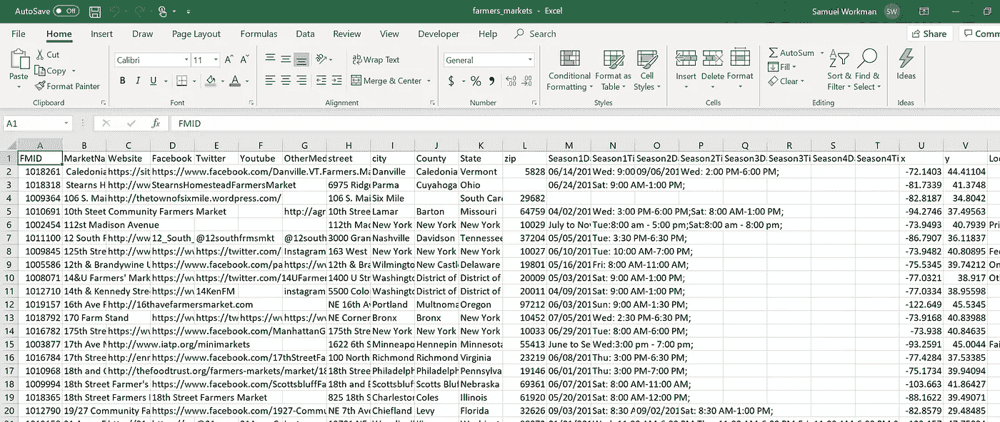

# 数据收集的四项原则

> 原文：<https://towardsdatascience.com/four-principles-of-data-collection-82ad07938ac1?source=collection_archive---------56----------------------->

## 数据收集

## 通过减少对数据的处理来简化分析

资料来源:农业营销服务本地食品目录

我花了一生的时间收集原始数据，无论是在我的工作中还是作为更广泛的研究团队的一部分。在这样做的过程中，我对数据在科学中的作用、数据的收集和组织变得相当固执。在这篇文章中，我详细介绍了数据收集和组织的四个原则，这些原则对任何需要收集数据的分析师都很有用，不管是用手还是用机器。通常，学生、初级学者、商业分析师和公共管理者会参与数据收集。然而，它在大多数课程中很少受到关注。尽管数据科学的兴起，以及其用于抓取、解析和自动化清理、组织和学习过程的工具，我们许多人仍然需要收集我们的数据。

我定量研究精英文本和政策文件。我的项目涉及官僚主义、政策实施和监管政策。我的书使用了近 25 万份监管提案的数据，我目前正在从事一个[国家科学基金会(NSF)资助的项目](https://www.nsf.gov/awardsearch/showAward?AWD_ID=1827494&HistoricalAwards=false)，该项目逐段检查 10 万份公众对监管的意见。

我还在一所大型公立大学教授本科生和研究生级别的统计学。我经常被一些学生所震惊，他们理解统计学的概念逻辑和如何建立回归模型，但对如何收集和组织数据却缺乏直觉。尽管数据科学和统计学开始在日常管理中发挥更大的影响，但我发现这种直觉在私营部门更加缺乏。以下一套基本原则可作为数据收集的指南。对它们的忠诚将提高数据的质量及其对决策的影响——无论是研究还是公共和私营部门的管理。

# 忠实于数据生成过程

我们经常讨论或描述科学，或学习，作为一个围绕理论和假设检验的过程。这种描述只是部分准确。在萌芽阶段，科学是结构化的观察。没有对观察结果的精确记录和保存，发展和检验理论是不可能的。而且，科学是不可复制的。

数据是社会、生物或物理过程的结果。这个世界没有给我们半个人，百分比，或对数美元；它给我们人，计数，和美元。对数据生成过程的保真度允许我们在迭代决策过程中以及归纳和演绎推理循环之间的转换中改进计算和测量。

**原则 1:记录数据；不要计算，不要变换。**

过去，可用的电子表格或数据库(例如 MS Excel 或 MS Access)的数据限制限制了一个单元格中可以存储的字符数或给定数据集可以包含的行数。这些限制意味着保留数据原始形式的记录极具挑战性，并且需要大量文件和空间。幸运的是，大多数电子表格应用程序不再是这种情况。(SQL 或 SQLite 数据库可以快速处理剩余的限制。)鉴于这些进步，在收集期间按原样存储数据。

*1A:如果可能的话，以文本或文本兼容格式存储数据。*

在获取忠实于数据生成过程的数据方面，数据收集并不是唯一的危险。程序，尤其是“工具化”的电子表格，经常给数据添加隐藏的结构或内容。例如，开头或结尾的空白尤其令人讨厌，因为问题并不明显。其他问题包括将文本存储为数字，反之亦然，以及将所有字符串作为因子变量读取。因此，建议将您收集的数据存储为文本或文本兼容文件(例如。txt 或者。csv“分隔”文件)。

*1B:备份数据。*

这里不需要大量的文字。将您的数据存储在多个位置。如果必要的话，其中一个应该是物理硬盘——所有的云都会不时出现故障。如果遵循这些原则，您应该只需要存储原始的、基于文本的文件。

**原则 2:管理数据组织**

一旦收集了数据，首先要做的是围绕它的结构思考。我在这里使用“策划”这个词，因为它意味着对数据的仔细(重新)组织——一些经过思考的事情。数据很容易在“宽”或“长”格式之间转换，只要其结构和组织是一致的。(宽格式和长格式数据之间的差异可能是一个单独的帖子。)

*2A:观察值出现在行中；变量出现在列中；变量的观察值出现在它们之间的单元格矩阵中。*

数据组织的基本关注点是观察值和变量或指标之间的区别。观察、主题或案例总是成排出现；变量出现在列中。(第一列包含行[即观察]标签。)

*2B:嵌套结构应该出现在列中，而不是行中。*

观察可能包含分组。例子包括时间、地理位置、重复测试、宗教等。在商业中，常见的分类是部门、类别或商店。这些类型的分组不应该在行中显示(通过缩进或任何其他方式)，而应该在列中作为单独的变量出现。例如，在一项全国性调查中，受访者的居住状态可能会被记录下来。“State”应该出现在一个单独的列中行标签右侧的某个列中，列标签为“state”

商业计算提供了一个很好的例子。在我涉足商业咨询的过程中，我经常看到按时间顺序排列的时间段。当您从这些列计算奇异值时，这是有意义的，但是如果没有大量的重组，对数据做任何其他事情几乎是不可能的，特别是如果行包含嵌套的话。句点是分组变量，应该出现在它们的列中。

小心复杂的行、列或数值标签。

带有区分大小写字符、特殊字符或空白的行、列或值标签会在电子表格之外的分析软件中引起问题(它们也可能是电子表格中的问题)。使用小写字母完全表示观察值、变量或标签，除非数据按原样使用。避免空格。使用下划线而不是句点来表示空白。避免使用特殊字符——“百分比”或“百分比”比“%”更好

最后，要认识到组织和标签是有意义的，因为其他人会使用你的数据。我们通常不为单一用例生成数据。组织简单的干净数据促进了数据的使用以及对程序和分析的共同理解。

**原则 3:计算和分类在数据收集之外。**

记住，度量是观察的模型。度量并不完全忠实地表示数据。通过忠实地以原始形式记录观察，从观察到测量的地图是可见的，允许评估、复制、更新和调整。

我发现初学分析的人(尤其是学生)经常误解什么是数据，把它们误认为是从数据中计算出来的统计数据(例如，均值不是数据，而是数据的简约表示)。这种误解通常是由于我们这些年长的分析师没有花太多时间来教授什么是数据或传达什么是数据收集的关键。

*3A:所有计算都应该在数据存储库之外进行。*

在商业中，电子表格是分析的引擎。原则 3 只需将原始的、未掺假的数据副本保存在单独的表格或文件中即可。对于社会科学家来说，所有的计算和其他统计程序都应该发生在统计程序中，而不是在原始数据中。在这两个领域中，从数据收集和保存中解析计算和分析方法都有逻辑上的好处。更新一个分析仅仅意味着更新由过程调用的数据集(也是以原生形式),如果脚本和函数被很好地记录的话。自动化报告和分析在公共部门和私营部门都是一件大事。在数据结构中进行计算、汇总和分析会妨碍有效的更新。

3B:在收集过程中不要汇总数据。

除非需求紧迫，否则不要在收集期间汇总数据。摘要必然意味着信息的丢失。禁止汇总包括数据结构中的总计和平均值等计算。再次，记住忠实于数据生成过程。所有的总结都可以通过记录良好的分析程序轻松重复。

在文本作为数据的情况下，如果需要摘要，你应该尽力把全文和摘要放在一起。同样，这种总结应该在收集之后进行。

**原则 4:如果错了，就一直错下去。**

这个原则乍听起来可能很奇怪，它需要理解分类或归类的可靠性和有效性之间的区别。出于这里的目的，有效性仅仅是一个观察是否被放在“正确的”类别中或者被“正确地”分类。可靠性指的是相似的观察结果、案例、主题或项目是否以相同的方式被归类或分类。这两种品质对于数据收集和测量都是必不可少的。

*4A:在对数据进行分类或归类的最初尝试中，可靠性优先于有效性。*

我使用或开发了无数的分类和归类方案。这些经历告诉我，在分类或归类上一贯错误比平均正确要好，但差异很大。使分类或归类正确(充满有效性)是一个迭代过程，高度的可靠性有助于这一过程。在三种情况下，您会发现自己在调整分配的类别或分类:

1.  分类不正确，但可靠性高。
2.  分类平均正确，但可靠性低。
3.  分类不正确，可靠性低。

如果你发现自己处于第一种情况，调整是很容易的，因为所有不正确的分类可以一起被分配一个新的分类。然而，请注意，第二点意味着所有数据必须逐个观察地重新编码。换句话说，由于缺乏可靠性，你必须重复整个过程。最后，第三点意味着你可能还没有很好地理解这个概念来对观察结果进行分类。

分类或归类应该是互斥的。

模糊和双重分类是可靠性的敌人。在一个列中，每个观察应该接收一个且只有一个代码。综合来看，4A 和 4B 是比较的敌人。重要的是要记住，所有的研究和分析(无论是公共部门、私人部门还是学术部门)都是在时间或空间上比较事物并做出选择的努力。如果你觉得有必要对案例或观察结果进行两次分类，那么就在单独的一栏中这样做。尽管记住，如果代码是可靠的，双重编码的安全网就没有必要了。

# 总而言之

无论是在商业、公共部门还是在学术领域，回答问题和做出决策首先取决于在观察中收集的信息——记录和保存数据。使用这些原则并不复杂，它们使分析师的生活变得更加容易。最后，使用现有的数据集总是很诱人的。当数据适用于许多问题时，这很好。小心使用。所有数据的存在都是为了一个可能与你无关的目的。这些原则不能回答你的目标和现有数据之间的匹配的概念问题。

*原载于 2020 年 5 月 13 日 https://www.samuelworkman.org**的* [*。*](https://www.samuelworkman.org/blog/hunter-gatherer-culture-in-research/)