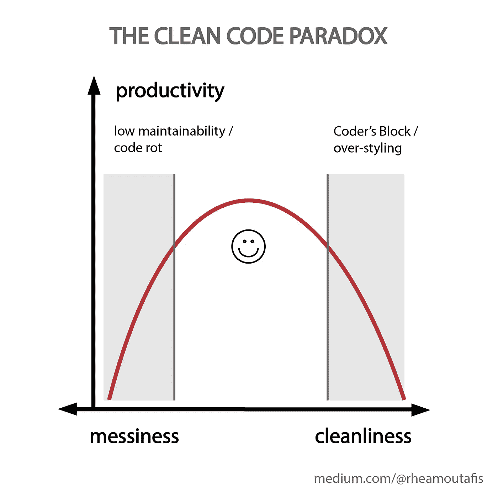
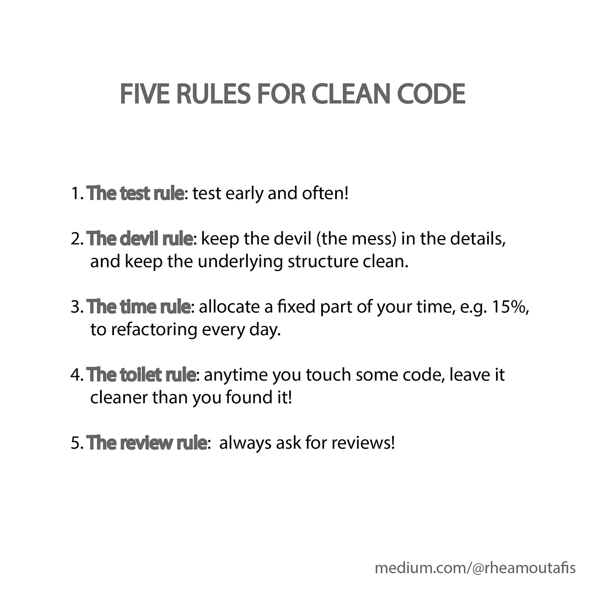

# 为什么除了计算机科学家，其他人都写马虎代码的四个原因

> 原文：<https://towardsdatascience.com/four-reasons-why-everyone-except-for-computer-scientists-writes-sloppy-code-b8505254e251?source=collection_archive---------7----------------------->

## 五次黑客攻击让你的更干净。

有些代码看起来很干净，但实际上很乱。尼基塔·万托林在 [Unsplash](https://unsplash.com/s/photos/programming?utm_source=unsplash&utm_medium=referral&utm_content=creditCopyText) 上的照片

为什么每个开发人员都认为他们正在编写完全可以理解的代码？为什么同一个开发人员不能破译别人的代码，更不用说维护它了？

因为他们写的都是可以工作的草率代码。也就是说，代码现在可以工作，但是由于它的混乱，不太具有可扩展性或通用性。除了计算机科学家——他们写的漂亮代码行不通。

## 理由 1:对计算机科学家来说，编码是一门艺术。对其他人来说，它是一种工具

计算机科学家编码是因为他们想编码。其他人编码是因为他们想完成一些事情。

一个普通的开发人员会根据他们脑海中出现的第一个想法来构建一个程序。然后他们会在这个想法的基础上发展，直到他们有了一个 MVP。通常，他们甚至不会考虑替代方法。

 [## 真正的 MVP 是什么样子的？

### 因为大多数时候，我们都弄错了

medium.com](https://medium.com/better-programming/what-does-a-real-mvp-look-like-ac35b4953e28) 

相比之下，计算机科学家会考虑实现的每一个选项，并权衡每一个选项的利弊。几周后，他们会有一段漂亮的代码，但仍然没有完全发挥作用，因为计算机科学家还没有决定输出的格式。

由于开发人员从一个简单的工具开始，并有机地发展代码，所以产生了许多草率的代码。相比之下，计算机科学家通常先建立一个结构，然后在其中工作。

有机的方法是避免程序员的阻塞和按时交付的最好方法。然而，如果你想写持久的代码，你可能想把结构放在第一位。

 [## 如何克服编码障碍

### 当你害怕你的游戏机时

towardsdatascience.com](/how-to-overcome-coders-block-51ece9dafe00) 

## 原因 2:开发者并不总是把读者放在心上

即使在协作项目中，开发人员在编写代码时也倾向于只考虑它的功能。在这样做的时候，他们忘记了代码也需要维护的事实。

问题是这种心态适得其反。当开发人员想在三个月后添加一个特性时，他们可能无法理解自己的代码。这种情况比你想象的要经常发生！

当不同的开发人员被要求实现一个新特性时，事情变得更加复杂。根据项目的大小，理解别人的代码可能需要几天到几周的时间。

## 理由三:风格是一个东西

每个人的编码都不一样。有些人讨厌在线评论，有些人喜欢。有些人在它的第一行上面评论它们的功能，有些人在下面。有些人喜欢开关盒，有些人讨厌它们。

这就是为什么一段代码对一个人来说可能很可怕，但对另一个人来说却很好。

当你独自工作时，这不成问题。但是现在，很多软件都是合作开发的。所以在项目的早期阶段确定一个风格指南是很重要的。

当然，您需要确保所有开发人员都遵守它。否则，您最终会得到混乱的代码，因为它是不同约定的混杂。

快速修复是值得的，但从长远来看可能会导致大混乱。Muhannad Ajjan 在 [Unsplash](https://unsplash.com/s/photos/programming?utm_source=unsplash&utm_medium=referral&utm_content=creditCopyText) 上拍摄的照片

## 原因 4:即时奖励的谬论

当你被一个问题困扰了好几天，直到你最终找到解决问题的办法时，你有没有感到兴奋？这是一个非常激动人心的时刻。

问题是，当开发人员追求快速修复时，他们往往会忽略长期问题。例如，他们可能修复了一个 bug 或者添加了一个特性，但是没有意识到代码的结构已经过时了。

这意味着每增加一项新功能，他们都必须投入更多的工作。相比之下，从长远来看，对程序进行一次重组会更容易添加更多的特性。

如果你喜欢快速解决问题，而不是解决根本问题，你并不孤单。人类的奖励系统更容易受到短期修复而不是长期变化的影响。但这样一来，你就积累了技术债务。从长远来看，这会让你付出很大代价。

 [## 技术债就像俄罗斯方块

### 你赢不了。你只能控制你输得有多快。

medium.com](https://medium.com/@erichiggins/technical-debt-is-like-tetris-168f64d8b700) 

## 干净与脏乱的危险

声称自己总是写出干净代码的开发人员要么是在撒谎，要么是高估了自己。也就是说，有几个原因让你不想写太干净的代码:

*   如果你的目标是从头开始编写干净的代码，你就增加了遇到编码障碍的机会。为了防止主要的阻塞发生，最好在一开始就有机地发展你的代码。这尤其适用于你是初学者的情况。
*   一些开发人员花了一整天的时间清理他们的代码，没有别的原因，只是为了美观。当然，如果有许多其他合作者，或者代码将以任何方式呈现，这可能是有用的。但通常情况下，润色代码就像普通医疗的整形手术一样有效——它可能看起来不错，但并不能解决任何更深层次的问题。

 [## 重构的艺术:写出更好代码的 5 个技巧

### 糟糕的代码是有代价的，写好的代码并没有那么复杂

medium.com](https://medium.com/better-programming/the-art-of-refactoring-5-tips-to-write-better-code-3bc1f6f7689) 

另一方面，你也不想让你的代码太乱。太多的混乱会使你的代码不可维护。缺乏维护会导致代码腐烂，从长远来看，项目会被丢弃，因为它们弊大于利。

因此，我们需要的是快速结果和可维护代码之间的健康平衡。大多数开发人员都倾向于凌乱的一面，所以提高整洁度是一条可行之路。好消息是，一些好习惯可以对开发人员的整洁和生产力产生巨大的影响。

## 黑客 1:尽早并经常测试

一些开发人员对他们的技术非常有信心，以至于他们在没有运行测试的情况下构建了整个项目。但是，除非手头的任务完全无关紧要，否则就会适得其反。

一旦他们试图编译或执行程序，屏幕就会充满错误信息。或者，更糟糕的是，错误直到几个月后才被发现，这时用户才意识到程序没有按预期运行。

这些都是不好的做法。如果说在科技行业工作教会了你什么，那应该是这个:

> 如果你没有测试过所有的场景，千万不要认为某样东西能按预期工作。

尽快尝试构建一些可执行的东西。哪怕非常非常简单。一有机会就测试一下。这样，您就可以在错误一产生就修复它们。

## 诀窍 2:结构良好，格式草率

只要代码的底层结构良好，追求快速修复是没问题的。现实情况是，开发人员试图在结构混乱或过时的代码中实现快速修复。

在这种情况下，最好花时间重新构建代码。如果修复没有得到正确的注释，或者有一些模糊的变量名，那也不是世界末日。但是试图在错误的代码中构建一个干净的特性是浪费时间和资源——无论如何，你都可能不得不重写很多。

因此，在整洁和速度之间的一个好的折衷是保持底层结构的整洁和更新，并且在细节上尽可能的整洁。

把魔鬼藏在细节里。阿尔瓦罗·雷耶斯在 [Unsplash](https://unsplash.com/s/photos/programming?utm_source=unsplash&utm_medium=referral&utm_content=creditCopyText) 上拍摄的照片

## 黑客 3:为重构分配时间

每当你变得混乱，你就在制造技术债务。就像货币债务一样，你拖得越久，它就变得越昂贵。

另一方面，花几天甚至几周的时间清理代码对普通开发人员来说听起来并不怎么鼓舞人心。这就是为什么建立一个每天偿还一点债务的惯例是有用的。

一个好的开始方法是每天用 15%的时间进行重构。我称之为时间法则。您会惊讶于您可以改进多少代码！

 [## 是什么让你的代码有味道？

### 列出了八种代码气味，所以您可以避免它们

medium.com](https://medium.com/better-programming/what-is-it-that-makes-your-code-smell-f9c96ac93ba2) 

## 黑客 4:留下比你发现的更干净的代码

我称之为厕所规则。如果每个人离开公共浴室时至少保持他们发现的清洁，他们将处于一种无可挑剔的状态。

从大多数公共厕所的状况来看，现实并非如此。遵守这样的规则需要每个开发人员的纪律，这反过来又需要一个优秀的经理。

但这种纪律是值得的，因为随着时间的推移，回报会是巨大的。你不能通过做不可能的事情来实现不可能——你只能通过做一些好的决定，每天朝着这些决定迈出一小步来实现。

## 黑客 5:请求评论！

有时，代码很混乱，因为开发人员不知道如何做得更好。例如，一个代码可能会使用 switch 语句，这样映射就容易多了。在这种情况下，高级开发人员的建议是关键。

建立一个常规的代码审查可以帮助创建一个反馈循环。这将改善年轻开发人员的学习曲线，并培养健康讨论的文化。

就像如厕规则和时间规则一样，常规是关键。要求评审应该是初级开发人员的习惯，而给出建议应该是高级开发人员工作中不可或缺的一部分。

理想情况下，评审时间应该是开发团队核心流程的一部分，关键建议的总结应该是每次会议的一部分。

## 平衡结构和混乱

过多的清洁会浪费时间和资源。写草率的代码要比遇到编码器阻塞而不交付好得多。

另一方面，草率的代码缺乏灵活性，难以维护。这五条规则将有助于在不浪费时间的情况下，使您的代码更加清晰。正如生活的每一部分一样，美好的事物都是在结构和混乱的健康平衡中产生的。