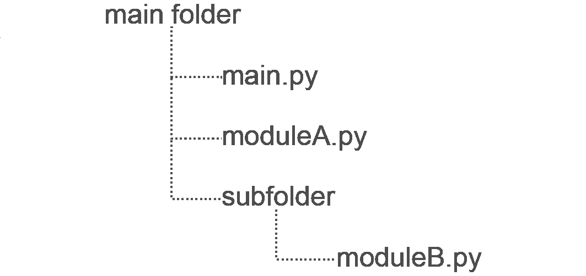

# 关于 Python 类和库，数据科学家需要知道的四件事

> 原文：<https://towardsdatascience.com/four-things-programmers-need-to-know-about-python-classes-and-libraries-2b82d2a95e35?source=collection_archive---------18----------------------->


照片由[克莱门特·H](https://unsplash.com/@clemhlrdt?utm_source=medium&utm_medium=referral)在 [Unsplash](https://unsplash.com?utm_source=medium&utm_medium=referral) 上拍摄

我从来没有机会在教室里学习 Python。而是通过自学，学会了编程语言。没有系统地学习编程语言的一个缺点是，有时我不能完全理解其他人的 Python 代码，我可能无法充分利用 Python 编程的特性。在这里，我将总结一下关于 Python 类和库的四件事，这四件事曾经让我很困惑。希望这对你学习 Python 有帮助！

# 1.调用内部变量和函数的类

在 Python 类中，_ _ init _ _ 方法需要显式传递 self 参数。此外，如果一个函数需要使用在同一个类中定义的内部变量或函数，self 参数也需要显式传递给那个函数。

# 2.定义具有多个输入参数的类

Python 允许通过使用 arg，*args 和**kwargs 来定义具有多个输入参数的类。*args 接受无关键字的可变长度参数列表，而**kwargs 接受有关键字的可变长度参数列表。下面我们来看一个例子。

```
Multiple_constructor(1, 2, 3, 4, a='a',b='b')
```

输出:

arg1: 1，arg2: 2
args: (3，4)
args: {'a': 'a '，' b': 'b'}

```
Multiple_constructor(1, 2, a='a',b='b')
```

输出:

arg1: 1，arg2: 2
没有*args 传入
args: {'a': 'a '，' b': 'b'}

```
Multiple_constructor(1, 2)
```

输出:

arg1: 1，arg2: 2
无*args 传入
无**kwargs 传入

```
Multiple_constructor(1)
```

输出:

__init__()缺少 1 个必需的位置参数:“arg2”

# 3.重用模块

通常，我们希望在其他程序中重用类或函数。其实 Python 库是一种代码复用的方式。在下面的例子中，我将展示如何在 main.py 文件中重用 moduleA 和 moduleB。

重用 moduleA 很简单。由于 moduleA.py 与 main.py 在同一个文件夹中，所以 moduleA 可以直接导入到 main.py 中。

由于 moduleB 位于子文件夹中，我们需要先将 moduleB.py 的相对路径添加到系统中。然后我们可以在 main.py 中导入 moduleB。



moduleA.py 和 moduleB.py 在 main.py 中重用

输出:

你好爱丽丝！你好鲍勃！

# 4.if __name__ == '__main__ '

__name__ 是一个特殊的 Python 变量。如果直接运行当前文件，__name__ = '__main__ '。但是，如果导入了当前文件，__name__ = fileName。

if __name__=='main ' '是控制是否在此 if 测试中运行代码的一种方式。当直接运行当前文件时，将运行 if 测试中的代码。但是，当当前文件被其他文件导入时，if 测试中的代码将不会运行。通过这种方式，Python 允许根据文件是直接运行还是导入来灵活地控制是否运行代码。

输出:

文件 1 在 if __name__=='__main__ '测试之前是 _ _ main _ _
文件 1
文件 1 在 if _ _ name _ _ = ' _ _ main _ _ '测试之后直接运行
文件 1

输出:

文件 1 是文件 1
文件 1 之前 if _ _ name _ _ = ' _ _ main _ _ '测试
文件 1 导入
文件 1 之后 if _ _ name _ _ = ' _ _ main _ _ '测试
文件 2 是 __main__
文件 2 之前 if _ _ name _ _ = ' _ _ main _ _ '测试
文件 2 直接运行
文件 2 之后 if _ _ name _ _ = ' _ _ main _ _ '测试

# 结论

在这篇短文中，我讨论了 Python 类和库的四个重要方面。作为一种面向对象的编程语言，Python 允许灵活使用类和库。通过包含一些代码示例，希望您对这四个 Python 概念有更清晰的理解！