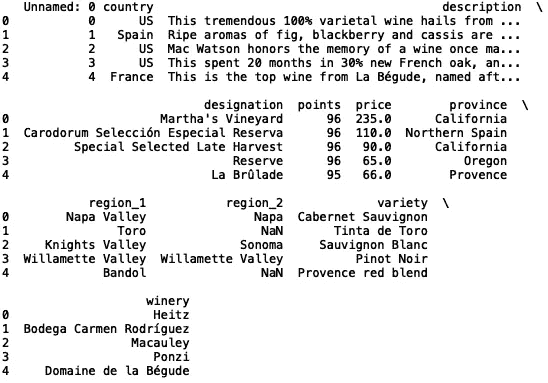
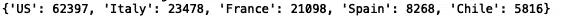
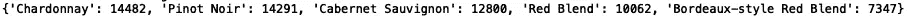
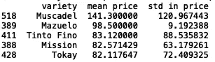
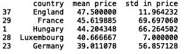
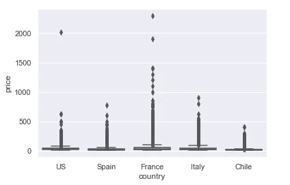
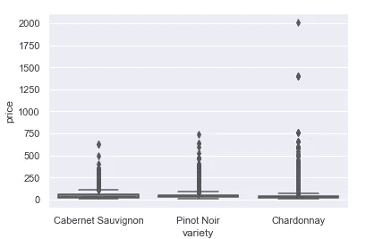
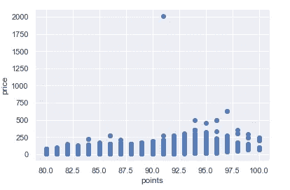

# 在 Python 中探索数据的四个有用函数

> 原文：<https://towardsdatascience.com/four-useful-functions-for-exploring-data-in-python-33b53288cdd8?source=collection_archive---------24----------------------->

## 在 Python 中探索和可视化数据


瓦伦丁·安托努奇在[的照片](https://www.pexels.com/photo/person-holding-compass-841286/)

在探索数据的过程中，我经常发现自己重复定义类似的 python 逻辑，以便执行简单的分析任务。例如，我经常计算数据中特定类别的数字列的平均值和标准偏差。我还经常分析数据中分类值的频率。为了节省时间，我编写了一些函数，允许我在不重写太多代码的情况下进行这种类型的分析。

在这篇文章中，我将分享我在模型构建的探索性数据分析步骤中经常使用的四个有用的函数。然后我将展示我们如何使用这些函数来探索*葡萄酒评论*数据集。数据集可以在[这里](https://www.kaggle.com/zynicide/wine-reviews)找到。该文件夹包含三个。csv 文件。我将使用名为“winemag-data_first150k.csv”的文件。

我们开始吧！

1.  **计数器**

我将讨论的第一个函数允许我们查看分类值在数据集中出现的频率。它接受数据帧、列名和限制作为输入。当被调用时，它打印分类值的字典以及它们出现的频率:

```
def return_counter(data_frame, column_name, limit):
   from collections import Counter    print(dict(Counter(data_frame[column_name].values).most_common(limit)))
```

让我们打印数据集的前五行:

```
import pandas as pd
df = pd.read_csv('winemag-data_first150k.csv')
print(df.head())
```



我们可以看到有几个分类列。让我们将函数应用于“国家”列，并将结果限制在五个最常见的国家:

```
return_counter(df, 'country', 5)
```



我们可以看到大部分的葡萄酒记录都对应于美国生产的葡萄酒。

让我们将函数应用于“品种”列:

```
return_counter(df, 'variety', 5)
```



大多数葡萄酒是夏敦埃酒和黑皮诺酒。这是一个有用的快速测试，可以查看数据中是否有任何明显的不平衡，这通常是建模时要处理的一个关键问题。

2.**汇总统计**

下一个函数是汇总统计函数(有点类似于 df.describe())。该函数采用一个数据帧、一个分类列和一个数字列。每个类别的数字列的平均值和标准偏差存储在数据框中，并且数据框根据平均值以降序排序。如果您想要快速查看特定类别对于特定数字列是否具有更高或更低的平均值和/或标准偏差值，这将非常有用。

```
def return_statistics(data_frame, categorical_column, numerical_column):
    mean = []
    std = []
    field = []
    for i in set(list(data_frame[categorical_column].values)):
        new_data = data_frame[data_frame[categorical_column] == i]
        field.append(i)
        mean.append(new_data[numerical_column].mean())
        std.append(new_data[numerical_column].std())
    df = pd.DataFrame({'{}'.format(categorical_column): field, 'mean {}'.format(numerical_column): mean, 'std in {}'.format(numerical_column): std})
    df.sort_values('mean {}'.format(numerical_column), inplace = True, ascending = False)
    df.dropna(inplace = True)
    return df
```

我们可以查看“品种”和“价格”的汇总统计数据:

```
stats = return_statistics(df, ‘varieties’, ‘prices’)
print(stats.head())
```



麝香葡萄品种的平均价格最高。

我们可以为国家做同样的事情:

```
stats = return_statistics(df, ‘countries’, ‘prices’)
print(stats.head())
```



英国的平均价格最高。

3.**箱线图**

下一个函数是 boxplot 函数。我们使用箱线图来显示基于最小值、最大值、中值、第一个四分位数和第三个四分位数的数值分布。如果你对它们不熟悉，可以看看文章[了解盒子情节](/understanding-boxplots-5e2df7bcbd51)。

与汇总统计函数类似，此函数采用数据框、分类列和数值列，并根据限制显示最常见类别的箱线图:

```
def get_boxplot_of_categories(data_frame, categorical_column, numerical_column, limit):
    import seaborn as sns
    import matplotlib.pyplot as plt
    keys = []
    for i in dict(Counter(df[categorical_column].values).most_common(limit)):
        keys.append(i)
    print(keys)

    df_new = df[df[categorical_column].isin(keys)]
    sns.boxplot(x = df_new[categorical_column], y = df_new[numerical_column])
```

让我们为 5 个最常见的国家的葡萄酒价格绘制箱线图:

```
get_boxplot_of_categories(df, 'country', 'price', 5)
```



正如我们所见，在所有五个国家类别中，葡萄酒价格都有明显的异常值。我们可以对“多样性”做同样的事情。为了更好地可视化，我将类别值限制为三个国家:

```
get_boxplot_of_categories(df, 'variety', 'price', 3)
```



4.**散点图**

最后一个函数是散点图函数。此函数将一个数据框、分类列、分类值和两个数字列作为输入，并显示一个散点图:

```
def get_scatter_plot_category(data_frame, categorical_column, categorical_value, numerical_column_one, numerical_column_two):
    import matplotlib.pyplot as plt
    import seaborn as snsdf_new = data_frame[data_frame[categorical_column] == categorical_value]
    sns.set()
    plt.scatter(x= df_new[numerical_column_one], y = df_new[numerical_column_two])
    plt.xlabel(numerical_column_one)
    plt.ylabel(numerical_column_two)
```

让我们制作一个美国葡萄酒点数与价格的散点图:

```
get_scatter_plot_category(df, 'country', 'US', 'points', 'price')
```



价格和奖励积分之间似乎存在轻微的正相关关系。我就讲到这里，但是请随意处理数据并自己编码。

概括地说，在这篇文章中，我回顾了我在探索性数据分析过程中经常使用的四个有用的函数。我回顾了分析数据的方法，包括用箱线图和散点图可视化数据。我还定义了生成汇总统计数据的函数，比如平均值、标准差和分类值的计数。我希望这篇文章是有帮助的。

这篇文章的代码可以在 [GitHub](https://github.com/spierre91/medium_code) 上找到。感谢您的阅读！