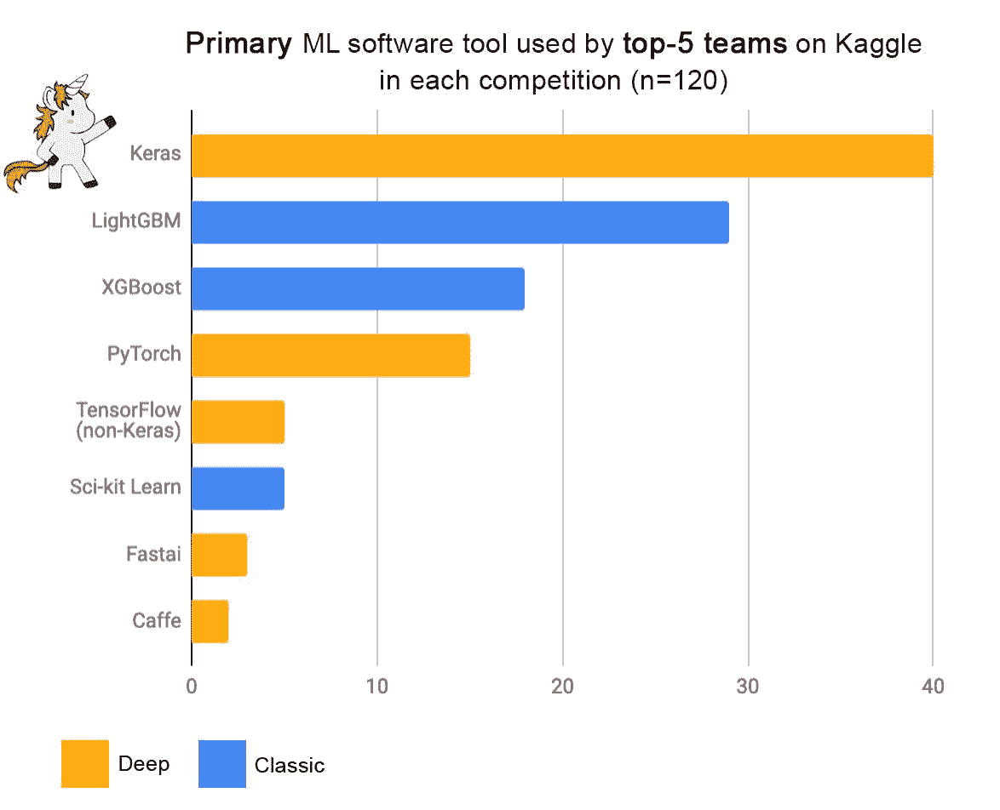

# 团队在 Kaggle 上获胜的四种方式

> 原文：<https://towardsdatascience.com/four-ways-teams-win-on-kaggle-50e62acb87f4?source=collection_archive---------23----------------------->

## 框架、多重处理、云以及更大的团队

Kaggle 是最好和最差的机器学习的家园。这是成千上万个团队的战场，他们争相建立最佳模型，在最后期限内解决现实世界的问题，赌注是几十万美元。在大型数据集上训练这些世界级的模型通常需要数百个计算小时。在本帖中，我们将探索获胜团队使用的一些技巧以及如何加快速度。


[图片[来源】](https://pixabay.com/illustrations/superhero-girl-speed-runner-534120/)

# #1 —使用顶层框架

有时 Kaggle 上的竞争会导致模型无法复制或者[彻头彻尾的欺诈](/kaggle-1st-place-winner-cheated-10-000-prize-declared-irrecoverable-bb7e1b639365)。但其中一些竞争为整个行业设立了新的标准。Kaggle 是机器学习成为焦点并取得巨大进展的地方。世界上最好的模型构建框架受到 Kaggle 竞赛的启发并围绕其构建。

获胜——团队从他们的工具中榨出每一分每一毫的绩效。当工具不够好或不够快时——更好的工具就会被制造出来。这方面的例子有流行的梯度增强库:

*   2014—XGBoost—[【github】](https://github.com/dmlc/xgboost)【论文】—2015 年 Kaggle 比赛期间，29 个获奖方案[中有 17 个方案使用了 XGBoost](https://www.linkedin.com/pulse/present-future-kdd-cup-competition-outsiders-ron-bekkerman/) 。
*   2017—light GBM(LGBM)—[【github】](https://github.com/microsoft/LightGBM)[【paper】](https://papers.nips.cc/paper/6907-lightgbm-a-highly-efficient-gradient-boosting-decision-tree.pdf)—由微软开发，比 XGBoost 快 20 倍，但并不总是那么准确。这个库是 2019 年 Kaggle 上流行内核的[默认选择。](https://www.kaggle.com/c/ga-customer-revenue-prediction/discussion/66048)
*   2017—CatBoost—[【github】](https://github.com/catboost/catboost)[【论文】](https://arxiv.org/abs/1706.09516) —没有 LightGBM 常用，但在利用分类列的[中可以有优势。](https://datascience.stackexchange.com/questions/49567/lightgbm-vs-xgboost-vs-catboost)

竞赛获胜者经常结合多个模型构建库来稍微提高性能。关于这些梯度增强框架的深入比较，请参见本文。许多竞赛获胜者也使用 Keras 库，尽管它最初的设计并没有考虑到 Kaggles。



上面的图片来自 Keras 图书馆的作者 Franç ois Chollet 的一条推文。在这条线索中，他指出:

*赢家是那些经历了“进步循环”的“更多迭代”的人——从一个想法，到它的实施，再到可操作的结果。所以获胜的团队就是那些能够跑得更快的团队。*

# #2 —利用多重处理

为了获胜，Kaggle 团队需要在有限的时间内测试尽可能多的想法。对于千兆字节的数据，每次迭代都以小时为单位。有许多参数可以调整，使训练过程更短。但是，为了优化排行榜分数，训练必须“进行到 11”。考虑到需要许多小时的计算，自然的优化是并行化。

在 Python 中，由于全局解释器锁(GIL)，使用线程来并行化工作通常是没有意义的。Kaggle 上流行的框架都在内部进行了多线程优化，以利用多个内核将训练时间减少 10 倍。他们还可以利用 GPU 将训练速度提高[10 倍](https://xgboost.ai/2018/07/04/gpu-xgboost-update.html)。但是，测试许多超参数和特征组合意味着进一步增加工作量。仅仅是加载数据就可能非常耗时，以至于一些团队使用[多重处理来应对这种情况](https://www.kaggle.com/nroman/lgb-single-model-lb-0-9419),如下所示:

```
files = ['../input/test_identity.csv', 
         '../input/test_transaction.csv',
         '../input/train_identity.csv',
         '../input/train_transaction.csv',
         '../input/sample_submission.csv']def load_data(file):
    return pd.read_csv(file)with multiprocessing.Pool() as pool:
    test_id, test_tr, train_id, train_tr, sub = pool.map(load_data, files)
```

多重处理本身可以在强大的机器上本地工作。不幸的是，我的 MacBook 有点温顺。最重要的是，繁重的任务完全消耗了我的机器资源。后台任务繁重，即使阅读电子邮件也变得缓慢而痛苦。

# #3 —云上的多重多处理

启动一台机器来运行一个可能需要一个多小时才能返回的函数可能是值得的。让机器运转几个小时来实现多种功能尤其有用。有很多方法可以获得一台机器来完成工作，比如使用 AWS Fargate、Google Cloud Run 和其他提供商。在 [XGBoost 分布式培训教程](https://xgboost.readthedocs.io/en/latest/tutorials/index.html)中有一些这样的例子。

使用云时要考虑的权衡是速度、成本和设置一切的复杂程度。下面的代码片段使用了[dismap](https://docs.dis.co/quick-start-guide/discomp)，它提供了对`multiprocessing.Pool()`的替换，所以它非常简单。map 中的每次迭代可能会发现自己在不同的机器上，而我们的主机只会等待结果。

```
def pow3(x):
    print (x**3)
    return (x**3)

with discomp.Pool() as po:
    results = po.map(pow3, range(10))
    print(results)
    # prints [0, 1, 8, 27, 64, 125, 216, 343, 512, 729]
```

虽然这个例子很简单，但是您可以推断出可以做什么。对于更完整的场景，您可以看到我如何使用 XGBoost 在信用卡欺诈数据集中比较不同超参数配置的性能。使用传统的`map`呼叫测试 30 组参数需要 82 分钟，使用`multiprocessing.Pool().map`需要 35 分钟，使用`discomp.Pool().map`需要 9 分钟。使用云机器，我可以以 9 倍的速度运行测试。使用云确实要花钱，所以它并不是适合所有人的解决方案。有点像这艘船。


[图片[来源](https://pixabay.com/photos/powerboat-speed-speedboat-fast-2784250/)

# #4 —更大的团队

通常较大的团队在 Kaggle 上有优势，因为每个团队成员都用不同的参数和库探索不同的特性和不同的模型。团队中的每个人也将贡献自己的计算资源。最后，所有的模型将被组合成一个[集合平均值](https://en.wikipedia.org/wiki/Ensemble_averaging_(machine_learning))，它往往比每个单独的模型表现得更好。要更深入地分析团队规模趋势，[请查看本笔记本](https://www.kaggle.com/gpreda/meta-kaggle-what-happened-to-the-team-size)。

# 优化时间

在 Kaggle 中，给你的是带标签的数据，所以机器学习中的一个大问题已经解决了。所有竞争者剩下要做的就是预处理，选择正确的模型，使用最好的软件包，设计最好的特性和确定最好的参数。这仍然是一项很少有人擅长的艰巨任务。一个团队可以测试的组合数量直接受限于他们周期的持续时间以及他们可以在多少台机器上运行它们。幸运的是，现在有许多选择可以节省时间并获得计算资源。请告诉我你是否觉得这些技巧有用，或者只是在 twitter 上打个招呼。