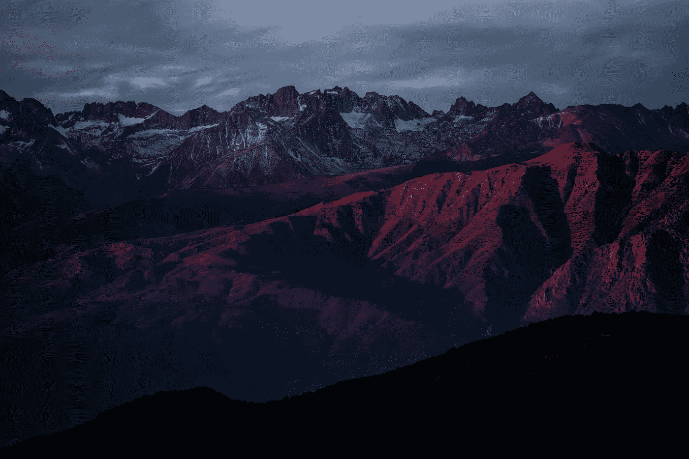
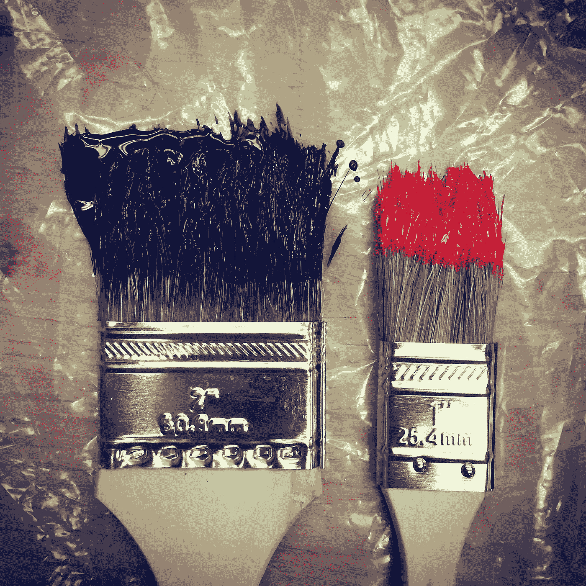
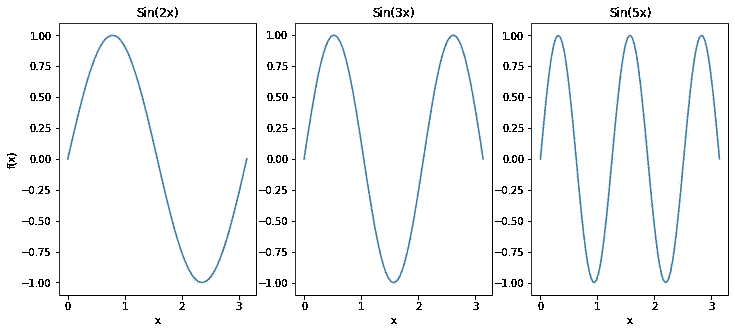
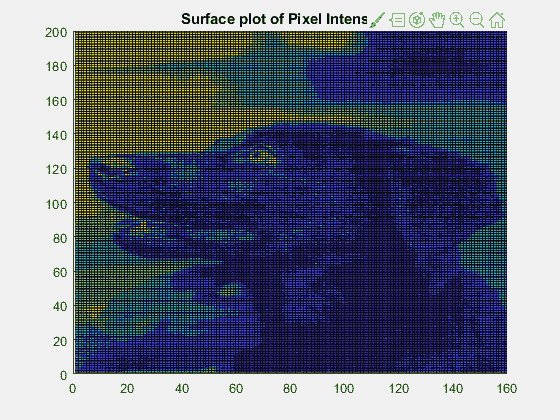
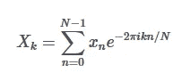
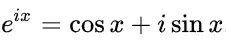
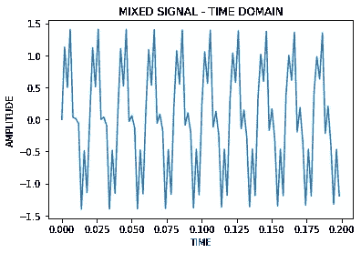
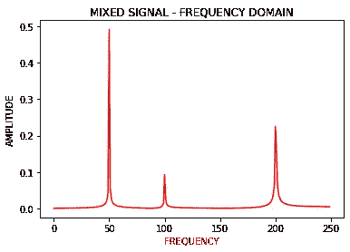

# 傅立叶变换和图像的床单视图。

> 原文：<https://towardsdatascience.com/fourier-transforms-and-bed-sheet-view-of-images-58ba34e6808a?source=collection_archive---------35----------------------->

约翰·汤纳在 [Unsplash](https://unsplash.com/s/photos/mountains?utm_source=unsplash&utm_medium=referral&utm_content=creditCopyText) 上拍摄的照片

## 开发傅立叶变换工作原理背后的直觉。

傅立叶变换是做什么的？傅立叶模式代表什么？为什么傅立叶变换在数据压缩方面是出了名的受欢迎？这些是本文旨在用一个有趣的类比来表示图像的问题。

图像是数字绘画。它们由不同的特征组成。有些功能需要非常精确地控制笔刷，比如在狗身上画胡须。其他的可以用粗画笔快速填充，像清澈的蓝天。所有图像都是不同程度的精细和暗淡特征的组合，即高频和低频特征。

让我们花点时间来理解频率是如何进入我们的分析的。想象正弦波经过半个周期。它慢慢上升，达到最大值，然后慢慢减小。正弦的频率越高，波就越窄。

照片由[威廉·费尔克](https://unsplash.com/@gndclouds?utm_source=unsplash&utm_medium=referral&utm_content=creditCopyText)在 [Unsplash](https://unsplash.com/s/photos/paint-brush?utm_source=unsplash&utm_medium=referral&utm_content=creditCopyText) 上拍摄

想象一个被诅咒的画家，他只能用笔尖是半波正弦的画笔画画。如果他要画一个精致的特征，比如狗的胡须，他会选择一个正弦频率高的笔刷，即一个窄尖的笔刷。类似地，如果他要画一个没有任何细节的晴朗的天空，他会选择低频率的笔刷，也就是说，一个厚一点的笔刷。

频率越高，峰值越窄。

令人惊讶的是，所有现存的图像就像被诅咒的画家的作品一样。值得注意的是，傅立叶表明每一幅图像(信号)都可以分解成一系列复杂的项，其中每一项都有一个数值。幅度被称为傅立叶系数。将图像分解成各种正弦项及其幅度的整个过程称为傅立叶分解。傅立叶级数是一种更普遍的情况，其中要分解的信号是周期性的。傅立叶变换是信号具有无限时间周期，即非周期性的特殊情况。

完成上述分解的一种优雅而快速的算法是快速傅立叶变换，它可以说是 21 世纪将要开发的最重要的算法。它在蜂窝通信、卫星、电影、电视等领域有着深远的应用。

为了形象化图像的弯曲性质，绘制图像的大小，就像绘制表面图一样，并观察轮廓的俯视图，这将是很有趣的。这个想法是由华盛顿大学的史蒂文·布伦顿博士提出的。

剧情使用了[雅各布·卡奇](https://unsplash.com/@jacobbey?utm_source=unsplash&utm_medium=referral&utm_content=creditCopyText)在 [Unsplash](https://unsplash.com/@jacobbey?utm_source=unsplash&utm_medium=referral&utm_content=creditCopyText) 上的一张照片。

图像的曲折性质清晰可见。高频特征作为窄峰清晰可见。这些包括眼睛、面部结构的轮廓和人手的轮廓。低频特征通常是均匀颜色的巨大延伸，在背景中观察到。这些包括大面积的黑色皮毛和背景。

下面是复制先前结果的简单代码。

制作表面情节动画的源代码包含在我的 Github 中，[在这里](https://github.com/kommalapatisahil/medium/tree/master/Fourier2)！

这被称为图像的床单视图。这个名字背后的想法是，如果四个人拿着一张床单的每一边，并开始以相应的幅度在一个傅立叶频率下振荡，并且对于无限傅立叶模式中的每一个都存在四个人的类似设置，那么所有床单的叠加将导致物理上的折痕，看起来像上面的图像。因此得名，床单观！

好了，现在有了一个好的直觉来理解傅立叶变换能做什么，这是一个很好的练习来正式回顾这些想法。离散信号的傅里叶分解方程如下:

这里，xn 是时间 N 处的信号值，Xk 是每个频率 k 的傅立叶系数，N 是信号样本的总数(即记录信号的离散时间步长的数量)。FFT 算法返回每个频率的 Xk 值。使用欧拉公式可以将复指数分解为正弦和余弦。这为迄今为止开发的直觉提供了一个健全的检查。

例如，让我们用多个频率构建一个正弦信号。比方说，频率为 50、100 和 200 赫兹的正弦信号以不同的比例组合而成。周期性质仍然可见，但通过在时域中可视化信号来理解原始频率成分确实很难。

傅立叶变换有助于直观地显示频域中的信号。因此，对上述信号进行傅立叶分解，我们可以得到下面的图。

混合物在 50、100 和 200 Hz 下的真实频率在频域中显示出预期的峰值。值得注意的是，FFT 算法也可以给出每个频率分量的权重，而不需要信号的任何先验知识。

啊，是的！臭名昭著的单线 FFT 命令。在 MATLAB 中，就更简单了，不需要任何导入，只需要 fft()。

现在回到图像的单页视图，每张图片都是可以应用傅立叶分解的二维信号。如果获取图像的一部分，它将类似于我们示例中的时域信号，但具有自己的频率成分。床单的看法是强大的开发直觉背后的一个图像可以是一个简单的信号，在时域，与多维度。

一般来说，信息密集区由高频项组成，而均匀的平坦区域由低频项组成。傅立叶的天才在于推导加权模式(或频率-幅度对)。这为理解构成图像的最重要的模式提供了一个思路。事实证明，帕累托法则在这里是成立的，只有极少数的模式包含了图像的大部分信息。这个原则对数据压缩至关重要。通过忽略大多数模式，我们可以减小图像的大小。然而，图像质量只是略有下降。

如果你有兴趣更深入地了解傅立叶变换如何用于数据压缩，或者理解为什么数据是可压缩的，首先，查看我的前一篇文章。像往常一样，联系我继续对话，或者向我提供一些关于内容的反馈。