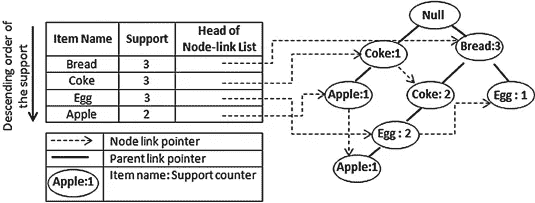

# FP 增长——用 Python 实现数据挖掘中的频繁模式生成

> 原文：<https://towardsdatascience.com/fp-growth-frequent-pattern-generation-in-data-mining-with-python-implementation-244e561ab1c3?source=collection_archive---------0----------------------->

## 在大项目集中挖掘关联规则的强大算法！

照片由[法比奥](https://unsplash.com/@fabioha?utm_source=medium&utm_medium=referral)在 [Unsplash](https://unsplash.com?utm_source=medium&utm_medium=referral) 上拍摄

# 介绍

在前一篇文章中，我们已经介绍了 Apriori 算法，并指出了它的主要缺点。在本文中，我们将展示一种叫做 FP 增长算法的高级方法。我们将介绍 FP 增长算法的整个过程，并解释为什么它比 Apriori 算法更好。

 [## Apriori:关联规则挖掘的深层解释及 Python 实现

### 关联规则挖掘是一种识别不同项目之间潜在关系的技术。方法有很多…

towardsdatascience.com](/apriori-association-rule-mining-explanation-and-python-implementation-290b42afdfc6) 

# 为什么好？

让我们回忆一下上一篇文章，Apriori 算法的两个主要缺点是

*   候选项目集的大小可能非常大
*   计数支持的高成本，因为我们必须一遍又一遍地扫描项目集数据库

为了克服这些挑战，Fp 增长的最大突破是

> 不需要候选人生成！

Apriori 的所有问题都可以通过利用 **FP 树**来解决。更具体地说，项集大小将不再是一个问题，因为所有的数据将以一种更紧凑的方式存储。此外，没有必要一遍又一遍地扫描数据库。相反，遍历 FP 树可以更有效地完成同样的工作。

# FP 树

FP 树是整个 FP 增长算法的核心概念。简单来说，FP 树就是项目集数据库的**压缩表示**。树结构不仅在数据库中保留项目集，而且跟踪项目集之间的关联

该树是通过获取每个项目集并一次一个地将其映射到树中的路径来构建的。这个建筑背后的整个想法是

> 更频繁出现的项目将有更好的机会共享项目

然后我们递归地挖掘树来得到频繁模式。模式增长，算法的名字，是通过连接从条件 FP 树生成的频繁模式来实现的。

忽略树上的箭头。图片作者。

# FP 增长算法

请随意查看评论良好的源代码。这真的有助于理解整个算法。

 [## chonyy/fpgrowth_py

### pip 安装 fpgrowth_py，然后像使用 git clone git clone 一样使用它来获得此回购的副本…

github.com](https://github.com/chonyy/fpgrowth_py) 

FP 增长如此高效的原因是这是一种**分而治之**的方法。我们知道，有效的算法必须利用某种数据结构和高级编程技术。它实现了树、链表和深度优先搜索的概念。这个过程可以分为两个主要阶段，每个阶段又可以进一步分为两步。

## 阶段 1: FP 树构建

> 第一步:清洁和分类

对于每个事务，我们首先删除低于最低支持的项目。然后，我们按照频率支持**降序**对项目进行排序。

图片作者。

> 第二步:构建 FP 树，标题表包含已清理的项目集

遍历清理后的项集，一次映射一个到树中。如果分支中已经存在任何项目，则它们共享同一个节点，并且计数递增。否则，该项将位于创建的新分支上。

标题表也是在这个过程中构建的。交易中每个独特的项目都有一个链表。使用链表，我们可以在短时间内找到项目在树上的出现，而无需遍历树。

来源:[https://www . researchgate . net/figure/An-FP-tree-and-its-header-table-15 _ fig 1 _ 280940829](https://www.researchgate.net/figure/An-FP-tree-and-its-header-table-15_fig1_280940829)

## 阶段 2:挖掘主树和条件 FP 树

> 步骤 1:将主 FP 树分成条件 FP 树

从每个频繁 1-模式开始，我们用 FP 树中的前缀集创建**条件模式基**。然后，我们使用这些模式库，以与阶段 1 完全相同的方法来构造条件 FP 树。

> 步骤 2:递归挖掘每个条件树

频繁模式从**条件 FP 树**中生成。为一个频繁模式创建一个条件 FP 树。我们用来挖掘条件树的递归函数接近深度优先搜索。它确保在继续之前，没有更多的树可以用剩余的项目来构建。

让我们仔细看看下面的过程

图片作者。

同级别同颜色。算法工作流程如下所示

1.  检查第一个 1-频繁模式“a”
2.  获取粉红色的“a”的条件 FP 树
3.  挖掘粉红色的树，深入到第二层
4.  检查粉色树上的“f ”,发现没有更多的树可以构建
5.  在粉红色的树上勾选 c
6.  开采黄树，深入到第 3 层

# Python 实现

## FP 增长函数

乍一看这个 FP growth 主函数，你可能会对它的两个部分产生疑问。

> 为什么要为项目集和频率使用单独的列表，而不是创建一个字典？

原因是 Python 字典中的键必须是不可变的，所以我们不能把 set()作为键。然而，不可变版本的 set， **frozenset** 是可以接受的。不幸的是，由于这些项目的**顺序**在 FP 增长算法中至关重要，我们无法在转换到 frozenset 后保留顺序。对此的唯一解决方案是将其存储在单独的列表中。

> 为什么在 mineTree 函数中不把 FP 树作为输入变量？

这就是表头的威力。因为我们已经在标题表中存储了所有的事件，所以没有必要将根节点传递给函数。利用表上的链表，我们可以快速找到树上的项目。

## 树形结构

对于 itemset 列表，我们首先创建一个半空的标题表，其中只包含项目及其频率。我们遍历每个项目集，按照频率**降序**对项目进行清理和排序。然后，我们通过从清理的项目集中逐个传递项目来更新树。

如果项目已经存在于树中，我们只需增加计数。否则，我们用该项创建一个新的分支，并将其附加到父节点。这里要做的一个重要步骤是更新标题表，因为出现了新的条目。将新出现的链接到标题表中的链接列表。

## 树木开采

> 矿井树

从 1-频繁模式出发，我们找到所有的前缀路径，并用它构造条件模式库。对于条件模式基，使用与上面完全相同的 constructTree 函数来构建树。如果这棵树能被成功构建，我们会更深入，开始研究这棵树。这是递归发生的地方。

还记得我提到过为每个频繁模式构建一个条件树吗？你可以在**线 8** 上看到图案生长。

> 查找前缀路径

获取该项在树上的第一个匹配项，它是表头链表的头节点。然后，遍历树直到根，以获得前缀路径。之后，我们转到链表中的下一个节点，重复遍历。

> 上升 FP 树

用自递归来提升树。继续追加项目并调用自身，直到它到达根。

# 比较

## FP 增长与先验

图片作者。

我已经组织了两种算法的主要特征，并把它制作成上表。通过观察表格，我们可以知道，在大多数情况下，FP 增长通常比先验增长好。这就是为什么 Apriori 只是一个基本方法，FP Growth 是对它的改进。

> **具有不同最小支持的运行时**

图片作者。

我们从 [***源代码回购***](https://github.com/chonyy/fpgrowth_py) 中取数据集，尝试一些实验。我们做的第一件事是检查最小支持如何推断运行时间。

从图中我们可以看出，FP 的增长总是比 Apriori 快。原因已经在上面解释过了。一个有趣的观察是，在两个数据集上，apriori 的运行时间在一个特定的最小值后开始快速增加。另一方面，FP 增长的运行时间仅仅受到值的干扰。

> **运行时有不同数量的交易**

图片作者。

两种算法的运行时间都随着项目集数量的增加而增加。然而，我们可以清楚地看到，先验增加的斜率要高得多。这意味着与 Fp 增长相比，Apriori 算法对项集大小更敏感。

## 升序与降序

您可能想知道为什么在使用它构建树之前，我们必须按照频率**降序**对项目进行排序。如果用升序试试会怎么样？从图中可以看出，降序排序总是更快。而且支撑越低速度的差别越明显。

图片作者。

但是为什么呢？我想给出一些我自己的假设。让我们回忆一下 FP 增长的核心概念

> 更频繁出现的项目将有更好的机会共享项目

从支持度较高的物品开始，共享分支的可能性会较高。共享的分支越多，树的大小就越小。树越小，运行整个算法的成本就越低。因此，按降序对项目进行排序会使该方法运行得更快。

# 结论

我想分享一个有趣的故事。当我下班后写这篇文章时，一个全职工程师走过，他看到我正在写一些关于先验和 Fp 增长的东西。他说，“**有趣，但不现实**”他进一步解释说，这种算法不考虑称重。例如，有多个相同项目的交易怎么办？还有更微妙的条件没有包含在这个算法中。这就是为什么公司不会在他们的业务中实现这一点。

# 源代码

 [## chonyy/fpgrowth_py

### pip 安装 fpgrowth_py，然后像使用 git clone git clone 一样使用它来获得此回购的副本…

github.com](https://github.com/chonyy/fpgrowth_py) 

# 以前的帖子

 [## Apriori:关联规则挖掘的深层解释及 Python 实现

### 关联规则挖掘是一种识别不同项目之间潜在关系的技术。方法有很多…

towardsdatascience.com](/apriori-association-rule-mining-explanation-and-python-implementation-290b42afdfc6) 

# PyPi 包

 [## fpgrowthfy

### pip 安装 fpgrowth_py，然后像使用 git clone git clone 一样使用它来获得此回购的副本…

pypi.org](https://pypi.org/project/fpgrowth-py/)