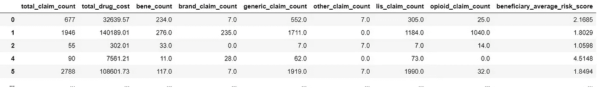
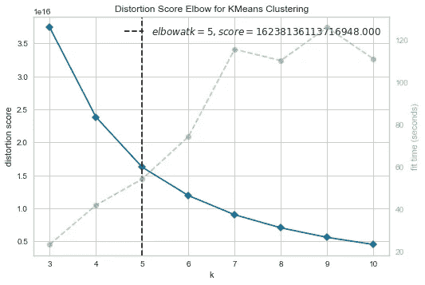
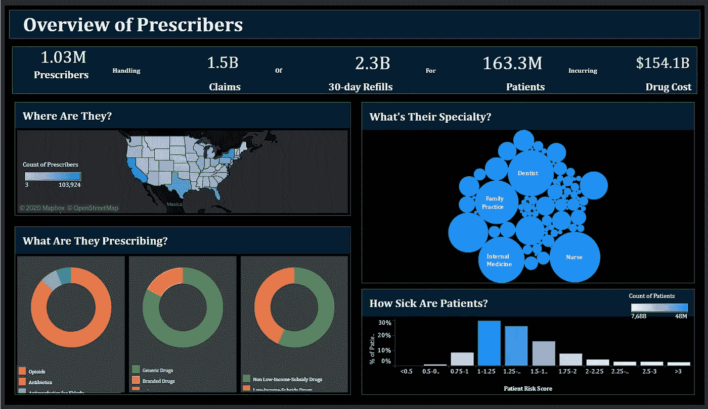
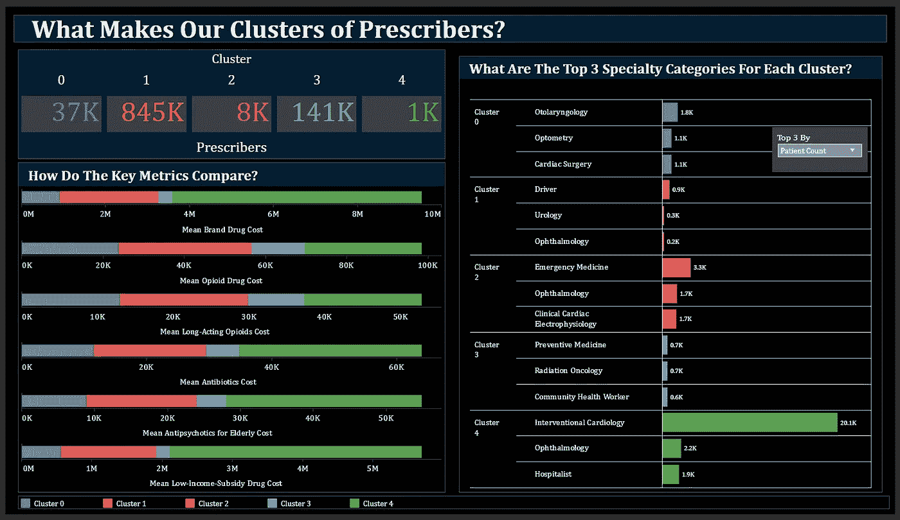
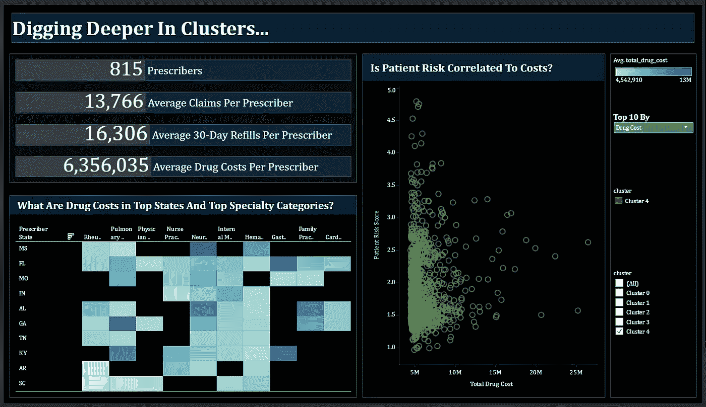

# 医疗保健中的欺诈检测

> 原文：<https://towardsdatascience.com/fraud-detection-in-healthcare-1801bf19d36c?source=collection_archive---------19----------------------->

## 使用[表格即](https://public.tableau.com/views/DetectingFraudsinHealthcare/Story1?:display_count=y&:origin=viz_share_link)识别可疑的医疗服务提供者


[engin akyurt](https://unsplash.com/@enginakyurt?utm_source=medium&utm_medium=referral) 在 [Unsplash](https://unsplash.com?utm_source=medium&utm_medium=referral) 上拍摄的照片

你知道吗，在美国，数十亿美元花费在欺诈、浪费和滥用处方药上。

> 此外，您是否知道只有 20%的医疗保健提供商承担了 80%的成本！？

你会问，我是怎么知道的？

> TLDR :如何识别可疑的和可能有欺诈行为的医疗服务提供者？看看[我的场景，即](https://public.tableau.com/views/DetectingFraudsinHealthcare/Story1?:display_count=y&:origin=viz_share_link)和[我制作的解释这些场景的视频](https://youtu.be/XSvFYj-UmtM)。

我曾经和美国一家主要的健康保险公司合作过。在广泛研究了绝密的患者索赔数据后(它受到严格的法律保护！)在多个项目中，我意识到的一件事是阿片类药物危机是真实存在的。即使我们把阿片类药物放在一边，欺诈性索赔的数量也是巨大的。然而，应该提到的是，我们通常所说的欺诈，实际上是欺诈、浪费和滥用(FWA)。而欺诈是故意和恶意进行的(咄！)，浪费和滥用并不要求对不法行为有意图和知情。浪费是对资源的过度利用，而滥用是指提供者的做法与合理的财政、商业或医疗做法不一致。

> 无论如何，当目标是确定这样的医疗保健提供者时，我们面临一个问题:他们实在是太多了！

这就像大海捞针。更准确地说，这就像在一堆针中找到一根有缺陷的针。进入图形分析来拯救。使用 Tableau 仪表板，我将展示如何过滤提供者并识别可疑的提供者。通过这种方式，我们减少了搜索池的大小，从而使查找故障针变得容易。；)

但是数据在哪里呢？实际的患者索赔数据受到保护(称为 PHI，即受保护的健康信息)，公众无法获得。但是我们可以凑合使用公共可用的医疗保健数据，这些数据是在提供者级别上汇总的，因此它不会识别患者。医疗保险和医疗补助服务中心在[开处方者汇总表](https://data.cms.gov/Medicare-Part-D/Medicare-Provider-Utilization-and-Payment-Data-Par/psut-35i4)中提供此类数据。该数据包含每个提供者提供的处方的汇总详细信息，如阿片类药物、抗生素、品牌药物、仿制药，以及提供者的人口统计信息。

我确定了一些我认为在判断开处方者的欺诈行为时很重要的特征。



我应用了 k-means 聚类，并使用 *KElbowVisualizer* 来确定最佳聚类数，如下所示。

```
from yellowbrick.cluster import KElbowVisualizervisualizer = KElbowVisualizer(KMeans(init='k-means++'), k=(3,11))
visualizer.fit(X)        # Fit the data to the visualizer
visualizer.show()
```

完整的代码可以在这个 [colab 笔记本](https://github.com/mohannishant6/Detecting-Frauds-in-Healthcare/blob/master/Clustering.ipynb)中看到。使用肘方法，我决定 5 是集群的最佳数量



我在数据帧中为每个处方者标记了他们的簇号。

> 看看我做的这个画面。它有三个视图来讲述一个故事，并帮助确定一些特定的可疑处方。

以下是三视图显示的内容:

美国整体医疗保健提供者/开处方者情景概述；这些图表还充当其他图表的过滤器，因此我们可以使用上面的两个图表在右下角的条形图中看到加利福尼亚去看牙医的患者的疾病水平。



第二个屏幕直观地解释了集群之间的差异；查看器可以选择使用下拉功能列表来更改指标，该列表给出了每个集群的前 3 个特性。可以明显看出，集群 4 确实是可疑的，因为它在所有类别中具有最高的成本。



最后，我们更深入地研究集群 4，以识别异常提供商。我们还可以选择任何其他集群来精确定位混淆的提供者。右侧的散点图提供了悬停在圆圈上的提供商的详细信息。最右边的提供者/处方者是产生高费用的人。当他们的患者风险评分低时，我认为他们是可疑的。



总之，仪表板的视图 1 旨在教育美国数据和整体医疗保健情况的分析师或查看者。在熟悉数据之后，在第二个视图中，我希望直观地传达所形成的集群和所使用的特征之间的差异。因此，观点 2 可以被认为是解释性的。在视图 3 中实现了识别一个或多个混杂或异常处方者的最终目标。正如在第三视图的最后一个图表中可以看到的，我们有一个简单的方法来确定潜在欺诈的开处方者。

这是我制作的一个 2 分钟的视频[来解释](https://youtu.be/XSvFYj-UmtM)[即](https://public.tableau.com/views/DetectingFraudsinHealthcare/Story1?:display_count=y&:origin=viz_share_link):

所呈现的可视化的优势在于成功地实现了识别可疑处方者的主要任务。在这个过程中，分析师或观众还可以了解医疗保健领域数据的复杂性，如成本和患者风险评分。然而，这种方法的鲁棒性不能保证。

> 仍然需要领域专家来判断使用 viz 识别为可疑的开处方者是否是假阳性。

例如，通过可视化识别的开处方者可能是仅迎合高费用患者/病例的开处方者。这样的开处方者将通过建议的可视化被错误地识别。与此同时，可以认为，考虑到其他特征，精通医疗保健领域的分析师或观察者将能够判断开处方者实际上是否是混淆者。

在 [LinkedIn](https://www.linkedin.com/in/mohannishant/) 上与我联系

在 [GitHub](https://github.com/mohannishant6) 上查看一些我感兴趣的项目