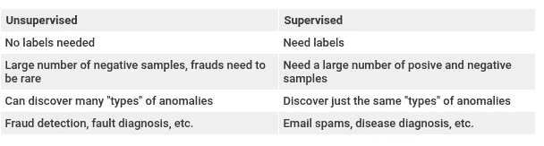
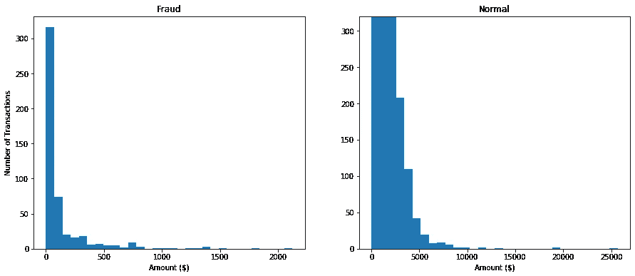
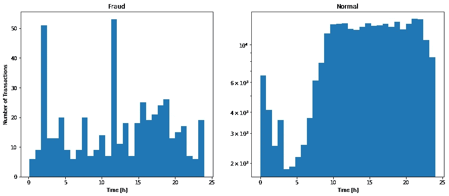
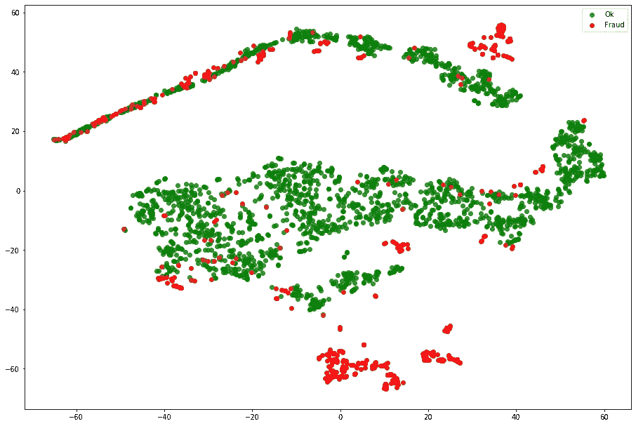
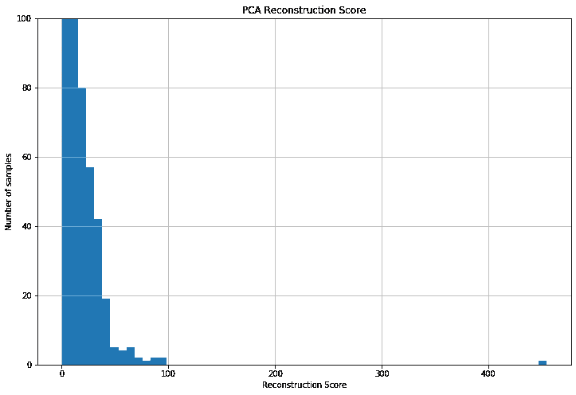
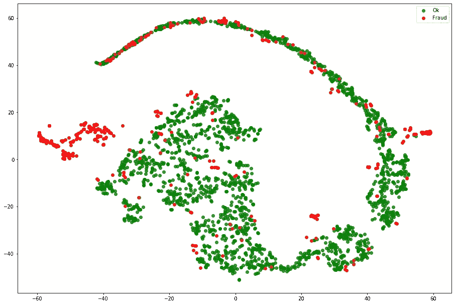
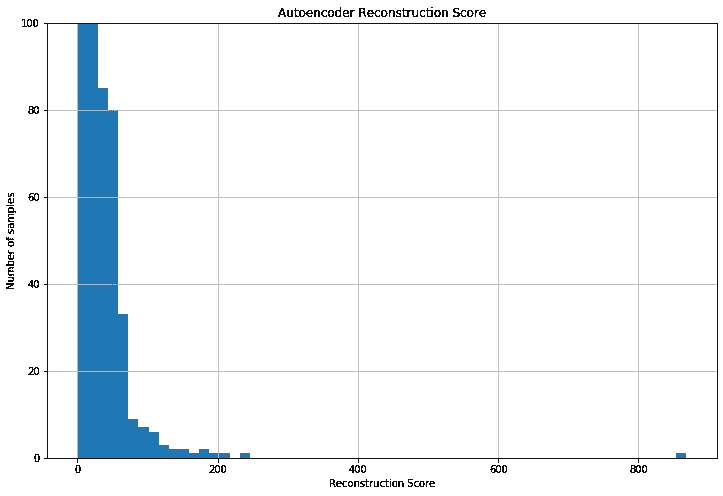
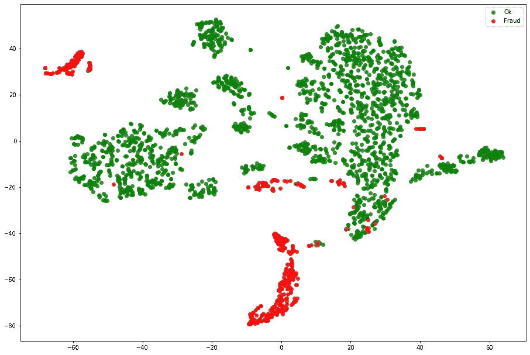

# 欺诈检测—无监督的异常检测

> 原文：<https://towardsdatascience.com/fraud-detection-unsupervised-anomaly-detection-df43d81fce67?source=collection_archive---------11----------------------->

## 发现信用卡交易欺诈的 100%无人监管的方法

瑞安·波恩在 [Unsplash](https://unsplash.com/s/photos/credit-card?utm_source=unsplash&utm_medium=referral&utm_content=creditCopyText) 拍摄的照片

许多企业主最关心的问题之一是如何保护他们的公司免受欺诈活动。这种担忧促使大公司保存与他们过去的欺诈行为相关的数据，然而，无论是谁实施欺诈，目的都是不被发现，那么这种数据通常是未标记的或部分标记的。

在本文中，我们将讨论如何在信用卡交易数据集上发现欺诈，与大多数欺诈数据集不同，该数据集是完全标记的，但是，我们不会使用标签来发现欺诈。信用卡欺诈是指有人使用他人的信用卡或账户信息进行未经授权的购买或通过预付现金获取资金。信用卡诈骗不仅仅发生在网上；这也发生在实体店中。作为企业主，您可以通过识别支付环境中潜在的信用卡欺诈来避免严重的问题和不必要的宣传。

发现欺诈交易最常见的方法之一是随机选择一些交易，并要求审计员对其进行审计。这种方法非常不准确，因为欺诈交易的数量与正常交易的数量之间的关系接近 0.1%。

然后，我们的目标是利用机器学习来检测和防止欺诈，并使反欺诈者更加高效和有效。通常，有监督和非监督方法:

此外，还可以部署这些模型来自动识别未来已知欺诈模式/类型的新实例/案例。理想情况下，这种类型的机器学习算法的验证有时需要时间验证，因为欺诈模式会随着时间的推移而变化，但是为了简化本文，验证将被简化。

# 数据集

该项目使用了来自 [Kaggle](https://www.kaggle.com/mlg-ulb/creditcardfraud) 的约 284000 笔信用卡交易的数据集。

 [## 信用卡欺诈检测

### 标记为欺诈或真实的匿名信用卡交易

www.kaggle.com](https://www.kaggle.com/mlg-ulb/creditcardfraud) 

数据集高度不平衡，正类(欺诈)占所有交易的 0.172%。它只包含作为 PCA 变换结果的数字输入变量。不幸的是，由于保密问题，原始特征和关于数据的更多背景信息没有被提供。特征 V1、V2、…、V28 是用 PCA 得到的主要成分，唯一没有用 PCA 变换的特征是“时间”和“数量”，并且没有空值([数据集页面](https://www.kaggle.com/mlg-ulb/creditcardfraud))。

因为只有“时间”和“金额”特征很容易解释，所以我们可以使用一些可视化方法来查看这些特征对目标变量(欺诈)的影响。首先，欺诈更多发生在小额交易还是大额交易上？

# 检测欺诈的方法

本文提出了一种无监督的方法来检测欺诈，唯一使用标签的地方是评估算法。这个问题的最大挑战之一是目标高度不平衡，因为只有 0.17%的案件是欺诈性交易。但是表征学习方法的优点是它仍然能够处理这种不平衡性质的问题。使用 TSNE，我们可以尝试了解交易是如何相似的:

这种方法的主要思想是压缩数据，形成“潜在表示”，然后重构数据。如果样本与数据集的其余部分相似，则重构的数据将与原始数据相似甚至相等。然而，如果样本与其余样本**不**相似，则重构样本将不会与原始样本相似。

简而言之，我们压缩数据并重建它。如果重建的数据与原始数据不相似，我们就有欺诈行为。

## 主成分分析

使用主成分分析(PCA)，我们设法将数据从 30 个特征压缩到 10 个特征，并计算重建分数。该分数的直方图如下:

我们可以看到，大多数样本具有较低的重构分数，然后，可能大多数欺诈具有超过 50 的重构分数。使用 TSNE，我们可以将原始数据处理与 PCA 压缩数据分布进行比较。

原始分布与 PCA 分布

现在，我们需要为重建分数设置一个阈值。通常使用领域专业知识来帮助设置这个阈值，因为它直接影响精确度和召回率的权衡。

使用重建分数的平均值和标准偏差，我们可以设置合理的阈值。然后，我选择将阈值设置为 *mean + 2*std。*这样，我们审计了 0.74%的交易，发现了 87%的欺诈行为。

## 自动编码器

自动编码器是一种人工神经网络，用于以无监督的方式学习有效的数据编码。它由负责压缩数据的编码部分和重建数据的解码器组成。

自动编码器的目的是学习一组数据的表示(编码)，通常是为了降维。与 PCA 方法类似，重建得分直方图如下所示:

我们可以看到，大多数样本的重构分数较低，而大多数欺诈的重构分数可能超过 60。使用 TSNE，我们可以将原始数据处理与自动编码器压缩数据分布进行比较。

原始发行版与自动编码器发行版

自动编码器表示似乎很好地将欺诈从正常数据中分离出来。现在，我们需要为重建分数设置一个阈值。通常使用领域专业知识来帮助设置这个阈值，因为它直接影响精确度和召回率的权衡。

使用重建分数的平均值和标准偏差，我们可以设置合理的阈值。然后，我选择将阈值设置为 *mean + 2*std。*通过这种方式，我们审计了 0.85%的交易，发现了 65%的欺诈行为。

# 结论

该方法的目标已经实现，使得用 100%无监督的方法检测欺诈成为可能。然而，有几种方法可以使这种方法更好地工作，例如:

*   调整使用的模型(PCA 和自动编码器)；
*   调整重建分数的阈值；
*   探索 PCA 和 Autoencoder 是否检测到相同的欺诈。如果他们以不同的方式工作，也许值得一试；
*   用一些特征工程增加数据。

在 [GitHub](https://github.com/lmeazzini/Small-projects/blob/master/Credit_fraud.ipynb) 上可以找到用于执行这种方法的代码以及更多的分析:

 [## lmeazzini/小型项目

### permalink dissolve GitHub 是超过 5000 万开发人员的家园，他们一起工作来托管和审查代码，管理…

github.com](https://github.com/lmeazzini/Small-projects/blob/master/Credit_fraud.ipynb)