# 使用 Geopandas 和 Contextily 为静态地图提供免费底图

> 原文：<https://towardsdatascience.com/free-base-maps-for-static-maps-using-geopandas-and-contextily-cd4844ff82e1?source=collection_archive---------31----------------------->

## 了解如何在 Python 中添加免费底图


来源:https://github.com/darribas/contextily

[***context ily***](https://github.com/darribas/contextily)是 Python 中对上下文瓦片的一个包。在这个快速教程中，我将向您展示如何在 Jupyter Notebook 中使用上下文和 Geopandas 来制作一些漂亮的地图。首先，我们需要确保安装了这些包，在 anaconda 提示符下键入:

```
conda install -c conda-forge geopandas
conda install -c conda-forge contextily
```

我假设你已经安装了 matplotlib 包，如果没有，确保你先安装它。

```
conda install -c conda-forge matplotlib
```

现在，我们需要将包导入笔记本:

```
import geopandas as gpd
import contextily as ctx
import matplotlib.pyplot as plt
```

在本教程中，我将使用北达尔富尔州/苏丹的冲突点数据及其边界形状文件，**该数据和本教程的完整代码可在**[***Github***](https://github.com/wathela/Contextily-Basemaps)***找到。***

```
# Read in the conflict points and the boundary shape files using geopandas
conf_data = gpd.read_file("NorthDarfurConf.shp")
ND_Boundary = gpd.read_file("NorthDarfurBoundary.shp")
```

为了快速浏览数据，您可以简单地打印地理数据帧的标题，以查看它们有哪些列。

```
conf_data.columns
```

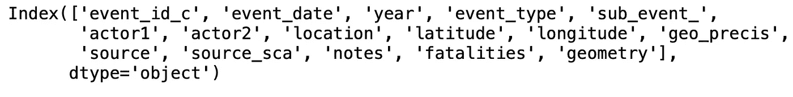

```
ND_Boundary.columns
```

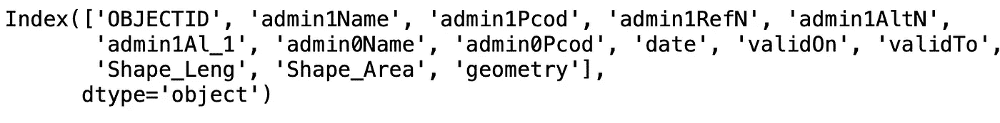

我们只需要冲突地理数据帧中的 event_type 列，它包含所记录事件的类型。显示这些数据只有一行代码:

```
# we specify the column that is going to be used for the symbology
conf_data.plot(column = 'event_type');
```

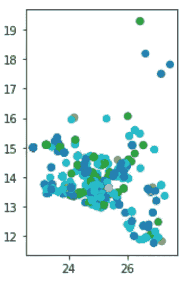

为了使它更好，需要设置一些参数，我们还将使用边界地理数据框架来显示州的边界。但是首先，我们需要定制情节的颜色(如果你已经意识到它是随机生成的)。简单地说，我们将为 even_type 列中的唯一值创建一个字典，并为每个值分配一个唯一的自定义颜色代码。

```
# get the uniques values in event_type column
categories = conf_data.event_type.unique()# create a list for our custom colors
c = ['m', 'k', 'g', 'r', 'y', 'c']# create a dictionary to combine both lists, categories are keys and # color codes are values
colorDict = dict(zip(categories,c))
print(colorDict)
```

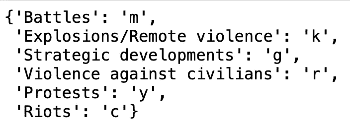

要使用自定义颜色绘制我们的点，我们需要按照 event_type 列对 conf_data geo-dataframe 进行分组，以便每个唯一的事件类型都能从颜色字典中获得其指定的颜色。

```
# plot the state's boundary with black edge color only and line width of 2
ax = ND_Boundary.geometry.boundary.plot(figsize = (10,15), color = None, edgecolor = 'K', linewidth=2)# Loop through each event type group for eventType, data in conf_data.groupby('event_type'):
    color  = colorDict[eventType]
    data.plot(ax = ax,  color = color, label = eventType)
```

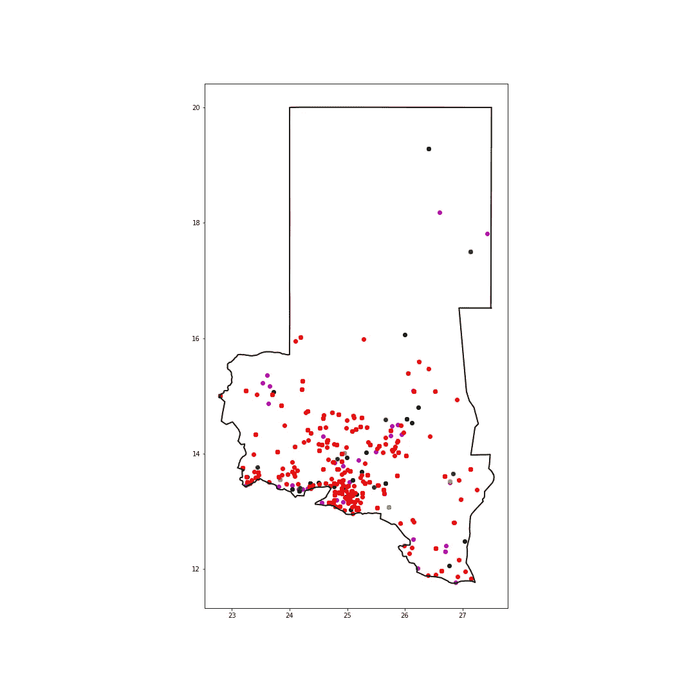

# 上下文地

现在我们准备探索上下文，看看我们如何使用它在我们的地图中包含一个底图。Contextily 有一个完整的供应商列表。它们都存储为字典，因此您可以在 python 中轻松地浏览和切换它们:

```
print(ctx.providers.keys())
```

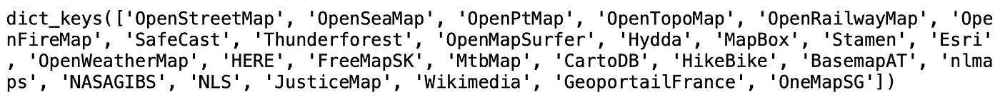

要查看每个提供者包含哪个切片，您可以使用提供者名称来打印其切片。例如，让我们看看开放街道地图提供商有哪些切片:

```
print(ctx.providers.OpenStreetMap.keys())
```

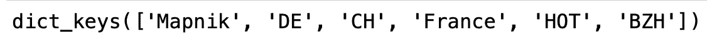

要将基础地图添加到前面的地图中，我们只需将一行代码添加到前面的代码中，其中我们指定:

*   轴:以确保我们一起策划一切。
*   坐标参考系统(crs):对于 crs，将使用 conf_data 或 ND_Boundary 的相同 crs(两者具有相同的 crs ),否则它将不起作用。
*   提供者:例如带有 Mapnik 磁贴的开放街道地图。

```
# add open street map basemap
ctx.add_basemap(ax, crs = ND_Boundary.crs, url = ctx.providers.OpenStreetMap.Mapnik)
```

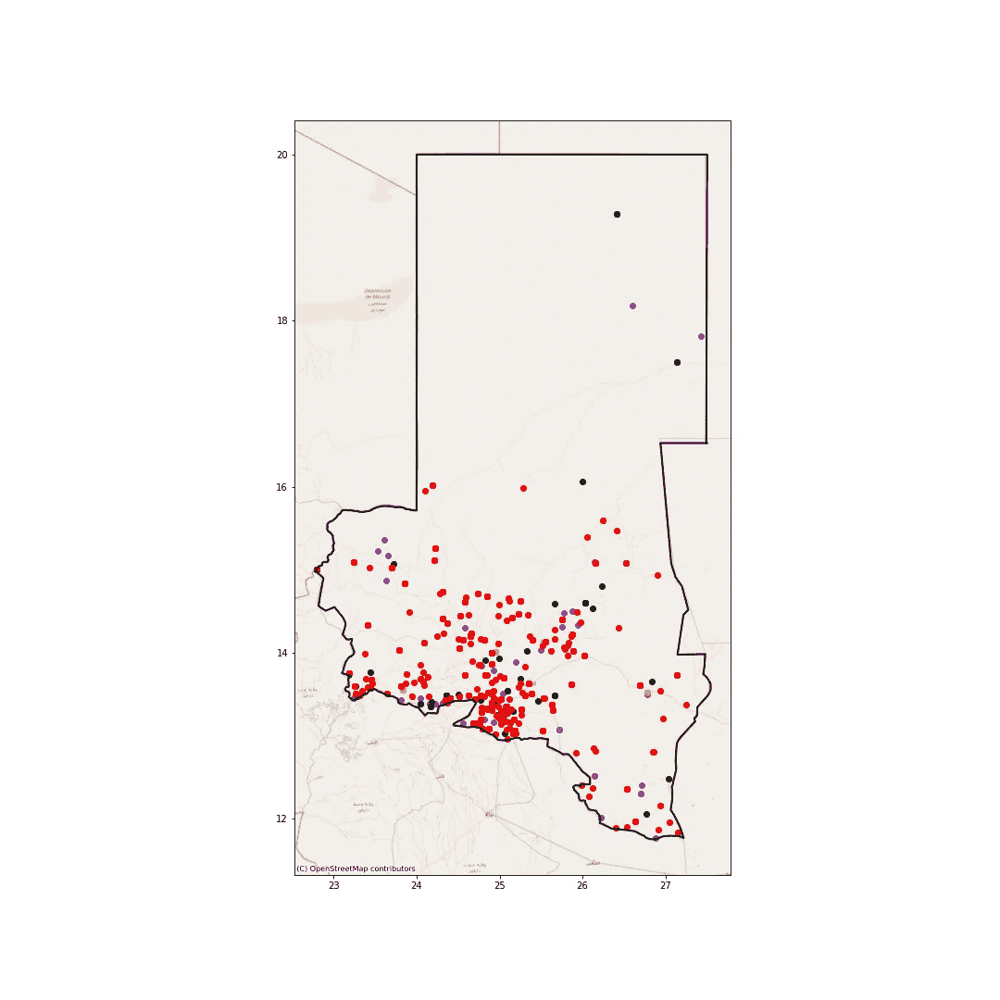

最后，将为我们的地图添加一个图例和标题:

```
ax.legend(bbox_to_anchor = (0.31,1), prop={'size':10}) # set legend's position and sizeax.set(title="Conflict in North Darfur/Sudan (1997-2020)") # add a title to the mapax.set_axis_off() # remove the axis ticks 
plt.tight_layout() # adjust the padding between figure edges
plt.savefig('norhtDarfur_conf_OSM_Map.png')# Save the map as an image
plt.show()
```

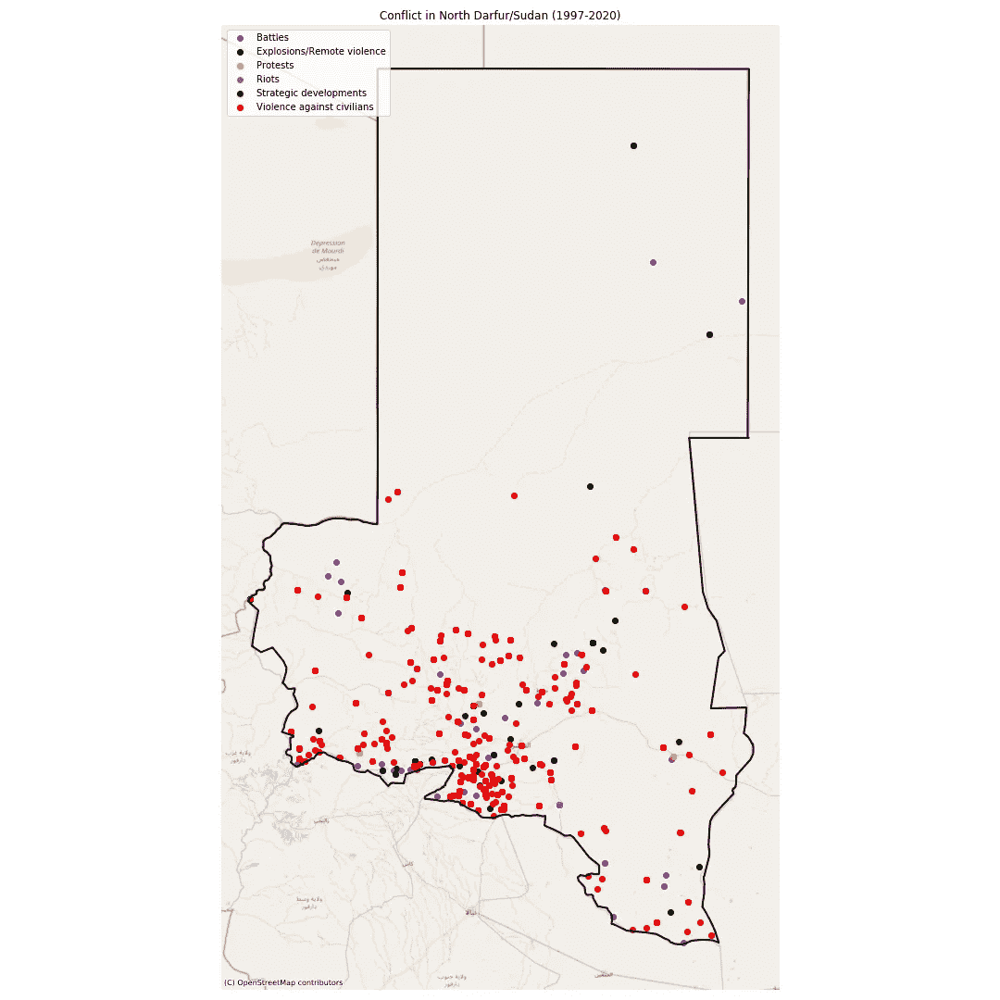

以下是一些其他提供商:

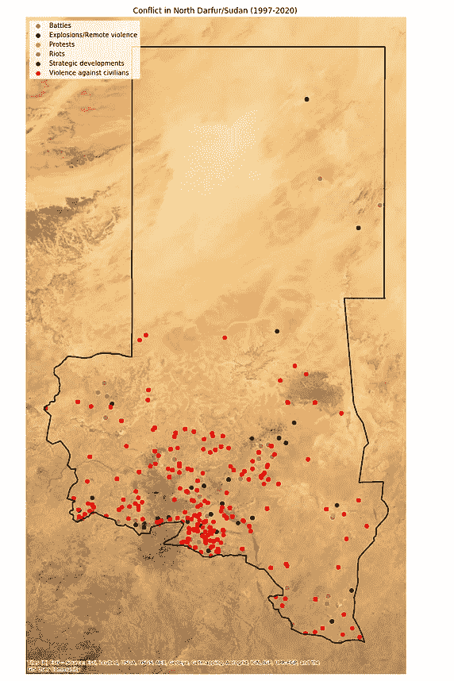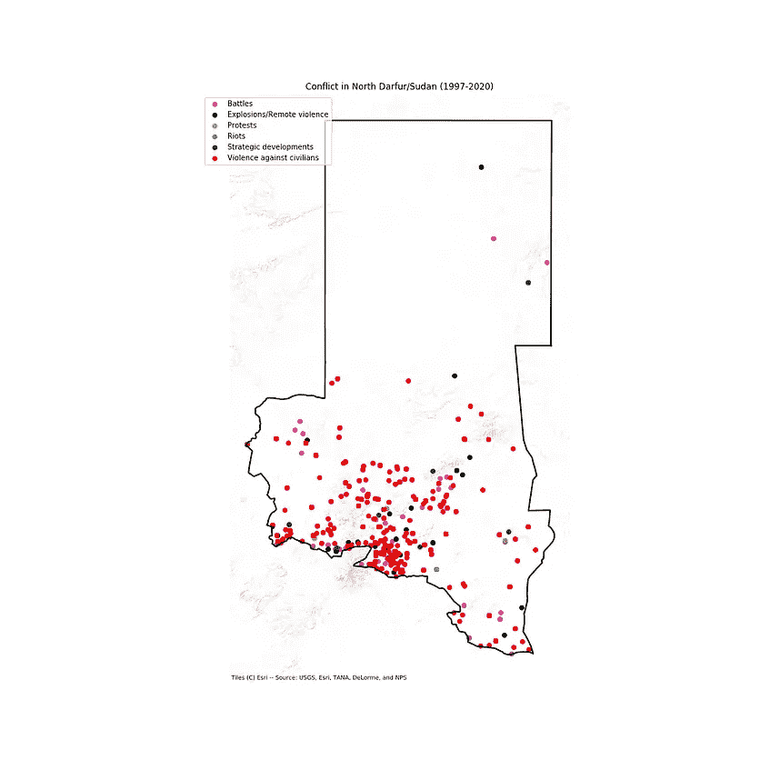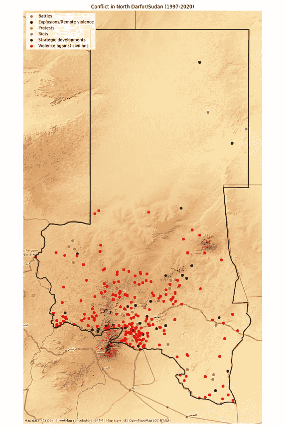

从左至右:Esri 世界影像、Esri 地形和开放地形底图。

# **参考文献**

 [## GeoPandas 0.7.0 - GeoPandas 0.7.0 文档

### GeoPandas 的目标是简化 python 中地理空间数据的处理。它结合了熊猫的能力…

geopandas.org](https://geopandas.org/) [](https://github.com/darribas/contextily) [## 达里巴斯/语境地

### contextily 是一个小的 Python 3 (3.6 及以上版本)包，用于从互联网上检索切片地图。它可以添加那些瓷砖…

github.com](https://github.com/darribas/contextily) [](https://data.humdata.org/dataset/acled-data-for-sudan) [## 苏丹-冲突数据

### ACLED 项目代码报告的信息类型，代理人，确切位置，日期和其他特点…

data.humdata.org](https://data.humdata.org/dataset/acled-data-for-sudan)