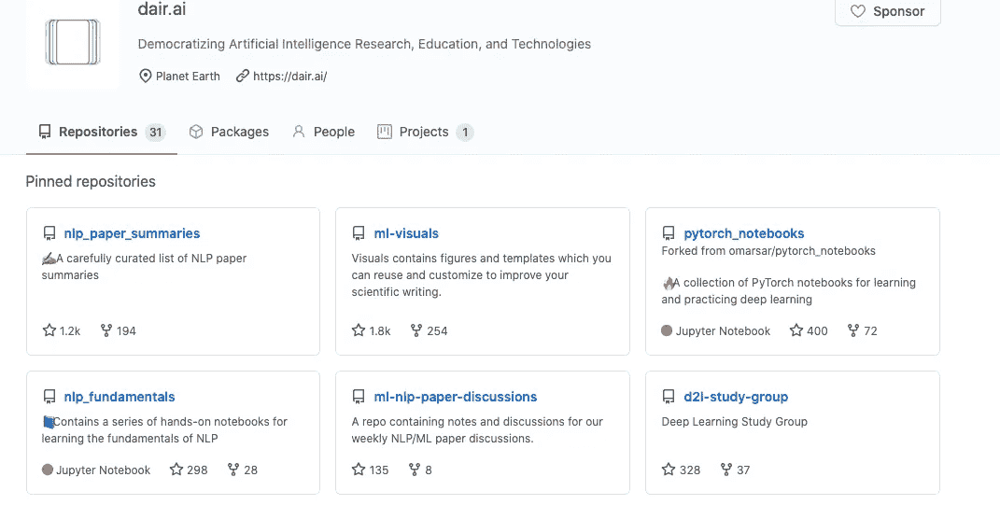
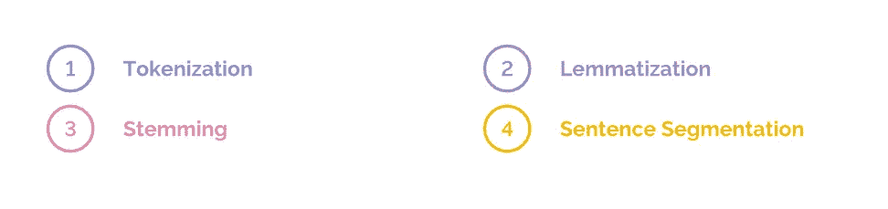
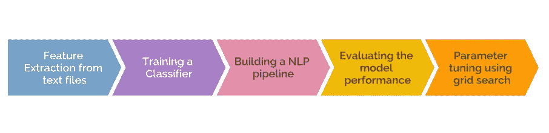
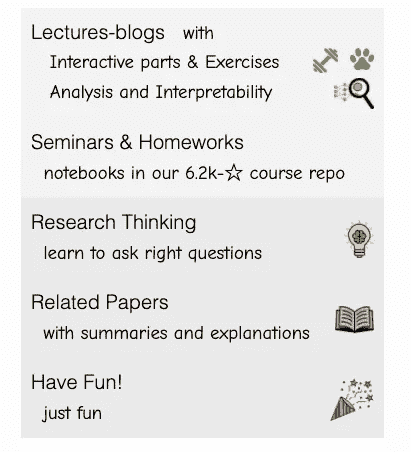
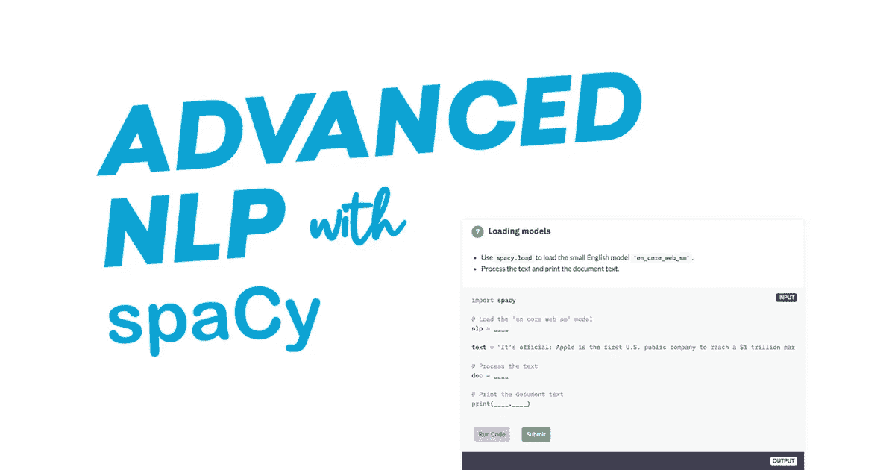
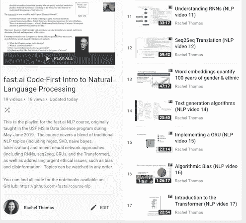

# 自然语言处理入门的免费实践教程

> 原文：<https://towardsdatascience.com/free-hands-on-tutorials-to-get-started-in-natural-language-processing-6a378e24dbfc?source=collection_archive---------27----------------------->

## 开始使用 NLP 并不困难

[梁杰森](https://unsplash.com/@ninjason?utm_source=medium&utm_medium=referral)在 [Unsplash](https://unsplash.com?utm_source=medium&utm_medium=referral) 上的照片

自然语言处理(NLP)是人工智能的一个子领域，近年来发展迅速。由于研究、学术和工业领域的许多人的共同努力，取得了巨大的进展。其中一些机构非常友好地公开了他们的资料，这样全世界的人都可以从中受益。这篇文章是五个这样的优秀资源的汇编，这些资源可以被证明对刚开始学习 NLP 的人或者有经验的人非常有益。这些课程由各自领域的专家创建，提供互动练习、简明理论和真实案例研究的组合。

# 1.dair.ai 的《自然语言处理基础》(第一章)

来源:[dair . ai 的 Github 页面](https://github.com/dair-ai)

dair.ai 是一个致力于使人工智能研究、教育和技术民主化的社区。他们所有的项目都在 GitHub 上免费托管，他们通过聚会、时事通讯、博客和学习材料传播知识。其中一个正在进行的项目是关于自然语言处理基础的****，**，这将是一个从零开始的自然语言处理原则系列。目前，只有第一章是可用的，如果你是一个绝对的初学者，这应该是一个很好的起点。这一章有 colab 版本和网络版本。本章以清晰易懂的术语介绍了以下 NLP 基础知识:**

****

**作者图片**

**阅读完教程后，你会对一些重要的 NLP 概念背后的动机有足够的理解。这将为先进的东西奠定基础。**

# **2.sci kit-学习文本数据**

****

**[来源:scikit-learn 开发者](http://r	The scikit-learn developers)**

**[**Scikit-learn**](https://scikit-learn.org/stable/) ，一个流行的用于机器学习的 Python 库，有几个关于 [**处理文本数据**](https://scikit-learn.org/stable/tutorial/text_analytics/working_with_text_data.html) 的动手教程。实践教程使用 20 个新闻组数据集向您介绍文本分析的一些基本方面:大约 20，000 个新闻组文档的集合，平均分布在 20 个不同的新闻组中。在本教程结束时，您将对 NLP 的以下方面有一个大致的了解:**

****

**作者图片**

**本教程后面还有一些练习来进一步练习和巩固概念。**

# **3.Elena (Lena) Voita 的 NLP 课程**

****

**来源:[https://lena-voita.github.io/nlp_course.html](https://lena-voita.github.io/nlp_course.html)**

**莉娜是爱丁堡大学的博士生。她最近发布了一个名为 [**NLP 课程|给你**](https://lena-voita.github.io/nlp_course.html) 的 NLP 课程。这是她从 2018 年秋季开始在 [Yandex 数据分析学院(YSDA)](https://yandexdataschool.com/) 教授的(ML for) [自然语言处理课程](https://github.com/yandexdataschool/nlp_course)的延伸。这门课程在很多方面都很独特:**

*   **首先，它是免费和公开的。**
*   **其次，本课程设计方便、清晰，并且对学习者友好。这使得它不同于我过去遇到的许多其他 NLP 课程。事实上，埃琳娜如此关注课程的个性化是非常值得称赞的。用她的话说:**

> **我想制作这些材料，这样你(是的，你！)可以自己学习，学自己喜欢的东西，按自己的速度学习。我的主要目的是帮助你进入你自己的非常个人化的冒险。**送给你。****

**本课程目前涵盖以下模块:**

*   **单词嵌入**
*   **文本分类**
*   **语言建模**
*   **Seq2seq 和注意**

**每个模块都是精心策划的内容的组合，包括交互部分、练习、相关研究论文的链接，甚至一些 NLP 游戏。该课程正在积极开发一个关于迁移学习的模块，预计将于 11 月添加。甚至还有关于卷积网络的补充部分。**

# **4.带空间的高级 NLP**

****

**来源:[https://course.spacy.io/en/](https://course.spacy.io/en/)**

**[**spaCy**](https://spacy.io/) 是一个用于工业级自然语言处理的现代 Python 库。 [**高级 NLP with spaCy**](https://course.spacy.io/en/) 是由 spaCy 的核心开发者之一 Ines Montani 打造的免费互动课程。在这个免费的互动在线课程中；您将学习如何使用 spaCy 构建高级自然语言理解系统，同时使用基于规则和机器学习的方法。本课程包括四个章节，这些章节又进一步细分为几个小的互动模块:**

*   **[第 1 章:寻找单词、短语、名称和概念](https://course.spacy.io/en/chapter1)**
*   **[第二章:利用 spaCy 进行大规模数据分析](https://course.spacy.io/en/chapter2)**
*   **[第三章:处理管道](https://course.spacy.io/en/chapter3)**
*   **[第四章:训练神经网络模型](https://course.spacy.io/en/chapter4)**

**本课程结束时，您将有足够的经验使用 spacy 在 NLP 中构建自己的小项目。**

# **5.Fastai 的自然语言处理的代码优先介绍**

****

**来源:[fast . ai 的 NLP 课程视频](https://www.fast.ai/2019/07/08/fastai-nlp/)**

**[**自然语言处理**](https://github.com/fastai/course-nlp) 代码优先入门是 Rachel Thomas 教授的课程，遵循 [fast.ai](https://www.fast.ai/) 自上而下的教学方法。以下是该课程官方博客文章的节选:**

> **该课程教授传统的自然语言处理主题(包括正则表达式、奇异值分解、朴素贝叶斯、记号化)和最新的神经网络方法(包括 RNNs、seq2seq、注意力和变压器架构)，以及解决紧迫的伦理问题，如偏见和虚假信息。**

**本课程配备了 Jupyter 笔记本和相关视频，涉及 NLP 的一些重要方面，如:**

*   **[自然语言处理的迁移学习](https://www.youtube.com/watch?v=5gCQvuznKn0&list=PLtmWHNX-gukKocXQOkQjuVxglSDYWsSh9&index=10&t=0s)**
*   **[注意](https://www.youtube.com/watch?v=IfsjMg4fLWQ&list=PLtmWHNX-gukKocXQOkQjuVxglSDYWsSh9&index=12)和[变压器](https://www.youtube.com/watch?v=AFkGPmU16QA&list=PLtmWHNX-gukKocXQOkQjuVxglSDYWsSh9&index=17)**
*   **[文本生成算法](https://www.youtube.com/watch?v=3oEb_fFmPnY&list=PLtmWHNX-gukKocXQOkQjuVxglSDYWsSh9&index=14)**
*   **[NLP 中的道德问题](https://www.youtube.com/watch?v=pThqge9QDn8&list=PLtmWHNX-gukKocXQOkQjuVxglSDYWsSh9&index=16)等**

# **结论**

**在这篇文章中，我们看了五种不同的 NLP 资源，它们对初学者或有语言处理经验的人都有好处。这不是一个详尽的列表，还有其他一些我可能遗漏了的众所周知的资料。然而，我亲自浏览了所有上述资源，因此可以毫无疑问地推荐它们。你可以选择所有的课程，也可以选择其中的一些。无论你走哪条路，确保你练习你的技能，因为仅仅有理论知识不会让你在这个行业走得更远。**