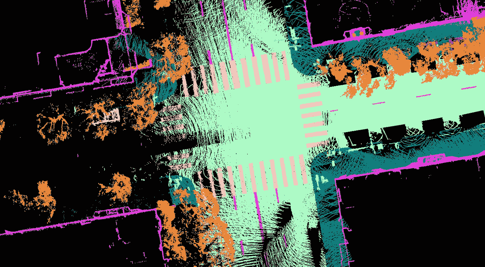
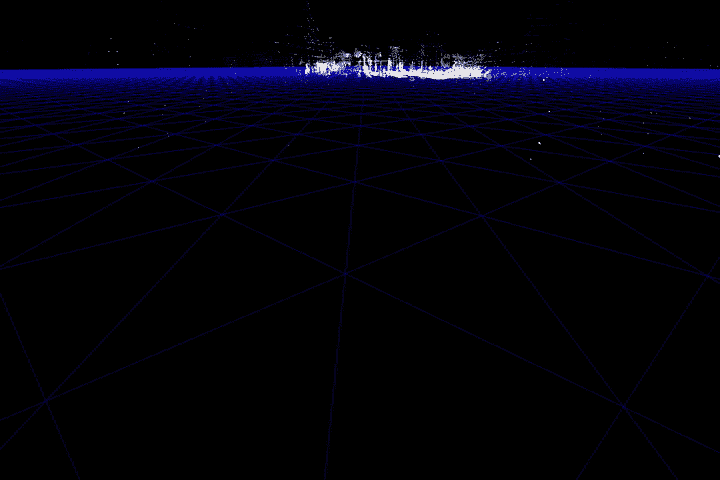

# 自动驾驶汽车人工智能应用的免费激光雷达数据集

> 原文：<https://towardsdatascience.com/free-lidar-datasets-for-self-driving-cars-ai-applications-50771284daf8?source=collection_archive---------26----------------------->

## Scale AI 发布了一个新的开源数据集，用于学术和商业用途，并加速了自动驾驶研究的发展。

数据标注，也称为数据标注/标注/分类，是用标签标注(即标注)数据集的过程。这个过程的质量对于受监督的机器学习算法来说是至关重要的，这些算法在试图通过识别未标记数据集中的相同模式来预测标签之前，从标记的数据中学习模式。

半自动图像标记的数据标记引导流程示例。图片来源: [segments.ai](https://segments.ai/)

对于自动驾驶汽车应用程序，我们通常会避免明确地对机器学习算法进行编程，以如何做出决策，而是向深度学习(DL)模型提供带标签的数据进行学习。事实上，DL 模型可以随着更多的数据变得更好，似乎没有限制。然而，要得到一个功能良好的模型，仅仅有大量的数据是不够的，还需要高质量的数据标注。

有鉴于此， [Scale AI](https://scale.com/) 旨在为自动驾驶汽车、地图绘制、AR/VR 和机器人等人工智能应用提供训练数据。Scale 首席执行官兼联合创始人亚历山大·巴甫洛夫·王在最近的一次采访中告诉 [TechCrunch](https://techcrunch.com/) :“机器学习绝对是一种垃圾进，垃圾出的框架——你真的需要高质量的数据来支持这些算法。这就是我们建立规模的原因，也是我们今天使用该数据集以开源视角帮助推动行业发展的原因。”

车道和边界检测应用的注释点云示例。图片来源:[比例人工智能](https://scale.com/open-datasets/pandaset)

本周，该公司与激光雷达制造商何塞合作，发布了一个名为 PandaSet 的新数据集，可用于训练机器学习模型，例如应用于自动驾驶挑战。该数据集是免费的，并授权用于学术和商业用途，包括使用何塞的前向(固态)PandarGT 激光雷达和名为 Pandar64 的机械旋转激光雷达收集的数据。

*该车安装有广角相机、长焦距相机、1 台机械旋转激光雷达(Pandar64)和 1 台固态激光雷达(PandarGT)。图像演职员表:* [*比例人工智能*](https://scale.com/open-datasets/pandaset)

这些数据是在旧金山和硅谷的市区行驶时收集的，之后官员们在该地区发布了呆在家里的新冠肺炎命令(据该公司称)。

数据集功能:

*   48，000 张相机图像
*   16000 次激光雷达扫描
*   +100 个 8 的场景
*   28 个注释类
*   37 个语义分割标签
*   完整的传感器套件:1 台机械激光雷达、1 台固态激光雷达、6 台摄像机、机载 GPS/IMU

它可以在[这个链接](https://scale.com/open-datasets/pandaset#overview)免费下载。

PandaSet 包括 28 个对象类的 3D 边界框和一组丰富的与活动、可见性、位置、姿势相关的类属性。该数据集还包括具有 37 个语义标签的点云分割，包括烟雾、汽车尾气、植被和充满汽车、自行车、交通灯和行人的复杂城市环境中的可驾驶表面。

*开源数据集的一些形态。图像演职员表:* [*比例 AI*](https://scale.com/open-datasets/pandaset)

虽然存在其他优秀开源自动驾驶汽车数据集，但这是一种不受任何限制地许可数据集的新尝试。

我收集了以下四个高质量的其他数据集，它们肯定会对您的机器学习/自动驾驶汽车项目或推动点云数据的形成和研究有用:

 [## 点云处理在线课程- 3D 地理数据学院

### 编队学习先进的点云处理和三维自动化。开发新的 python 地理数据技能和开源…

learngeodata.eu](https://learngeodata.eu/point-cloud-processor-formation/)  [## 三维点云的未来:一个新的视角

### 被称为点云的离散空间数据集通常为决策应用奠定基础。但是他们能不能…

towardsdatascience.com](/the-future-of-3d-point-clouds-a-new-perspective-125b35b558b9) 

## 开源自动驾驶汽车数据集

*   [Waymo 开放数据集](https://waymo.com/open/)
*   [Aptiv 的 nu scenes](https://www.nuscenes.org/)
*   [北京大学/百度 Apollo Scape](http://apolloscape.auto/)
*   [加州大学 BDD100K](https://arxiv.org/abs/1805.04687)