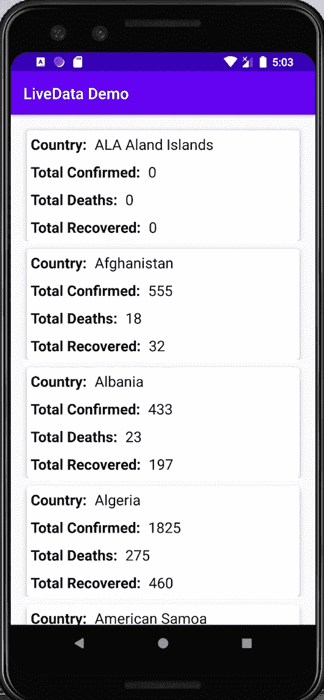
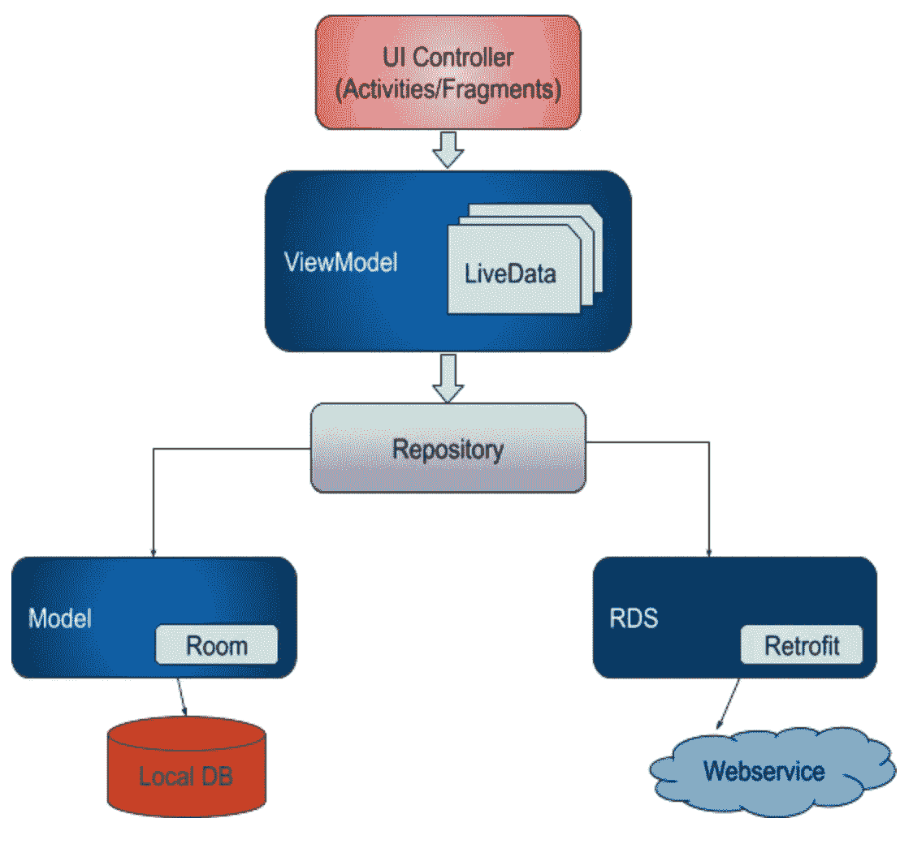
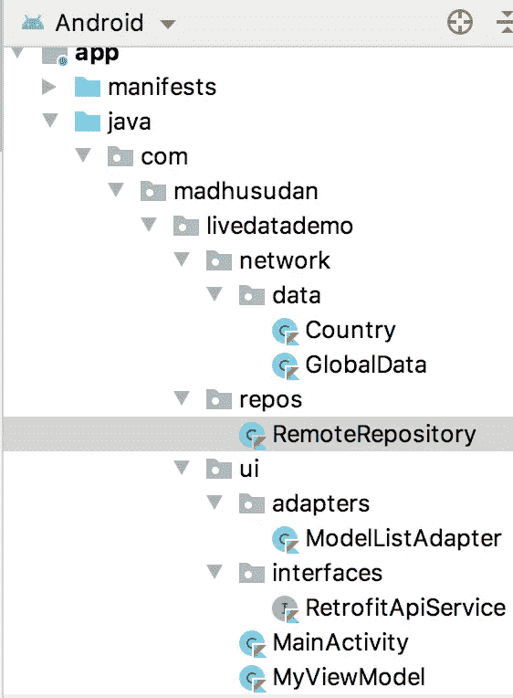
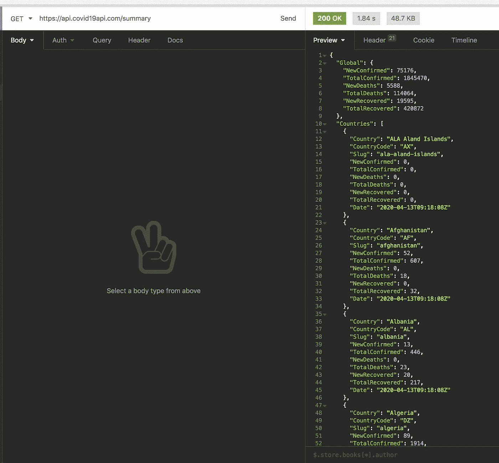

# 与 LiveData 和 MVVM 一起提供免费的冠状病毒案例 API

> 原文：<https://towardsdatascience.com/free-live-coronavirus-cases-api-with-livedata-and-mvvm-39a78f8351fb?source=collection_archive---------31----------------------->

## 我们将通过 LiveData & MVVM 实现实时冠状病毒病例应用编程接口


[Dương Trần Quốc](https://unsplash.com/@fanhungry?utm_source=unsplash&utm_medium=referral&utm_content=creditCopyText) 在 [Unsplash](https://unsplash.com/s/photos/camera-man?utm_source=unsplash&utm_medium=referral&utm_content=creditCopyText) 上拍照

## 我们将建造什么？

我们将构建一个 Android 应用程序，它将在 RecyclerView 中显示冠状病毒的真实病例。我们将遵循 MVVM 架构模式，用 Kotlin 实现 LiveData。

我们最终的应用程序将是这样的。



## 我们会学到什么？

*   MVVM 建筑模式
*   LiveData
*   使用改进的 API

## 为什么是 MVVM？

MVVM 是一种架构设计模式，它帮助我们实现以下目标。

*   MVVM 让代码更容易理解
*   对于其他开发人员来说，代码变得更容易维护
*   这也使得项目松散耦合，意味着减少了组件(如类、活动和片段)之间的依赖性。
*   代码测试变得容易多了。

## MVVM 建筑模式



MVVM 建筑

上图解释了 MVVM 架构模式。在这个图中，在体系结构的顶部存在我们的视图，用户通过这些视图与数据进行交互。

为了显示数据，我们使用 **ViewModel** ，因此我们的视图依赖于 ViewModel 来获取数据。使用 **ViewModel** 的好处是，如果活动被破坏，它不会更新数据。这意味着它减少了应用崩溃的机会。

接下来，在**视图模型**下面存在**存储库**，它进一步依赖于各种数据源。存储库可以从任何来源获取数据，它可以是远程存储库或本地存储库，这完全取决于您的逻辑。

## LiveData

当谈到可观察或观察者时，这意味着我们在谈论两种不同的东西，一种你可以认为是电视，另一种你可以认为是正在观看电视的人。所以电视是可观察的，因为它被观察，而观看它的人是一个观察者。如果我们把这个概念应用到我们的数据和视图上，数据被我们的视图观察，所以数据是可观察的，而视图是观察者。现在我希望你能理解这个概念。

现在是时候来点技术了，不是吗？

`[LiveData](https://developer.android.com/reference/androidx/lifecycle/LiveData)`是一个可观察的数据持有者类，这意味着扩展了`LiveData`类的类负责通知处于活动状态的视图。一旦数据发生任何变化，我们的视图就会看到，即我们的视图会得到通知。

让我们考虑一个场景来更好地理解这个概念。

## 例如:-

让我们假设，你在任何应用程序的主屏幕上，它向你显示项目列表，但只要你单击任何项目，就会发生一些处理，这意味着后台服务正在获取数据，同时，你关闭应用程序。该应用程序对您不可见，但后台服务很快停止(因为您关闭了该应用程序)，并且它仍在尝试设置视图上的数据，现在由于数据未被提取，因此您的应用程序将因`NullPointerException`而在后台崩溃。那就是没有使用`LiveData`的问题。

现在，我们可以从这个例子中了解到，我们获取数据的过程并不知道我们的活动、片段和服务的生命周期，这就是我们的应用程序崩溃的原因。

市场上唯一可用的解决方案是解决此类问题的`LiveData`。那我们还在等什么？让我们直接进入编码部分。

## 项目结构

在您的项目中创建以下包



## 网络包:

这个包包含另外两个包，即 data 和 repos，data 包有两个类来接收从 RemoteRepository 类获取的数据。

## 用户界面包:

这个包还有另外两个包，它们是适配器和接口，适配器包有一个`ModelListAdapter`类，这个类创建了一个**冠状病毒**的详细列表。

接口包包含一个返回改造对象的接口。在这个接口中，我定义了 **BASEURL** 和它的**端点**。

接下来的两类 ui 包是`MainActivity`和`MyViewModel`。我们的`MainActivity`类包含了`RecyclerView`和`ProgressBar`。MyViewModel 类为我们的活动提供数据。

说够了，让我们现在开始编码…

这个项目我准备用**免费的**冠状病毒 api。

**API 网址:**【https://api.covid19api.com/summary 

我将只使用国家数组。



## 主活动. kt

我在这个应用程序中有一个单独的屏幕，这个屏幕使用 RecyclerView 描绘了冠状病毒详细信息的列表。

`ViewModelProviders`是一个类，这个类的`of()`方法返回活动范围的 **MyViewModel 类**的对象。这是提供**视图模型**核心逻辑的主类。一旦我们创建了我们的 **MyViewModel** 类的对象，现在我们可以开始使用 **observer()** 方法观察数据。这个观察者接受两个参数，即当前活动的上下文和**观察者**匿名类。匿名类是没有任何名称的唯一类，这些类减少了类的数量。java 文件，这些类用于一些特定的情况，当只有一次使用是必要的。在 **Observer** 匿名类中，我们设置 recyclerview 适配器来显示我们的项目列表。所以这是我们在活动中需要的唯一代码。当 **observer()** 发现数据中有任何更新时，它会通知适配器或任何视图。

**MainActivity** 的布局文件仅包含 recyclerview 和一个 progressBar，用于显示从远程存储库获取数据时的处理情况。

## ModelListAdapter.kt

这是在 recyclerview 中设置项目列表的适配器类。这个类是从`MainActivity`中调用的。ModelListAdapter 类使用`*list_item*` 布局文件，该文件有四个 textviews 来显示数据。

我们的适配器类的布局文件。

## MyViewModel.kt

这是我们的 ViewModel 类， **MainActivity.kt** 类依赖于这个类。每当视图需要数据时，这个类就提供它。ViewModel 类只负责管理数据。这个类永远不能访问视图。这个类的`callAPI()`方法访问`Repository`类的对象并调用它的`callAPI()`方法。然后`Repository`类返回**可变数据**对象的对象。这个对象进一步传递给 our `MainActivity`来设置数据。

## 翻新设备服务

是一个有`fetchData()`方法的接口，这个函数返回`Country`类的对象。注意，fetchData()方法是用 **@GET** 请求注释的，这意味着我们要发出的是一个 **GET** 请求。Get request 仅在仅从服务器获取数据时使用，这意味着在服务器上既不发送数据也不更新数据，除此之外，该接口还创建了 reform 类的 singleton 对象。 **invoke()** 函数在**伴随对象内部，**这意味着无论何时我们需要调用这个`invoke()`方法，我们都不必创建对象。**伴随对象**与 Java 的**静态**方法相同。在 baseurl()方法中，我传递了我的 web 服务的 url。

## Repository.kt

Repository 类处理网络调用。当从`MyModelView`类调用这个类的 **callAPI()** 方法时，它很快开始执行它的异步方法`enqueue()`。该方法有两个回调函数， **onFailure()** 和 **onResponse()** ，如果调用成功，则调用`onResponse()`，否则调用`onFailure()`。

**数据类别:**

Country 是我的主类，它在构造函数中接受一个 GlobalData 类的列表。这个类由我们的 API 返回。

```
**class** Country(**val Countries**: List<GlobalData>) {

}
```

这是我们从 API 得到的数据。

```
**data class** GlobalData(
    **var Country**: String,
    **var NewConfirmed**: Int,
    **var TotalConfirmed**: Int,
    **var NewDeaths**: Int,
    **var TotalDeaths**: Int,
    **var NewRecovered**: Int,
    **var TotalRecovered**: Int
)
```

# 使用 LiveData 的优势

*   确保用户界面与数据状态相匹配
*   **没有内存泄漏:**观察器被绑定到`[Lifecycle](https://developer.android.com/reference/androidx/lifecycle/Lifecycle)`对象，当它们相关的生命周期被破坏时，它们会自行清理。
*   **没有因停止的活动而崩溃:**如果观察者的生命周期处于非活动状态，例如在后台堆栈中的活动，那么它不会接收任何 LiveData 事件。
*   **不再手动处理生命周期:** UI 组件只是观察相关数据，并不停止或恢复观察。LiveData 自动管理所有这一切，因为它在观察时知道相关的生命周期状态变化。
*   **总是最新数据:**如果生命周期变为非活动状态，它会在再次变为活动状态时接收最新数据。例如，一个在后台的活动在返回前台后会立即收到最新的数据。
*   **适当的配置更改:**如果由于配置更改(如设备轮换)而重新创建活动或片段，它会立即接收最新的可用数据。

如果你在代码的某个地方卡住了，不要担心，你可以从 [**这里**](https://github.com/himanshujbd/LiveData) 下载我的 Github 项目。

我希望你喜欢读这篇文章，你也可以访问我的 [**网站**](http://thehimanshuverma.com/) ，在那里我会定期发布文章。

[**订阅**](https://mailchi.mp/b08da935e5d9/himanshuverma) 我的邮件列表，以便在您的收件箱中直接获得我的文章，并且不要忘记关注我自己在 Medium 上发表的文章[**The Code Monster**](https://medium.com/the-code-monster)来完善您的技术知识。

# 结论

我们已经看到了如何将 LiveData 用于 MVVM 和改进 API。为了详细说明 LiveData 的用例，我使用了 Live Api，这样可以帮助您轻松理解 LiveData 的概念。