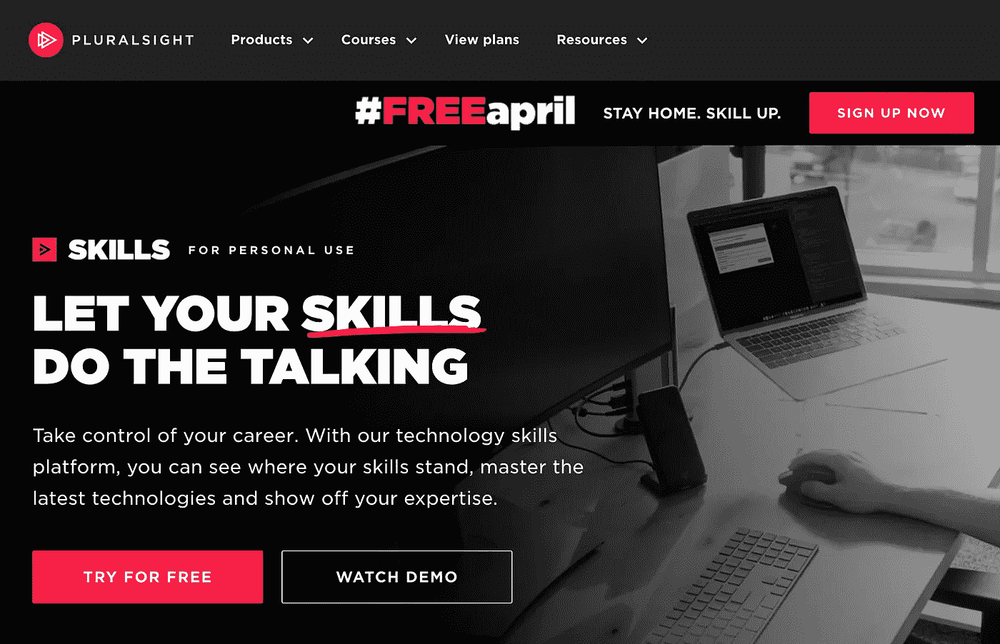
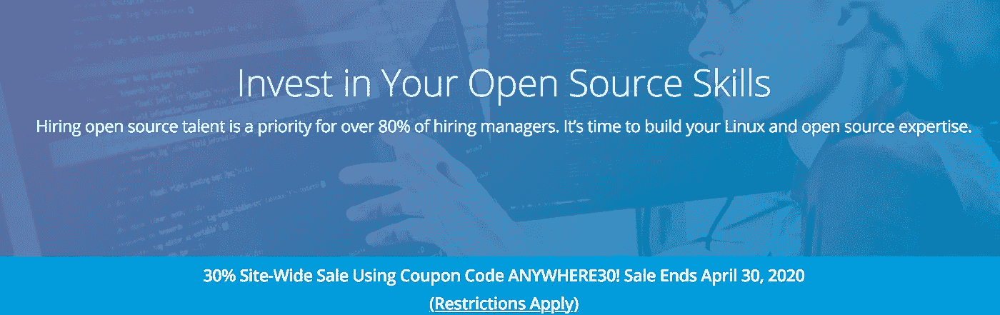

# 新冠肺炎危机期间的免费在线数据科学课程

> 原文：<https://towardsdatascience.com/free-online-data-science-courses-during-covid-19-crisis-764720084a2?source=collection_archive---------24----------------------->

## 提供免费课程的在线平台

J. Kelly Brito 在 [Unsplash](https://unsplash.com/s/photos/learning?utm_source=unsplash&utm_medium=referral&utm_content=creditCopyText) 上的照片

许多教育公司希望让数据科学对每个人来说更实惠、更容易获得。由于现在对许多人来说，时间是艰难和不确定的，许多付费平台现在要么提供免费订阅，要么提供课程。

如果你现在希望提高你的数据科学技能，查看这篇文章中的资源。

在你开始学习之旅之前，请务必阅读我在**如何学习**和**做更好的笔记**上的帖子。

 [## 如何记笔记:来自人工智能、神经科学、社会学家和免费应用程序的见解

### 帮助您更好地记笔记和思考的见解和工具

medium.com](https://medium.com/@ausius/how-to-take-notes-insights-from-ai-neuroscience-a-sociologist-and-a-free-app-34b4be63080a)  [## 使用这个免费的笔记应用程序做更好的笔记，它将成为你的第二大脑

### 黑曜石使连接想法变得容易，帮助你更好地思考和写作

medium.com](https://medium.com/swlh/take-better-notes-with-this-free-note-taking-app-that-wants-to-be-your-second-brain-1a97909a677b)  [## 2 元学习原则帮助你更有效地学习

### 高效获取知识和技能

medium.com](https://medium.com/@ausius/2-meta-learning-principles-to-help-you-learn-more-efficiently-44061c9951e1) 

# JetBrains 学院

[JetBrains 学院](https://www.jetbrains.com/academy/)网站

制作 PyCharm 等 ide 的软件公司 JetBrains 通过 JetBrains Academy 提供免费课程。您将通过构建工作应用程序来学习 coe。此优惠活动免费，有效期至 2021 年 1 月 1 日。

# 乌达城

图片来自 [Udacity](https://blog.udacity.com/2020/03/one-month-free-on-nanodegrees.html) 的博客

[Udacity](https://blog.udacity.com/2020/03/one-month-free-on-nanodegrees.html) 提供为期一个月的免费高级纳米学位课程，但**只针对美国或欧洲的学生**，而且每位学生仅限一个纳米学位课程。他们还计划在未来几周和几个月内宣布更多的举措，所以请注意！

# 乌德米

[Udemy](https://www.udemy.com/courses/free/) 免费资源中心页面截图

Udemy 免费提供数百门课程。许多是数据科学课程，但你也可以找到关于生产力、个人发展和音乐的免费课程。

# 谷歌云培训

谷歌云网站截图

[谷歌](https://inthecloud.withgoogle.com/training-discount/register.html)通过谷歌云培训在有限时间内提供独家优惠。你可以在[qwikilabs](https://www.qwiklabs.com/)、Pluralsight 或 Coursera 上学习课程(只是这三个网站中的一个，尽管 Pluralsight 和 Coursera 也在提供优惠——见下文)。

> 我们在 Qwiklabs、Pluralsight 和 Coursera 上提供的 Google Cloud 培训有特别折扣。要申领这些特别优惠，只需填写下表，并在 2020 年 5 月 31 日(星期日，太平洋时间晚上 11:59)之前在**您首选的平台上注册培训。**

# Coursera

图片来自 Coursera 的博客

危机期间，Coursera 提供了许多新的免费课程(带证书)。许多甚至与危机直接相关:精神健康和福祉、公共健康和流行病学。

> 从今天开始，我们将为任何人、任何地方提供完全免费的课程选择，这样更容易坚持学习。虽然 Coursera 上的许多课程已经可以免费获得，无需证书，但这次促销活动使您不仅可以参加讲座和测验，还可以获得提供这些课程的免费证书。我们计划在 2020 年 5 月 31 日前提供此项优惠，更多详情请访问以下链接。

# 国际商用机器公司

IBM 的培训和技能博客截图

[IBM](https://medium.com/p/764720084a2/edit) 正在提供数百门免费课程，比如 IBM Cloud、Watson、Systems、Professional Skills、Finance & Operations。

# 包装

[Packt](https://courses.packtpub.com/pages/free) 的免费车间访问页面截图

[Packt](https://courses.packtpub.com/pages/free) 是一家出版公司，出版编程书籍和工作坊。他们目前正在为 web 开发、数据科学和编程提供免费的研讨会。你必须向他们注册，购买他们的工作室(想买多少就买多少)，并在结账时输入促销代码(PACKTFREE)。

# 代码集

[代码学院](https://pro.codecademy.com/learn-from-home/)页面截图

Codecademy 正在提供专业版订阅。然而，只有 10，000 个奖学金可用，你需要一个有效的学校电子邮件地址。

# Dataquest

图片来自 [Dataquest](https://www.dataquest.io/blog/covid-financial-aid-scholarship/) 的助学金奖学金页面

[Dataquest](https://www.dataquest.io/blog/covid-financial-aid-scholarship/) 为那些真正有经济需求并渴望提高数据科学技能的人提供经济援助奖学金。

> 谁可以申请？任何人都可以申请，但我们要求两件事:你有真正的需求，并且在 5 月 27 日之前至少完成一次 Dataquest 任务。

# 多元视觉

[Pluralsight](https://www.pluralsight.com/product/skills/personal) 页面截图

[Pluralsight](https://www.pluralsight.com/product/skills/personal) 提供四月份的免费订阅。他们提供各种主题的课程，从软件开发到网络安全和机器学习。

# Linux 基金会培训奖学金

Linux 基础培训页面截图

Linux 基金会提供了高达 500 英镑的奖学金来发展开源社区。你将接受培训课程和认证考试。

# 奖金

许多教育公司都提供免费订阅(看看这个庞大的汇编，尤其是如果你在为你的孩子寻找资源的话！)由于学校关闭

国家应急图书馆(互联网档案馆)已经提供了超过 140 万册图书。

当你享受这些难以置信的学习资源时，记得保持安全和健康！

*更多帖子，* [*订阅我的邮件列表*](https://hauselin.ck.page/587b46fb05) *。*