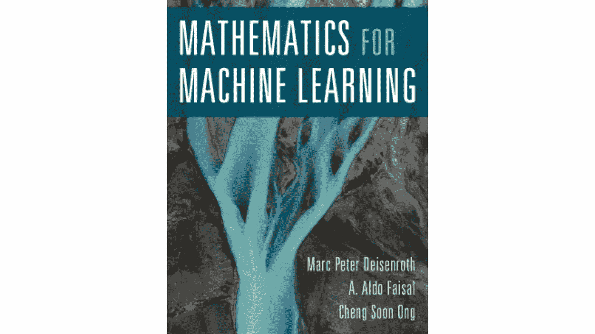

# 免费阅读资源|机器学习

> 原文：<https://towardsdatascience.com/free-reading-resources-machine-learning-9e15e96a7a2b?source=collection_archive---------46----------------------->

## 有助于理解机器学习概念的资源

照片由来自[佩克斯](https://www.pexels.com/photo/person-using-macbook-pro-on-person-s-lap-1181298/?utm_content=attributionCopyText&utm_medium=referral&utm_source=pexels)的[克里斯蒂娜·莫里洛](https://www.pexels.com/@divinetechygirl?utm_content=attributionCopyText&utm_medium=referral&utm_source=pexels)拍摄

在这篇文章中，我们将通过免费阅读资源来更好地理解机器学习。这将是一个简短的帖子。我将通过提供一些基本信息向您介绍每种资源。我试图通过在线访问找到资源，这样任何地方的任何人都可以免费访问它们。这也是我喜欢编程的原因之一，有无限多的开源和免费资源。这个列表中的七本书都与机器学习有关，但每本书都会给你不同的视角。希望这些资源对您也有所帮助。

阅读一本编程书籍可能有点挑战性，但我通常不会阅读整本书，而是检查他们的索引，阅读我觉得有趣或需要在那一刻学习的部分。当然，如果你有时间，你可以读完整本书。我们开始吧！

# 1-Python 数据科学手册

这是对 Python 世界中最重要的数据科学工具的全面介绍。这是杰克·范德普拉斯写的一本书。Jake VanderPlas 以前是 eScience Institute 的开放软件主任和物理科学研究主任；他现在在谷歌工作。在本书中，您还可以找到关于 Numpy、Pandas 和 Matplotlib 库的有用内容。

[https://jakevdp.github.io/PythonDataScienceHandbook/](https://jakevdp.github.io/PythonDataScienceHandbook/)

[https://jakevdp.github.io/PythonDataScienceHandbook/](https://jakevdp.github.io/PythonDataScienceHandbook/)

# 2-Python 101

另一个有用的书籍资源，由 Michael Driscoll 撰写。Michael 从 2006 年开始用 Python 编程。他是广受欢迎的 Python 博客“鼠标大战 Python”的作者。他也是 Real Python 的贡献者。

如果您刚刚开始使用 Python，这是一个很好的资源。这也是更新您 Python 知识的好读物。这本书将帮助你从头到尾学习如何用 Python 3 编程。Python 101 从 Python 的基础开始，然后转到 Python 的标准库。

[https://leanpub.com/python_101](https://leanpub.com/python_101)

[https://leanpub.com](https://leanpub.com/python_101)

# 3 —机器学习和大数据

这个资源比其他资源更具学术性。可以找到机器学习和大数据的实现。这些项目大多是使用 Python、C++、Java 和 Scala 解决的。如果您有兴趣了解有关大数据的更多信息，这将是一本不错的读物。

http://www.kareemalkaseer.com/books/ml/

【http://www.kareemalkaseer.com 

# 4 —用于机器学习的数学

这本书更侧重于机器学习背后的数学。如果你有兴趣提高你的机器学习知识，你应该知道它是如何工作的。当你知道事情是如何运作的，你就有更多的力量去改变和尝试新事物。这本书分为两部分:

*   数学基础
*   使用数学基础的示例机器学习算法

[https://MML-book . github . io](https://mml-book.github.io)

[https://MML-book . github . io](https://mml-book.github.io)

# 5 —机器学习向往

人工智能正在改变众多行业。来自吴恩达的免费电子书《机器学习向往》教你如何构建机器学习项目。

这本书的重点不是教你 ML 算法，而是如何让 ML 算法工作。读完《机器学习向往》，你将能够:

*   优先考虑人工智能项目最有前途的方向
*   诊断机器学习系统中的错误
*   在复杂的设置中构建 ML，例如不匹配的训练/测试集
*   建立一个 ML 项目来比较和/或超越人类水平的表现
*   了解何时以及如何应用端到端学习、迁移学习和多任务学习。

[https://www.deeplearning.ai/machine-learning-yearning/](https://www.deeplearning.ai/machine-learning-yearning/)

[https://www.deeplearning.ai/machine-learning-yearning/](https://www.deeplearning.ai/machine-learning-yearning/)

# 6 —理解机器学习:从理论到算法

作者:Shai Shalev-Shwartz 和 Shai Ben-David。

这本教科书的目的是以一种有原则的方式介绍机器学习，以及它所提供的算法范例。这本书提供了机器学习的基础理论和数学推导，将这些原则转化为实际的算法。

[https://www . CSE . huji . AC . il/~ shais/understanding machine learning/copy . html](https://www.cse.huji.ac.il/~shais/UnderstandingMachineLearning/copy.html)

[https://www . CSE . huji . AC . il](https://www.cse.huji.ac.il/~shais/UnderstandingMachineLearning/copy.html)

# 7 —百页机器学习书

这本书涵盖了机器学习的大部分新趋势。安德烈写的。他是两个孩子的父亲，也是加拿大魁北克市的机器学习专家。9 年前，他获得了人工智能博士学位，在过去的 7 年里，他一直在 Gartner 领导一个机器学习开发人员团队。

这本书就像一杯奶昔，里面有你最喜欢的水果。健康简洁🙂

在一个段落中，本书涵盖的主题可以列为:监督和非监督学习，支持向量机，神经网络，集成方法，梯度下降，聚类分析和降维，自动编码器和转移学习，特征工程和超参数调整！数学，直觉，插图，都在短短一百页里！

【http://themlbook.com 

[http://themlbook.com](http://themlbook.com)

我是贝希克·居文，我喜欢分享关于创造力、编程、动力和生活的故事。

*跟随我的* [*博客*](https://medium.com/@lifexplorer) *和* [*走向数据科学*](https://towardsdatascience.com/) *留下灵感。*

谢谢你，