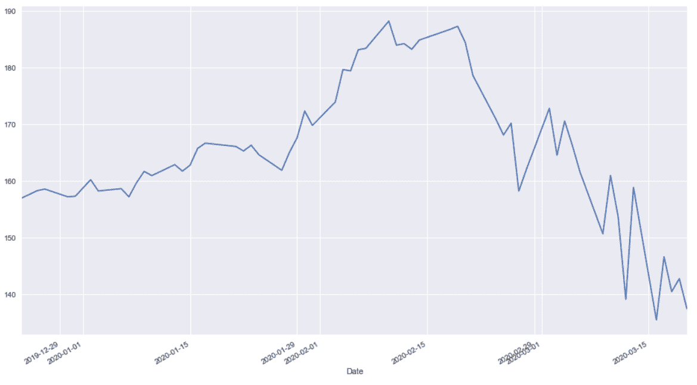

# 使用 Yahoo Finance API 为 Python 免费提供股票数据

> 原文：<https://towardsdatascience.com/free-stock-data-for-python-using-yahoo-finance-api-9dafd96cad2e?source=collection_archive---------0----------------------->

## 在这篇文章中，我将探索通过 Python 代码与 Yahoo Finance API 集成的用途。


照片由[里克在](https://unsplash.com/@ricktap?utm_source=medium&utm_medium=referral) [Unsplash](https://unsplash.com?utm_source=medium&utm_medium=referral) 上敲击

# 什么是雅虎财经 API？

雅虎财经是一个媒体平台，提供金融新闻、股票报价数据、新闻发布和财务报告。而且雅虎财经提供的所有数据都是免费的。Yahoo Finance API 是 Yahoo 提供的获取财务信息的 API。

雅虎在 2017 年弃用了他们的财务 API。所以你可以看到很多网站在谈论雅虎财经 API 的替代品。然而，python 库 [**yfinance**](https://github.com/ranaroussi/yfinance) 通过从 Yahoo！财务并以 DataFrame 格式返回数据。所以你仍然可以使用雅虎财经获得免费的股市数据。

雅虎财经提供了超过五年的每日 OHLC 价格数据。此外，您可以获得最近几天的分钟 OHLC 数据。

# 开始吧

Yahoo Finance API 提供对以下信息的访问:

*   财务摘要，如收益，资产负债表。
*   股票历史价格。
*   股票行为(包括拆分和分红)。

所有这些信息都来自雅虎财经官网。

```
# To install yfinance before you use it.
> pip install yfinance
```

# 速度限制

调用 Yahoo Finance API 有一些限制:

*   使用公共 API(没有身份验证)，每个 IP 每小时最多只能有 2，000 个请求(或者一天最多 48，000 个请求)。

我不确定这是为了财务数据。但是请使用 time.sleep(1)来避免您的 IP 被阻止。

# 历史价格和图表

您必须调用`Ticker`模块来访问 ticker 数据。这里有一个简单的例子来检索五天的`MSFT`股票 OHLC 数据:

现在你可以得到如下结果:

您可以为 history()方法设置更多参数:

# 绘制历史价格

如果还没有安装，可以运行命令安装 matplotlib 和 seaborn。

```
pip install matplotlib
pip install seaborn
```



# 将数据导出为 CSV 格式

此外，您可以将数据导出为 CSV 格式进行分析。

该功能将设置 **auto_adjust** 默认值为真。如果你不想要它，你可以改变它的值。

# 金融基础

您可以快速查看一些财务数据，如股息和拆分。您需要更改历史记录的代码长度来获取金融基本面数据。

**更新于 2020/03/21** :目前没有收益和资产负债表信息。可能需要另一个 API 来找出数据。

# 最后

在本文中，我们了解了从雅虎财经获得股票市场数据有多简单。你可以开始写数据背后的分析。如果你有任何问题，请在下面提问。