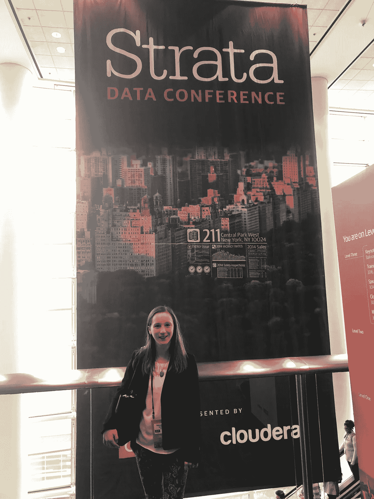

# 2020 年你应该去看看的免费虚拟数据科学会议

> 原文：<https://towardsdatascience.com/free-virtual-data-science-conferences-you-should-check-out-in-2020-5da723bf1cd1?source=collection_archive---------35----------------------->

## 数据科学会议发生了怎样的变化，为什么您仍然应该参加

由于疫情会议的召开，像数据科学会议这样的大型聚会不再明智。许多组织者没有完全取消会议，而是将会议虚拟化——有些人甚至免费举办会议！对于那些已经有旅行或预算限制的人来说，这是一个很好的机会(会议可能很贵！).你仍然可以舒舒服服地坐在沙发上享受数据科学会议的诸多好处。

数据科学会议可以提供很多东西:对该领域的发展轨迹有重大想法的演讲者，深入前沿话题的会议，在该领域有应用经验的专家，网络等。这些好处中的大部分仍然可以在虚拟会议上实现。

我参加了在旧金山举行的 2019 年地层数据会议

在我分享要查看的会议列表之前，我先简要总结一下数据科学会议体验的变化。

1.  **缩放(或其他平台)格式**。会议是指在预定的时间主持会议，并有一个现场发言人。观众可以通过聊天或语音实时提问。
2.  **录制并免费提供的会话**。错过了你想要的疗程？不用担心，录音通常在演示结束后不久就可以免费获得！过去，会议为与会者提供了这种服务，但现在许多录音可供所有人使用。
3.  **Slack 等消息 app 已经取代了面对面的联网**。像 Slack 这样的应用程序提供了与更多观众互动的好处，并可以继续关于不同会话的对话。虽然这显然不同于面对面的交流，但它近似于曾经面对面的讨论。

免责声明——我不隶属于本文所列的任何会议，也不受其赞助。所有列出的会议之所以被选中，是因为它们对我来说很有趣，也很有用。

# 即将召开的会议

该列表突出显示了当前虚拟的会议。我可能会在将来更新这个列表。按日期顺序排列的清单。

## Spark + AI 峰会

*2020 年 6 月 22 日至 26 日*

Spark + AI 峰会涵盖了与 Apache Spark 和 AI 相关的主题，为开发人员、数据科学家和高管提供了不同的赛道，他们将应用最好的数据工具并使用 AI 来构建创新产品。在虚拟会议上，您将了解到:

*   Apache Spark、Delta Lake、MLflow 和考拉的下一步是什么
*   管理机器学习生命周期的最佳实践
*   大规模构建可靠数据管道的技巧
*   流行的深度学习和机器学习框架的最新发展
*   人工智能的实际、真实的用例

会议是虚拟的，对所有人开放。会议是免费的，但半天和全天的培训课程和认证课程需要付费。峰会在 5 天内举行了 200 多场会议。

> “数据和 AI 需要统一。但是最好的人工智能应用程序需要大量不断更新的训练数据来建立最先进的模型。Apache Spark 是唯一一个将大规模数据处理与最先进的机器学习和人工智能算法相结合的统一分析引擎。”

 [## Spark + AI 峰会|人工智能& Apache Spark 大会

### 对于数据团队来说，这是前所未有的重要时刻。齐心协力，我们可以解决世界上最棘手的问题，而且…

databricks.com](https://databricks.com/sparkaisummit/north-america-2020) 

# 数据和分析:实时

*2020 年 7 月 14 日至 16 日(美国)，2020 年 7 月 21 日至 23 日(欧洲)*

Data & Analytics: Live 是一个端到端的数字会议，它通过 keynote theatres、互动展览、虚拟会见发言者分组会议和网络区域复制了面对面的会议。该会议旨在为与会者提供从数据中提取商业价值和可行见解所需的最佳实践和见解。会议的目标是高管和精通技术的数据从业者。会议将包括直播和点播。

*免费通行证仅适用于所有行业的数据/分析从业者，他们不提供任何解决方案、招聘服务、咨询或在数据社区内提供任何软件/硬件解决方案作为其核心业务。*

 [## 数据与分析:2020 年实况| Corinium

### 参加这一面向数据和分析领导者的免费实时虚拟活动。在手机、台式机或平板电脑上。我们带来了最好的…

data-analytics-live.coriniumintelligence.com](https://data-analytics-live.coriniumintelligence.com/)  [## 数据和分析实况-欧洲| Corinium

### 数据与分析:Live，Europe 是一个 100%虚拟的会议，将连接欧洲最先进的数据分析…

data-analytics-live-eu.coriniumintelligence.com](https://data-analytics-live-eu.coriniumintelligence.com/) 

## 人工智能的未来

*2020 年 7 月 28 日*

人工智能的未来活动展示了“人工智能的最新创新、技术和商业模式”，并将“领先的公司、创业公司、投资者、开发者和科技巨头聚集在一起，共同探索、学习和交流。”该会议旨在通过网络机会将会员和商业及技术领导者联系起来，以支持他们的增长和商业战略，并提供与人工智能相关的最新内容。

参加会议是免费的，但空间有限。

 [## 人工智能的未来——人工智能的未来

### 下载活动计划书，联系人工智能、数据、商业和技术虚拟活动的初创公司、企业和投资者…

www.futureofai.com](https://www.futureofai.com/) 

## AI4

8 月 18 日至 20 日

AI4 是一个为期三天的会议，主要关注人工智能和机器学习在企业中的采用和应用。会议采用了“面向内容的用例方法”，并提供了“一个通用框架，用于思考人工智能对每个行业意味着什么，并提供在组织的人工智能旅程的任何阶段促进理解的内容”。商业领袖和数据从业者都会发现这个会议很有价值。

要想免费参加，你必须申请一张会议通行证。Ai4 2020 是免费参加合格的申请人谁是…

*   在拥有 250 多名员工的组织中工作
*   担任高级职位和/或技术职务
*   对会议听众没有销售兴趣(或为有销售兴趣的公司工作)

 [## 人工智能大会——8 月 18 日至 20 日——数字化举行

### Ai4 2020 是业界最具影响力的人工智能活动。通过聚集来自各行业、政府和企业的领导者…

ai4.io](https://ai4.io/) 

# 具有(免费)录制会话的过去会议

## 英伟达的 GPU 技术大会(GTC)

英伟达 GPU 技术大会的所有内容，包括人工智能、高性能计算、加速数据科学、医疗保健、图形等广泛主题的最新突破，都可以在 GTC 点播平台上免费获得。NVIDIA 已经在计划下一届 GTC 数字盛会了！

 [## 观看英伟达首席执行官黄仁勋的 GTC 2020 主题演讲

### 加入我们新的实时网络研讨会，与专家会议联系，并录制讨论最新人工智能的演讲…

www.nvidia.com](https://www.nvidia.com/en-us/gtc/) 

## 全球人工智能体验

DataRobot 在本次会议上的会议承诺向与会者传授人工智能如何有意义地影响组织，以及如何解决组织的关键问题。有来自各行各业先驱的用例会议，以及关于如何在人工智能方面取得成功的实际见解。所有录制的会议都是免费的。

 [## 议程| DataRobot AI 体验虚拟会议

### 两天充满了无限的机会来加速你的人工智能。查看数据机器人人工智能体验的完整议程…

aiworldwide.datarobot.com](https://aiworldwide.datarobot.com/agenda) 

## MongoDB.live

MongoDB.live 推出了 100 多个教育讲座和一个激动人心的主题会议，并发布了大量公告。现在可以免费点播课程。这是与 MongoDB 数据库软件相关的内容的一个很好的来源。

 [## MongoDB World 现在是 MongoDB.live | June 年 6 月 9 日-10 日

### 加入我们的 MongoDB .无论你在哪里都可以现场直播！了解前沿内容、流式主题演讲、分组会议等

www.mongodb.com](https://www.mongodb.com/world) 

## PyCon US 2020 Online

PyCon 2020 是“使用和开发开源 Python 编程语言的社区的最大年度聚会。”会议记录的会议涵盖了各种与 python 相关的主题，如语言特性、机器学习和数据工程。

 [## PyCon US

### PyCon 2020 Online 已进入最后一周。回想过去 5 周左右的时间，有一个想法贯穿其中:…

us.pycon.org](https://us.pycon.org/2020/online/) 

## 奥赖利地层数据和人工智能超级流

约会 TBD——“更像是来了”

奥莱利已经取消了 2020 年的所有会议；但是，将继续举办实时在线活动，并提供交互式教程。此外，O'Reilly 在线学习平台包含大量与数据科学、数据工程、机器学习、编程和可视化各种主题相关的有组织的内容(包括以前活动的会议记录)。在线学习平台不是免费的，但是 O'Reilly 目前提供 10 天的免费试用。

 [## 会议-奥莱利媒体

### 将我们的现场活动转变为在线活动

www.oreilly.com](https://www.oreilly.com/conferences/)