# 借助加权产品模型，让您不再犹豫不决

> 原文：<https://towardsdatascience.com/free-yourself-from-indecision-with-weighted-product-models-48ae6fd5bf3?source=collection_archive---------41----------------------->

## 公司和疯狂的数据科学家如何使用决策分析来选择事物


来源:[像素](https://www.pexels.com/pt-br/foto/alemanha-aparencia-apartamento-arquitetura-415687/) (CC0)

作为一名友好的数据科学家，同事们总是带着有趣的问题来找我寻求帮助。人们要求我创建一个模型，一个公式，一个图表，一些东西…来解决一个定量的问题。

在过去的六个月里，一个反复出现的问题出现在不同的人面前:如果你必须评估许多标准，如何在众多选择中决定最好的项目/活动/项目/公寓？

人们可能会认为我毫不犹豫地选择了一些令人惊叹的人工智能算法、深度学习分类器，甚至是带有 Bootstrap 采样的爬山集成选择。然而，正如罗伯特·勃朗宁所说，[“嗯，少即是多，卢克雷西亚”](https://www.poetryfoundation.org/poems/43745/andrea-del-sarto)。

一个[加权产品模型](https://www.wikiwand.com/en/Weighted_product_model) (WPM)是解决[多准则决策分析](https://www.wikiwand.com/en/Multiple-criteria_decision_analysis) (MCDA)问题的一个简单而流行的技术。它基本上包括将所有属性值相乘以得到一个分数。越高越好。

例如，请看下表:

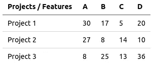

表一:项目和特点。来源:作者

第一行的 WPM 分数为:

项目 1 = 30 x 17 x 5 x 20 = 51，000

更正式的定义是:

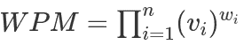

公式一:WPM 得分。来源:作者

其中:

*   *i* :索引
*   *n* :特征数量
*   *vi* :第 I 个特征的值
*   *wi* :第 I 个特征的重量

因此，使用 WPM 提供的分数，偏好被排序如下

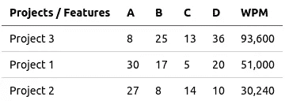

表二:按 WPM 评分排序的项目。来源:作者

如果每个特征的权重相同( *wi = 1* )。

# 现实生活中的问题

称重产品模型是一项非常简单的技术。你可以使用任何编程语言，甚至是电子表格(从 [Github](https://github.com/rnmourao/mcda-wpm) 获取代码)。

为了展示如何用 Python 来做这件事，我们再举一个例子:


表三:待售公寓清单。来源:作者

上表对应于伊利诺伊州芝加哥市的待售公寓，数据基于一个流行的 real state 网站，并针对教育目的进行了调整。这些特征是卧室数量(**张床**)、浴室数量(**个浴室**)、总面积、业主协会费用( **hoa** )、停车位数量**、建筑年份**、公寓楼层**、日照**、是否有电梯**、价格**。************

**尽管它很简单，但还是有一些陷阱。首先我会告诉你如何正确地做这件事，然后我会告诉你什么是你不应该做的。**

**让我们导入一些库:**

```
import pandas as pd
from sklearn.preprocessing import MinMaxScaler
```

**然后，我创建了一个熊猫数据框架:**

```
raw = pd.read_csv('apartments.csv')
```

**WPM 只使用数字特征。所以，我把**曝光**和**升降**转换成数字:**

```
# keep original data safe
df = raw.copy()

# now exposure to West and to East are, respectively, 0 and 1
df['exposure'] = df.apply(lambda r: 1 if r['exposure'] == 'E' else 0, axis=1)

# if an building has an elevator, it will receive 1; 0 otherwise
df['elevator'] = df.apply(lambda r: 1 if r['elevator'] == 'Yes' else 0, axis=1)
```

**现在，表格看起来像这样:**

**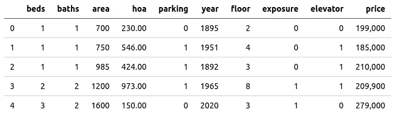**

**表四:曝光量和电梯转换成数字。来源:作者**

**接下来，我将所有特征缩放到相同的范围:**

```
# create a scaler with range [10, 100]
mms = MinMaxScaler(feature_range=(10, 100)) 

# apply scaler
df = pd.DataFrame(mms.fit_transform(df), columns=df.columns)
```

**现在，每个值都在 10 到 100 之间。**

**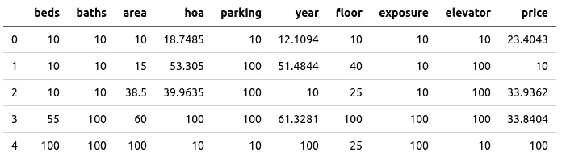**

**表 V:缩放到范围[10，100]的特征。来源:作者**

**是时候定义权重了:**

```
weights = {'beds'          :  1.,
           'baths'         :  1.,
           'area'          :  1.,
           'hoa'           : -1.,
           'parking'       :  1.,
           'year'          :  1.,
           'floor'         : -1.,
           'price'         : -1.,
           'exposure'      :  1.,
           'elevator'      :  1.}
```

**这里的想法是让消极的特征不是好处。举个例子，如果价格上涨，WPM 值就会下降。**

**让我们定义 WPM 函数:**

```
def wpm(option, weights):
    value = 1
    for column in option.keys():
        if column in weights.keys():
            value *= option[column] ** weights[column]
    return value
```

**然后，我们对行应用函数:**

```
df['wpm'] = df.apply(lambda r: wpm(r, weights), axis=1)

# merge the wpm score with the original table to a better interpretation of the results
pd.merge(raw, df['wpm'], left_index=True, right_index=True).sort_values(by='wpm', ascending=False)
```

**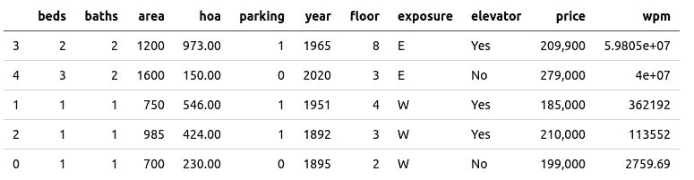**

**表六:按 WPM 评分排序的公寓。来源:作者**

**WPM 评分以所有功能同等重要的方式对公寓进行了排名。然而，如果一个负担得起的 HOA 比浴室的数量更重要呢？不同的特征重要性可以通过改变它们的权重来实现:**

```
weights = {'beds'          :  1.,
           'baths'         :  1.,
           'area'          :  3.,
           'hoa'           : -5.,
           'parking'       :  5.,
           'year'          :  1.,
           'floor'         : -5.,
           'price'         : -3.,
           'exposure'      :  1.,
           'elevator'      :  5.}
```

**这些权重值完全是任意的，它们通常取决于决策者的判断。此外，还可以定义不同的比例。这里我用了一个[李克特量表](https://www.wikiwand.com/en/Likert_scale)，因为它非常简单。**

**车位、电梯、便宜的 HOA、低矮的楼层，现在都是必不可少的；面积和价格都很可观，其余的都不太重要。**

****

**表七:按新 WPM 评分排序的公寓。来源:作者**

**WPM 得分现在有了一个完全不同的尺度，但这并不重要，因为只有排名是相关的。**

# **不要**

**正如我之前所说，你需要采取一些预防措施来正确使用 WPM。**

**首先，你必须对数据进行缩放。所有功能。永远不会。人们可能会说你不需要这样做，因为数据已经准备好了，或者 WPM 本身不需要它。不要相信他们:否则，你会弄乱权重。作为一个例子，让我们只取两个特征:**床**和**区域**，并假设权重分别等于 2 和 1:**

**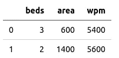**

**表八:带有未缩放数据的 WPM 示例。来源:作者**

**如你所见，卧室的数量比总面积更重要，但后者的比例更高，破坏了重量。如果您对[10，100]范围的特征进行缩放，情况就不同了:**

**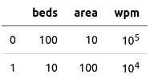**

**表九:带有缩放数据的 WPM 示例。来源:作者**

**第二:不要将值缩放到[0，1]范围。更喜欢比这大的值。为什么？因为以下电源属性:**

**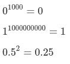**

**公式 II:功率特性的一些例子。来源:作者**

**0 几乎总是 0，1 总是 1，如果应用大于 1 的幂，分数会变小。所以，选择另一个范围。**

**与权重相关，可以使用任何值。但是，还是要保持简单:使用整数，只有当一个特性是一种负担时才使用负数，并且小心使用零。**

**第三个警告有点复杂:特性应该是合理独立的。如果其中两个或两个以上有因果关系，你应该只保留一个。例如，假设您有一个名为 [**房产税**](https://smartasset.com/taxes/illinois-property-tax-calculator) 的特性，其计算强烈依赖于公寓的价格:**

**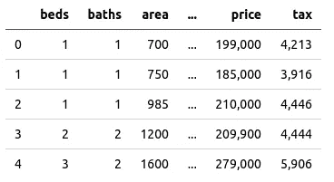**

**表十:公寓及其财产税。来源:作者**

**如果计算这两个特征之间的[皮尔逊相关系数](/pearson-coefficient-of-correlation-explained-369991d93404):**

```
df[['price', 'tax']].corr()
```

**你会发现一个完美的相关性:**

**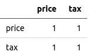**

**XI:价格和税收之间的完美关联。来源:作者**

**如果添加这两个特性，就像添加两次列**价格**。它的权重将增加一倍，使其相关性增加两倍。换句话说，会把权重搞乱。**

**然而，皮尔逊相关性的高值可能是一个线索，但不能保证这两个特征是相关的。作为一个例子，让我们测试另外两个特性，**电梯**和**停车**:**

```
df[['elevator', 'parking']].corr()
```

**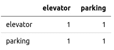**

**表十二:电梯与停车的完美关联。来源:作者**

**这两个特征是高度相关的，但是大楼里有电梯并不意味着公寓会有停车位！**

**因此，您需要分析这些特征来决定应该丢弃哪些特征。**

# **WPM 很酷，但是…**

**决策分析有很多技巧，解决了很多问题。如果你有兴趣了解更多，请随意点击我放在这篇文章末尾的链接。**

# **参考**

**[1] C. Tofallis，[加法还是乘法？关于多标准排名和选择的指南](https://pubsonline.informs.org/doi/pdf/10.1287/ited.2013.0124) (2013)，告知教育事务**

**[2] E. Triantaphyllou，B. Shu，S. Sánchez 和 T. Ray，[多准则决策:一种运筹学方法](https://www.semanticscholar.org/paper/Multi-Criteria-Decision-Making%3A-An-Operations-Triantaphyllou-Shu/2742bc0516f28152472ee35ea400418e0bc69f7d) (1998)，电子电气工程百科全书**