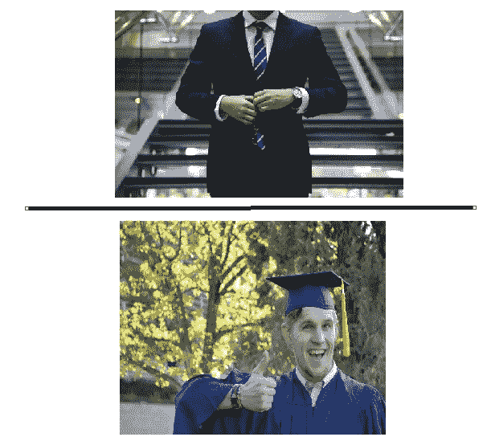

# 2021 年，自由职业可能是从事数据科学的最佳方式

> 原文：<https://towardsdatascience.com/freelancing-may-be-the-best-way-to-do-data-science-in-2021-4f04e76da0b6?source=collection_archive---------23----------------------->

## 为什么我决定做自由职业者

在 [Unsplash](https://unsplash.com?utm_source=medium&utm_medium=referral) 上由 [Austin Distel](https://unsplash.com/@austindistel?utm_source=medium&utm_medium=referral) 拍摄的照片

虽然由于新冠肺炎的冲击，经济形势一直在转型，但英国的失业率已经上升到 4.5%，这是三年来的最高水平，它也在缓慢但肯定地蚕食数据科学市场— [Edouard Harris](https://medium.com/u/11d8ab71ef4b?source=post_page-----4f04e76da0b6--------------------------------) 几个月前写了一篇非常有趣的文章，题为“[过去一个月数据科学市场发生了什么](/whats-happened-to-the-data-science-job-market-in-the-past-month-88c748a4cd25)”。

随着公司预算紧缩，找到最具成本效益和时间效率的方法来满足需求是非常重要的，因此我认为自由职业者正在增加，我相信你可能更适合做自由职业者(至少目前是这样)，特别是作为一个试图进入这个领域而不是申请数百份工作却没有成功的人。

让我们来谈谈我相信这一点的一些原因:

## 真实世界的体验

**图 1** :西装男形象由[猎人赛](https://unsplash.com/@huntersrace)于 [Unsplash](https://unsplash.com/?utm_source=medium&utm_medium=referral) 上； [robtowne0](https://pixabay.com/users/robtowne0-914531/) 在 [Pixaby](https://pixabay.com/) 上竖起大拇指毕业照；(图片由作者整理)

> **注意**:你需要一定程度的教育才能得到一份数据科学的工作。

考虑到我们有两个有抱负的候选人，他们有相似的教育背景，但是其中一个决定从事项目并使它们开源，而另一个继续寻找教育资源来学习。谁的努力会首先引起你的注意？

希望你说的是参与项目的人。如果是这样，太好了！为什么是自由职业者？你今天问了所有正确的问题…作为一个有抱负的人，你获得了在现实世界中从事项目工作的经验，再加上客户的好评，这使你成为许多正在招聘全职数据科学家的公司非常有竞争力的雇员，如果你决定在机会出现时过渡到全职角色。

一般来说(对于有抱负和经验丰富的数据科学家来说)，作为一名数据科学家，自由职业不仅会在你从事客户工作的同时增长你的数据科学技能。你还在培养一些人可能称之为“T0”的创业技能——我个人认为这是成为数据科学家的一个关键方面。

这是因为自由职业不仅让你对客户的工作负责，因为你还必须负责自己的个人营销、个人财务管理和客户服务。实际上，你已经变成了一个企业——我们已经在以前的帖子中讨论了数据科学的各种“创业”方面。

 [## 最重要的数据科学项目

### 每个数据科学家都必须做的项目

towardsdatascience.com](/the-most-important-data-science-project-458d016ef8a6)  [## 品牌在数据科学中的重要性

### 最近，一个特别的话题在我和朋友的讨论中反复出现。品牌的重要性！我…

towardsdatascience.com](/the-importance-of-branding-in-data-science-467b2d2b1e7f) 

我认为这非常有价值，原因有二:

1.  你对经营企业有一种感觉，如果你觉得它适合你，你可能会决定继续经营自己的企业。
2.  当你管理自己的事务时，你发展了对企业价值的第三感

## 赚取你的价值

学习新的技能和增加你的知识是在这个领域长期存在的必要条件。然而，一次又一次，公司因支付给数据科学家的报酬过低而闻名，因为他们做的事情超出了他们的预期。

除此之外，在一家公司工作时，如果没有某种形式的妥协，你就不太可能因为学习新技能或提高原有技能而获得加薪。例如，为了弥补你将会赚到的几个额外先令，你可能会被安排一些无关紧要的任务，或者你可能不得不增加工作时间，这样你就没那么多时间来花这些额外的钱了。

> “学得越多，赚得越多”

另一方面，作为一名自由职业者，你有能力与客户协商你的收入。如果你已经学会了如何将机器学习模型部署到云上，这反过来应该会产生 5%的报酬，你有权与你的客户谈判。本质上，随着你发展和提高你的技能，你的收入潜力就在你手中，你可以决定自己的价值。

## 灵活性

由[卡尔·巴塞洛](https://unsplash.com/@barcelocarl?utm_source=medium&utm_medium=referral)在 [Unsplash](https://unsplash.com?utm_source=medium&utm_medium=referral) 上拍摄

我觉得，对于在家工作是否会持续下去，世界上的意见分歧很大，但就目前情况来看，我们大多数人都在家里工作。

虽然在办公室工作 8 小时是可行的，但我个人认为许多人可能会同意我的观点，即在家工作是无益的，因为随着越来越多的干扰进入我们的环境，我们的生产力会下降。

当自由职业者时，这不是一个大问题，因为一个主要原因…你可以决定工作多长时间，这意味着你可以花一些时间专注于深度工作，以完成你为一天留出的任务。

## 包裹

现在，有一些显而易见的原因可以解释为什么自由职业可能不像一个公司的永久工作那样合适:

*   提交新作品的提案本身几乎就是一项工作
*   工作和现金流不一致
*   没有带薪休假

在疫情之前，我最初从未想过做自由职业者，但随着全球经济持续紧张，我开始认为，对于那些认为自己可以独立工作的人来说，这可能不是一个坏选择。

因此，如果你认为自己有能力被一家公司聘用，但由于一些你无法控制的原因，你无法获得一份工作，那么在缓冲期间从事自由职业是个不错的主意。同样，如果你想在毕业后(或学习期间)获得实践经验，那么自由职业是一个不错的选择。

对于已经接受自由职业的弊端并接受经济现状的数据科学家来说，自由职业数据科学是一个非常赚钱的职业，这可能是 2021 年的发展方向，尤其是在经济面临更大压力的情况下。

另一个你可能会感兴趣的帖子是“[你不需要工作来获得数据科学经验](/you-dont-need-a-job-to-get-data-science-experience-26af4fd4c200)”

 [## 你不需要工作来获得数据科学经验

### 把硬币翻转过来

towardsdatascience.com](/you-dont-need-a-job-to-get-data-science-experience-26af4fd4c200) 

你觉得这个帖子怎么样？留下回复或者让我们在 LinkedIn 上进行对话…

 [## Kurtis Pykes -数据科学家-自由职业者，自由职业者| LinkedIn

### 在世界上最大的职业社区 LinkedIn 上查看 Kurtis Pykes 的个人资料。Kurtis 有 3 个工作列在他们的…

www.linkedin.com](https://www.linkedin.com/in/kurtispykes/) 

对博客感兴趣？订阅我的 youtube 频道获取最新内容(本周日第一篇帖子)！

 [## 库尔蒂斯·派克斯

### 欣赏您喜爱的视频和音乐，上传原创内容，并在上与朋友、家人和全世界分享这些内容…

www.youtube.com](https://www.youtube.com/channel/UCu6zdBQhvEY5_j-ifHWljYw?view_as=subscriber)