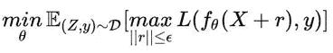
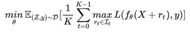

# FreeLB:一种通用的文本对抗训练方法

> 原文：<https://towardsdatascience.com/freelb-a-generic-adversarial-training-method-for-text-92ac25828495?source=collection_archive---------34----------------------->

## 一种改进文本和自然语言处理对抗训练的新的通用技术。

图片由来自 Pixabay 的 Gerd Altmann 提供

2013 年，Szegedy 等人发表了“**神经网络的有趣性质**”。这篇论文的一大要点是，模型可能会被*的反面例子*所愚弄。这些例子包含了某种人类肉眼无法察觉的扰动，但却可以完全欺骗模型。本文还发现，对立的例子可以在不同数据上训练的模型中推广，也就是说，所有这些模型都被一个具有同样难以察觉的扰动的例子所愚弄。

计算机视觉领域中的一个对立的例子(来自 Goodfellow 的《解释和利用对立的例子》,参见下面的参考资料)

Goodfellow 等人在 2014 年发表了“**解释和利用对抗性例子**”作为这项工作的后续，以进一步分析为什么对抗性例子如此普遍以及如何生成它们。这产生了对抗性训练的概念，其中除了训练数据集之外，还使用生成的对抗性样本来训练模型，以使模型更加健壮和可推广。这里有一个警告:健壮性和可推广性在某些领域(计算机视觉)是不一致的，而在其他领域(NLP)则是互补的。因此，对抗性训练有助于模型变得更加健壮，并可能更具普遍性。

自从 Goodfellow 的论文以来，对抗性训练技术继续变得更加优雅和有效，从而使模型对恶意示例更加健壮。这项来自微软 Dynamics 365 AI Research 的新工作提出了一种新的针对 NLP 域的对抗训练算法 FreeLB (Free Large Batch ),该算法通过向单词嵌入添加对抗扰动并最小化输入样本周围不同区域内的结果对抗风险，来促进嵌入空间中更高的鲁棒性和不变性。这不同于先前的工作，先前的工作通过添加随机的单词/句子，通过拼错单词，或者通过将文本输入解释成完全不同的句子结构，向文本输入*即*添加对抗性扰动。通过在嵌入级别添加扰动，这种方法可以引入一些示例，如果我们只是简单地修改输入文本，这些示例是不可能生成的。

FreeLB 利用“免费”培训策略(Shafahi 等人，2019；张等(2019)用多样化的对立样本来扩大每个训练批次的大小，而不需要比当前最先进的算法投影梯度下降(PGD)额外的成本。具体来说，PGD 试图找到一组参数来最小化标准球内任何 *r* 的最大风险，如下所示:

其中 *D* 为数据分布， *y* 为标签， *L* 为某损失函数。与 PGD 在最后一步只使用 *X+r* 输出的梯度相比，FreeLB 每次迭代都取 *r* 输出的梯度的平均值，相当于把输入看成是 *K* 倍大的虚拟批次，【 *X+r1，X+r2，…，X+rk】*。具体公式是:

该团队在几个下游任务中使用这种 FreeLB 技术微调了 BERT 和 RoBERTa 语言模型。在 GLUE 基准测试中，BERT 测试分数从 78.3 增加到 79.4，而 RoBERTA-large 模型的分数增加了 0.3，达到 88.8。经过微调的 RoBERTa-large 还能够在 ARC-Easy (85.44%)和 ARC-Challenge (67.75%)基准测试中实现一流的性能。最后，在 CommonsenseQA 基准测试上的实验表明，FreeLB 可以被推广，并提高 RoBERTa-large 模型在其他任务上的性能。

如果你想了解更多关于 FreeLB 如何工作的细节，这里有一个链接[链接](https://arxiv.org/pdf/1909.11764.pdf)到 FreeLB 的文章，点击[这里](http://aka.ms/mmai)查看更多的出版物和团队的其他工作。

**参考文献**

1.  [克里斯蒂安·塞格迪](https://arxiv.org/search/cs?searchtype=author&query=Szegedy%2C+C)，[沃伊切赫·扎伦巴](https://arxiv.org/search/cs?searchtype=author&query=Zaremba%2C+W)，[伊利亚·苏茨科夫](https://arxiv.org/search/cs?searchtype=author&query=Sutskever%2C+I)，[琼·布鲁纳](https://arxiv.org/search/cs?searchtype=author&query=Bruna%2C+J)，[杜米特鲁尔汉](https://arxiv.org/search/cs?searchtype=author&query=Erhan%2C+D)，[伊恩·古德菲勒](https://arxiv.org/search/cs?searchtype=author&query=Goodfellow%2C+I)，[罗布·弗格斯](https://arxiv.org/search/cs?searchtype=author&query=Fergus%2C+R)，**神经网络的耐人寻味的性质** (2013)，arXiv 预印本，arXiv:1312.61999
2.  [伊恩·j·古德菲勒](https://arxiv.org/search/stat?searchtype=author&query=Goodfellow%2C+I+J)、[黄邦贤·史伦斯](https://arxiv.org/search/stat?searchtype=author&query=Shlens%2C+J)、[克里斯蒂安·塞格迪](https://arxiv.org/search/stat?searchtype=author&query=Szegedy%2C+C)、**解释和利用反面例子** (2014)，国际学习表征会议，ICLR，2015
3.  [亚历山大·马德里](https://arxiv.org/search/stat?searchtype=author&query=Madry%2C+A)，[亚历山大·马克洛夫](https://arxiv.org/search/stat?searchtype=author&query=Makelov%2C+A)，[路德维希·施密特](https://arxiv.org/search/stat?searchtype=author&query=Schmidt%2C+L)，[迪米特里斯·齐普拉斯](https://arxiv.org/search/stat?searchtype=author&query=Tsipras%2C+D)，[阿德里安·弗拉多](https://arxiv.org/search/stat?searchtype=author&query=Vladu%2C+A)，**走向抗对抗性攻击的深度学习模型** (2017)，arXiv 预印本 arXiv:1706.06083
4.  A.Shafahi，M. Najibi，A. Ghiasi，Z. Xu，J. Dickerson，C. Studer，L. Davis，G. Taylor，T. Goldstein，**对抗性训练免费！**，神经信息处理系统，NeurIPS 2019
5.  张定淮，张天元，陆，朱占兴，董斌，**你只传播一次:最大原理无痛对抗训练**，神经信息处理系统，NeurIPS 2019
6.  、[于成](https://arxiv.org/search/cs?searchtype=author&query=Cheng%2C+Y)、[哲干](https://arxiv.org/search/cs?searchtype=author&query=Gan%2C+Z)、[孙思齐](https://arxiv.org/search/cs?searchtype=author&query=Sun%2C+S)、[汤姆·戈尔茨坦](https://arxiv.org/search/cs?searchtype=author&query=Goldstein%2C+T)、[刘晶晶](https://arxiv.org/search/cs?searchtype=author&query=Liu%2C+J)、 **FreeLB:语言理解的强化对抗训练(2019)** ，学习表征国际会议，ICLR 2020