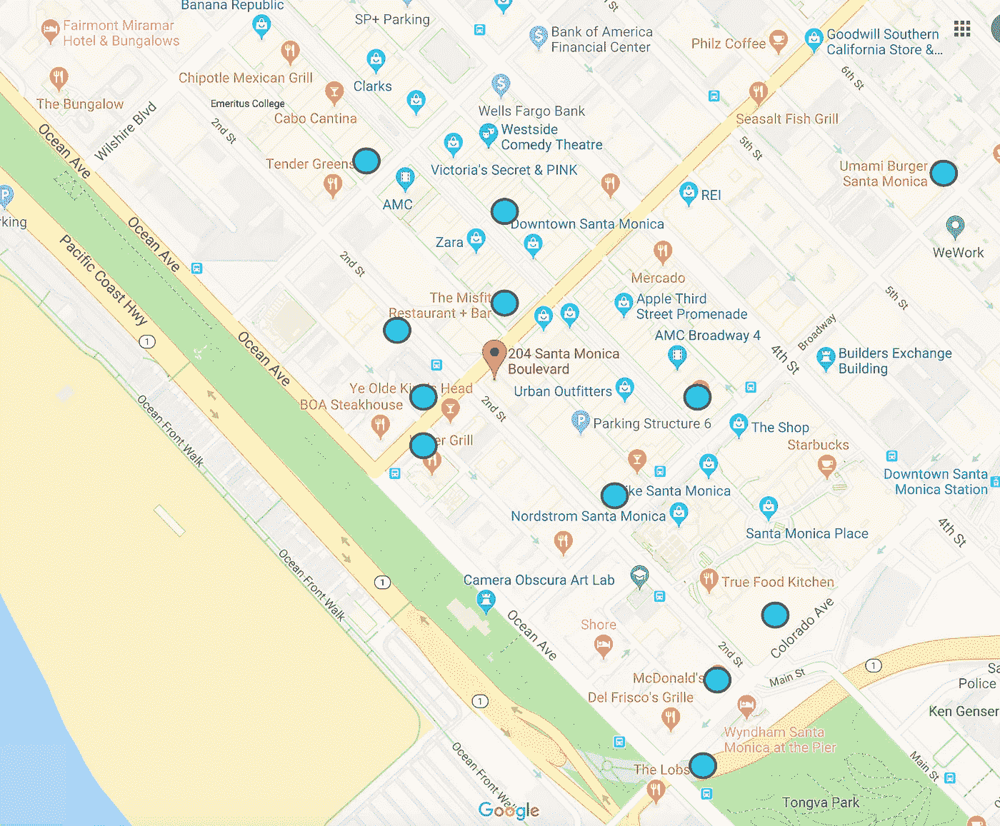

# 谁做的薯条客观上是最好的？

> 原文：<https://towardsdatascience.com/french-fries-the-final-frontier-of-data-science-674ec8f1d74c?source=collection_archive---------33----------------------->

## 薯条:数据科学的最后前沿

二月份，我们的数据科学团队就我们去哪家餐厅做的炸薯条最好的问题展开了争论。

我们决定在整个二月/三月举办一场比赛，看看谁才是真正的薯条之王。挪过去[三月狂](https://www.ncaa.com/news/basketball-men/bracketiq/2020-04-20/what-march-madness-ncaa-tournament-explained)，你好**淀粉狂**

淀粉疯狂:比三月疯狂少得多的运动比赛(但更美味)——由[艾美奖·史密斯](https://unsplash.com/@emsmith?utm_source=medium&utm_medium=referral)在 [Unsplash](https://unsplash.com?utm_source=medium&utm_medium=referral) 拍摄

我把我们的发现打成了第一篇关于薯条的学术论文，并提交给了 arXiv。

它立即遭到拒绝。:(

然而，这里有一个关于客观上最好的薯条的故事，或者如我所称:

**对圣莫尼卡市区薯条主观质量的客观分析**

*警告*:这篇文章很可能会让你对薯条产生饥饿感

# 摘要

这一切 *都是从一次团队午餐开始的。我们总是点薯条。几次午餐后，我们开始问这个问题:我们圣莫尼卡办公室附近最好吃的薯条是什么？你怎么确定“最好”呢？作为一家数据科学公司，我们知道这不能简单地通过在各种餐馆吃薯条来确定，我们必须围绕科学的严谨性和特定的限制来构建我们的分析，这样我们才能对我们的发现充满信心…如果结果不能通过同行评审来重现，那还有什么意义呢？因此，淀粉疯狂诞生了；* ***一场比赛，一群数据书呆子客观地评选出圣塔莫尼卡哪家餐馆的炸薯条是主观上最好的。***

# 介绍

1802 年，托马斯·杰斐逊在白宫的一次晚宴上提供了“法式土豆”。从那里，薯条诞生了。土豆被切成片并油炸成了美国菜肴中的一种主食。

尽管与汉堡和快餐联系最紧密，但大多数餐馆都供应炸薯条。由于它们无处不在，人们肯定会问*这样一个问题:“谁的薯条最好吃？”食物配方的简单性使得这个问题特别有趣，因为厨师只有几个变量可以用来制作他们理想的炸薯条。*

作为一个加州人，In-n-Out 薯条在我心中占有特殊的位置。

此外，一些机构每天生产大量的薯条——这种大量生产会降低薯条的质量吗？他们必须将很大一部分业务集中在生产美味的薯条上，这一事实是否比以高端菜肴闻名的餐厅质量更好？

我们想借此机会谈谈房间里的研究大象——如果这项研究首先是重要的话。事实上，我们建议:

## **是的。**

无论规模大小，对知识的追求都是令人钦佩的，而且还没有对圣莫尼卡市中心地区的炸薯条质量进行过任何研究。我们可能还没有几百万美元的炸薯条基金供我们支配，但是我们有毅力和动力(和调色板)来完成这个项目。我们很高兴能给人类资料库增加一点新知识。

# **1。方法**

**1.1 位置**

我们必须首先选择将要参加比赛的薯条。最简单的抽样方法是选择离我们办公室不到 10 分钟步行路程的地方可以买到的薯条。幸运的是，我们的办公室位于圣莫尼卡市中心，那里不缺油炸食品；事实上有太多了。为了缩小搜索范围，我们只需在 Yelp 上输入“最好的炸薯条”,然后选择前 12 个结果。由于 fry 风格(见第 1.2 节)，有几个位置最终被替换，但这种方法产生了一批强有力的竞争者。

为了避免评委根据薯条的产地产生偏见，每个地点都被随机分配了一个基于流行电视节目的虚假身份。图 1 是将真实的餐馆映射到其虚假身份的关键。从今以后，所有的餐馆都将使用虚假的名字。

图 1:为了消除位置偏见，给每个参赛者的虚假身份表

**1.2 样式&采购**

薯条有很多种，不幸的是，比较不同风格的薯条就像比较苹果和橘子一样，因此我们必须标准化我们的薯条类型。我们选定了最常见的样式——咸马铃薯薯条。这排除了像华夫饼干薯条和甘薯薯条等流行的变体，但仍然允许参与者之间的创造性和多样性。

我们通过只评判经典的马铃薯薯条，将风格偏好/偏见保持在最低限度——照片由[艾美奖·史密斯](https://unsplash.com/@emsmith?utm_source=medium&utm_medium=referral)在 [Unsplash](https://unsplash.com?utm_source=medium&utm_medium=referral) 上拍摄

一次判断一批薯条不是一个可行的选择，因为这将需要四倍于当前实验分配的时间，并使锦标赛(1.3.2)不可能进行。时间的增加将不可避免地导致法官的疲劳。相反，我们试图在不降低每批薯条完整性的情况下，一次收集每轮所需数量的薯条。

尽管我们尽最大努力尽可能接近同时获得鱼苗批次，但我们的检索并非没有缺陷，有些人可能会认为一批鱼苗经过的距离与该批次的分数成反比。我们在 3.2 节的讨论中详尽地回顾了这个猜想。

负责拿薯条的人被指示点薯条时说:“我可以点一份薯条吗？”餐馆根据这份订单制作的任何风格都被认为是他们典型的油炸风格。

**1.3 实验设计**

类似于 FIFA 世界杯的比赛设计，Starch Madness 由两部分组成:小组赛(1.3.1)和锦标赛(1.3.2)。在小组赛阶段的出色表现使你有资格参加锦标赛。

图 2:小组赛分组。“经典”电影的区分是主观的(但却是正确的)

*1.3.1 小组赛阶段*

12 份参赛炸薯条中的每一份都被随机分成 4 组，每组 3 名参赛者，称为分组，在小组赛阶段进行评分。使用的评分是 1.4 中定义的 F.A.T 系统。裁判被指示使用 F.A.T .系统(1.4)而不是比较来自一个部门的薯条来得分。

这是一个重要的区别，因为对每个鱼苗产生一个客观的分数比一个比较分数更能显示鱼苗的强度。此外，如果一个特定的部门有三个优秀的(或糟糕的)批次，他们应该被允许参加锦标赛发挥他们的实力，而不是他们的部门的整体实力。图 2 概述了这些划分。

*1.3.2 锦标赛玩法*

图 2:小组赛分组。“经典”电影的区分是主观的(但却是正确的)

虽然这不是比较炸薯条最科学严谨的方法，但它确实很有趣。在此阶段，前 8 个最高等级的炸薯条批次被播种并放置在单个剔除支架中。每场一对一的比赛都是由裁判盲目投票决定谁更喜欢弗莱。通过锦标赛，获胜者将被加冕。

【The F . A.T 系统

O 评判薯条的首要障碍之一是如何标准化评分。要做到这一点，人们必须回答一个深刻的哲学问题，“什么是好的薯条？”我们的薯条专家团队将薯条的质量分为三类:

# **风味。**

# **外观。**

# **质地。**

这个由三部分组成的评分标准被出色地命名为“F.A.T 系统”这些都代表了一份好薯条的核心属性。通过根据这些指标对批次进行评级，我们可以满怀信心地决定哪种油炸食品是最好的。这些指标都采用 5 分制评分，1 分为最低，5 分为最高。这三个数字的平均值产生了 fry 的整体质量，并帮助裁判在锦标赛中做出重要的投票决定。

**1.5 评委**

薯条由能干的 RETINA.ai 团队评判，他们对薯条的热爱仅次于他们对数据收集和分析的热爱。这些法官的优点在 3.5.2 中得到很好的辩护

# 2.结果

A 小组赛阶段结束后，每位选手都在 F.A.T .系统中进行了评分，我们制作了以下数据表:

以绿色突出显示的人获得了足够高的 F.A.T 分数，有资格参加比赛。那些没有突出显示的低于麦当劳线，因为麦当劳不仅是合格的分数最低的薯条，而且平均分数为 2.43/5，可以被认为是一个普通的薯条。

还应该指出的是，小 Ruby 的得分绝对令人难以置信，比任何其他竞争者高出近 0.5 分，接近满分 4.44/5。另外一个有趣的结果是，小鲁比和汉堡休息室的得分高于大美式薯条，这是一种专门供应薯条的食品卡车。

麦当劳线以上的所有参赛者都进入了种子锦标赛，导致锦标赛结构如图 3 所示。使用虚假身份是因为这是评委在比赛中看到的相同支架。

图 3:锦标赛比赛等级的合格薯条

第一轮过后，*洛斯·波洛斯·赫曼诺斯* & *莫斯·艾斯利*如预期获胜，*洛斯·波洛斯·赫曼诺斯*横扫 *JJ 餐厅*7-0。然而，在垫底的两场比赛中，两场比赛都令人失望。Krusty Krab 以 6-1 赢得决定性胜利，而开心汉堡店*在一场激烈的辩论中以 4-3 险胜。 *Krusty Krab* 击倒*破釜酒吧*，而且这样做很有效，这是非常令人惊讶的，因为如前一节所述，*破釜酒吧*(伟大的美国薯条)*只有*卖薯条——然而他们在季后赛中一场比赛都没赢。*

最后的四场比赛如预期的那样进行，第一名*洛斯波洛赫曼诺斯*以 7 比 0 击败第四名*莫斯艾斯利酒吧*和第六名*克鲁斯蒂克拉布*击败第七名*鲍勃汉堡*。冠军赛是 ESPN 的经典之作。种子 6 号 *Krusty Krab* ，在整个锦标赛中只有 1 票反对，迎战种子 1 号 *Los Pollos Hermanos* ，他的小组赛分数明显高于其他任何人，比他们的冠军对手高出 1.44 分。但最终，经过激烈的辩论和评判，处于劣势的一方以 4 比 3 赢得了冠军。

嗨，Ho Burger ( *Krusty Krab* )被冠以淀粉疯狂的胜利者！

在一个令人惊讶的失败者的故事中，Krusty Krab (HiHo Burger)尽管是第 6 号种子，却赢得了淀粉疯狂！

# 3.讨论

现在我们有了每种薯条的客观分数，我们有机会从 F.A.T 分数平均值中看到某些属性对薯条质量的影响

3.1 价格是否意味着质量？

图 4:价格和鱼苗质量的关系

当看着炸薯条的价格和质量时，有一件事非常明显:比赛中最贵的炸薯条，Misfit，也被评为最差。事实上，不匹配是一个异常值，以至于将其作为数据点实际上改变了鱼苗价格和质量之间的关系，从正变到负。

在没有不匹配的情况下，价格和质量之间的相关性是适度正的(0.40 皮尔逊相关系数)，而与不匹配的相关性是零到负的(-0.08 皮尔逊)。简单总结一下:

*   价格确实意味着质量，但最多只有 10 美元
*   不合时宜的(也许任何/所有高于 10 美元的薯条)是一种敲竹杠。你最好去麦当劳

说到麦当劳——最便宜的选择实际上是你能得到的最好的价格。虽然绝对质量确实会随着价格的上涨而提高，但它不会提高到每花一美元就能提高质量的程度。事实上，在麦当劳花一美元生产的油炸食品质量比旁边的餐馆高 38%。如果你在寻找最好的“性价比”，麦当劳是最好的选择。

**3.2 距离是否暗示质量？**

评委打分时的一个主要讨论是，离我们办公室的距离是否意味着薯条更好还是更差。这背后的原因很简单，因为薯条在新鲜和热的时候是最好的，如果我们不得不步行几分钟回到办公室，它们可能会比离我们办公室更近的一批薯条失去更多的热量。

双方都有强有力的论据。为了支持这个理论，Umami burger 是最远和最低评级的薯条之一，Little Ruby，Plan Check 和 HiHo 都进入了季后赛，并且离我们的办公室非常近。然而，最近的餐厅 Misfit 得分最低，Great American Fries 虽然很远，但质量仍然非常高。很明显，解决这个问题的唯一方法是

**统计数据！**

位置邻近性及其与鱼苗质量的关系。从左上顺时针移动命名的象限

我们在地图上标出了每家餐馆的位置，找到了从每家餐馆到我们办公室的欧几里得距离，并在地图上做了标记。首先，即使从数据中去除不匹配，也只有 10%的方差可以通过线性或指数关系(0.1 R2 值)来解释，因此距离降低质量的假设被拒绝。距离质量图为这些餐馆提供了一个有趣的策略。通过将数据除以麦当劳线和平均距离，我们可以创建 4 个象限/段。

象限 I 可以被标记为“容易下注”，每家餐馆都很近，而且质量很高。

**象限 II** 可以贴上“值得一游”的标签，因为它们距离更远，但质量仍然很高。

**象限 III** 可以被贴上“不值得旅行”的标签，因为它的质量低于麦当劳，距离高于平均水平。

最后**象限 IV** 可以被贴上“看似糟糕”的标签，因为虽然它们离办公室很近，但它们甚至不是短途旅行。象限 IV 的名称也源于这样一个事实，即我们经常去不适合的地方，因为它离我们很近，我们已经开始相信他们的薯条非常好。我们的研究表明这是不正确的，我们频繁的访问只是让我们产生了偏见

**3.3 外部因素是否影响了我们的投票？**

*3.3.1 喜剧性的虚假身份*

虚假身份被添加到餐馆中，以便人们在投票时不会基于他们之前在该餐馆的经历而产生偏见。然而，在我们试图掩盖他们的身份时，我们可能通过与虚构的餐馆来自的电影宇宙的联系引入了新的偏见。具体来说，如果一家餐厅被赋予了喜剧的身份，并且因为我们与该电影/节目的积极关联，我们给它的评分更高，会怎么样？或者反过来说，如果一家餐厅被赋予了非常严肃的电影/节目身份，并且正因为如此，评委们更加仔细地审查油炸食品，会怎么样？人们对待《沉默的羔羊》的态度会比《阿呆和阿呆》更消极吗？

答案是**没有**。用喜剧拆分薯条，我们得到的 t 检验 p 值为 0.52。虚假身份的喜剧价值并没有影响我们的投票。

*3.3.2 天气*

我们在二月和三月进行了这些实验——洛杉矶的冬天。在我们的一些回合中，气温达到了令人不寒而栗的 58 度——这影响了我们的投票吗？寒冷的天气会让热薯条味道更好，从而导致更高的 F.A.T .分数吗？还是阴天让我们变得忧郁，因此对我们吃的薯条更挑剔？

答案是**否**。如果天气温度在 60 度以上，我们可以通过 t 检验得出 p 值为 0.74。外面的天气没有影响我们的投票

*3.3.3 星期几*

在 Fryday 上评判 fries 会影响我们的投票吗？**否**，p 值 0.55 否定了这个假设。

**3.4 Yelp 评分可以表示 F.A.T 得分吗？**

elp 是一项以众包餐馆评级为荣的服务。许多人在决定是否应该去某个地方吃饭之前，通常会先查看 Yelp。在选择一个地方吃最好的炸薯条时，我们能使用同样的策略吗？人们希望随着 Yelp 总评分的增加，薯条的质量也会提高。

图 Yelp 分数和鱼苗质量的关系

不幸的是，事实并非如此。如图 8 所示，评价高的 Yelp 食用者不能生产出和他们的餐馆一样高的平均评价的薯条。即使我们剔除了不合时宜的异常值，好的 Yelp 餐厅也低于 Yelp-FAT 线，这只是简单地显示了 Yelp 分数和 F.A.T .分数之间的 1:1 关系——高于 Yelp-FAT 线(如 3.0 Yelp 分数)的餐厅生产的薯条的厚度高于 Yelp 分数所显示的厚度。我们对 4.0+餐厅未能生产 4.0+薯条的解释是，Yelp 评分不仅包括其他食物，还包括餐厅的氛围。Yelp 分数高的餐馆往往比分数低的餐馆有更好的就餐体验，尽管他们的薯条质量相同或更差。

**3.5 解决潜在的混淆变量**

*3.5.1 季后赛排名*

每个人都喜欢失败者的故事，因此，尽管在小组赛和锦标赛中弄瞎了每家餐厅，知道排名可能会迫使投票者在比赛结束时选择失败者。锦标赛的鱼苗质量比小组赛高，所以这是完全可能的。未来如何控制这一点是为了避免告诉排名，但也要在比赛中多次改变虚假身份，从而消除评委在之前的品尝中产生的任何偏见。

*3.5.2 判断敏锐度*

为了解决这样的担忧，即法官本身有偏见，不能代表那些没有参与研究的人的分数，这也是可能的。然而，每个法官都通过了薯条法官认证程序(图 9 ),因此他们的专业知识对于薯条质量来说是足够准确的。

图 9:所有评委收到的认证计划标志

# **4。结论**

安京薯条是一个与所有读者相关的主题，我们希望在圣莫尼卡地区之外继续我们的研究。虽然我们的资源将我们限制在圣莫尼卡和单一淘汰，下一步可能是扩大区域和审判。我们都很感兴趣，如果这些结果适用于所有餐厅，或者如果有餐厅声称拥有最好的薯条，并希望参加挑战。

对于那些不相信圣莫尼卡炸薯条的油炸质量的研究主题值得发表的人，我们强烈主张应该永远鼓励对知识的追求，无论影响有多小或应用有多专业。

我们希望所有阅读过本书的人能够以同行评议的形式进行自己的薯条质量评估，并公布任何有趣的结果。炸薯条质量的研究领域还很年轻，已经成熟，可以发表更多的文章了。

对终极薯条的探索仍在进行中，数据科学家在未来的道路上扮演着重要的角色。

人类对完美炸薯条的追求的可视化——照片由 [Matthew Kalapuch](https://unsplash.com/@matthewkalapuch?utm_source=medium&utm_medium=referral) 在 [Unsplash](https://unsplash.com?utm_source=medium&utm_medium=referral) 上拍摄

希望你喜欢，

亚当·弗莱·布朗内尔