# 机器学习中的频繁主义者与贝叶斯方法

> 原文：<https://towardsdatascience.com/frequentist-vs-bayesian-approaches-in-machine-learning-86ece21e820e?source=collection_archive---------4----------------------->

## 线性回归和贝叶斯线性回归的比较

作者照片

贝叶斯统计推断和频率主义统计推断之间一直存在争论。20 世纪，频繁主义者主导了统计实践。许多常见的机器学习算法，如线性回归和逻辑回归，都使用频率主义方法来执行统计推断。虽然贝叶斯主义者在 20 世纪之前主导了统计实践，但近年来，贝叶斯学派的许多算法，如期望最大化、贝叶斯神经网络和马尔可夫链蒙特卡罗，在机器学习中得到了普及。

在本文中，我们将在机器学习的背景下讨论它们的区别和联系。我们还将使用两种算法进行说明:**线性回归**和**贝叶斯线性回归。**

# 假设

为简单起见，本文中我们将使用θ来表示模型参数。

**Frequentist 方法**假设观测数据是从某个分布中抽样得到的。我们将这种数据分布称为似然性:P(Data|θ)，其中θ被视为常数，目标是找到使似然性最大化的θ。例如，在逻辑回归中，假设数据是从伯努利分布中抽样的，而在线性回归中，假设数据是从高斯分布中抽样的。

**贝叶斯方法**假设数据和假设的概率(指定数据分布的参数)。在贝叶斯理论中，θ是一个变量，假设包括假设 P(θ)的先验分布和数据 P(Data|θ)的可能性。对贝叶斯推理的主要批评是先验的主观性，因为不同的先验可能得出不同的后验和结论。

# 参数学习

**频率学家**使用**最大似然估计**来获得参数θ的点估计。对数似然表示为:

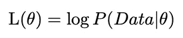

通过最大化对数似然或最小化负对数似然(损失函数)来估计参数θ:

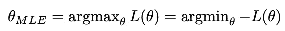

**Bayesians** 不是点估计，而是使用 Bayes 公式估计参数的完全后验分布:

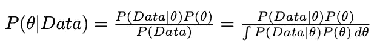

您可能已经注意到，分母的计算可能是 NP 难的，因为它在θ的所有可能值上都有一个积分(或分类情况下的求和)。你可能也想知道我们是否能得到θ的点估计，就像 MLE 所做的那样。这就是**最大后验概率** ( **图**)估算发挥作用的地方。MAP 绕过了后验分布的繁琐计算，而是试图找到使后验分布最大化的θ的点估计。

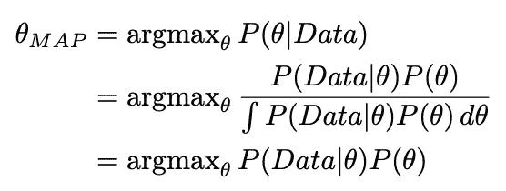

由于对数函数是单调的，我们可以在对数空间重写上述等式，并将其分解为两部分:最大化似然性和最大化先验分布:

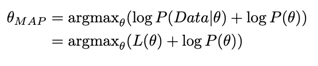

这个看起来不像 MLE 吗？

事实上，这两者之间的联系是 MAP 可以被视为对正则化损失函数执行 MLE，其中先验对应于正则化项。例如，如果我们假设先验分布为高斯分布，则 MAP 等于 L2 正则化的 MLE 如果我们假设先验分布是拉普拉斯分布，那么在 L1 正则化的情况下，MAP 等于 MLE。

还有一种方法可以得到后验分布的点估计:**期望后验(EAP)** 估计。MAP 和 EAP 的区别在于 MAP 得到的是后验分布的众数(最大值)，而 EAP 得到的是后验分布的期望值。

# 不确定

频率主义者和贝叶斯方法之间的主要区别是他们在参数估计中测量不确定性的方式。

正如我们前面提到的，**常客**使用 MLE 来获得未知参数的点估计，他们不会给可能的参数值分配概率。因此，为了衡量不确定性，频率主义者依赖于零假设和置信区间。然而，需要指出的是，置信区间并不直接转化为假设的概率。例如，95%的置信区间，只意味着你生成的 95%的置信区间将覆盖真实的估计，但是说它以 95%的概率覆盖真实的估计是不正确的。

**另一方面，贝叶斯**在可能的参数值上有一个完整的后验分布，这允许他们通过整合完整的后验分布来获得估计的不确定性。

# 计算

由于在许多参数上的整合，Bayesians 通常比 frequent ists**计算更密集。有一些方法通过使用共轭先验或使用采样方法或变分推理来近似后验分布来降低计算强度。**

# 例子

在本节中，我们将了解如何使用两种算法进行训练和预测:线性回归和贝叶斯线性回归。

## 线性回归(频率主义者)

我们假设线性回归模型的以下形式，其中截距包含在参数θ中:

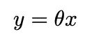

假设数据按照高斯分布分布:

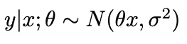

使用 MLE 最大化对数似然，我们可以得到θ的点估计，如下所示:

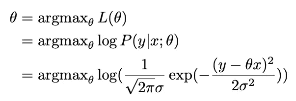

一旦我们从训练数据中学习了参数θ，我们就可以直接使用它来对新数据进行预测:

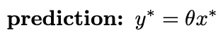

## 贝叶斯线性回归(贝叶斯)

如前所述，贝叶斯方法是对先验和可能性都进行假设:

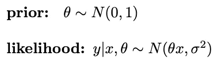

使用这些假设和贝叶斯公式，我们可以得到后验分布:

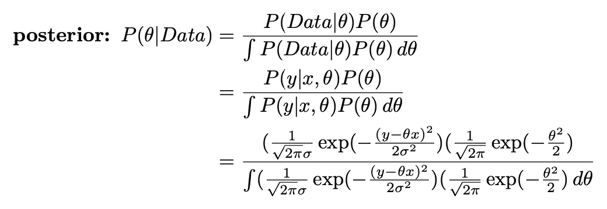

在预测时，我们使用后验分布和可能性来计算后验预测分布:

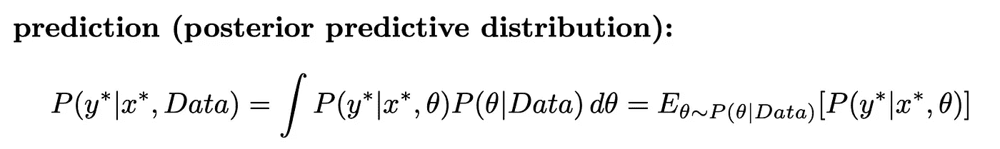

请注意，参数和预测的估计值都是全分布。当然，如果我们只需要一个点估计，我们总是可以使用 MAP 或 EAP。

# 结论

机器学习的主要目标是使用从训练数据中学习到的参数进行预测。我们应该使用频率主义者还是贝叶斯方法来实现目标取决于:

1.  我们想要的预测类型:点估计或潜在值的概率。
2.  我们是否有可以整合到建模过程中的先验知识。

顺便说一下，我们之前讨论过[判别模型和生成模型](/generative-vs-2528de43a836)。一个常见的误解是将判别模型称为频率主义模型，将生成模型称为贝叶斯模型。事实上，频率主义和贝叶斯方法都可以用于判别或生成模型。你可以参考[这个帖子](https://lingpipe-blog.com/2013/04/12/generative-vs-discriminative-bayesian-vs-frequentist/)获得更多的澄清。

我希望你喜欢阅读这篇文章。:)