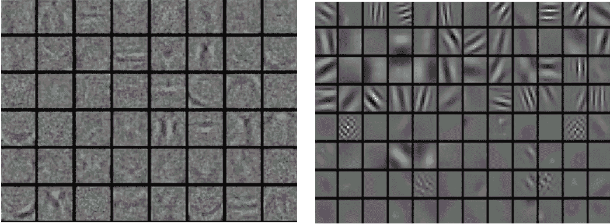

# 学习率常见问题

> 原文：<https://towardsdatascience.com/frequently-asked-questions-on-learning-rate-6defb4e45d2e?source=collection_archive---------32----------------------->

## 学习率问题和答案

这篇文章旨在解决我的学生经常问的关于学习速度的常见问题，也称为步长。所以，我发现以问答的形式收集它们很有用！你应该能够找到所有你想知道的关于学习率的信息。

eberhard grossgasteiger 在 [Unsplash](https://unsplash.com?utm_source=medium&utm_medium=referral) 上的照片

**什么是学习率，它的目的是什么？**

神经网络计算其输入的加权和，并将其传递给激活函数以获得输出。为了获得准确的预测，称为梯度下降(GD)的学习算法在从输出向输入反向移动的同时更新权重。当对训练集的每个样本进行更新时，我们称之为随机梯度下降(SGD)。

梯度下降优化器通过最小化损失函数(L)在多次迭代中估计模型权重的好值。这就是学习率的来源。它控制模型学习的速度，或者说，控制权重更新以达到 l 的最小值的速度。新(更新后)和旧(更新前)权重值之间的关系表示如下:

**学习率取负值吗？**

梯度∂L/∂w 是损失函数增加方向的向量。因此，-∂L/∂w 是 l 递减方向上的向量。由于η大于 0，因此是一个正值，-η∂L/∂w 在 l 递减方向上朝着它的最小值前进。如果η是一个负值，那么你正在远离最小值。它正在逆转梯度下降所做的事情，甚至使神经网络不学习。如果你考虑一个负的学习率值，你必须在上面的等式中做一个小的，但是必要的改变，这样你就可以保持最小化损失函数:

**学习率的典型值有哪些？**

学习率的典型值范围从 10 E-6 到 1。这里，你必须知道已经为 GD、具有动量的 GD 和 SGD 建立了，对于任何优化问题，如果学习率小于 1/L，梯度下降收敛到局部极小值，其中 L 是损失函数关于参数的 Lipschitz 光滑性。

**坡度上选择不当的学习率会有什么问题？**

达到最小梯度所需的步长直接影响模型的性能:

*   小的学习率消耗大量的时间来收敛，或者由于梯度消失，即梯度变为零而不能收敛。
*   较大的学习率使模型面临超过最小值的风险，因此它将无法收敛:这就是所谓的爆炸梯度。

消失(左)和爆炸(右)渐变([图像来源](https://cs231n.github.io/neural-networks-3/)

因此，您的目标是调整学习率，使梯度下降优化器以最少的步骤数达到 L 的最小值。通常，您应该选择一个理想的学习速率，该速率既要足够低，以便网络收敛到有用的值而不会导致梯度消失，又要足够高，以便可以在合理的时间内对模型进行训练而不会导致梯度爆炸。

除了你对学习速率的选择，损失函数的形状，以及你对优化器的选择，决定了你能多快收敛到目标最小值。

**错误选择的重量学习率有什么问题？**

当我们的输入是图像时，学习率设置不当会导致噪声特征，如下图所示。恰恰相反，平滑、干净和多样的特征是良好调节的学习速率的结果。正确和不正确地设置学习率决定了你的模型的预测质量:一个良好的训练或者一个未收敛的网络。

由神经网络的第一层产生的标绘特征:不正确地(左)和正确地(右)设置学习率的情况([图像信用](https://cs231n.github.io/neural-networks-3/)

**能否先验地计算出最佳学习率？**

对于简单的模型来说是可能的。对于复杂的问题，从理论推导中计算出能产生最准确预测的最佳学习率是不可行的。为了发现给定数据集上给定模型的最优学习率值，必须进行观察和经验。下一个问题的目的是了解你可以用来设定学习率的不同选择。

**我们如何设定学习率？**

通过参考我在文献中读到的内容，我区分了 4 种主要方法，你可以选择它们来调整你的模型的学习率。下面是配置η值所需了解的一切。

*   *固定学习率的使用:*

您为学习率设定了一个值，您将在整个学习过程中使用该值。在这里，两种方式是可能的。第一种是琐碎而简单的，不需要任何努力。它包括使用实践中常用的通常值，即 0.1 或 0.01。第二种方法更相关，因为你必须寻找适合你的特定问题和神经网络结构的正确的学习速率。如前所述，学习率的典型值范围从 10 E-6 到 1。因此，你在这个范围内粗略地搜索 10 的各种顺序，以找到你的学习速率的最佳子范围。然后，在粗搜索找到的子范围内，用小的增量来细化搜索。你在实践中可能会看到的一个启发是在训练时观察损失，以找到最佳的学习率。

*   *学习率计划的使用:*

与固定的学习速率不同，这种替代方案要求η值根据时间表在训练期内变化。这里，你从一个大的学习率开始，在模型的训练过程中逐渐降低学习率。这是合乎逻辑的！在学习过程的开始，权重被随机初始化，并且远未被优化，因此大的变化步长是足够的。随着学习过程接近尾声，需要更精确的权重更新。通常每隔几个历元就减少一个学习步骤。学习率也可以在固定数量的训练时期衰减，然后在剩余的时期保持恒定在一个小值。

我从阅读材料中得出的两个流行的时间表方案是在平稳状态下降低学习率和学习率衰减。在第一种方案中，对于固定数量的训练时期，每次丢失稳定期，即停滞时，学习率降低。关于第二种方案，学习率被降低，直到它达到接近 0 的小值。在这里，我区分了学习率的三种衰减方式，即阶跃衰减、指数衰减和 1/t 衰减。

*   *给新币加动量:*

它包括在经典 SGD 方程中增加一项:

由于 Vt-1，这个增加的项考虑了权重更新的历史，这是过去梯度的指数移动平均的累积。这平滑了 SGD 的进程，减少了它的振荡，从而加速了收敛。然而，这需要设置新的超参数γ。除了具有挑战性的学习速率η的调整之外，还必须考虑动量γ的选择。γ设置为大于 0 小于 1 的值。其常用值为 0.5、0.9、0.99。我将不详细讨论动量。这将在另一篇文章中处理。

*   *自适应学习率的使用:*

与上述方法不同，不需要手动调整学习速率。η由优化器调整，以根据权重的重要性执行更大或更小的更新。此外，确保了模型中每个权重的学习率。自适应梯度(Adagrad)、Adadelta、均方根传播(RMSProp)和自适应矩估计(Adam)是自适应梯度下降变体的例子。在这里，你要知道，没有单一的算法对所有问题都是最好的。

这里概述了学习率配置的主要方法。它提供了一个简明扼要的图形表示，方便您的理解！

学习率有哪些实用的经验法则？

*   学习率是你的模型所依赖的最重要的超参数。所以，如果你被迫设置一个且只有一个超参数，你必须优先考虑学习率。你可以参考我以前的一篇文章来了解另一个重要的神经网络超参数:*激活函数*。

 [## 全面综合了主要激活函数的优缺点

### 激活函数:神经网络最重要的超参数之一，必须仔细选择…

medium.com](https://medium.com/analytics-vidhya/comprehensive-synthesis-of-the-main-activation-functions-pros-and-cons-dab105fe4b3b) 

*   模型学习率的调整是耗时的。因此，没有必要执行网格搜索来找到最佳学习速率。为了达到成功的模型，找到一个足够大的学习率，使得梯度下降有效地收敛，但是不要大到它永远不收敛。
*   如果你选择一种非自适应学习率设置方法，你应该意识到这个模型会有成百上千的权重，每一个都有自己的损失曲线。所以，你必须设定一个适合所有人的学习速度。此外，损失函数实际上并不具有清晰的 U 形。它们往往具有更复杂的形状，有几个局部最小值。
*   自适应方法极大地简化了适当学习率配置的挑战性任务，这使得它们更常用。此外，它通常收敛得更快，并且优于其学习速率被非自适应方法不适当地调整的模型。
*   SGD with momentum、RMSProp 和 Adam 是最常用的算法，因为它们对几种神经网络体系结构和问题类型具有鲁棒性。

我希望它对新的深度学习实践者足够有用和清晰。如果这篇文章中没有提到的新问题突然出现在你的脑海中，请随时提问！也许把上面的问答做得更详尽一些会有用。

一篇关于动量的文章正在进行中。敬请期待！