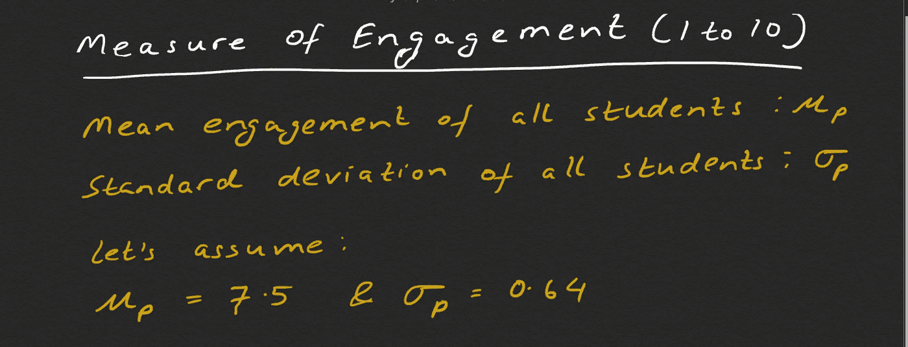
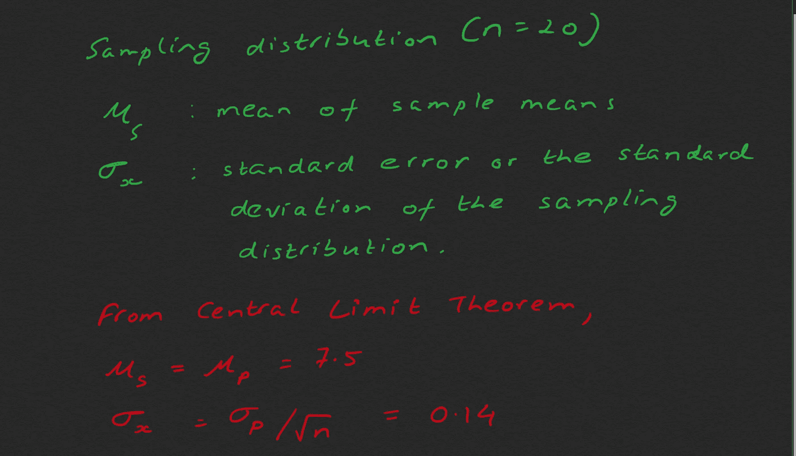
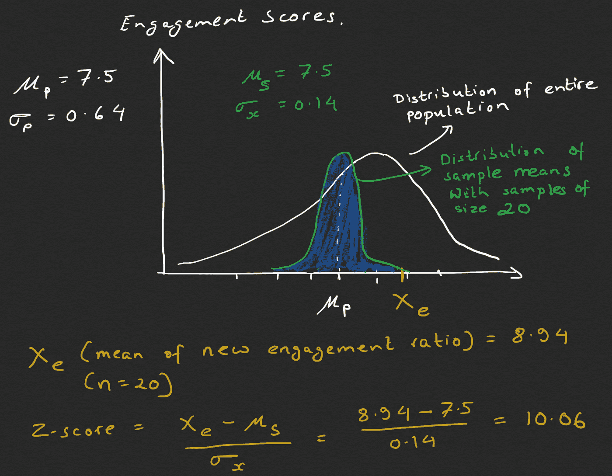
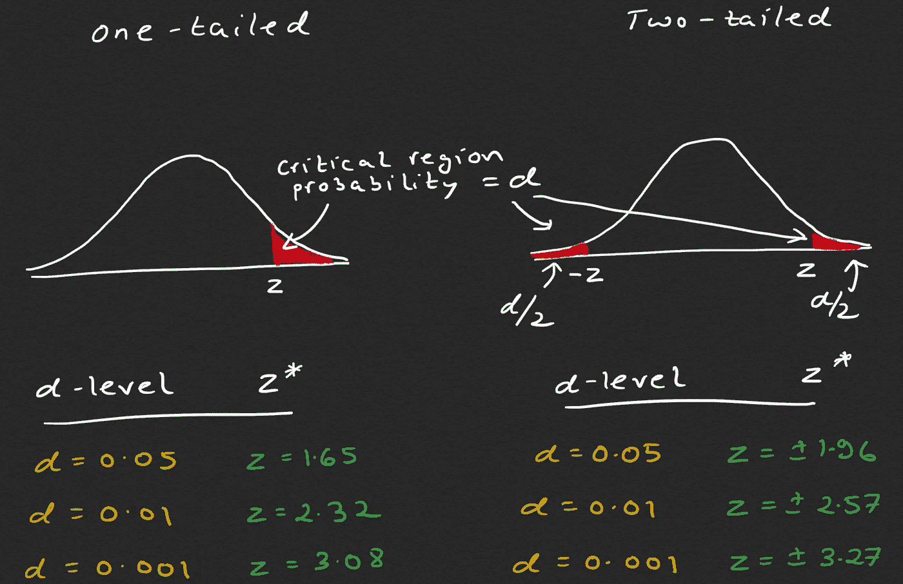
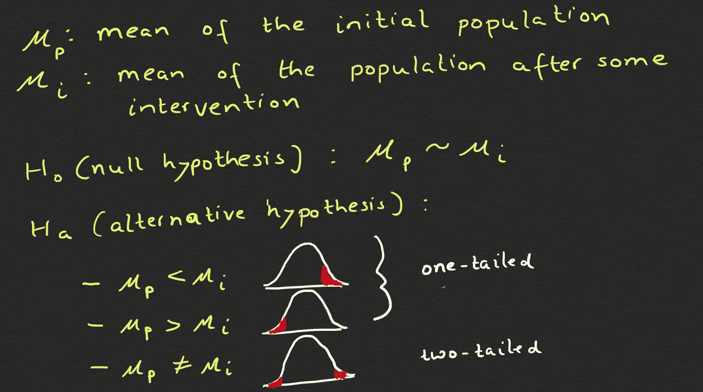
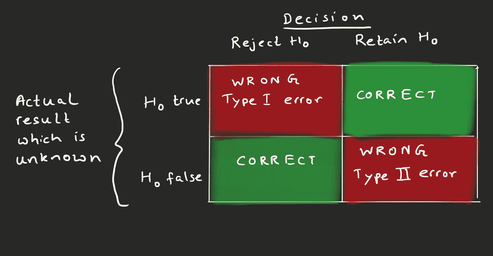
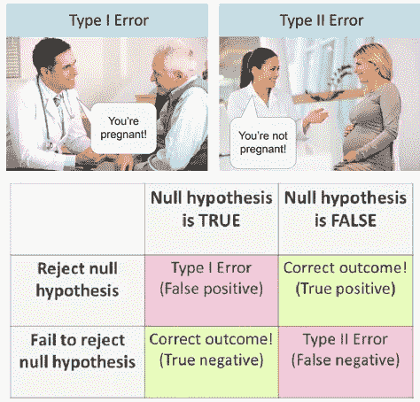

# 简单解释了假设检验以及 I 型和 II 型错误

> 原文：<https://towardsdatascience.com/friendly-introduction-to-hypothesis-testing-and-type-i-type-ii-errors-6044d3c60236?source=collection_archive---------50----------------------->

## 如何为实验选择正确的测试，并根据统计证据做出决定？

合著者:[艾米特·库马尔](https://medium.com/u/9a4969039da3?source=post_page-----6044d3c60236--------------------------------)

> "事实是顽固的东西，但统计数字是易驾驭的."
> ― **马克·吐温**

照片由[像素](https://www.pexels.com/photo/analysis-blackboard-board-bubble-355952/?utm_content=attributionCopyText&utm_medium=referral&utm_source=pexels)的[像素](https://www.pexels.com/@pixabay?utm_content=attributionCopyText&utm_medium=referral&utm_source=pexels)拍摄

我最近在阅读 A/B 测试时偶然发现了假设测试的概念。

> 维基百科将假设检验定义为:

> 统计假设，有时也称为验证性数据分析，是一种在观察通过一组随机变量建模的过程的基础上可检验的假设。统计假设检验是一种统计推断方法。通常，比较两个统计数据集，或者将通过采样获得的数据集与来自理想化模型的合成数据集进行比较。为两个数据集之间的统计关系提出了另一个假设，并与这两个数据集之间没有关系的理想零假设进行了比较。如果根据阈值概率(显著性水平),数据集之间的关系不太可能实现零假设，则认为这种比较具有统计显著性。当确定某项研究的什么结果会导致拒绝预先指定的显著性水平的无效假设时，使用假设检验。

读这本书的人可能会认为有人这样写，所以很少有人能理解它。真正的挑战是大多数教程依赖于统计学家喜欢使用的大量术语和语言。

在这篇文章中，我将尝试用简单的方式解释假设检验以及第一类和第二类错误，而不使用太多的数学知识。

我建议提前阅读[这篇文章](/demystifying-confidence-interval-and-margin-of-error-e01c1bc8760b)，因为置信区间和误差幅度的概念将有助于理解假设检验。

# 真实世界的例子

路易斯·基冈-Skillscouter.com 在 [Unsplash](https://unsplash.com/s/photos/online-course?utm_source=unsplash&utm_medium=referral&utm_content=creditCopyText) 上的照片

假设一家在线教育公司希望借助一项新功能来提高学生的参与度。参与度定义为观看课程的分钟数除以可用内容的总分钟数。让我们假设参与度的值在 1 到 10 之间。由于该公司不确定新功能是否会提高参与度，他们想在学生样本中进行测试。

现在，如果我们从总体中随机抽取 ***n*** 名学生的样本(具有均值 **μ_p** 和标准差**σ_ p**),[中心极限定理](https://en.wikipedia.org/wiki/Central_limit_theorem)告诉我们以下内容:

*   如果我们从替换总体中随机抽取足够多的样本，那么样本均值的分布将是近似正态的。
*   抽样分布的平均值( **μ_s** )可用于估计真实总体平均值， **μ_p**
*   抽样分布的样本标准差( **σ_x)** 由 **σ_p/√n** 给出(即总体的标准差除以样本中的观察数)。

我们现在有了总体中所有样本大小为 ***n=20*** 的样本均值分布。现在，让我们向随机抽取的 20 名学生介绍这项新功能，然后计算新的参与度。假设这 20 名学生的新平均参与度是*。*

*我们想知道新的**、*、*、**在抽样分布中落在哪里？换句话说，我们想找到 z 值？*

> *z 得分基本上是标准偏差( **σ_x)** 的数量，通过该数量，值 **Xₑ** 高于或低于平均值 **μ_s** 。*

**

*现在让我们问一个问题“随机选择一个大小为 20 的样本，得到一个至少为 8.94 的平均值的概率是多少？”概率将等于***1-蓝色阴影区域的面积*** *。*我们可以使用 [z 表](https://s3.amazonaws.com/udacity-hosted-downloads/ZTable.jpg)来获取数值。我们发现 10.06 的 z 值非常大，超出了图表范围！这仅仅意味着概率很小，几乎不可能偶然得到 8.94 的平均值，或者换句话说，新功能似乎对学生的参与度有影响。*

*这里我们需要定义一个阈值，如果概率低于这个阈值，我们可以安全地假设所获得的结果不太可能是偶然获得的，并且该结果是由于一些干预(在我们的例子中引入了一个新的特性)。统计学家确定了三个常规水平，称为 ***α*** 水平，也称为显著性水平。*

*   ****α*** = 0.05(5%)*
*   ****α*** = 0.01(1%)*
*   ****α***= 0.001(0.1%)*

*如果得到特定样本均值的概率小于 ***α*** ，则**不太可能**发生。*

**

*这里，我们假设在引入新功能后，平均参与度会增加。在现实生活中，我们不能做出这样的假设，因为相反的情况也是可能的。为了解决这种不确定性，我们使用双尾测试，将 ***α*** 对称地分成两部分。分割 ***α*** 会导致两个不对称的 z 临界值。*

**

> *注意:对于双尾检验，z-临界值与用于计算置信区间的值相同。参考本文了解更多关于置信区间的信息。*

*在特定的 ***α*** 水平上，我们在任一情况下都有两种可能的结果(单尾或双尾)。样本均值( ***、Xₑ*** )要么位于临界区域之外，要么位于临界区域之内。我们将这两种结果称为零假设( ***、Hₒ*** )或替代假设( ***、Hₐ*** )。*

*零假设( ***、Hₒ*** )假设经过某种干预后，当前人口和新人口之间没有显著差异。*

**

*当我们确定变化的方向时，我们选择单尾检验。双尾检验是一个保守的选择，因为我们可能会弄错方向。*

*给定一个样本均值，我们可以拒绝一个零假设(***【hₒ】***)或者拒绝失败。拒绝零假设( ***Hₒ*** )可以用以下方式解释:*

*   *我们的样本均值**落在**临界区域内。*
*   *平均值的 z 得分的绝对值**大于 z 临界值的绝对值**。*
*   *获得样本均值的概率**小于 ***α*** 水平**。*

# *第一类和第二类错误*

*这种类型的统计分析容易出错。在上面的例子中，可能的情况是，所选的 20 名学生已经非常投入，而我们错误地认为高平均投入比是因为新功能。下图显示了可能发生的四种不同情况。*

**

*熟悉机器学习的人可能会观察到，类型 I 错误基本上是假阳性，类型 II 错误是假阴性。*

**

*[https://www . Reddit . com/r/Mcat/comments/ao 6 Ovi/type _ I _ and _ type _ ii _ errors/](https://www.reddit.com/r/Mcat/comments/ao6ovi/type_i_and_type_ii_errors/)*

## ***I 型错误(**假阳性)*

*   *解读:你预测的是正的，是假的。*
*   *你预言一个男人怀孕了，但他没有。*

## ***第二类错误(假阴性)***

*   *解读:你预测的是负数，这是假的。*
*   *你预言一个女人没有怀孕，但她确实怀孕了。*

*我希望假设检验这个术语将不再是一个陌生的概念。虽然这篇介绍遗漏了一些技术部分，但是有很多非常好的资源，可以提供更多的细节。我总是乐于接受问题和建议。在 LinkedIn 上联系我，别忘了点击👏🏻如果你喜欢邮报。*