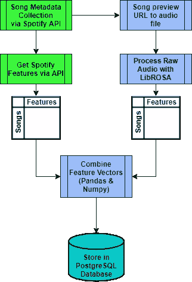
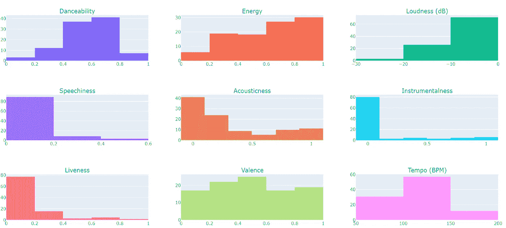
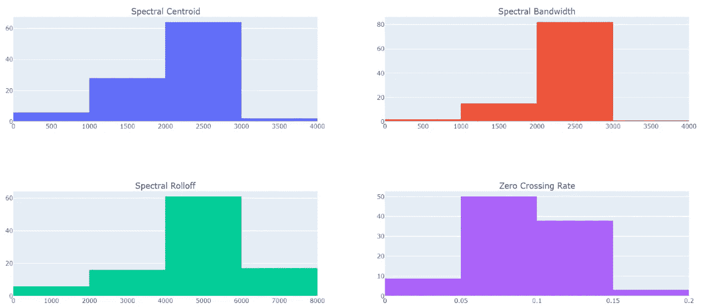
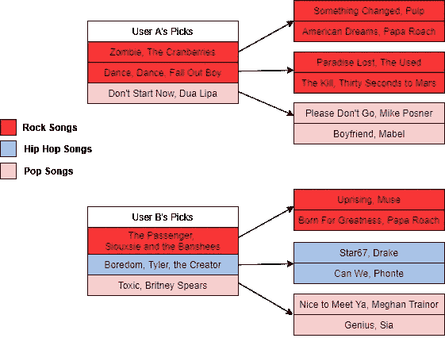
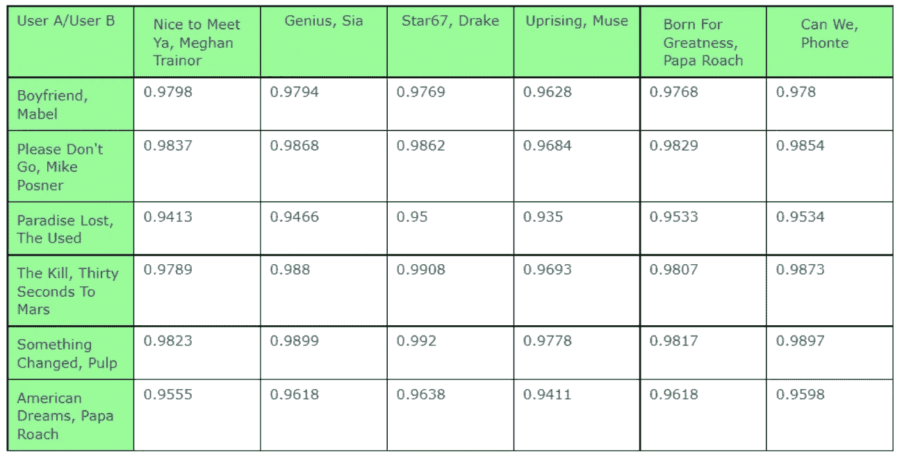
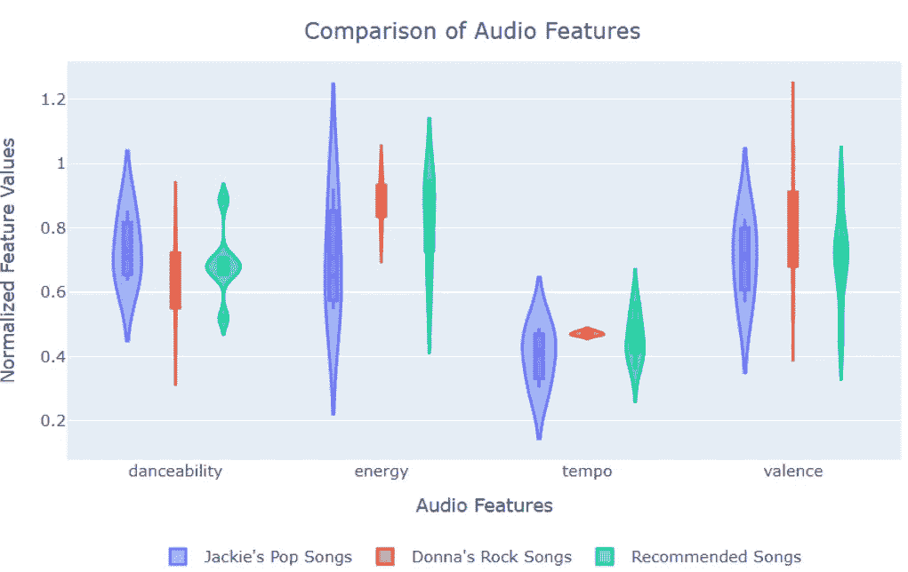
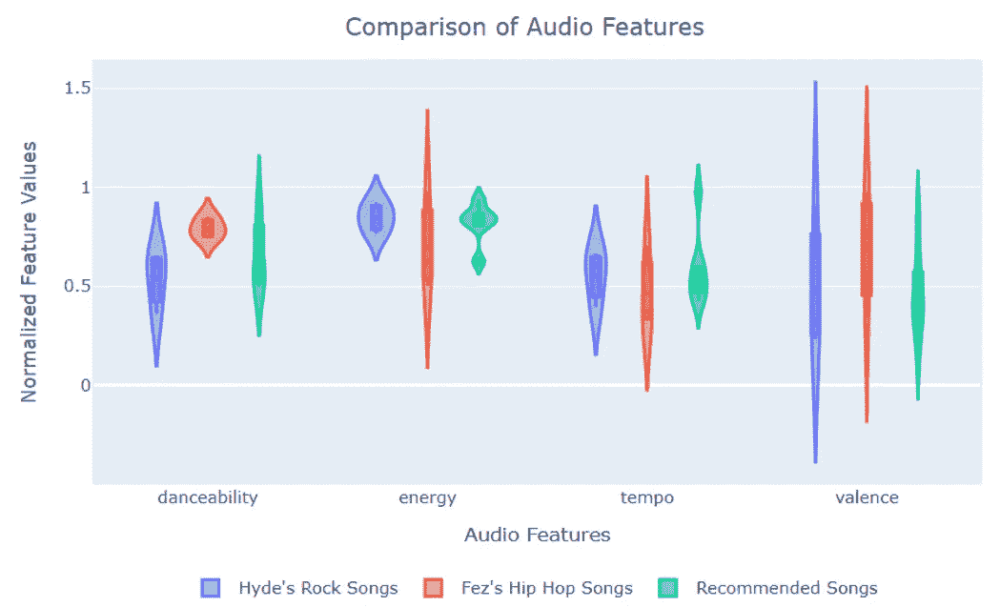

# Friendshipify:一个用于朋友的播放列表生成器

> 原文：<https://towardsdatascience.com/friendshipify-a-playlist-generator-for-friends-f79297f08b03?source=collection_archive---------45----------------------->

## 用 Spotify API 和 Flask 构建的多用户歌曲推荐器 webapp

[亚历山大·波波夫](https://unsplash.com/@5tep5?utm_source=unsplash&utm_medium=referral&utm_content=creditCopyText)在 [Unsplash](https://unsplash.com/s/photos/music?utm_source=unsplash&utm_medium=referral&utm_content=creditCopyText) 上拍照

你有没有在和朋友的长途旅行中被困在听自己不喜欢的音乐？

你的朋友问你想听什么，你说“你喜欢什么音乐就放什么。”所以他们开始演奏他们的音乐，你意识到他们喜欢的音乐是你不能忍受听的。现在你后悔没有在把音乐控制权交给他们之前说出来，公路旅行才刚刚开始。

我也遇到过几次这种情况。我和我的搭档对音乐的品味截然不同。他大多喜欢说唱，也时不时听听 ska 和朋克。我什么都喜欢一点，但是我听什么主要取决于我的心情。我们的品味在另类/独立音乐的一个非常特定的子集上重叠。在四个小时的车程中，我们轮流将歌曲添加到 Spotify 队列中，但我们仍然受困于对方的歌曲。

像这样的情况让我希望有一种方法，我们只能播放我们都喜欢的歌曲。我建立了 Friendshipify 来拯救我们，使我们不再陷入这种境地。

Friendshipify 根据两个用户的喜好交集生成一个播放列表。每个用户提供三首歌曲，应用程序将把它们作为他们的“音乐品味”，并策划一个两个用户都会喜欢的歌曲播放列表。试试这里的！

# 方法概述

使用 Python 编写的数据收集管道收集了大约 40，000 首歌曲。这些管道利用 Spotify API(通过 Spotify，一种 Python 包装器)来收集歌曲、元数据(如艺术家信息和流派)以及 Spotify 特有的音频功能(如可跳舞性、速度和乐器性)。使用 LibROSA 从原始音频文件中提取附加音频特征(例如，过零率、Mel 倒谱系数)。使用 Pandas 和 Numpy 构建特征向量，并存储在 PostgreSQL 数据库中。Friendshipify web 应用程序是使用 Flask 开发的，并通过 Google 云平台部署。伴随的可视化是用 Plotly 编写的。

数据收集和争论渠道；图片由 Deandra Alvear 提供

# 我是如何创建 Friendshipify 的

## 数据收集和争论渠道

Friendshipify 数据库存储了跨越 11 个流派的数千首歌曲的特征向量。当用户输入一首歌曲时，Friendshipify 会检查歌曲的特征向量是否已经存储在数据库中。如果不是，轨迹通过数据收集和特征提取管道来生成特征向量。

数据收集管道利用 Spotify API 收集歌曲及其元数据，如曲目名称、艺术家姓名和流派。使用音频特征端点检索音频特征，例如节奏、可跳舞性和能量。以下是我选择包含的 9 个 Spotify 特性的样本分发，这些特性的定义可以在 [Spotify API 文档](https://developer.spotify.com/documentation/web-api/reference/tracks/get-audio-features/)中找到。

9 个 Spotify 功能的样本分布；图片由 Deandra Alvear 提供

我本可以在这里停下来，基于 Spotify 提供的功能构建一个简单的推荐器，但我有两个顾虑:我选择的 9 个 Spotify 功能是否足以提供高质量的推荐，以及我如何能够验证我的结果。在做一些研究时，我偶然发现了几篇关于音乐信息检索的博客文章([流派分类](/music-genre-classification-with-python-c714d032f0d8)、[重要音频特征](/how-i-understood-what-features-to-consider-while-training-audio-files-eedfb6e9002b))，作者使用了 LibROSA，一个用于音频分析的 Python 库，从原始音频文件中提取音频特征。

Spotify API 在歌曲对象元数据中提供了歌曲 30 秒预览的链接。我想我可以使用 LibROSA 从歌曲预览中提取潜在特征，从而扩展我的数据集中的特征。我构建了一个特征提取管道来做这件事。下面是我根据自己的研究选择提取的一些特征的样本分布。有关频谱特性(质心、带宽、滚降)的更多信息，请参见[本笔记本](https://musicinformationretrieval.com/spectral_features.html)，有关过零率的更多信息，请参见[本笔记本](https://musicinformationretrieval.com/zcr.html)。

4 个 LibROSA 特征的样本分布；图片由 Deandra Alvear 提供

一旦收集并处理了所有数据，我就将它们存储在 PostgreSQL 数据库中。Spotify 和 LibROSA 的组合功能将用于推荐。

## 创建匹配算法

决定如何配对可能是这个过程中最困难的部分。我不仅需要决定如何评估歌曲之间的相似性，还必须想出如何推荐能迎合两个用户的歌曲。虽然协同过滤方法被广泛用于构建推荐系统，但它并不是我想要解决的问题的正确方法。协同过滤试图根据评级历史找到*个相似用户*。在我的例子中，我想找到两个用户的歌曲之间的相似之处。

在评估歌曲之间的相似性时，我采取的第一步是尝试聚类。我认为将歌曲分类会给我不同的群体，我最终可以从中得出建议。我把所有收集到的曲目的特征向量输入到 K 均值聚类算法中。这导致了一些有趣的集群，但并没有给我一个清晰的想法，如何或为什么歌曲被集群的方式。当我听每个集群中的歌曲时，我可以听到相似之处，但我没有办法量化这些相似之处来验证结果。

最后，我决定按流派对歌曲进行分组，这是数据收集过程中包含的一个功能。使用流派作为分组标准意味着，如果用户提交一首摇滚歌曲，应用程序只会推荐其他摇滚歌曲。

# Friendshipify 如何工作

一旦两个用户提交的曲目通过了数据收集和特征提取管道，该应用程序就具备了开始提出建议所需的所有标准。下图显示了这一过程。表“用户 A 的选择”和“用户 B 的选择”代表两个用户和他们提交给 Friendshipify 的歌曲。使用左侧的图例以不同的颜色表示类型。

按流派做推荐；图片由 Deandra Alvear 提供

首先，计算歌曲和数据库中属于同一流派的所有其他歌曲之间的余弦相似度。例如，用户 A 的第一首歌曲是小红莓乐队的“僵尸”。这是一首摇滚歌曲，因此 Friendshipify 计算“僵尸”的特征向量与属于摇滚流派的所有其他歌曲特征向量之间的余弦相似度。前两首最相似的歌曲(具有最高余弦相似值)成为该歌曲的推荐。在图形中，每首歌曲都有一个指向其最相似歌曲的箭头；《有些东西变了》和《美国梦》是 Friendshipify 数据库中与《僵尸》最相似的前两首歌。

用户 A 和用户 B 的余弦相似性矩阵；图片由 Deandra Alvear 提供

一旦 Friendshipify 为每个用户推荐了 6 首歌曲，它们就被用来构建一个 6×6 的余弦相似矩阵，其中用户推荐的歌曲是行索引或列索引。矩阵的单元包含每个用户之间所有可能的歌曲配对的成对余弦相似性值。例如，用户 A 的推荐“男朋友”和用户 B 的推荐“很高兴见到你”的相似度得分是 0.9798。

具有最高余弦相似值的歌曲对被用作最终推荐。上表中，《Star76》和《改变的东西》相似度最高，所以这两首歌会被纳入结果。然而，“起义”和“失乐园”具有最低的相似性得分，因此这些歌曲可能不会被包括在最终结果中，除非它们与不同的歌曲具有高的相似性得分。

# 测试案例

虽然 Friendshipify 总是会推荐与两个用户最相似的歌曲，但也会有一些情况很好，而另一些情况不太好。

## 流行与摇滚

两个朋友，唐娜和杰姬，都喜欢不同的音乐。成龙喜欢 2000 年代的流行音乐和玛丽亚·凯莉的早期音乐。唐娜更喜欢 90 年代到 21 世纪初的摇滚。成龙挑选了以下流行歌曲:

*   糟糕的爱情，嘎嘎小姐
*   幻想，玛丽亚·凯莉
*   为我哭成一条河，贾斯汀·汀布莱克

唐娜挑选了以下摇滚歌曲:

*   闻起来像青少年精神，涅槃
*   阳光下的岛屿，威泽
*   永远不会让你走，心灵蒙蔽合唱团

Friendshipify 为 Jackie 和 Donna 的播放列表推荐了这些歌曲:

*   商会，蓝尼·克罗维兹，流行
*   贝弗利山，威泽，洛克
*   半迷人的生活，心灵蒙蔽合唱团，摇滚
*   我的浪潮，声音花园乐队，摇滚
*   MMMBop，汉森，流行
*   还有我，丹尼尔·梅里威瑟，爸爸
*   再见，麦迪逊啤酒，流行音乐

为了验证这些推荐的歌曲是否符合两个朋友的口味，我决定检查四个音频特征的分布，可跳舞性、能量、速度和效价。

成龙和唐娜提交歌曲的小提琴情节及其推荐；图片由 Deandra Alvear 提供

以下是来自 [Spotify API 文档](https://developer.spotify.com/documentation/web-api/reference/tracks/get-audio-features/)的这些功能的定义:

> **可跳舞性**:根据速度、节奏稳定性、拍子力度和整体规律性的组合，一首曲目是否适合跳舞。值 0.0 最不适合跳舞，1.0 最适合跳舞。
> 
> **能量**:从 0.0 到 1.0 的度量，代表强度和活动的感知度量。通常，高能轨道感觉起来很快，很响，很嘈杂。例如，死亡金属具有高能量，而巴赫前奏曲在音阶上得分较低。
> 
> **速度**:以每分钟节拍数(BPM)为单位的轨道整体估计速度。在音乐术语中，速度是给定作品的速度或节奏，直接来源于平均节拍持续时间。
> 
> **效价**:从 0.0 到 1.0 的一个量度，描述一首曲目所传达的音乐积极性。高价曲目听起来更积极(例如，快乐、愉快、欣快)，而低价曲目听起来更消极(例如，悲伤、沮丧、愤怒)。

从小提琴的情节中，我们可以看到成龙的流行歌曲节奏较低，适度可舞，能量多样，适度积极(价)。唐娜的所有摇滚歌曲似乎都有相同的低节奏，不如杰基的流行歌曲适合跳舞，有高能量，适度积极。“推荐歌曲”的值分布在视觉上与 Jackie 和 Donna 的歌曲的分布相匹配。推荐的歌曲同样是低节奏，变价。

推荐的能量与在两个朋友的歌曲中看到的值的范围重叠。然而，小提琴的形状表明，Friendshipify 推荐像唐娜的高能歌曲的可能性更高。推荐的可跳舞性值是有趣的，因为包括了两个极值 0.88 和 0.51，尽管其余的歌曲落在 Jackie 和 Donna 的平均可跳舞性值内。Friendshipify 可以包括这些极值，以解决 Jackie 的下一首歌曲具有 0.88 的可跳舞性值的 50%概率，或者 Donna 的一首歌曲具有 0.51 的可跳舞性值的事实。

尽管在可跳舞性上存在差异，但基于绘制的特征，结果似乎是好的。我觉得这些歌曲在听觉上符合并迎合了两个朋友的口味。蓝尼·克罗维兹的《密室》听起来很流行/摇滚，所以我觉得这首歌对杰姬和唐娜都会有吸引力。“MMMBop”符合成龙和唐娜选择的时代，听起来类似于心灵蒙蔽合唱团的“永远不会让你走”和“半迷人的生活”，后者是从唐娜的歌曲中推荐的。“Good In Good Good In Good”是杰基精选推荐的歌曲，听起来与贾斯汀·汀布莱克的“泪流成河”非常相似。

## 摇滚对嘻哈

唐娜和杰基的朋友海德喜欢和唐娜一样的摇滚乐。他挑选了以下歌曲:

*   中间，Jimmy Eat World 组合
*   布莱特赛德先生，杀手们
*   红辣椒乐队加州

他们问他们的朋友菲斯喜欢什么样的音乐。他喜欢嘻哈，他最喜欢的两个组合是 OutKast 和 TLC。他最喜欢的德雷克歌曲是《在我的感觉里》。菲斯挑选了以下歌曲:

*   嘿，你好，奥特卡斯特
*   在我看来，德雷克
*   瀑布，TLC

以下是 Friendshipify 提出的建议:

*   一支舞，德雷克，嘻哈
*   抱紧我，动感城市原声带，摇滚
*   皇家翼，银阳皮卡，摇滚
*   家的色调，盲瓜，摇滚
*   三是个神奇的数字，瞎瓜，石头
*   后院，朋友哥打，嘻哈
*   傻逼乐队，跑酷乐队，嘻哈

海德和非斯提交歌曲的小提琴情节及其推荐；图片由 Deandra Alvear 提供

海德的摇滚歌曲中度到不适合跳舞，能量很高。这是有道理的，因为“中间”和“亮边先生”听起来又快又有活力。尽管能量很高，海德的舞蹈性和节奏分布都被加州化扭曲了，这是一首比他的另外两首歌更柔和的歌。菲斯的歌和海德的歌相比表现出截然相反的特点。菲斯的可舞性小提琴以接近 0.8 为中心，这意味着他的歌曲具有很高的可舞性。尽管可以跳舞，菲斯的歌曲的能量和节奏是可变的。奥特卡斯特的《嘿呀》很有活力，《在我的感觉里》就没那么有活力了，《瀑布》是非斯挑的最慢的。海德和菲斯的歌曲都有不同的效价，考虑到他们的选择，这是有道理的。

“推荐歌曲”的特征分布似乎偏向海德或菲斯的歌曲。推荐的可跳舞性可能被一首或两首值约为 0.9 的歌曲所扭曲。能量和速度分布都包含异常值。包含这些异常值的歌曲可以被推荐，因为海德在高能量摇滚歌曲中有一首低节奏、低能量的歌曲，而非斯在更柔和的嘻哈歌曲中包括一首高能量、高节奏的歌曲。化合价似乎是推荐抓住两个朋友口味的一个特征；推荐的歌曲表现出相同的变价可变性。

推荐给海德和菲斯的歌，似乎并不能同时迎合两人的口味。Run-D.M.C 的“Sucker m . c . s”是最接近的，因为这首歌的打击乐性质，尽管它是一首嘻哈歌曲。向菲斯推荐另一首醇厚的德雷克歌曲是有道理的，因为他包括了一首德雷克歌曲。这两首盲瓜的歌曲也很圆润，Friendshipify 可能会试图在“在我的感觉中”和“一支舞”的特点上与它们相匹配。

如果 Friendshipify 的目的是提供单独的推荐，那么这些结果会是好的，然而，摇滚和嘻哈音乐似乎差别太大，无法推荐符合两种用户口味的歌曲。然而，流派并不是 100%的一个流派或另一个。如果菲斯和海德选择了不同的歌曲，结果可能会更有凝聚力，特别是如果两个朋友选择的歌曲不是那么多变。

# 最后的想法

Spotify 包含 4000 多种不同的风格，有些甚至是杜撰出来的。起初，我对按流派逐步限制最初的推荐持怀疑态度。即使使用像流行和摇滚这样宽泛的流派，感觉还是会给出不连贯的最终结果。音乐的美在于它不是非黑即白的。艺术家可以将不同的声音和风格融入歌曲中。例如，一首嘻哈或说唱歌曲可能有放克、古典或 R & B 的背景旋律(见[泰勒，创作者](/what-can-data-analytics-tell-us-about-flower-boy-59c037b1622c))，但仍然被认为是嘻哈/说唱。通过提取每首歌曲的潜在特征，该应用程序可以识别这些微妙的模式，并推荐类似的声音歌曲。有几次，我对给出的结果感到惊喜。因此，如果一个结果“似乎是错误的”，我鼓励你听一听。

如果我有更多的时间在这个应用上工作，我会通过改变风格的处理方式来改善推荐。我不会将 Spotify 的独特子类别映射到更一般的类别(例如，afrofuturism 变成了 R&B)，而是会保留独特的类别，并扩展数据集，以包含大量属于每个独特类别的歌曲。改变匹配算法的这一部分将提高推荐的质量，并且很可能减少应用程序的运行时间。我还将实现一个 Spotify 授权流，这样用户就可以直接将播放列表添加到他们的 Spotify 库中。

# 参考

[1] [获取音轨的音频功能](https://developer.spotify.com/documentation/web-api/reference/tracks/get-audio-features/) (2020) Spotify API 文档

[2] [Parul Pandey](https://towardsdatascience.com/@parulnith?source=post_page-----c714d032f0d8----------------------) ，[用 Python 进行音乐流派分类](/music-genre-classification-with-python-c714d032f0d8) (2018)，走向数据科学

[3] Joel Jogy，[我是如何理解的:在训练音频文件时需要考虑哪些特性？](/how-i-understood-what-features-to-consider-while-training-audio-files-eedfb6e9002b) (2019)，走向数据科学

[4] Steve Tjoa，[谱特征](https://musicinformationretrieval.com/spectral_features.html) (2017)，音乐信息检索笔记

[5]史蒂夫 Tjoa，[过零率](https://musicinformationretrieval.com/zcr.html) (2018)，音乐信息检索笔记

[6]莫拉·约翰斯顿，[Spotify 如何发现未来的流派](https://artists.spotify.com/blog/how-spotify-discovers-the-genres-of-tomorrow) (2018)，Spotify for Artists，News

[7] Paul Sorres，[数据分析能告诉我们关于花童的什么](/what-can-data-analytics-tell-us-about-flower-boy-59c037b1622c) (2019)，走向数据科学