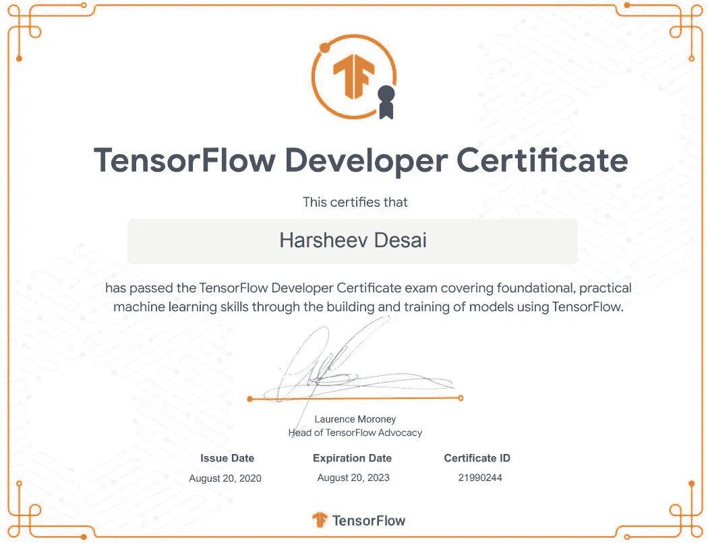

# 从一个完全的新手到通过 TensorFlow 开发者证书考试

> 原文：<https://towardsdatascience.com/from-a-complete-newbie-to-passing-the-tensorflow-developer-certificate-exam-d919e1e5a0f3?source=collection_archive---------3----------------------->

## 我从学习 Python 到通过 TensorFlow 开发者考试不到 5 个月的旅程。

阿迪·戈尔茨坦在 [Unsplash](https://unsplash.com?utm_source=medium&utm_medium=referral) 上的照片

我刚从土木工程学士学位毕业，准备今年秋天开始攻读交通工程硕士学位。不幸的是，因为新冠肺炎，我的计划被推迟到了冬季学期。所以到今年一月为止，我没有上学，也没有工作。

在查看我未来的研究生院正在进行的一些研究时，我遇到了机器学习和深度学习正在许多运输工程相关的研究项目中实施。当时，我对 ML、DL，甚至是整个数据科学是什么一无所知！所以，我开始研究这个课题。我和我的几个计算机和软件工程师朋友聊过，我从他们那里了解到，机器学习植根于统计学、微积分和线性代数，所有这些都是我最喜欢的数学主题。我记得我对自己说，我不能错过这个机会，我有世界上所有的时间和无限的资源(感谢互联网！).除此之外，我将进入一个被数据科学迅速改变的领域，我需要尝试一下。

我一直在与编程语言作斗争，我曾经开始学习 Java，但在开始后的 5 个小时内就放弃了。这很尴尬，因为我对开发 android 应用程序抱有很高的期望。现在想起来，我只是懒惰和不耐烦。但这次不同，我不得不学习比 Java 更容易掌握的 Python，我发现自己真的被这个新领域迷住了。

所以，让我们直接开始吧！在这篇文章中，我将带你经历我如何在不到 5 个月的时间里从一个完全的新手变成一个 Google 认证的 TensorFlow 开发者的旅程。

# 1.学习 Python

有很多学习 Python 的资源，既有免费教程，也有给你结业证书的付费课程。我个人选择了证书课程，因为它为我提供了一种切实的信誉形式，并让我负责任。来自非编码背景，这对我很重要。这里是一些可用的资源；

> 证书课程

*   这是我学 Python 上的课。我向任何没有编码背景的人推荐这本书，因为这本书涵盖了所有的基础知识，并且不断更新。最棒的是，你可以终身使用所有的材料，并获得证书证明你已经完成了全部课程。

> 链接: [Python 训练营:学习 Python 编程和代码培训](https://www.udemy.com/course/complete-python-bootcamp/)

*   这是密执安大学在 coursera.com[提供的另一个精彩专业。它由 4 门不同的课程组成，涵盖广泛的主题，从写你的第一首“Hello World！”使用数据库的代码。你可以买下来领证，也可以免费审核。](http://coursera.com)

> 链接: [Python 为大家](https://www.coursera.org/specializations/python#courses)

更多课程列表[此处](https://medium.com/better-programming/top-5-courses-to-learn-python-in-2018-best-of-lot-26644a99e7ec)

> 免费教程

*   freeCodeCamp.org 的优秀员工定期在 YouTube 上发布高质量的编码教程。

> 链接:[学习 Python —初学者全教程【教程】](https://www.youtube.com/watch?v=rfscVS0vtbw)

*   另一个很棒的 Python 教程视频

> 链接: [Python 教程— Python 初学者【全教程】](https://www.youtube.com/watch?v=_uQrJ0TkZlc)

好了，现在你已经学会了 Python 的基础，干得好，祝贺你！！

但是，不要指望自己成为专家，仅仅因为你有一个证书或者你坐了 5 个小时的视频教程。这项工作远未完成！这将是一个渐进的过程，有一些很棒的工具可以帮助你练习和提高你的编码技能。

我用了两个网站，

*   Codewars.com 真是太棒了！他们已经想出了一种方法来将练习编码的过程游戏化。一定要去看看

> 链接:[代码大战:融会贯通](https://www.codewars.com/)

*   Leetcode.com 是另一个伟大的网站。他们有编码面试风格的问题，以增加难度，这是另一个练习和提高你的编码技能的好地方。

我建议定期练习和提高你的 Python 技能。记住:间隔重复有效！

# 2.学习机器学习理论

正如我之前提到的，机器学习植根于统计学、微积分和线性代数，因此你不需要为了理解和学习机器学习概念而能够编码。在我看来，吴恩达在 coursera.com 讲授的机器学习课程绝对是一门瑰宝。这门课很老了，使用 Matlab 而不是 Python，但是介绍和解释概念的方式非常相关，会让你做好准备。对于像我这样一个完全的新手来说，有时会非常沮丧，但我现在很感激我完成了课程，尽管当时我并没有完全理解其中的一些主题。我发现自己一直在参考课程中的材料，甚至在准备 TensorFlow 开发者考试时也是如此。

> 链接: [Coursera |在线课程&顶级教育工作者的证书。免费加入| Coursera](https://www.coursera.org/learn/machine-learning/home/welcome)

注意:这个课程甚至可以在学习 Python 之前上，但我会建议先学习 Python，这样你可以在学习机器学习概念的同时练习。

# 3.学习数据科学库

Python 中有一些特定的库，使得数据科学相关的任务变得更加简单和高效。其中一些库是 Pandas(数据操作和分析)，Numpy(支持多维数组和矩阵)，Matplotlib(绘图)和 Scikitlearn(创建 ML 模型)。网上有数不清的资源，这里是我用过的一些-

*   熊猫——我看了很多视频、教程，甚至旁听了一门证书课程。codebasics 的这个 YouTube 播放列表无疑是互联网上最好的资源之一。

> 链接:[熊猫教程(Python 中的数据分析)](https://www.youtube.com/playlist?list=PLeo1K3hjS3uuASpe-1LjfG5f14Bnozjwy)

*   numpy——一如既往[freeCodeCamp.org](http://freecodecamp.org)为胜利而战！！

> 链接: [Python NumPy 初学者教程](https://www.youtube.com/watch?v=QUT1VHiLmmI)

*   matplotlib——YouTube 上的这个播放列表很容易理解，并且很好地解释了棘手的话题。

> 链接: [Matplotlib 教程系列—用 Python 绘图](https://www.youtube.com/playlist?list=PLQVvvaa0QuDfefDfXb9Yf0la1fPDKluPF)

*   scikitlearn——我参加了在[udemy.com](http://udemy.com)开设的一门课程，这门课程几乎涵盖了所有的 ML 模型，并使用真实世界的数据集解释了它的实现。YouTube 上还有一个 3 小时的免费教程，你可以在这里找到。

> 链接:[机器学习 A-Z(数据科学课程中的 Python&R)](https://www.udemy.com/course/machinelearning/)

# 4.深度学习理论

在这一点上，可以肯定地说，除了深度学习，你已经知道了成为一名成功的数据科学家所需要知道的大部分事情。DL 足够复杂，需要单独的课程甚至单独的库来实现。吴恩达在 Coursera 上开设的机器学习课程提到了神经网络和深度学习，但这比那门特定课程涵盖的内容要多得多，因此吴恩达开设了另一门课程，深入研究神经网络和深度学习。Deeplearning.ai 创建了一个由 5 门课程组成的专业，涵盖了不同的主题，如卷积神经网络、超参数调整、序列模型等。本课程着重于不同神经网络模型的理论和工作原理。我认为，完成本课程是必不可少的，尽管为了成功构建和部署深度学习模型，您并不一定需要完成本课程。然而，当您必须在 TensorFlow 中调优模型或从头创建模型时，它会让您的生活变得简单得多。

> 链接:[深度学习专精](https://www.coursera.org/specializations/deep-learning?#courses)

注意:本课程可以免费旁听。

我写了一篇文章，通过实际实现解释了深度神经网络的内部工作原理，可以在这里找到

# 5.张量流

TensorFlow 是一个免费的开源软件库，用于神经网络等机器学习应用。其他类似的库有 PyTorch 和 Theano，但我决定继续使用 TensorFlow，因为它应该对生产模型和可伸缩性更好，特别是因为 Keras 现在已经完全集成到 TensorFlow 中。 [Deeplearning.ai](http://deeplearning.ai) 的人在 Coursera 上发布了另一个专业化，这是上面提到的深度学习课程的延续。它使用 DL 课程中教授的概念，并使用 TensorFlow 实现它们。我选择参加 TensorFlow 实践专业化认证的另一个原因是，它涵盖了 Google tensor flow 开发人员认证考试所需的所有先决条件。

链接:[练张量流](https://www.coursera.org/specializations/tensorflow-in-practice?#courses)

> **我需要参加 TensorFlow 开发者考试吗？**

这种特殊的证书考试是相当新的，在这个时间点上大约 5 个月，因此现在还不确定它在行业中对改善就业前景有多大价值。来自一个非编码的背景，这个考试作为一种方式来验证我在深度学习方面的技能。

这种考试需要一定程度的准备和编码能力，甚至能够尝试成功。最重要的是，它给了我一个固定的目标，并成为我完成所有课程的动力。

[这里](https://medium.com/@harshit_tyagi/google-certified-tensorflow-developer-learning-plan-tips-faqs-my-journey-9f88016048e3)是一篇详细谈论考试的大文章。

作者图片

这些是我遵循的步骤，我打算继续学习。还有很多东西需要学习，尤其是因为数据科学是一个快速发展的领域。