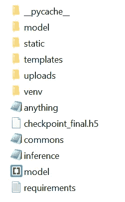
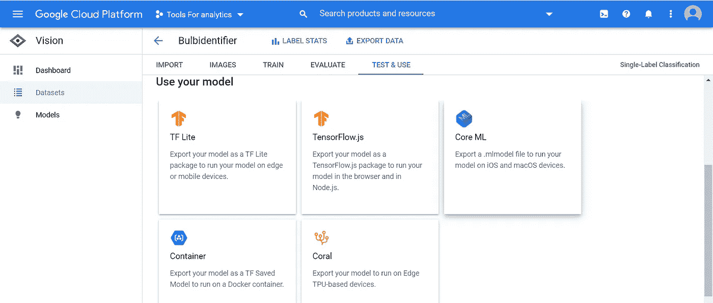
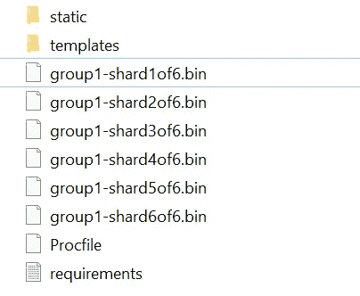
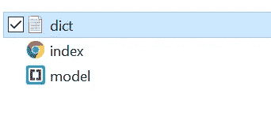
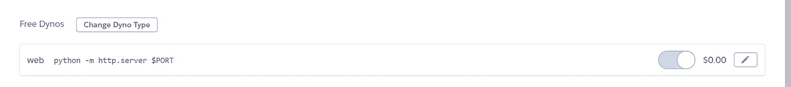
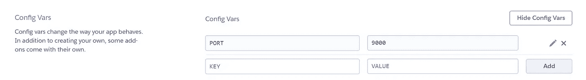

# 从愿景到生产:第 3 部分

> 原文：<https://towardsdatascience.com/from-a-computer-vision-idea-to-an-mvp-deployment-part-3-6d6528809f80?source=collection_archive---------44----------------------->

*你建立了一个 ML 模型——*[*这个*](https://github.com/aditi310896/Bulbdetection/blob/master/Multiclassmodeltrial1.ipynb) *之后，你做什么呢？你如何把它变成可以在网上展示的东西？你如何把它变成其他人可以使用的东西，与之互动，并使之有用？
你部署一下！*

*大多数时候，人们在构建统计模型的阶段结束他们的项目，这可能是数据科学家的典型角色，他们通常不会最终将他们的模型作为开源软件部署到互联网上进行真实世界的测试，因为人们通常认为* ***前端和后端开发*** *会发挥作用(这也是我在这个项目开始时的想法:P)*


图片来源:Pexels

显然有一些更简单的方法可以做到这一点，我将在我的博客中解释。我们使用 Heroku 和 Github 在 web 上部署我们的模型。

这篇文章我们要看什么？
1。使用你编码并从头构建的模型来制作应用。
2。如何整合谷歌模式做 app？
3。在本地机器上部署这两种方法。
5。将模型推送到 Github 并部署在 Heroku 上

为什么是烧瓶？
当我到达这个阶段时，我想先在 GitHub 页面上部署这个模型。GitHub Pages 是一个免费的静态站点托管服务，旨在托管来自 GitHub 库的项目。

当使用 web 应用程序时，我不能使用 GitHub 页面来托管它们。GitHub Pages 只适用于静态网站，而不适用于需要服务器和数据库的动态应用程序。你必须使用云服务，比如亚马逊网络服务来链接 Gitpages。所以 flask 是下一个选择，因为它使用 **Python 作为服务器端语言**，并且确实与模型完美集成。我了解到我可以使用名为 Flask 的框架来使用 Python 作为服务器端语言

## **使用您的编码 CNN:**

使用 Flask 在 Herkou 上部署您的模型以供开源使用。

了解你的应用部署基础知识(如果你想看的话，可以在这里找到官方安装指南！)

建立一个虚拟环境来管理项目的依赖关系是一个好主意。为此，您可以为您的项目设置一个文件夹，然后在您的终端上运行:

```
mkdir myproject
cd myproject
python3 -m venv venv
```

> *我将在这里用 Python 3 做 Windows 上的作品。如果您在 Mac 上工作或运行 Python 2，您可能想看看官方文档，看看您可能需要调整什么来启动和运行。*

接下来，激活您的环境并安装 flask

```
py -3 -m venv venv
pip install Flask
```

要创建一个非常小的 Flask 应用程序，首先要创建一个文件。创建文件并在文本编辑器中打开它。然后打字

```
**from** flask **import** Flask
app = Flask**(**__name__**)**@app.route**(**'/'**)**
**def** hello_world**():**
    **return** 'Hello, there!'
```

上面的代码是做什么的？

首先，我们导入了 Flask 类。接下来，我们创建了该类的一个实例。第一个参数是应用程序模块的名称。如果你使用单个模块，你将使用`(__name__)`以便 Flask 知道在哪里寻找东西。“route”部分告诉 Flask 哪个 URL 应该触发我们的函数。我们给这个函数一个名字，这个名字也用来为这个函数生成 URL，并返回我们希望在用户浏览器中显示的消息。

你可以把这个存成 hello.py 或者 whatever.py 或者任何让你开心的东西。只是**不要存成 flask.py** 因为那会和 flask 冲突。我喜欢用 app.py 作为 flask 的主文件，因为这将是 Flask 以后想要找到的文件。

如果您想运行它，请在您的终端上键入:

```
set FLASK_ENV=development
set FLASK_APP=app.py
```

我在运行`flask run`之前运行这个命令。这将使您处于开发模式。这意味着，当您更改代码时，您的服务器会自动重新加载，而不是每次更改代码时都必须手动重启。当出现问题时，它还会为您提供一个非常有用的调试器！
然后运行:

```
flask run
```

如果一切正常，您会看到类似这样的内容

```
Running on [http://127.0.0.1:5000/](http://127.0.0.1:5000/)
```

现在，您可以将它复制并粘贴到浏览器中。看看有没有用！要关闭它，你可以在终端窗口输入 Control C

您可以通过更改您的 **app.py 文件来轻松传递值。**我的 app.py 文件是这样的:

```
from flask import Flask, request, render_template
app = Flask(__name__)from commons import get_model
from inference import read_image
from inference import time
from inference import test_single_image
#import os
#from werkzeug.utils import secure_filename[@app](http://twitter.com/app).route('/', methods=['GET', 'POST'])
def hello_world():
 if request.method == 'GET':
  return render_template('index.html', value='hi')
 if request.method == 'POST':
  print(request.files)
  if 'file' not in request.files:
   print('file not uploaded')
   return
  file = request.files['file']
  # Save the file to ./uploads in case you want to save uploads
  #basepath = os.path.dirname(__file__)
  #img_path = os.path.join(basepath, 'uploads', secure_filename(file.filename))
  #print(img_path)
  #file.save(img_path)
  bulbimage = file.read()
  print(bulbimage)
  bulbpreds,final = test_single_image(path=bulbimage)
  test_single_image(path=bulbimage)
  return render_template('index.html', bulb=bulbpreds,finalpred=final)if __name__ == '__main__':
 app.run(debug=True)
```

假设我们有了模型。文件，将该检查点放在您的项目文件夹中。

现在我们需要写信获取图像，并将信息发送到模板。首先，您需要一个函数来获取模型并创建您的预测。创建一个 **commons.py** 文件，并编写一个函数来获取模型以及允许您将上传的文件转换为张量的内容。试试这个！

公共文件:

```
import io
import torch
from PIL import Image
from keras import layers
from keras import models
from keras import optimizers
from keras.preprocessing.image import ImageDataGenerator
from keras.preprocessing.image import img_to_array, load_img
from keras.models import load_model
import tensorflow as tfdef get_model():
 global model
 model = load_model('checkpoint_final.h5')
 print("Loaded Model from disk")
 model.compile(loss='categorical_crossentropy',optimizer='adam',metrics=['accuracy'])
 return model
```

确保从其他文件中导入您使用的函数，比如从 commons import get_model 导入**。** 该函数读入图像，转换成 NumPy 格式，并调整图像大小以传入模型。然后它调用 model.predict，后者从 commons.py 文件中获取模型。整理灯泡类并返回预测。

接下来，创建一个**推论. py** 文件。我们需要能够整理出灯泡的名称、类别和标签，所以您可以编写如下内容:

```
rom keras import layers
from keras import models
import numpy as np
from keras import optimizers
from commons import get_model
from keras.preprocessing import image
from keras.preprocessing.image import ImageDataGenerator
from keras.preprocessing.image import img_to_array, load_img
from PIL import Image
import io
#import torchvision.transforms as transforms
import cv2def read_image(file_path):
    print("[INFO] loading and preprocessing image...")
    #print(file_path)
    bulbimage = np.array(Image.open(io.BytesIO(file_path)))
    bulbimage = cv2.resize(bulbimage, dsize=(400, 400))

    #print(bulbimage)
    #my_transforms = transforms.Compose([transforms.Resize(400)])
    #bulbimage=my_transforms(bulbimage)
    #print(bulbimage)
    #bulbimage= load_img(file_path, target_size=(400, 400))  
    #bulbimage = img_to_array(bulbimage)
    bulbimage = bulbimage.astype('float') 
    #bulbimage= np.array(bulbimage).copy() 
    bulbimage = np.expand_dims(bulbimage, axis=0)
    bulbimage /= 255.
    print(bulbimage)
    return bulbimagemodel=get_model()
import time
def test_single_image(path):
    bulbs = ['A19', 'BR2040', 'MR16', 'PAR203038', 'R20', 'T5T8']
    images = read_image(path)
    time.sleep(.5)
    preds = model.predict(images)  
    predictions = {
        "A19":round(preds[0][0],2),
        "BR2040":round(preds[0][1],2),
        "MR16":round(preds[0][2],2),
        "PAR203038":round(preds[0][3],2),
        "R20":round(preds[0][4],2),
        "T5T8":round(preds[0][5],2),}
    print('Final Decision:')
    time.sleep(.5)
    for x in range(3):
        print('.'*(x+1))
        time.sleep(.2)
    class_predicted = model.predict_classes(images)
    #class_predicted.shape()
    class_dictionary= {'A19': 0, 'BR2040': 1, 'MR16': 2, 'PAR203038': 3, 'R20': 4, 'T5T8': 5} 
    inv_map = {v: k for k, v in class_dictionary.items()} 
    result= inv_map[class_predicted[0]]
    #print("ID: {}, Label: {}".format(class_predicted[0], inv_map[class_predicted[0]]))  
    return predictions,result
```

我的 index.html 看起来像:

```
<!DOCTYPE html>
<html>
<head>
<title>Bulb App</title>
<meta name="viewport" content="width=device-width, initial-scale=1"><style>
body {
margin: 0;
font-family: Arial, Helvetica, sans-serif;
}
.hero-image {
background-image: linear-gradient(rgba(0, 0, 0, 0.3),rgba(0, 0, 0, 0.3)), url("/static/image.jpg");
background-color: #cccccc;
height: 800px;
background-position: center;
background-repeat: no-repeat;
background-size: cover;
position: relative;
}
.hero-text {
text-align: center;
position: absolute;
top: 50%;
left: 50%;
transform: translate(-50%, -50%);
color: white;
}
input[type=file] {
width: 100%;
padding: 12px 20px;
margin: 8px 0;
display: block;
width: 200px;
color: white;
justify-content: center;
align-items: center;
text-align: center;
box-sizing: border-box;
border-style: solid white;
border-width: 2px;
border-radius: 2px;
}
input[type=submit] {
width: 100%;
padding: 12px 20px;
margin: 8px 0;
display: block;
width: 200px;
font-size: 1.5em;
color: white;
justify-content: center;
align-items: center;
text-align: center;
box-sizing: border-box;
background-color: #DC143C;
border-radius: 4px;
}
</style>
</head>
<body>
<div class="hero-image">
<div class="hero-text">
<h1 style="font-size:50px">Bulb Classifier</h1>
<h3>Upload a picture of a bulb to see what type it is! </h3><form method ='file' enctype=multipart/form-data>
<input type="file" name="file">
<input type="submit" value="upload"><ul class="actions">
<h4>Predictions: {{ bulb }}</p>
<h5>Final Prediction:{{ finalpred }}</p>
</div>
</div>
</body>
</html> def get_model():
 global model
 model = load_model('checkpoint_final.h5')
 print("Loaded Model from disk")
 model.compile(loss='categorical_crossentropy',optimizer='adam',metrics=['accuracy'])
 return model
```



这是您应该拥有的文件结构。不要担心
静态文件夹包含你在背景中使用的图像。templates 文件夹包含 index.html 文件，您将需要在 Heroku 中进行部署的文件需求，可以通过

该函数读入图像，转换成 NumPy 格式，并调整图像的大小以传递到模型中。然后它调用 model.predict，后者从 commons.py 文件中获取模型。整理灯泡类并返回预测。
看起来很简单，你应该能够上传一张图片并得到一个结果！

现在，如果你想让公众可以使用它，让它对所有人开放。如果您想使用此应用程序部署到 Heroku，请跳到下一节。

# 使用 Auto ML 模型集成到您的 web 应用程序中

使用 AutoML 的`TensorFlow.js`模型格式的过程需要两个步骤:导出模型，然后加载它进行推理。



以下分步说明将帮助您加载任何基于 TF.js 的模型，并在您本地计算机的浏览器中部署您的应用程序，我们将为代码添加一些火花，以将其用作一个应用程序，人们可以上传图像并轻松获得他们的预测。这是一个良好的开端:

[](https://cloud.google.com/vision/automl/docs/tensorflow-js-tutorial) [## Edge TensorFlow.js 教程|云自动视觉文档

### 术语:参见 AutoML Vision Edge 术语页面，了解本教程中使用的术语列表。在本教程中…

cloud.google.com](https://cloud.google.com/vision/automl/docs/tensorflow-js-tutorial) 

> *`*loadImageClassification*`*函数在运行时使用* `*model.json.*`加载模型*
> 
> **`*model.json*`*文件包含了所有* `*.bin*` *模型文件的信息。
> 加载该文件会自动加载 TensorFlow.js* 中的模型**
> 
> ***`*classify*`*功能可应用于图像* `*DOM*` *元素。也就是说你只需要替换这里的 image DOM 元素:* `*const image = document.getElementById('daisy');*` *就可以得到图像预测。****

**基于训练，`classify`函数返回一个 JSON 文件，其中包含了这些类的置信度得分。**

**根据你训练的模型类型，输出模型。JSON 和 bin 文件应该如下所示:**

****

**templates 文件夹包含第二个文件夹中的文件，但是 model.json 文件也可以放在主文件夹中**

****

**如果您没有 git 帐户，您可以在 git 上创建一个帐户，初始化一个存储库并上传存储库中的所有文件夹。
通过键入以下内容将要求归档，您将看到下载的文本文件:**

```
**pip freeze > requirements.txt**
```

**我能够上传模型，将其集成到 Heroku 中，并将其部署在 Heroku 上，而无需使用任何命令行界面。但是，如果您使用的是您编码的模型，则. h5 文件很大，需要通过 CLI 推送到 Github，您需要使用 Git LFS 来推一个大于 25mb 的文件。
您可以在此浏览文档:**

**[](https://git-lfs.github.com/) [## Git 大文件存储

### 下载并安装 Git 命令行扩展。下载并安装后，为您的用户设置 Git LFS…

git-lfs.github.com](https://git-lfs.github.com/) 

如果你想用命令行上传到 Heroku 你可以看这里:

[](https://devcenter.heroku.com/articles/git) [## 使用 Git 部署

### Heroku 使用流行的版本控制系统 Git 管理应用部署。你绝对不需要成为一个饭桶…

devcenter.heroku.com](https://devcenter.heroku.com/articles/git) 

您的 proc 文件应该包含代码

```
python -m http.server $PORT
```

你可以在 Heroku 上自动观看:



按如下方式配置变量:



您已经准备好部署应用程序，只需单击“部署”按钮，您就会看到一个如下所示的链接，其中包含了我们的模型:

https://bulbdetection.herokuapp.com/templates/

您的 web 应用程序已启动并运行！

图片来源:Giphy.com

整个项目可以在我的 Github repo 找到:
数据准备和模型:[https://github.com/aditi310896/Bulbdetection](https://github.com/aditi310896/Bulbdetection)
部署:[https://github.com/aditi310896/wavelengthmodel](https://github.com/aditi310896/wavelengthmodel)**