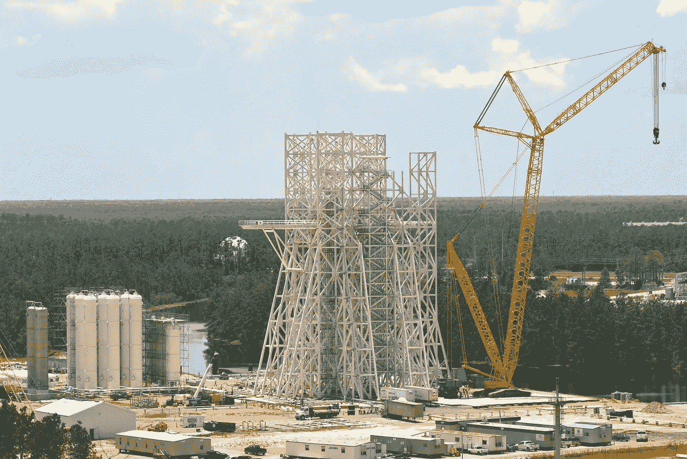
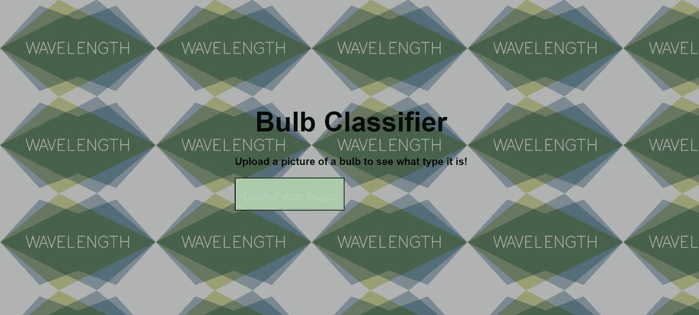
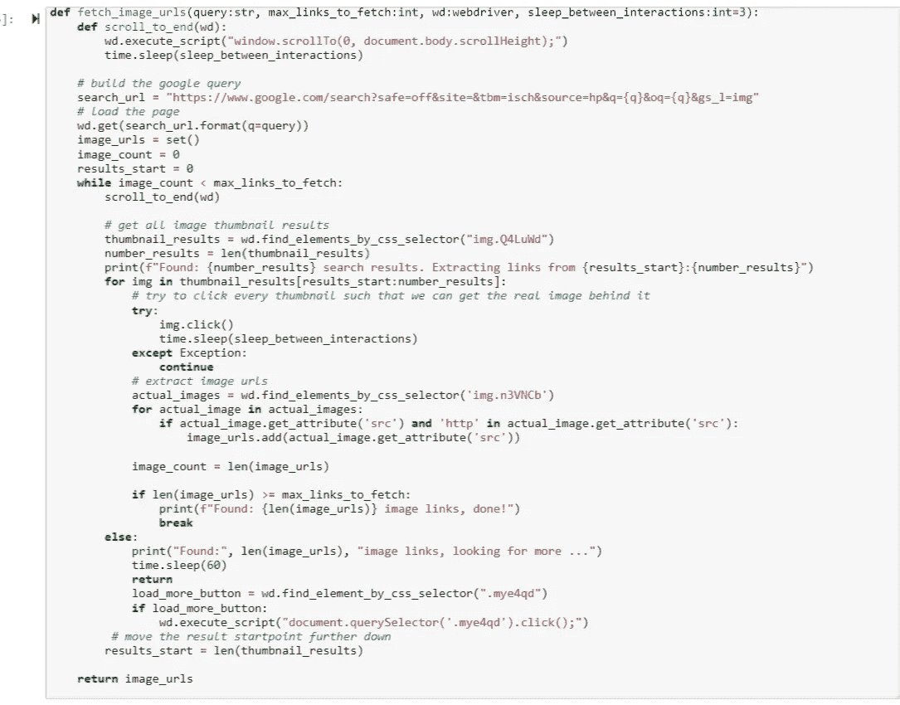
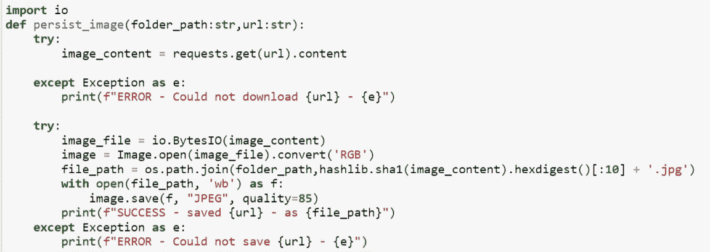
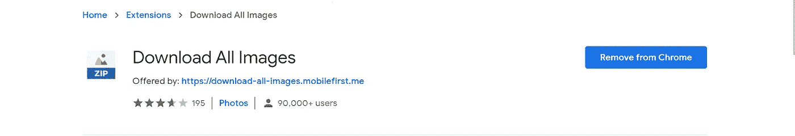
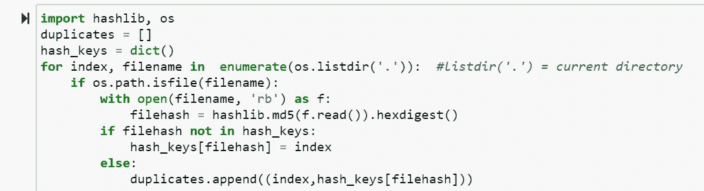
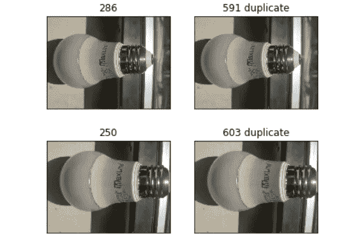

# 从愿景到生产:第 1 部分

> 原文：<https://towardsdatascience.com/from-a-computer-vision-idea-to-an-mvp-part-1-f7be02d78f99?source=collection_archive---------44----------------------->

图片来源: [NASA 开源](https://www.nasa.gov/centers/stennis/images/content/466563main_a-3-06252010.jpg)

> 本系列旨在将您从计算机视觉图像分类问题的第一步带到部署阶段，并让您思考在此过程中您可能想要实现的替代方案和方法！

*数据科学项目的生命周期通常从用例或想法开始，从所有可用的来源收集数据，分析数据并执行功能工程，建立一个统计模型，对未来数据进行良好的概括，然后部署到生产中。部署之后，您需要继续监视以执行度量，并使用新的可用数据重新训练模型。*

在我们开始这个项目之前，这里有一些灵感和我的成果的链接，这里有一些给你们的动力:

【https://bulbdetection.herokuapp.com/templates/ 

作者图片

这篇文章的目的是什么？

1.从谷歌上抓取图片

2.消除重复的问题

3.建议其他更简单快捷的方法来获取图像数据集。

没有我们想要识别的图像的数据，首先求助于谷歌！

训练图像分类器或在任何计算机视觉项目上工作的最乏味的部分之一是收集你将用来训练你的模型的图像。在本文中，我将通过一个简单的过程来指导您快速收集和过滤您的训练图像。

# 硒

[Selenium](https://www.seleniumhq.org/) 可用于自动化 web 浏览器与 Python(以及其他语言)的交互。通俗地说，selenium 假装是一个真实的用户，它打开浏览器，“移动”光标，如果你告诉它这样做，它就会点击按钮。Selenium 背后的最初想法是自动化测试。然而，在自动化基于 web 的重复性任务方面，Selenium 同样强大。

让我们看一个例子来说明硒的用法。事先需要做一点准备。我将用 **Google Chrome 概述 Selenium 的安装和使用。**

**步骤:**

1.  安装谷歌浏览器(如果已经安装，跳过)
2.  识别你的 Chrome 版本。通常通过点击“关于谷歌浏览器”找到。我目前有版本 **77.0.3865.90** (我的主版本因此是 **77** ，第一个点之前的数字)。
3.  从[这里](https://chromedriver.chromium.org/downloads)为你的主版本下载相应的 from 驱动，并把可执行文件放到一个可访问的位置(我用桌面/抓取)
4.  通过 pip install selenium 安装 Python Selenium 包

**启动网络驱动**

运行下面的代码片段(为了便于演示，请在 Jupyter 笔记本上运行)并查看幽灵浏览器是如何打开的。
下面是我写的从谷歌上抓取图片的代码:

作者图片

此功能有助于获取要下载的每张图片的 URL，提取、保存 URL，并使网络驱动程序自动点击 google images 中的“加载更多”按钮，从而可以平滑地抓取图片。
我们需要构建的第二个功能是访问每个 URL 并下载 URL 中的图像。

图片由作者提供

这两个函数用于将所有图像抓取到一个文件夹中，该文件夹包含您正在寻找的所有图像。下面是一个屏幕记录，显示了这些功能是如何工作的，以及每张图片是如何从网上抓取的。一定要看一看！

 [## MR16 —谷歌搜索—谷歌 Chrome 2020–08–18 13–59–02 _ Trim _ Trim . MP4

### 编辑描述

drive.google.com](https://drive.google.com/file/d/1a6c6VXAB_cqx_KwM8KwJS6LuCnp-pWug/view?usp=sharing) 

PROTIP:如果你将照片数量增加到 500 张，那么从网络驱动程序抓取和抛出错误的次数是有限制的。我发现最简单快捷的方法是使用 chrome 扩展下载图片。

你所需要做的就是获得扩展，打开你的浏览器，输入你的谷歌搜索，点击右上角的扩展图标下载图片。将下载一个压缩文件夹。

[https://chrome . Google . com/web store/detail/download-all-images/ifipmflagepipjokmbdecpmjbibjnakm](https://chrome.google.com/webstore/detail/download-all-images/ifipmflagepipjokmbdecpmjbibjnakm)

图片由作者提供

**重复数据删除**

*“如何删除相同大小、相同图像但不同名称的？在数千张图片的数据清理过程中。”*

如果您曾经尝试过手动构建影像数据集，您应该知道数据集中很可能会有重复的影像。
在你的数据集中有重复的图像会产生问题，原因有两个*:
它 ***将偏差*** 引入到你的数据集中，给你的深度神经网络额外的机会来学习模式*特定的*到重复的图像，这损害了你的模型将 ***推广*** 到它所训练的图像之外的新图像的能力。
通常，通过
从多个来源(例如，Google、Bing 等)抓取图像，您的数据集中会出现重复的图像。)或合并现有数据集(例如将 ImageNet 与 Sun397 和室内场景相结合)
当这种情况发生时，您需要一种方法:
**检测**您的数据集中有重复的图像，并删除重复的图像。*

下面是删除重复图片的代码，删除文件夹中所有重复的图片。

由作者提供

该函数初始化一个名为 duplicates 的空列表和一个空字典 hash_keys。然后，它打开并读取每个文件，为文件夹中的每个文件创建一个哈希值。

“md5”算法用于生成哈希值(32 位字符)。“hexdigest()”函数用于创建每个文件的哈希值。如果 file_hash 不在我们的 hash_keys 中，则给出 file_hash 的索引，否则将重复值附加到名为 duplicates 的列表中。

图片由作者提供

现在我们已经准备好了图片，我们需要把它们组织成一个可用的格式，然后开始制作模型！

抓取和重复数据删除的完整代码可以在我位于 https://github.com/aditi310896/Bulbdetectio T21 的 GitHub 仓库中找到