# 从设想到生产:第二部分

> 原文：<https://towardsdatascience.com/from-a-computer-vision-idea-to-an-mvp-the-model-part-2-acca969ef56b?source=collection_archive---------46----------------------->

## 这篇文章是多类模型第 1 部分的延续


图片来源:Pexels

本文讨论了为多级灯泡分类而建立的模型。

> 这篇文章我们要看什么？
> 1。在 Google Collab/Jupyter Notebook 上从头构建一个多类分类器
> 或者，你可以使用 Google 的 Auto ML 软件构建一个模型作为验证指标，或者直接使用 Google 模型
> 2。使用 Google Auto ML 模型验证模型。
> **此步骤要求您拥有一个 Google cloud 帐户，以便在云上训练您的模型，或者您可以使用我们从头开始训练的模型进行部署。

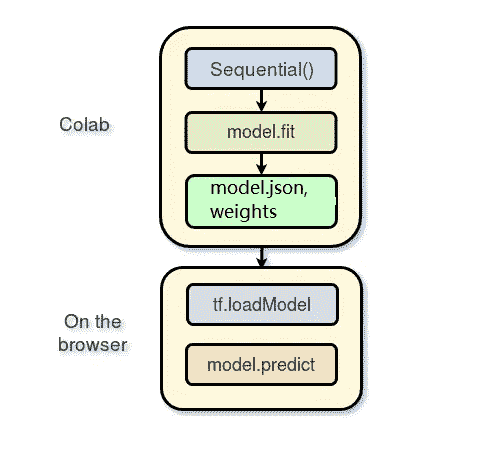

作者图片

我们的目标是做多类图像分类，其中的目标是分类的灯泡类型的图像属于 6。

由于这是一个新问题，还没有尝试过，我被告知从单一标签分类开始，我们从确定图像是否是 MR16 灯泡开始。下图表示预测值和实际值，其中 0 为 MR16，1 为其他。

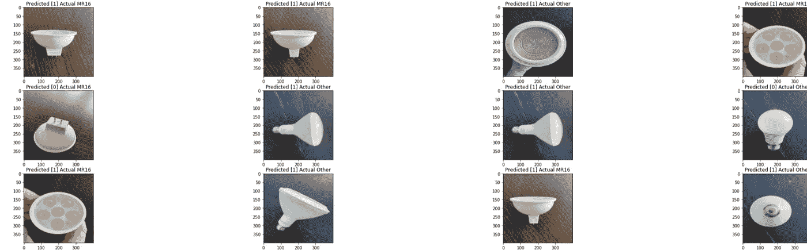

作者图片

我使用 Google collaboratory 是因为它利用了 GPU 的使用，这将帮助您训练模型的速度比本地机器快 10 倍。你可能想把你的谷歌 collab 升级到专业版，以增加它的内存，并帮助它在你的屏幕关闭时不会断开连接。

训练验证和测试分割
训练:6003 张图像
验证:266 张图像
测试:383 张图像
由于我们有一个大型数据集，我们有足够的图像来验证和测试它，因此大多数图像都放在训练集中。

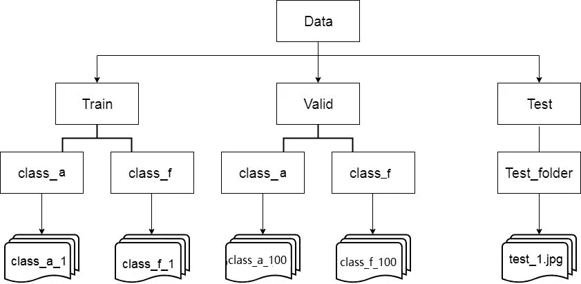

作者图片

这是训练集和验证集的结构，两者都应该具有类似的结构，每个标签都有一个文件夹，其中包含如上所述的相同图像。

正如您在上面的图片中所看到的，test 文件夹还应该包含一个单独的文件夹，所有的测试图像都在这个文件夹中(可以把它想象成“未标记的”类，这是因为 **flow_from_directory()** 期望在给定的目录路径下至少有一个目录)。

这些类的文件夹名很重要，用各自的标签名来命名(或重命名)它们，以便于以后使用。
一旦你把图片设置成上面的结构，你就可以开始编码了！

可视化数据:


作者图片

这是我最初试图分类的 6 类球茎。我首先检查了每个标签有多少张图片，以确保我的数据集是平衡的。

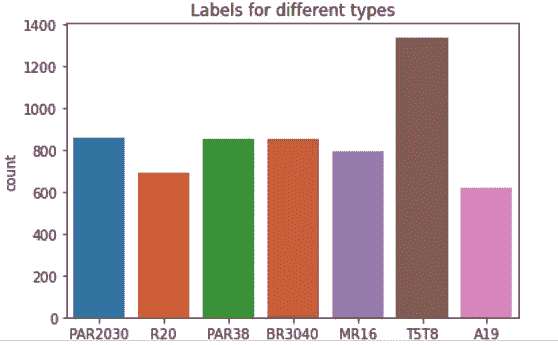

作者图片

检查每个标签有多少张图片，以确保数据集是平衡的。

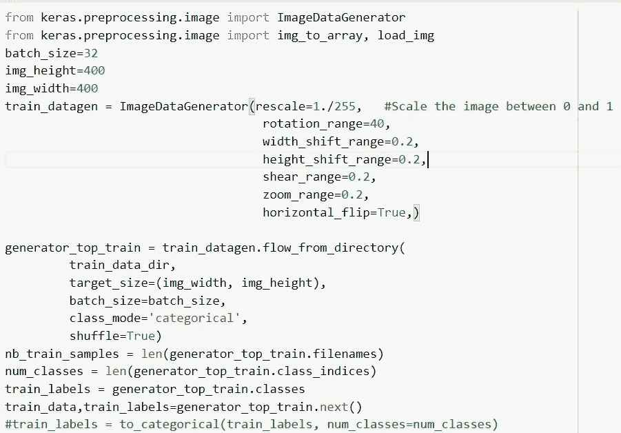

作者图片

类别 mode = categorical 执行一键编码并存储标签。

*   必须将**目录**设置为您的“n”类文件夹所在的路径。
*   **target_size** 是你输入图像的大小，每张图像都会被调整到这个大小。
*   **batch_size:** 每批从生成器生成的图像数量。
*   **class_mode:** 如果只有两个类需要预测，则设置为“binary”，如果没有设置为“categorical”，则在开发自动编码器系统时，输入和输出可能是同一个图像，在这种情况下设置为“input”。
*   **shuffle:** 如果您想要打乱正在生成的图像的顺序，则设置 True，否则设置 False。
*   **种子:**随机种子，用于应用随机图像增强和打乱图像的顺序。

让我们看看 class _ mode = categorical 从生成器中出来时做了什么？

我花了一段时间来了解生成器的输出以及它是如何存储图像和标签的，没有相关的文档，如下所示:

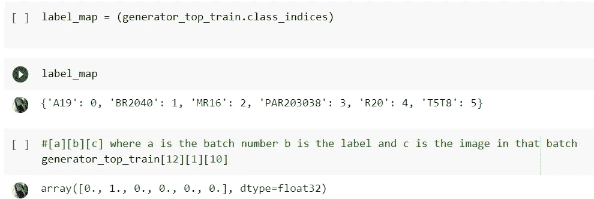

作者图片

要知道数据的组织方式是每批有 32 张图片。图像存储时图像中显示的标签为[a][b][c]其中:
[a]=图像的批次号[b]= b 取值 0 和 1 其中[a][1][c]存储图像的标签，[a][0][c]存储图像本身。[c]=该批次中的图像编号。

刚接触计算机视觉的人问过我好几次，**CNN 的每一层都学到了什么？** 下图显示了 CNN 每一层从图像中挑选和学习的内容。

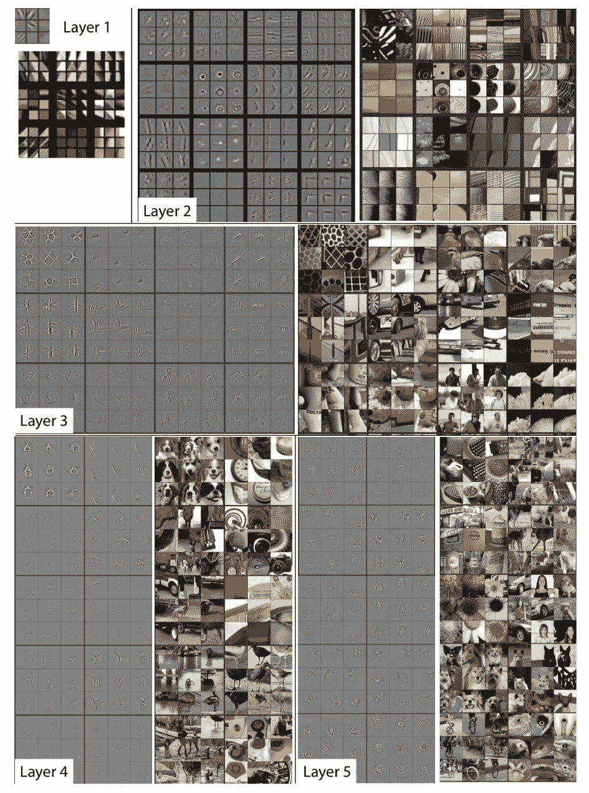

来源:https://arxiv.org/pdf/1311.2901.pdf

现在我们创建我们的模型。第一步是用 Sequential()初始化模型。之后，我们展平我们的数据，并添加额外的 3 个(或更多)隐藏层。这一步是完全可定制的你想要的。我们制作了几个不同的模型，有不同的漏失、隐藏层和激活。

对于多类分类，最后一个密集层必须有几个与类数量相等的节点，然后是`softmax`激活，即你的模型的最后两层应该是:

```
model.add(Dense(num_classes))
model.add(Activation('softmax'))
```

损失最好也是分类交叉熵。我尝试了各种迁移学习模型，包括 ResNet、VGGnet 和 Inception，因为这些模型因其性能和特定的架构创新而广泛用于迁移学习。我试着转动这些模型的最后几层，但它们似乎没有给出更好的结果，因此，我认为它们不适合区分我使用的图像类型(即不同类型的灯泡)

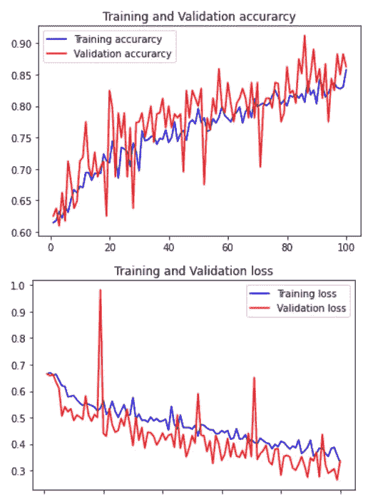

作者图片

然后，在我创建并编译了我们的模型之后，我们将我们的训练和验证数据与我们之前提到的规范相匹配。最后，我们创建一个评估步骤，来检查我们的模型训练集相对于验证集的准确性。

这是我们的模型，现在训练数据，然后验证它。一个时期是模型在我们整个数据集上训练的次数。一批可以解释为少量摄入，训练，多摄入一些。在进入下一个时段之前，每个时段必须完成所有批次。用太少的历元训练会导致数据拟合不足，而用太多的历元训练会导致数据拟合过度。你也希望损失尽可能低。下面的图片将显示我们的数据集的准确性和损失。

下图显示了我们刚刚制造的机器对未知数据的预测能力。注意，它说它在 test_data 上进行测试。准确性是第二个数字。然而，这不是检查我们的机器性能的唯一方法。有两种很好的方法可以检验你的机器预测或分类的能力。其中一个是分类度量，另一个是混淆矩阵。
我们的分类指标显示，我们的模型对所有图像类别都具有相对较高的精确度，让我们知道这是一个有效的模型

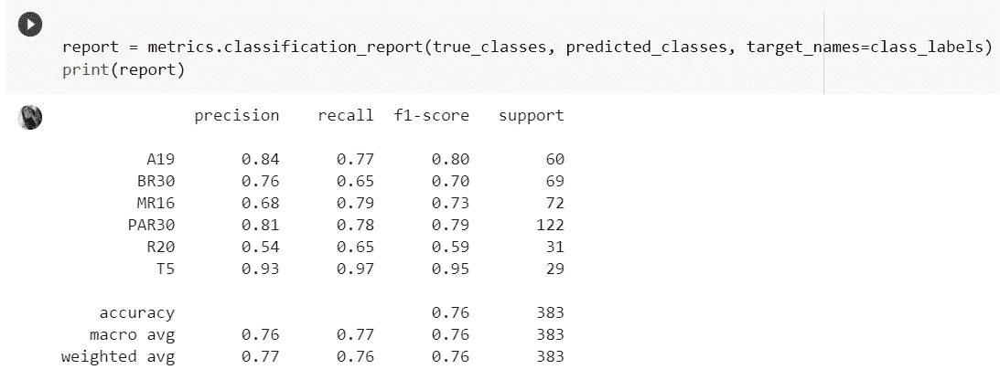

作者图片

为了使用分类度量，我们必须将测试数据转换成不同的 NumPy 格式，NumPy 数组，以便阅读。这就是第一行代码所做的一切。第二个单元块接收转换后的代码，并通过内置的分类指标运行它，从而给我们一个整洁的结果。请注意，由于我们的生成器函数，我们不需要在这里手动标记我们的类，因为我们在接受输入时设置了 class = categorical。这里重要的因素是精确度和 f1 分数。分数越高，你的模型越好。

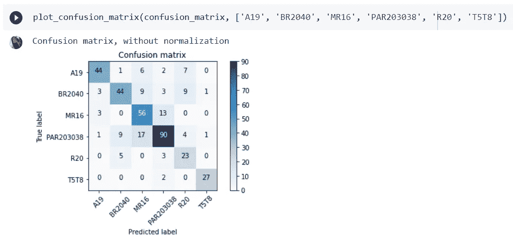

作者图片

正如我们在标准化数据中看到的，我们的机器非常擅长对灯泡进行分类。MR16 被误归类为 PAR203038，很可能是因为它们的结构相似。此外，PAR203038 可能因为同样的原因被误划为 MR16。

最后一个阶段是对图像进行测试。下面的单元块将实现这一点:

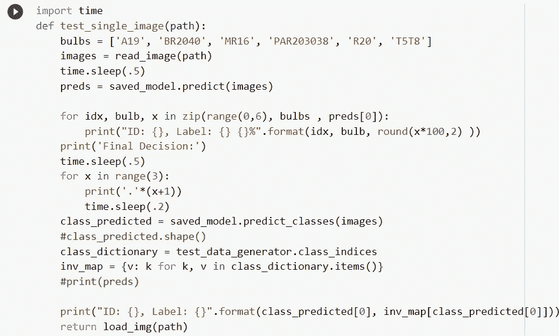

作者图片

*第一个 def 函数*是让我们的机器知道它必须加载图像，改变大小，并将其转换成一个可以在 GitHub 访问的数组。第二个*定义函数*使用预测模型和迭代函数来帮助正确预测图像。*路径*是我们定义图像位置的地方，最后， *test_single_image* 单元块将打印出最终结果，这取决于第二个单元块的预测。
这是我们的模型给出的最终结果:

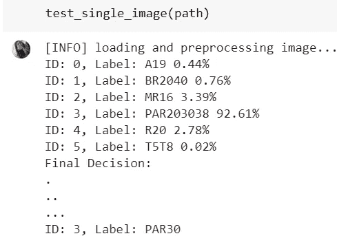

作者图片

**PRO HACK** :你可以直接使用 Google Auto ML 模型来训练数据，然后尝试将模型权重和 model.json 融入到我们尝试构建的应用中。

在进行这个项目时，我遇到了谷歌的 Auto ML 软件，由于我能够获得 78%的准确性，即使在尝试了不同的转移模型和调整超参数后，我决定通过用 Auto ML 模型训练我的数据来验证我的模型。

[AutoML](https://cloud.google.com/automl/) 是一套机器学习产品，使机器学习专业知识有限的开发人员能够针对他们的业务需求训练高质量的模型。这是一个可以设计神经网络的神经网络。

我将分享我如何使用*[Google Cloud AutoML Vision Edge](https://cloud.google.com/vision/automl/docs/)从零开始训练一个定制的机器学习模型。*

*您可以在以下位置了解更多关于 [google edge](https://cloud.google.com/vision/automl/docs/edge-quickstart) 计算机视觉自动 ml 模型的信息:
我不想让教程变得冗长，并记录上面做得很好的训练您的视觉 edge 模型的步骤！*

*一旦我们准备好一个干净的数据集，我们就可以开始设置我们的谷歌云项目。*

*1.我们可以按照这个指南来创建一个谷歌云项目:*

*[](https://cloud.google.com/dataproc/docs/guides/setup-project) [## 设置项目| Dataproc 文档| Google 云

### 登录您的 Google 帐户。如果您还没有帐户，请注册一个新帐户。在云控制台中，在…

cloud.google.com](https://cloud.google.com/dataproc/docs/guides/setup-project) 

2.下一步是在 [AutoML](https://cloud.google.com/automl/) 页面上创建我们的数据集。这里，正如您在快照中看到的，我们将使用单标签分类。当图像属于一个类别时，使用单标签分类。在我们的灯泡识别问题中，每个图像将被标记为六个标签中的一个，即单类标签。在多标签分类中，一幅图像可以同时属于多个类别。

这个视频很好地解释了你如何在 Auto ml 中上传和训练你的数据，并带你一步一步地通过它。

**3。导入所有图像**

在这个初始项目设置之后，我们将使用“导入”按钮，导入狗和猫的文件夹以及它们各自的图像。

> *注意:最佳实践是将所有输出图像上传到 Google 云存储桶，然后从 AutoML 仪表板导入该桶。*

上传后，我们可以在“图片”标签下看到所有的图片。这是你的数据上传后的样子，我建议你上传不同类别的 zip 文件夹到你的 bucket 中，这有助于这个过程更加高效和方便。

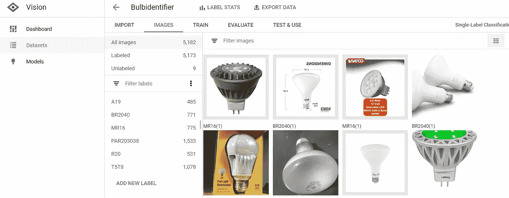

作者图片

**4。开始模型训练**

一旦你看到你的图像反映在 AutoML 仪表板，你训练你的模型。

使用 AutoML 训练该模型非常容易——转到`Train`选项卡并单击`Train New Model`。培训完成后，我们会收到电子邮件通知。

在训练之前，您应该决定您的模型将如何被使用—作为 API(在线预测)还是在边缘设备上(离线预测)。在线预测是测试结果的最佳方式，或者如果您希望通过 AutoML API 直接使用模型，也是最佳方式。它们更准确。离线模式节省了大量成本，可以在设备上运行。它们通常体积较小，可以在没有互联网连接的情况下运行。我们使用边缘设备，因为我对制作一个可以在任何机器上运行的应用程序感兴趣。

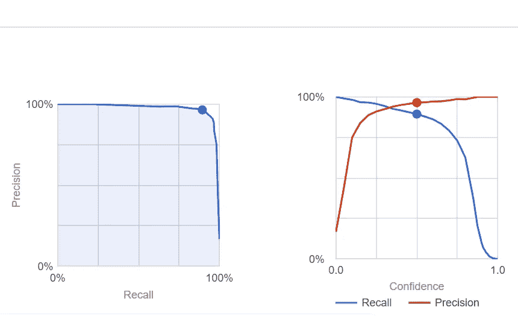

作者图片

对于模型的评估，我们知道精度指的是相关结果的百分比。另一方面，召回指的是被你的算法正确分类的总相关结果的百分比。
查看我们的灯泡分类器的召回率和精确度值。


作者图片

经过训练后，模型可以以 AutoML 提供的各种格式消费，如`TF Lite`、`Core ML`、`Tensorflow.js`等集装箱出口格式。
[TensorFlow.js](https://www.tensorflow.org/js) 是一个帮助在浏览器中直接使用 ML 的库。AutoML 创建模型只需很少的时间，TensorFlow.js 是直接在浏览器中运行模型的最简单、最有效的方法。

*这是一个有趣的问题，众说纷纭，比如浏览器广泛存在于所有设备中，无论是台式机、平板电脑还是手机。因此，浏览器中的 ML 可以产生很大的影响。从用户的角度来看，ML 模型可以很容易地在浏览器中建立，不需要任何驱动程序、库等。所有数据都保存在用户的设备上，不需要将数据发送到服务器。*

使用 AutoML 的`TensorFlow.js`模型格式的过程需要两步:导出模型，然后加载进行推理。


作者图片

下面的分步说明将帮助您将任何基于 TF.js 的模型加载到浏览器中。
单击 Tensorflow.js 框后，它会下载如下所示的 bin 文件，这是您准备好部署后的目录外观。


作者图片

模型导出后，您会看到一个`model.json`文件，它包含张量信息以及权重文件名和包含模型权重的文件。将 bucket 中的所有文件下载到您的本地系统。

我们将介绍创建一个部署在 Heroku 中的 web 应用程序的过程，该应用程序可以由网络上的任何人使用，但是这里的说明是一个很好的尝试起点。

[](https://cloud.google.com/vision/automl/docs/tensorflow-js-tutorial) [## Edge TensorFlow.js 教程|云自动视觉文档

### 术语:参见 AutoML Vision Edge 术语页面，了解本教程中使用的术语列表。在本教程中…

cloud.google.com](https://cloud.google.com/vision/automl/docs/tensorflow-js-tutorial) 

Github 链接可以在:
[https://Github . com/aditi 310896/bulb detection/blob/master/multiclassmodeltrial 1 . ipynb](https://github.com/aditi310896/Bulbdetection/blob/master/Multiclassmodeltrial1.ipynb)*