# 用 PyTorch 从 LSTM 细胞到多层 LSTM 网络

> 原文：<https://towardsdatascience.com/from-a-lstm-cell-to-a-multilayer-lstm-network-with-pytorch-2899eb5696f3?source=collection_archive---------8----------------------->

## 用 PyTorch 的实际例子理解 LSTM 单元的基础的指南

[Pixabay](https://pixabay.com/?utm_source=link-attribution&utm_medium=referral&utm_campaign=image&utm_content=73353)

> 如何只用 LSTMCells 构建多层长短期记忆神经网络？

这篇博客的目的是展示 PyTorch 中 LSTMCell 类的实际应用。众所周知，PyTorch 提供了一个 LSTM 类来建立基于 LSTMCells 的多层长短期记忆神经网络。在这篇博客中，我们将通过一个实际的例子来解释如何使用 LSTMCells 手工构建这样一个神经网络。

博客组织如下:

*   **简介**
*   **LSTM 牢房**
*   来自 PyTorch 的 LSTMCell 类
*   **多层 LSTM**

# 介绍

LSTM 网络是一种递归神经网络。众所周知，这些类型的神经网络能够正确处理可以表示为序列的数据，例如文本、音乐、频率、时间序列等。LSTM 架构的一个主要特征是它包含*门*，门的功能是*保存*有意义的信息以及*忘记*无用的数据。然而，重要的是要提到 LSTMs 在训练时往往*慢*，本质上是因为要更新的参数数量。

如果你想深入研究 LSTM 核心，请看看这个惊人的资源:[了解 LSTM 网络](https://colah.github.io/posts/2015-08-Understanding-LSTMs/)。

如果你想避开 LSTM 细胞结构的机制和它内部的工作方式，你可以直接跳到 PyTorch 的 **LSTMCell 类或者进入**多层 LSTM。****

# LSTM 细胞

首先，让我们了解一下 LSTM 细胞的机制。LSTM 单元主要由*遗忘、输入*和*输出门*以及*单元状态*3 个门组成。那么，让我们来发现*“忘记”*“输入”*“输出”是什么意思。*图 1 显示了 LSTM 单元的架构。

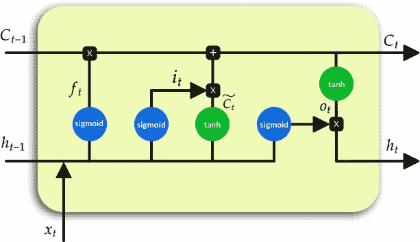

图一。LSTM 细胞

**遗忘门**决定哪些信息是不相关的，不应该考虑。**遗忘门**由之前的隐藏状态 *h(t-1)* 和当前时间步长 *x(t)* 组成，其值由 *sigmoid* 函数过滤，这意味着接近 0 的值将被视为要丢弃的信息，而接近 1 的值被视为值得保留的有用信息。然后，根据**遗忘门**用要保持的信息更新**单元状态**。图 2 突出显示了构建**遗忘门**所遵循的操作。等式 1 显示了**遗忘门**的数学表示。

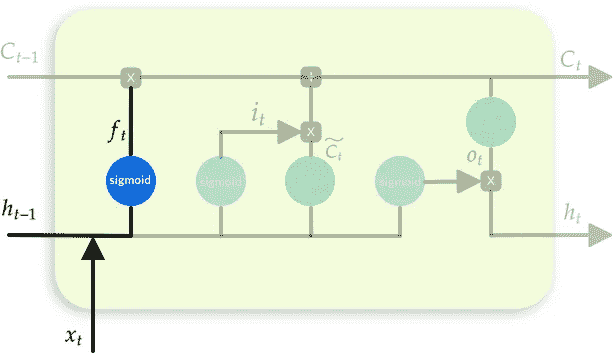

图二。忘记大门

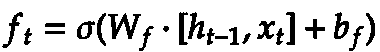

等式 1。忘记大门

**输入门**决定什么信息应该是单元状态的一部分(LSTM 的存储器)。它由先前的隐藏状态 *h(t-1)* 和当前的时间步 *x(t)* 组成。**输入门**考虑两个函数，第一个函数通过 *sigmoid* 函数过滤先前的隐藏状态和当前的时间步长。第二个通过 *tanh* 函数过滤先前的隐藏状态和当前的时间步长。因此，在更新**单元状态**之前，两个输出(一个来自 *sigmoid* 功能，一个来自 *tanh* 功能)一起操作，其想法是 *sigmoid* 输出将确定来自 *tanh* 输出的哪些信息对于保持**单元状态**是重要的。图 3 突出显示了构建输入门所遵循的操作。等式 2 显示了**输入门的数学表示。**

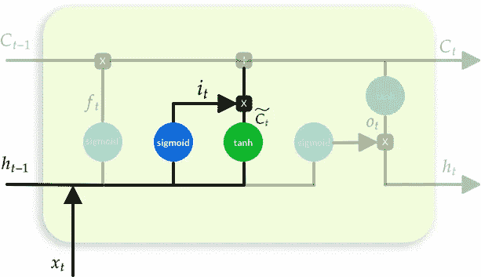

图 3。输入门

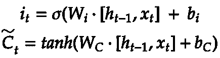

等式 2。输入门

到目前为止，我们已经讨论了**忘记门**以及**输入门**。现在是时候介绍**单元状态了。**

**单元状态**被称为 LSTM 的*存储器，它由**遗忘门**和**输入门更新。**本质上来说，**遗忘门**定义了不应保存在存储器中的内容，而**输入门**定义了应保存在该存储器中的内容。图 4 突出显示了更新**单元状态的过程。**等式 3 显示了**单元状态的数学表示。***

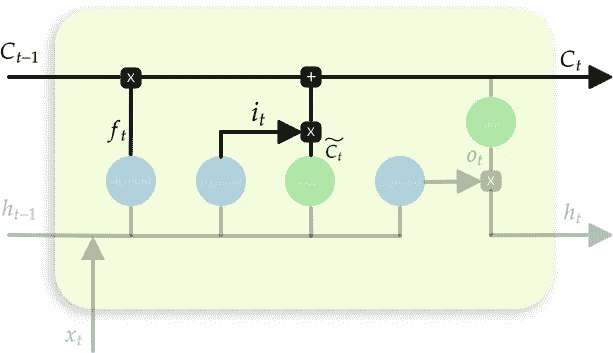

图 4。细胞状态

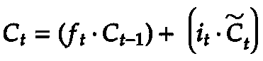

等式 3。细胞状态

最后，我们有**输出门**，其结果产生新的**隐藏状态。****输出门**利用先前的隐藏状态以及当前的时间步长，其值由 *sigmoid* 函数过滤。并行提取当前单元状态，由 *tanh* 函数过滤，两个输出一起操作，以生成新的**隐藏状态。**图 5 突出显示了构建**输出门的过程。**等式 4 和等式 5 分别给出了**输出门**和**隐藏状态**的数学表达式。

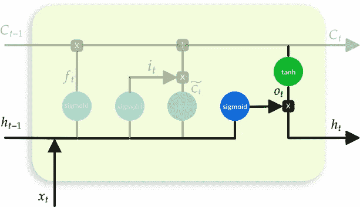

图 5。输出门和隐藏状态

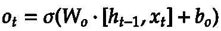

等式 4。输出门

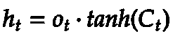

等式 5。隐藏状态

# PyTorch 的 LSTMCell 类

到目前为止，我们已经看到了 LSTM 细胞的工作原理及其组成部分。现在是时候看看如何将 PyTorch 的实际输入调整到 LSTMClass 中了。

先来了解一下初始化 LSTMClass 时的输入输出参数是怎样的，以及使用初始化对象时的输入输出参数是怎样的。

为了被初始化，LSTMCell 类需要两个重要的参数

*   **input_size:** 指每个时间步的特征数量
*   **hidden_size:** 指的是在 LSTM 单元内的每个函数中要学习的参数的数量(即，它是每个 *W* 向量的大小，该向量复合了每个门以及单元和隐藏状态)

初始化后，LSTMClass 创建的对象接收三个输入:

*   **输入**:包含待学习特征的张量。这个张量有一个形状( *batch* ， *input_size* )，其中 *batch* 指的是批量大小， *input_size* 指的是每个时间步包含的特征个数。
*   **h_0** :张量，将存储学习到的**隐藏状态**。这个张量有一个形状(*批量，*隐藏 _ 大小
*   **c_0:** 张量，它将存储**单元状态**(LSTM 的存储器)。这个张量有一个形状(*批量*，*隐藏 _ 大小*)。

图 6 突出显示了**输入***【t】***隐藏状态***(t-1)*和 *h(t)* 以及**单元格状态***(t-1)*和 *C(t)* 的矢量形状。

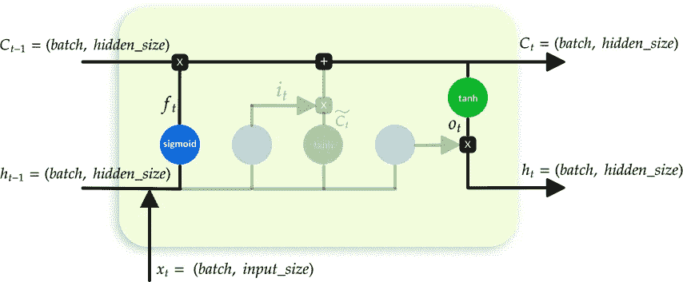

图 6。突出显示矢量形状。

正如我们已经知道的，LSTMs 处理顺序数据。所以让我们用一个简单的例子来理解如何顺序地给 LSTMCell 馈电(即如何展开 LSTM 网络)。

假设我们有一个句子*“天空是蓝色的”，*我们想把它引入 LSTM。因此，我们需要将这些*单词*转换成神经网络可读的格式。我不得不说，为了将单词转换成一种 *LSTM 可读的格式* t，有很多选择，因为这些选择超出了本博客的范围，我将限制自己选择一个最常见的选择，那就是*单词标记化*。

因此，为了将单词编码成 LSTM 可读的格式，我们首先需要将句子分割成一组单词(*单词标记)*，然后我们需要将每个*单词标记*转换成*索引标记形式。*之后，我们需要使用一个嵌入器层，以便将每个*索引令牌*转换成一个嵌入向量。至此，我们已经拥有了为 LSTM 提供数据所需的一切，我们只需要将序列组织成一组时间步长，其中每个时间步长都将被分配一个批处理大小。

假设我们想要创建一组 2 个时间步长，其中每个时间步长包含 2 个批量大小，我们将有 2 个输入张量，每个张量都有一个形状( *batch_size = 2* ， *input_size = 2* )，其中 *batch_size* 指的是每个时间步长的样本数， *input_size* 指的是嵌入维数。图 7 直观地解释了上述过程。

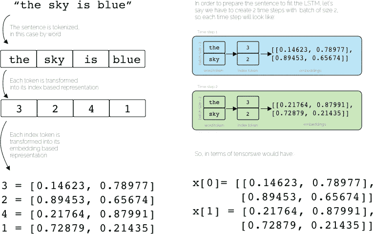

图 7。从原始句子到张量格式的可视化表示。

因此，为了向 LSTM 网络提供顺序数据，我们需要创建一个循环，其中每次迭代都将向当前 LSTM 单元提供一个具有 shape ( *batch_size* ， *input_size* )的时间步长。因此，就前面的例子而言，每个时间步长将包含批量大小 2 和输入大小 2。在图 8 中，上面的图像通过使用基于单词标记的表示来表示展开的版本，中间的图像通过使用基于索引标记的表示来表示展开的版本，按钮图像通过使用基于嵌入的表示来表示展开的版本。(三个图像是等效的，顶部和中间的图像仅用于说明)。

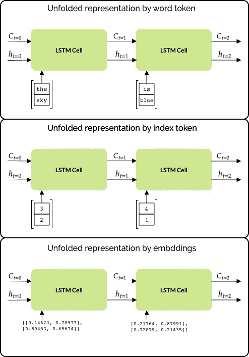

图 8。展开的版本

是时候看看代码了。在 PyTorch 中，建议在构造函数中定义设置和层。因此，就上面提到的玩具示例而言，代码片段 1 显示了初始化应该如何进行。

代码片段 1。构造器

值得一提的是两个重要方面，第一个是嵌入层作为输入参数接收的 *input_size* ，注意它指的是词汇量，在这个玩具示例中我们只有 4 个单词，这意味着词汇量是 4。第二个重要的方面是 LSTMCell 接收的输入大小参数，注意它的大小是 *embedding_dim* ，在本例中是 2(与上面的例子完全一样)。

一旦我们准备好了构造函数，我们需要在*转发函数中工作。*首先，我们需要创建并初始化**单元格状态**以及**隐藏状态**，例如:

代码片段 2。单元格和隐藏状态初始化

在第 3 行和第 4 行中，**隐藏的**和**单元格状态**分别被初始化，两者都有一个形状( *batch_size* ， *hidden_dim* )。紧接着在第 7 行和第 8 行，两种状态都被初始化(在这种情况下，我使用 X *而不是普通的初始化*，不过你可以选择你认为合适的那个)。

一旦我们初始化了**隐藏的**和**单元格状态**，我们就可以将每个索引令牌转换成基于嵌入的表示，例如:

代码片段 3。从索引标记到嵌入张量

这里，嵌入层接收包含索引标记的张量作为输入，因此 *out* 变量被赋予具有形状的嵌入值的张量( *batch_size，embedding_dim)。*

现在，一切都准备好了，以饲料 LSTM，然而在这样做之前，我们需要适应的形状*出*张量。我们只需要将第一维定义为时间步长的数量，因此我们继续执行以下操作:

代码片段 4。重塑张量

所以现在我们的 *out* 张量有了一个形状( *sequence_len，batch_size，embedding_dim)。*好了，是时候展开 LSTM 网络了:

代码片段 5。展现 LSTM

正如我们所观察到的，在循环中，我们用当前时间步长(即 *out[i】)来填充 LSTM 单元。*同样，通过该循环，**隐藏状态**和**单元状态**被更新“I”次，其中“I”表示时间步长为时间“I”。

那么现在让我们来看看完整的*前进函数:*

代码片段 6。正向功能

# 多层 LSTM

现在，如果你想堆叠 LSTM 细胞，以建立一个多层 LSTM？图 9 显示了一个 2 层 LSTM 网络的简单架构。

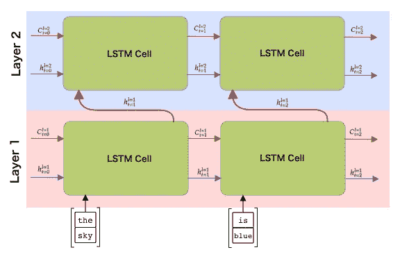

图 9。多层 LSTM

我们首先需要做的是在构造函数中初始化第二个单元(如果你想构建一个“n”堆叠的 LSTM 网络，你需要初始化“n”个 LSTMCell)。

代码片段 7。细胞初始化

因此，我们需要为每个 LSTM 层初始化**隐藏**和**单元状态**。

代码片段 8。权重初始化

现在是时候养活 LSTM 网络了。第一层将接收包含每个单词的每个标记的嵌入版本的输入张量。第二层将在时间步长“t”接收 LSTMCell 的**隐藏状态**作为输入。

代码片段 9。展开 LSTM 网络

所以基本上就是这样！

紧接着，如果你想使用 LSTM 网络的最后一个**隐藏状态**，你应该使用最后更新版本的**隐藏状态层 2。**

因此， *forward* 函数应该是这样的:

代码片段 10。正向功能多层 LSTM

# 结论

这篇博客解释了 LSTM 网络背后的数学原理，特别是 LSTM 细胞是如何工作的。同样，还解释了如何实现 LSTMCell 类以及如何准备数据，以便仅使用 LSTM 单元构建 LSTM 神经网络和多层 LSTM 网络。

了解幕后的机制总是很重要的，这次我们分解了 LSTM 的组件，以及这些组件是如何用当今最流行和强大的深度学习框架之一 PyTorch 实现的。