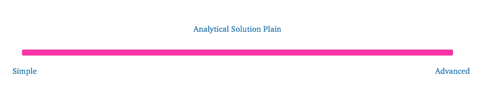
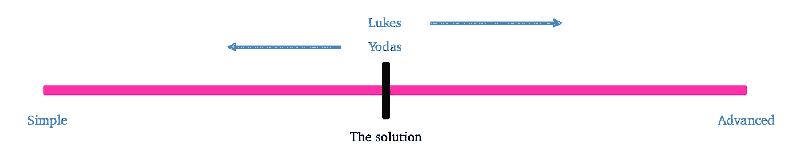
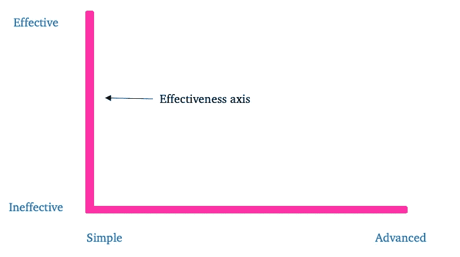
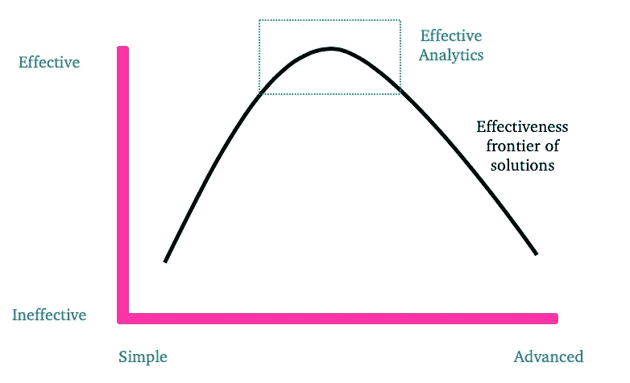

# 从高级分析到有效分析

> 原文：<https://towardsdatascience.com/from-advanced-to-effective-analytics-6fb8611ee627?source=collection_archive---------61----------------------->

[张家瑜](https://unsplash.com/@danielkcheung)在 [Unsplash](https://unsplash.com/?utm_source=medium&utm_medium=referral) 上拍照

## 了解并协调数据驱动型企业中的 Lukes 和 Yodas 的途径

在过去的十年里，企业的决策方式发生了根本性的转变。获胜的组织已经从一个个人经验和直觉为王的环境，转变为一个数据驱动的世界，在这个世界中，决策得到可量化的历史证据的支持。我们现在正处于下一次变革的边缘，即从简单分析到高级分析的转变。这种变化，像其他任何变化一样，需要在宏观和微观层面上提出发人深省的问题。转型领导者应该问的一个关键问题是，“从简单到高级分析的转变有意义吗，或者我们应该考虑另一条路线？”

随着在线课程的激增，高度宣传的成功和媒体的大肆宣传，高级分析(以各种形式营销)作为商业的下一步发展已经占据了中心舞台。这种宣传有积极的一面，因为以前认为数据价值不大的企业开始信任数据，并从中获益。然而，硬币的另一面并不那么闪亮。大肆宣传也造成了预期，让企业感到沮丧，许多员工失去了动力。

为了增加销售额和信任度，企业已经跳上了“站在人工智能和分析的最前沿”的潮流*。*这种策略是否能成功促进销售尚不清楚，但它确实为新的、有分析天赋的资源加入业务创造了期望。为了简单起见，我将这些资源称为“Lukes”。许多卢克加入了人工智能驱动的企业，希望“伸展四肢”，建立最新和最伟大的预测模型(这是可以理解的，因为这些模型在技术上很有趣，并增加了你的街头信誉)。不幸的是，卢克没有意识到需要进行的培训，也没有意识到他们在商业中的核心技能似乎是不切实际的。这导致了卢克内部的沮丧和消极情绪。随着业务资历的增加，技术理解能力的下降加剧了挫折感。

不管企业如何推销他们的分析能力，其中有一个共同的事实。企业希望从他们的数据中获得可操作且可信的见解。很少重视所使用的方法或技术。相反，当从数据中提取的洞察力允许卓越的解决方案时(特别是在竞争激烈的市场中)，真正的价值来自于分析能力。当考虑在成功的数据驱动环境中运营的企业时，您会发现一些企业领导者特别擅长以最小的复杂性提取这些见解。从现在开始，我将称这些领导人为“Yodas”。

为了抑制挫折感，卢克斯获得了解决问题的极大自由，而商业领袖期望从他们的解决方案中获得有限的价值。这种方法确实在短期内减少了挫折感，但是，会导致很大一部分分析工作不再“有效”,无法被 Yodas 或企业使用。

# 有效分析

为了平衡分析工作对 Yodas 的有用性和 Lukes 的挫折感之间的权衡，提出了“有效分析”的概念框架。

为了介绍有效分析的概念，想象对于每个问题都有无限多种可能的分析解决方案。此外，这种简单的解决方案从简单到高级/复杂不等。

图一。所有解析解都存在的平原。

每个问题的解决方案都会落在这个平原上的某个地方，确切的点取决于尤达和卢克之间的关系。尤达自然喜欢更简单、更容易理解的解决方案，而卢克喜欢更复杂、更先进的解决方案。解决方案落地的准确位置将取决于每一方展现的“武力强度”。各方的“力量强度”将取决于他们各自的可信度，以及问题的商业重要性。

图二。最终的解析解将取决于卢克和尤达所施加的力。

不幸的是，没有一个框架将卢克斯和约达斯纳入同一个参照系。相反，尤达或卢克做出了妥协，导致至少一方遭受损失。

有效的分析框架试图将 Lukes 和 Yodas 纳入同一个参考框架。这是通过向解决方案平面添加另一个维度来实现的。新的轴负责衡量解决方案从简单到高级的有效性。

图 3。效力的轴心

使用这种方法，并从其他研究领域窃取一些理论，可以为每个问题创建有效的前沿解曲线。

图 4。有效性边界和有效分析领域

所得曲线上的每个解决方案都有一定的分析有效性。此外，在构建详细的解决方案之前，Yodas 和 Lukes 可以很容易地确定并商定一组有效的分析解决方案。这种透明度将使陆客对业务需求有所了解，减少他们的挫折感。对于 Yodas 来说，这种方法将允许他们最终获得可用且值得信赖的解决方案，并且随着时间的推移，获得非常强大的 Lukes。

# 企业如何创造有效分析的文化？

这是一个很难回答的问题，主要是因为每个企业都是独特的，没有单一的解决方案。

在进入细节之前，需要进行一个重要的区分。有效分析的文化是让数据引领方向的下一步，**这不是第一步**。如果你正在阅读这篇文章，它假定你的企业已经有了数据驱动的思维模式，并且数据的价值已经实现。向数据驱动的思维模式迈出第一步是另一回事，这里就不讨论了。

让有效分析的环境扎根的关键是与**雷伊·达里奥的彻底开放和透明的概念相一致**。

在大多数企业中，即使是那些扁平化的企业，Yodas 和 Lukes 之间也有明显的界限。在这些独立的领域中运作导致了卢克斯和约达斯的主观现实之间的错位。通过尤达斯培养真正的商业透明度，卢克夫妇能够更好地理解大多数商业环境与他们接受培训的学术环境明显不一致。这需要卢克调整他们的重点和价值定位，关键的调整是区分什么是华而不实，什么是为企业增加真正价值的技能。

此外，培养这种透明度会鼓励高层领导(包括尤达斯和共和国的其他人)在高级分析领域发展自己。对高级分析的概念性理解使 Yodas 能够更好地可视化“有效解决方案边界”，了解提议的解决方案在边界上的位置，并在整个空间提供更有效的指导。

认为这一领域应该与其个人技能相分离的 Yoda 冒着以下风险:a)落后于拥抱数据驱动世界下一步的 Yoda，b)无法吸引或留住 Lukes，因为他们的特定技能没有通过增长机会得到回报。

# 理解原力之道

进入细节，下面是 Lukes 和 Yodas 需要理解/学习的一些具体要点，以实现一致并实现有效分析的文化。

卢克夫妇必须了解:

*   最酷/最准确的模型/技术并不总是问题的最佳解决方案。这在一开始对他们来说没有意义，甚至可能会有很大的阻力，但是给他们时间，他们会发现有时电子表格是这项工作的最佳工具。
*   您正在解决的问题应该作为相关技能/技术的指南。不要每个问题都拿着深度学习的锤子。
*   你的时间耗费金钱。用这个来计算你正在构建的解决方案的成本，然后问自己这样一个问题，“我会在我正在做的事情上花那么多钱吗？”如果不是，那么你需要重新考虑你的方法。

从尤达的角度来看，重要的是要知道:

*   整个分析景观。是的，这看起来很专业也很吓人，但是如果你真的相信这是你的业务发展的方向，那就投入进去吧。如果不是，那就值得重新考虑你雇用陆客的理由。
*   数据驱动进化的每一步都比上一步更大。这表明，有效的分析不是企业可以掉以轻心或对冲赌注的运动。在这个领域的承诺问题可能会导致很少的价值收益和失败的自我实现。为了增加价值，信任和信念需要放在这个方向上。
*   不要屈服于人工智能热潮。如果你雇佣卢克通过“爱”东西来解决你的问题，你很可能在浪费你和他们的时间。
*   确保你有一个 Lukes 可以工作的环境。不要雇佣卢克，指望他们创造奇迹。你会很失望，甚至可能以一个维达(一个真正优秀的卢克变成了负面)而告终。
*   卢克不知道原力之道(即商业如何运作)，所以给他们指导。如果你不这样做，你可能会得到非常酷的解决方案，但是没有办法实现或使用它们。

# 结论

干得好！你已经完成了这个想法(显然人们通常不会坚持这么久)。我留给你这条忠告。如果你是一个正在寻找尤达的卢克，我相信你会考虑到以上几点。如果你是一个已经有卢克的尤达，请认真对待这一点，并在你的业务中寻求结盟。如果你是一个带着维达的尤达…好吧…愿你永远幸运…