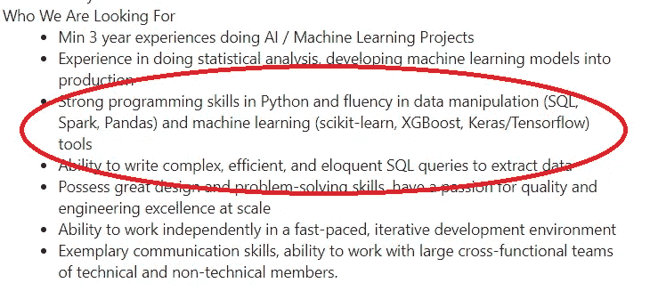

# 从业余到数据科学家——3 个月，够不够？

> 原文：<https://towardsdatascience.com/from-amateur-to-data-scientist-3-months-is-it-enough-185a21956f94?source=collection_archive---------31----------------------->

## 数据科学培训师视角的故事

[绿色变色龙](https://unsplash.com/@craftedbygc?utm_source=medium&utm_medium=referral)在 [Unsplash](https://unsplash.com?utm_source=medium&utm_medium=referral) 上的照片

> **“短短 3 个月成为数据科学家！我们将保证"**

这段话是你经常从数据科学训练营广告中看到的吗？虽然这些话可能和你在那里看到的一样，但是你明白了。许多训练营会试图在尽可能短的时间内向**推销成为数据科学家的前景。**

虽然真的有可能吗？从对数据科学一无所知到成为一名有天赋的数据科学家？这是我从训练营的一位前数据科学培训师那里得到的观点。

# **数据科学训练营**

为什么 Bootcamp 有足够的勇气做出这样的声明？我们首先需要知道就业市场想要从数据科学家那里得到什么。下面我举一个我在 LinkedIn 上找到的数据科学家职位需求的例子。

数据科学职位发布要求(来源:LinkedIn)

上面是一个典型的数据科学家招聘广告，你可以在任何地方找到。除了工作经验，这里列出的任何其他技能特别是我圈出的是**技术技能**。

这是大多数数据科学训练营经常致力于实现的目标；让训练营的学生具备技术技能，以确保他们能够参加工作面试。

如果我们看一下数据科学在线课程和训练营，学习大纲将遵循类似的方面:

*   学习 Python/R(编程语言)
*   学习可视化包
*   学习 SQL
*   学习机器学习
*   学习基本概率/统计

这是数据科学训练营经常提供的内容，也是我在担任数据科学培训师期间教给学生的内容。

那么 3 个月的时间学会以上所有技能，保证数据科学家这份梦寐以求的工作，够吗？简短的回答是**没有**，但是总有一个**异常**的空间。我来解释一下原因。

# 培训师的观点

## 数据科学训练营

数据科学培训师将在您的数据科学训练营的学习过程中为您授课。不管是好是坏，**当教一个学生时，并不是所有的教练都有相同的经验和技能**；也不是训练营机构本身——有些是为了销售。

在我担任数据科学培训师期间，我的工作场所显然没有准备好合适的学习材料和合格的教师。

当然，有一个来自 web 和开发编程背景的培训师，我承认他们的技能是神一样的，但教授数据科学？这是一个很大的不。

培训师大多是年轻人，他们因为编程技能和一些 Udemy 幻灯片课程而被迫教授数据科学。此外，在我加入公司时，我是唯一一个真正有数据工作经验的人，所以这对我来说是一个很大的惊喜。

有了这样的经历，我总是对数据科学训练营持保留态度。这是我作为前数据科学家培训师的第一个观点:

"**申请数据科学工作需要技术专长，但并非所有数据科学训练营的质量都一样。有些只是伪造的，会阻碍你成为数据科学家的机会。**

考虑到这一点，选择一名合格的数据科学家训练营是你在三个月内成为数据科学家的第一步——或者像广告宣传的那样。

## **老师和学生**

当你有一个合适的教学机构和合格的老师，现在我能成为一名数据科学家吗？你的机会会更高，但有一件事我需要提醒你；不是每个人都会放弃在数据领域的工作。这就是这个世界的残酷现实，每个人都有天赋，但每个人都有自己的天赋。数据科学工作值得吗？你可以在这里阅读我的观点。

 [## 数据科学家的工作—值得做出牺牲吗？

### 长话短说——的确如此(至少对我来说)

towardsdatascience.com。](/data-scientist-job-is-it-worth-the-sacrifices-made-efdf34139aa6) 

当我在做培训师的时候，我见过各种各样的学生——从有经验的天才到完全的业余爱好者。我可以看到一个学生跟上学习材料和理解新概念的能力，从真的很快到需要更多的时间来学习。

我很难确保每个学生都理解这些材料，因为我们的时间有限——训练营的广告是三个月，记得吗？。在短短的时间内，我需要教授所有可用的学习材料。

当然，对于拥有快速学习技能的学生来说，这是轻而易举的事情，但对于没有掌握数据科学技能的学生来说，这将是一次痛苦的经历。

从我作为一名培训师的角度来看，在三个月内成为一名数据科学家的广告对一些学生来说当然是可能的，但对另一些学生来说几乎是不可能的，因为他们的能力不同。

所以，我的**第二点**是:

**并不是所有的人都适合从事数据领域的工作，尤其是需要较长的时间来掌握必要的数据技能。如果你更加努力的话，也许可以，但是肯定比广告上说的三个月时间要长。**

我的建议是，如果你对自己的技能不确定，尝试学习哪种数据科学家技能，甚至在参加数据科学训练营之前就做好准备。这会对你有很大帮助。

## **训练营后**

在承诺的时间和从训练营毕业后，我现在是一名数据科学家吗？我不这么认为，现在是最难的部分——获得工作面试。

我见过许多有才华的学生连面试都很难，更不用说获得工作机会了。有些训练营提供与各种公司面试的机会，但有些没有。尽管有些学生在面试时仍然很难接受。

为什么那个学生过得很艰难？这是因为大多数学生只教授数据科学技术技能；忘记了许多其他方面，即业务和沟通。

我知道很多容易找到工作的学生并不是最聪明或最有才华的，但他们有很好的沟通技巧并了解公司业务。学习这项技能对我来说是从其他候选人中脱颖而出的最重要的技能。你可能想在我的其他文章中了解更多关于数据科学家的商业技能。

 [## 学习业务，成为伟大的数据科学家

### 每个数据科学家的核心。(抱歉，不是编码的问题)

towardsdatascience.com](/learn-the-business-to-become-a-great-data-scientist-635fa6029fb6)  [## 数据科学家必须了解商业 x 统计

### 为什么业务和统计之间集成对于数据科学家来说至关重要

towardsdatascience.com](/data-scientist-must-know-business-x-statistics-7bb8575a9525) 

无论如何，成为数据科学家重要的不仅仅是技术技能，还有业务和沟通技能。事实上，如果你和一些培训师关系很好，他们甚至会给你推荐一份数据科学的工作(这是我自己的经验)。

所以，我的**第三点**是:

"**当你申请成为数据科学家时，训练营的技术技能并不是公司寻求的唯一东西。你可能需要另一种技能，比如商务和沟通。**

尽管如此，即使你缺乏商业技能，仍然有可能获得一份数据科学家的工作。毕竟这个世界是一个奇怪的地方，有许多变量会影响你的就业机会。

# **结论**

总之，我想说，成为一名数据科学家很难，尤其是在三个月内。这是因为:

*   一些训练营不够资格教你必要的数据科学技能。
*   不是每个学生都有足够的天赋在短时间内跟上学习材料。
*   完成训练营后需要很多必要的技能。

# 如果您喜欢我的内容，并希望获得更多关于数据或数据科学家日常生活的深入知识，请考虑在此订阅我的[简讯。](https://cornellius.substack.com/welcome)

> 如果您没有订阅为中等会员，请考虑通过[我的推荐](https://cornelliusyudhawijaya.medium.com/membership)订阅。