# 神经网络优化轨迹的可视化

> 原文：<https://towardsdatascience.com/from-animation-to-intuition-visualizing-optimization-trajectory-in-neural-nets-726e43a08d85?source=collection_archive---------30----------------------->

## 从动画到直觉

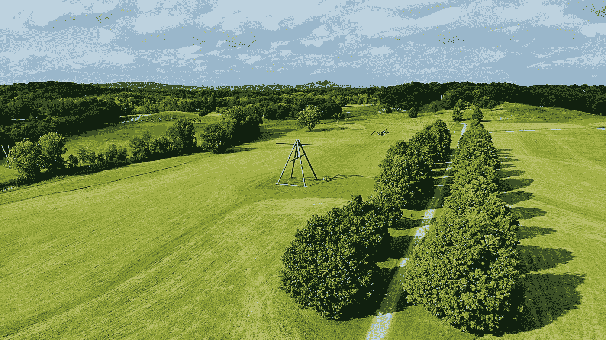

飞越纽约风暴王艺术中心，2018 年夏天。我在 DJI 马维克航空公司拍摄的照片

*更新:我已经把代码移植到一个 Python 包* [*这里*](https://github.com/logancyang/loss-landscape-anim) *。请随意试验并制作类似本文中的情节！*

在前[后](https://medium.com/swlh/from-animation-to-intuition-linear-regression-and-logistic-regression-f641a31e1caf)中，我展示了一些线性回归和逻辑回归的训练过程的动画情节。对他们如何“学习”有一个良好的“感觉”是有帮助的，因为在应用更复杂的模型之前，他们可以被用作基线。虽然大多数深度神经网络也使用基于梯度的学习，但类似的直觉要难得多。一个原因是参数是非常高维的，涉及到许多非线性，很难在我们的脑海中描绘出优化过程中发生了什么。与计算机不同，我们只能感知小于或等于 3D 的空间。

在这篇文章中，我将展示更多的动画情节，让你一窥这些高维空间。我使用的模型是带有 ReLU 激活的全连接多层感知器。然后，我们可以直观地看到宽度和深度如何影响损失情况和优化轨迹。

让我们考虑这个由 3 个类组成的 2D 数据集。我们人类一眼就能看出这种模式是由某种螺旋函数产生的。我们只需不到一秒钟就能识别它，同时，我们会自动为看不见的数据产生一种外推方法。这是因为我们从出生起就接受了这种视觉任务的训练(也不要忘了我们只能在非常低维的空间中做这件事)。在这里，我将训练几个人工神经网络来对这个形状进行分类，并在参数空间中*检查训练过程。*

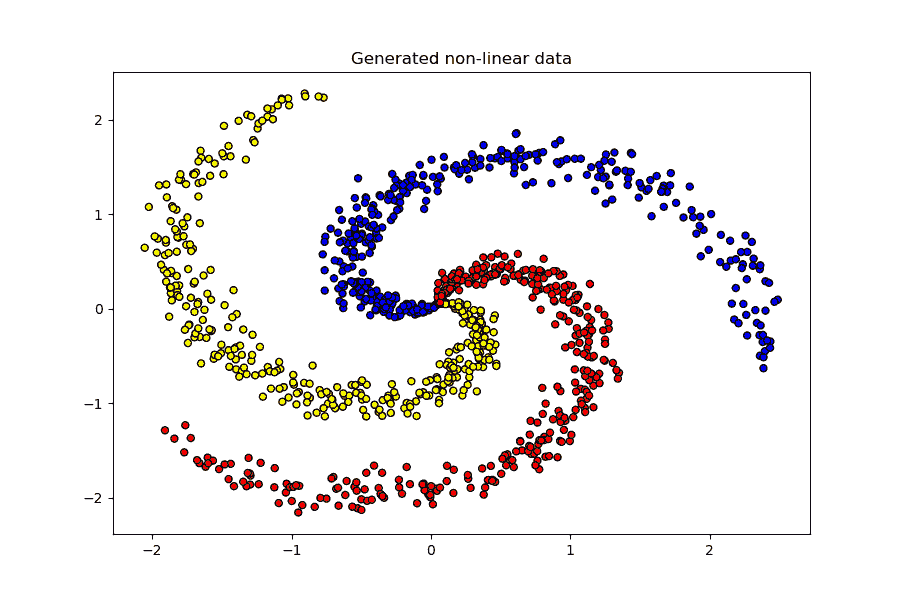

在继续之前，我想提出一个重要的问题:我们如何在高维参数空间中可视化优化轨迹？

最直接的方法是找到两个方向来穿过高维空间，并可视化该平面上的损失值。但是用哪两个方向呢？有无限多的潜在方向可供选择。在论文 [*中用神经网络可视化损失景观，李等。艾尔。*](https://arxiv.org/abs/1712.09913) ，作者讨论了几种方案，并采用了一种使用 PCA 进行降维的方案。下面是动机的简要总结:

1.  2 高维空间中的随机向量很可能是正交的，并且它们很难捕捉到优化路径的任何变化。路径在两个向量所跨越的平面上的投影看起来就像随机漫步。
2.  如果我们选择一个方向作为从初始参数指向最终训练参数的向量，而随机选择另一个方向，可视化将看起来像一条直线，因为第二个方向与第一个方向相比没有捕获太多的变化。
3.  **如果我们在优化路径上使用主成分分析(PCA ),并获得前 2 个成分，我们可以用最大方差可视化 2 个正交方向上的损失。**

因此，我使用 PCA 方法来获得更好的优化路径。请记住，这不是路径可视化的“最佳”方法，因为它可能不适用于其他目的。例如，如果您的目标是比较不同优化器采用的路径，例如 SGD 与 Adam，这种 PCA 方法将不起作用，因为主要成分来自路径本身。事实上，不同的优化器具有不同的路径和不同的 PC 方向，即损失情况的不同部分，使得不可能进行比较。为此，我们应该使用两个固定的方向。

这里的架构是通过改变和组合下面的两个属性产生的

*   隐藏层数:1，5，10
*   每个隐藏层中的神经元数量:5，20，100

总共 9 种配置。

让我们看看不同模型产生的决策区域/边界旁边的优化路径。通过显示决策区域，而不是依赖于生成数据集分割的验证/测试准确性，我们可以更好地直观了解不良拟合，因为*我们已经有了先验知识，即头脑中的“螺旋”预期*。

首先，让我给你展示一下逻辑回归在这种情况下的作用，

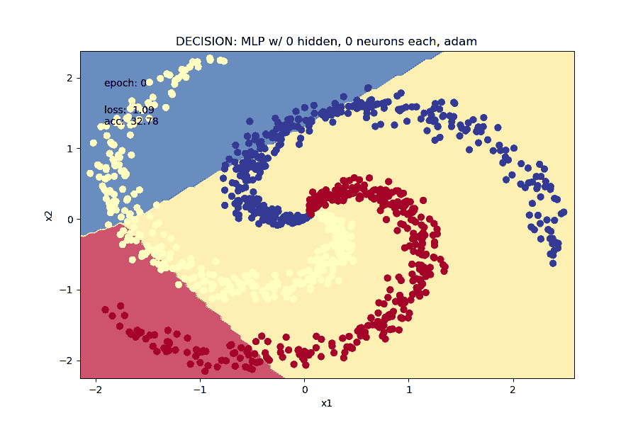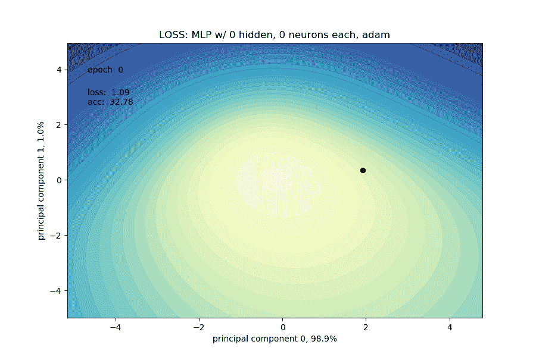

逻辑回归

显然，它的 3 条直线做得不好，但它的损失景观是完全凸的。

从第一个配置开始:1 个隐藏层和 5 个神经元。每个带有 ReLU 的神经元本质上是一条直线，有一边被激活。

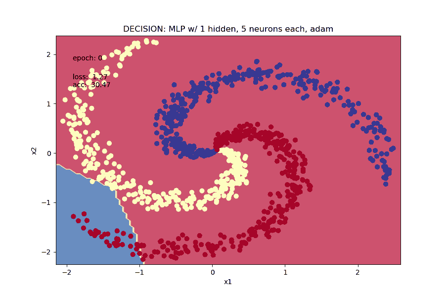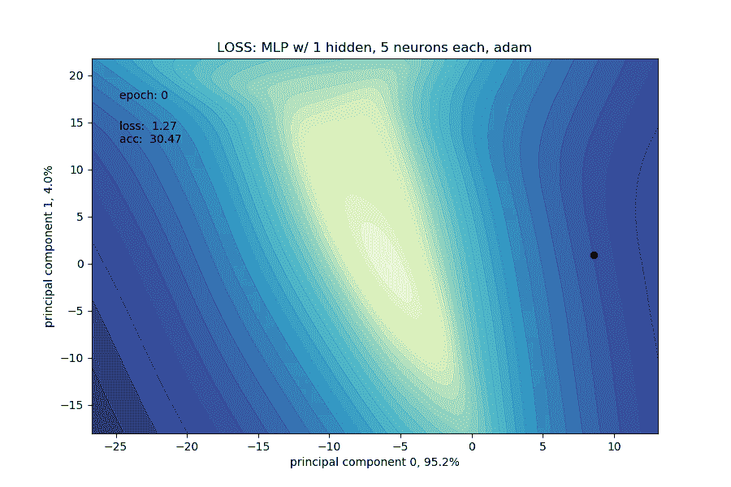

1 个包含 5 个神经元的隐藏层

从逻辑回归来看，这是一个明确的进步，但 5 个神经元无法捕捉螺旋的弯曲形状，并努力达到高精度和低损耗值。损失情况似乎大多是凸的。

我们看到增加了更多的神经元

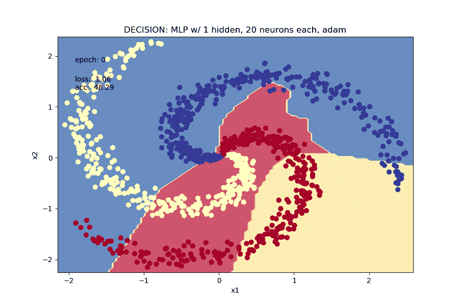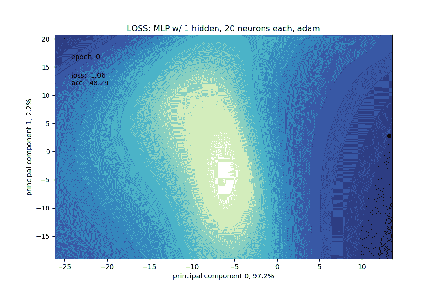

1 个包含 20 个神经元的隐藏层

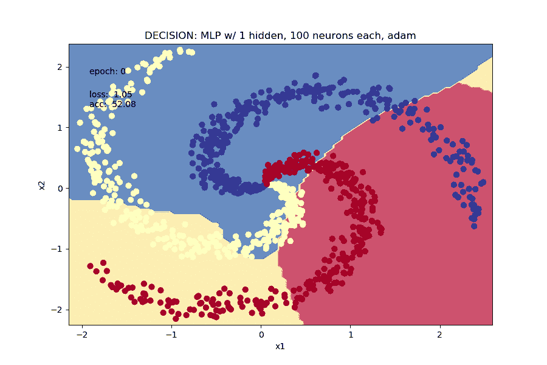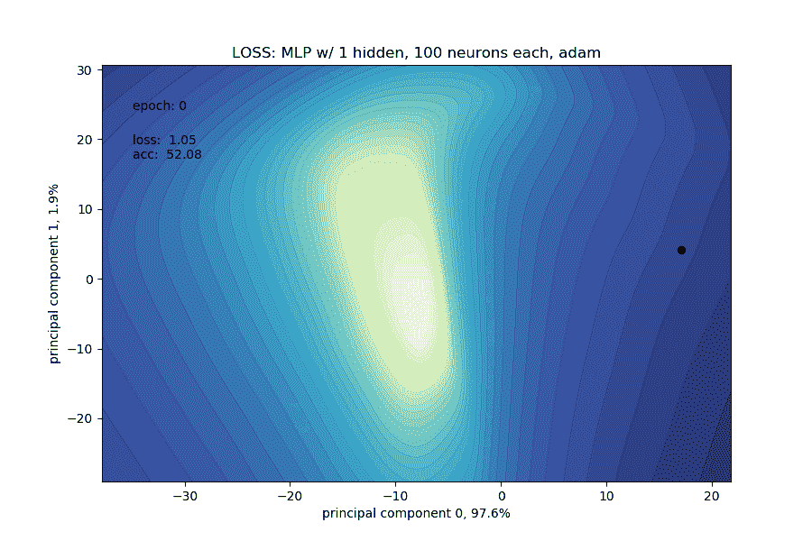

1 个包含 100 个神经元的隐藏层

请注意，每个主成分捕获的方差都标在轴上。顶部组件几乎总是获得 95%+这部分是由这些数据的性质和网络的架构决定的。在论文中，作者还观察到类似的行为，即对于 [CIFAR-10](https://www.cs.toronto.edu/~kriz/cifar.html) 数据集和各种架构，优化路径位于非常低维的空间中。

接下来，5 个隐藏层，

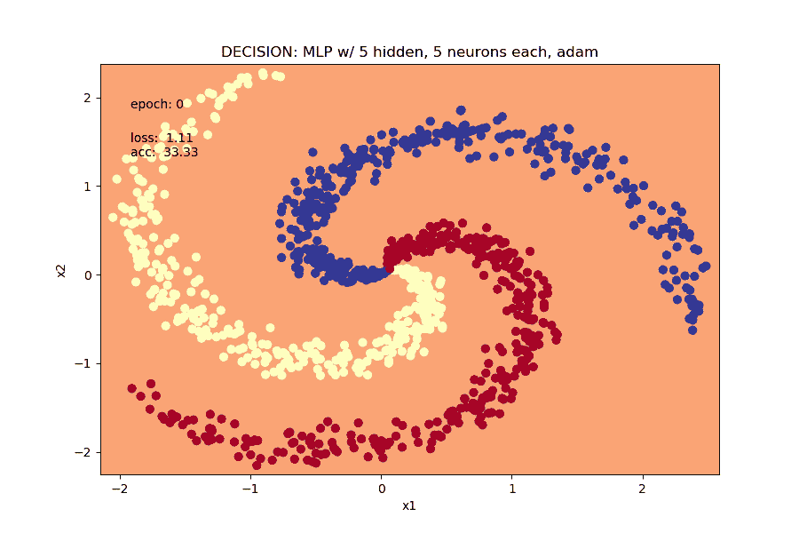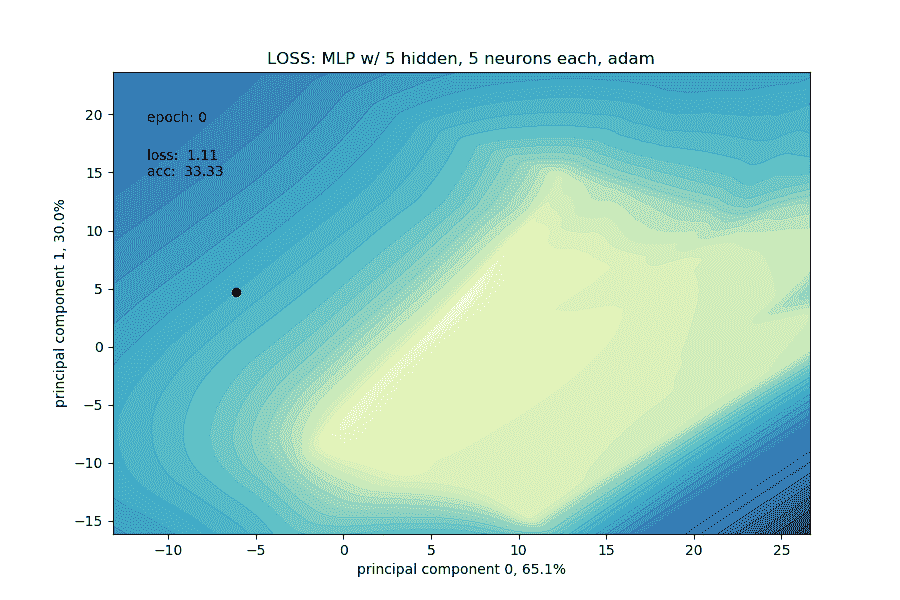

5 个隐藏层，每个层有 5 个神经元

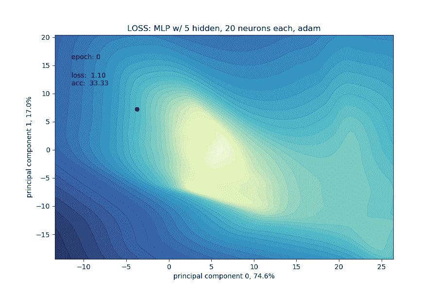

5 个隐藏层，每层 20 个神经元

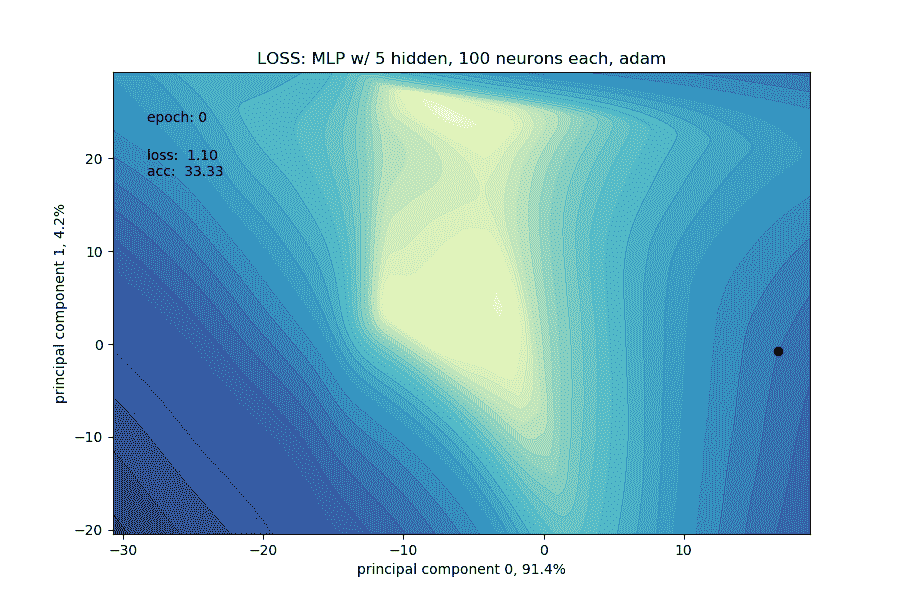

5 个隐藏层，每层 100 个神经元

通过 5 个隐藏层，PC-2 子空间中的损失景观变得明显不那么凸。对于窄的 5 个隐藏层乘以 5 个神经元的设置，我们可以猜测高维景观是高度非凸的，并且优化器很快陷入局部谷并产生不良拟合。

有了 20-100 个神经元和 5 层，优化器可以非常快地达到接近零的损耗。进一步的训练只是让它波动，出现意想不到的“小故障”。正在发生的是，神经网络试图用数据所在的 2D 空间之外的奇怪的高维形状来拟合这些数据。它过拟合得很快，但并没有像我们直觉上所做的那样真正捕捉到底层的数据生成机制。

事情变得有点疯狂的 10 个隐藏层。

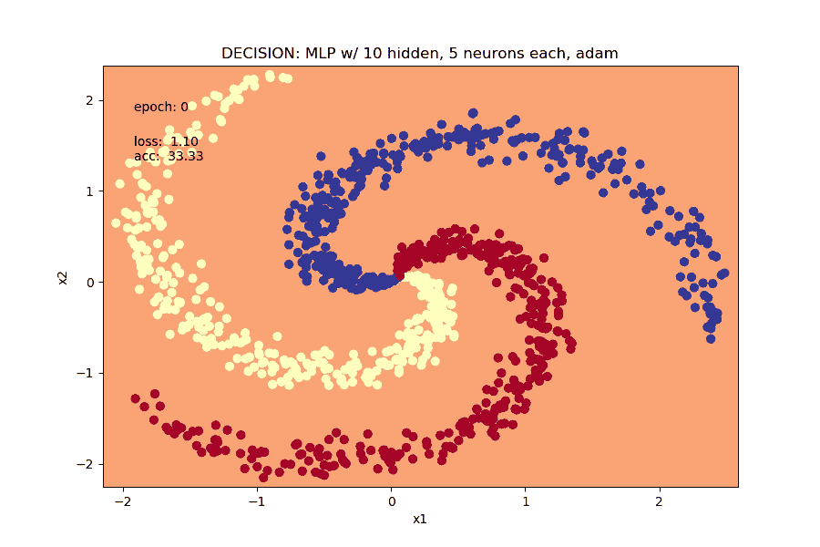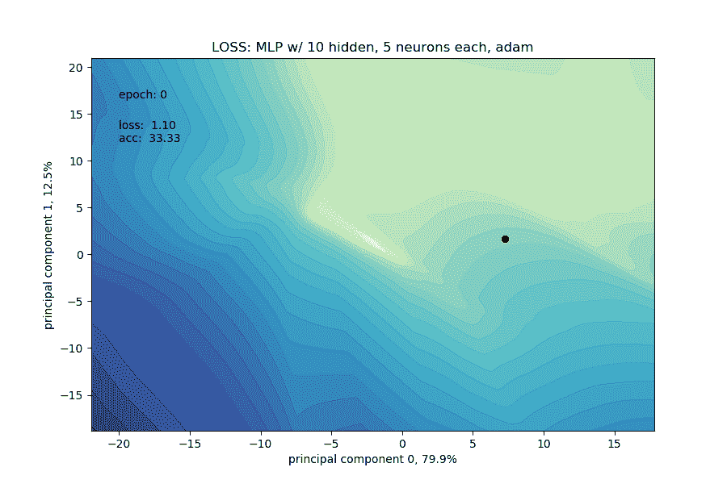

10 个隐藏层，每个层有 5 个神经元

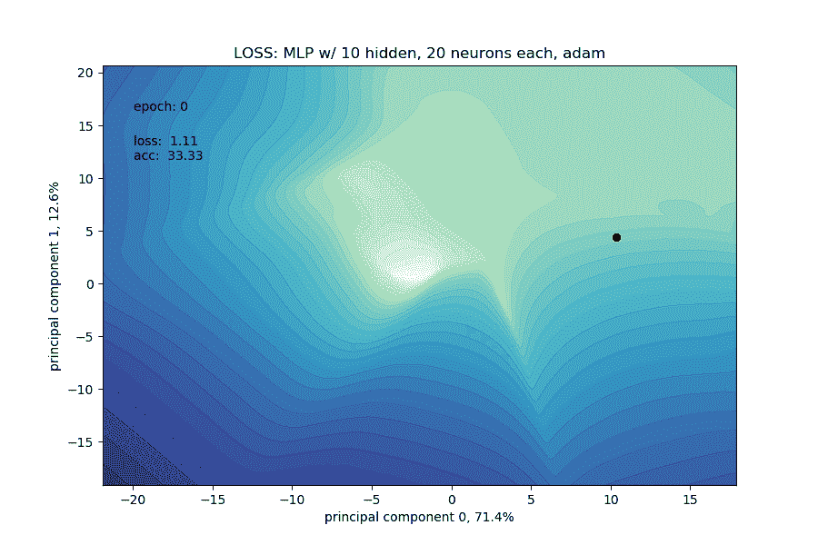

10 个隐藏层，每层 20 个神经元

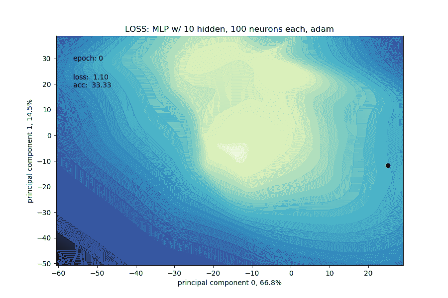

10 个隐藏层，每个层有 100 个神经元

它们都有相同的特征，比如很快达到接近零的损失，但却产生奇怪的拟合，不能很好地概括。*在其他条件相同的情况下，窄而深的神经网络比宽而浅的神经网络更难训练。*

看看这个薄而深的 20 层网络，每个隐藏层有 5 个神经元，损失景观是如此不凸，它只是卡住了，变得不可捉摸。

[的论文](https://arxiv.org/abs/1712.09913)更详细地讨论了神经网络属性的几个方面。作者研究了网络深度、宽度、初始化、跳跃连接的影响，以及损失景观几何的含义。**一个关键要点是，跳过连接对于使深度网络更容易训练至关重要。**如果你对*为什么我们可以训练深度神经网络*这个问题感兴趣，我强烈推荐这篇论文。

***一图抵千言*** *。*这里的每个动画情节都是 50 张图片，我们在这篇文章里有 21 张。比较不同配置之间的历元数、损失值和准确度，可以对基本神经网络的学习过程有一个“感觉”。同样的方法可以用来可视化更大更复杂的架构。

尽管今天对深度学习进行了大肆宣传，但人工神经网络仍处于早期阶段。许多技术是经验性的，还没有理论支持。获得经验的最好方法是通过反复试验。一旦深度学习的学生在基础上发展出一些直觉，我推荐 [fast.ai](https://www.fast.ai/) 提倡的自上而下的学习方法。许多科技上的突破都是实验过程中的偶然事件，而不是理论推导的自然结果。人们通常理解*为什么*某样东西在应用了几年后会起作用。所以不要害怕未知，把手弄脏就好，多培养模特！

*在* [*中*](https://medium.com/@loganyang) *上看我的其他帖子，或者在* [*上关注我的*](https://twitter.com/logancyang) *。*

# 参考

*   [*用神经网络可视化损失景观，李等。艾尔。*](https://arxiv.org/abs/1712.09913)
*   [https://github.com/madewithml/basics](https://github.com/madewithml/basics)