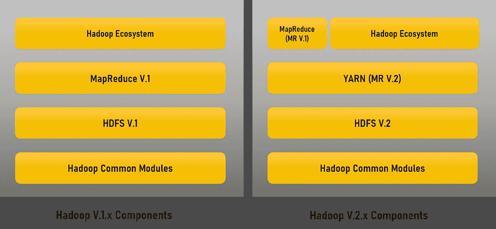
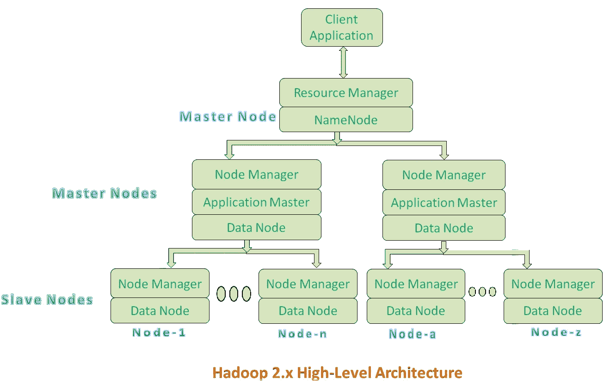

# 从业务需求到运行应用的大数据

> 原文：<https://towardsdatascience.com/from-business-requirements-to-big-data-running-application-1c269b91a7d6?source=collection_archive---------65----------------------->

## [揭开大数据应用的面纱](#)

## 大数据工具和技术—数据存储框架

*如果你仍然不确定你是否正在处理大数据应用，我鼓励你阅读文章* [*处理大数据应用*](/big-data-application-from-business-requirements-to-big-data-running-application-bd801c60c60e) *。*

在本文中，我将深入介绍主要的大数据工具和技术，它们可以满足您构建运行良好的大数据应用程序的所有目的。

当你看一看大数据生态系统时，你会对你可能注意到的工具的数量感到惊讶和困惑，并且会产生许多问题:我们需要知道所有这些工具吗？可供选择的最佳工具有哪些？有没有一些工具比其他的更好？如果我们只是在寻找某些功能，如处理大量数据的存储或实时分析，我们需要使用什么？

这些问题和更多的问题可能会造成这种混乱，这将使大多数具有相当好的专业水平的人迷失在这个领域。这些问题将在接下来的章节中回答。

# 我们需要知道现在市场上所有的工具吗？

*我宁愿说不！你不需要知道所有可用的工具，只需要知道你需要什么。*

为了消除混淆，市场上的工具根据其功能分为不同的类别，如下所示:

1.  **数据存储框架:**这些框架是为了处理基于分布式存储机制的海量数据而构建的。这些分布式存储机制通常支持复制和分区数据，以便处理节点(主机)中的任何故障转移，并使它们始终可供用户或其他应用程序使用。
2.  **数据处理框架:**这些框架有一个特定的角色，通过对数据应用各种处理来概括，包括过滤、清理、转换等等。这些工具通常以分布式方式实时执行它们的任务，考虑将记录分成多个节点，并并行应用不同种类的处理任务。
3.  **数据采集框架:**这些框架的作用就像一个排队机制，它们确保每个记录都不会被遗漏。从而确保推送到这些框架的每个记录的交付保证。它们通常还支持复制数据，以避免任何节点发生故障时的任何数据丢失。
4.  **数据可视化框架:**这些框架是理解大数据应用程序生成的结果的关键。这些结果是决策的基础。负责决策的经理将使用图表和不同种类的可视化小部件来进行所需的推理。

在本文中，我将详细讨论数据存储框架，我完全知道一篇文章对于如此庞大的工具和框架集是不够的，因此，我将更多地考虑大数据的核心及其所有不同的架构，并尝试列出当今市场上被认为非常重要的多种其他工具。

[imgix](https://unsplash.com/@imgix?utm_source=medium&utm_medium=referral) 在 [Unsplash](https://unsplash.com?utm_source=medium&utm_medium=referral) 上的照片

# Hadoop —大数据的核心

简而言之，我想提一下 Hadoop 是基于 2003 年发表的 Google 文件系统(GFS)论文创建的。这篇论文是引领大数据时代的核心工作。在揭示了 GFS 的秘密之后，Hadoop 的开发开始付诸实践，成为一个名为 Apache Nutch 的项目，该项目于 2016 年转移到新的 Hadoop 项目，其中发布了第一个版本。Hadoop 是第一个开源、可靠、可扩展的计算框架，能够处理数 Pb 的数据。它的核心是基于 Java 编程，带有一些 C 和 shell 脚本中的原生代码。

你需要知道的是，Hadoop 主要由两个重要的层组成，一个是数据层，称为 Hadoop 分布式文件系统(HDFS)，另一个是处理层，最初称为 Map 和 Reduce 框架(MapReduce)。我们将更多地关注 HDFS 端，因为它非常重要，目前没有其他文件系统可以取代它。然而，市场上的处理端被其他一些工具所取代，如 Spark、Flink 等。HDFS 仍然是任何大数据应用程序的主要焦点，尤其是在我们希望保留不同的数据实体(原始数据、处理后的数据等)时。).

Hadoop 一直在高速发展。即使你熟悉 Hadoop 1，也不意味着你熟悉 Hadoop 2 或 Hadoop 3。事情正在彻底改变，一些组件被替换，其他组件被删除，新功能正在添加。由于其重要性，我将确保报道这一演变。如果你还没有升级你的 Hadoop，你可能会重新考虑。

正如我在所有 Hadoop 版本中提到的，唯一保持健壮并得到良好维护而没有更换的组件是 HDFS，这是我们真正关心的。

**Hadoop 1 和 Hadoop 2 的区别**

任何对知识好奇的人，都想知道有什么不同？为什么那时我需要迁移到 Hadoop 2？

这个问题的答案非常简单:我们可以有多个主控作为主要的突出区别。好像答案太雾了。我将开始详细解释发生了什么。

Hadoop 1 与 Hadoop 2 的高级架构

Hadoop 2 在 Hadoop 的架构中增加了一个名为 YARN 的新层，也被称为另一个资源协商者，负责管理应用程序使用的资源，监控这些应用程序，并在 HDFS 之上调度作业[1]。该层导致详细架构中的新层次，如下所示:

1.  第一层(在名称节点层):由两个主要组件组成，它们是资源管理器(YARN)和 HDFS。
2.  第二层(在主节点级别):由三个组件组成，它们是节点管理器(负责管理和监控容器，容器是指 HDFS 中的一部分内存)、应用程序主(允许资源管理器与节点管理器交互)和数据节点。
3.  第三层(数据节点层):由节点管理器和数据节点两部分组成。

[source = "[https://www . journal dev . com/8800/Hadoop-architecture-yarn-HDFS-MapReduce](https://www.journaldev.com/8800/hadoop-architecture-yarn-hdfs-mapreduce)"]

Hadoop 2 中引入的这种架构是实现不同目的的关键，例如:

1.  支持多个名称节点，而不是一个名称节点(单点故障)，在 HDFS 联合的情况下，每个名称节点都可以分配到一个特定的名称空间，而不是由一个名称节点管理 Hadoop 1 中的所有名称空间[2]。
2.  支持多种编程模型，包括 MapReduce、Streaming、Graph、Spark、Storm 等。而不是单一的编程模型 MapReduce。
3.  获得比 Hadoop1 更高的可扩展性。
4.  在 Hadoop 1 中使用可变大小的容器而不是固定大小的槽。

**Hadoop 2 和 Hadoop 3 的区别**

除了 Hadoop 2 中的变化之外，我们还将讨论 Hadoop 3 中的新变化。我将区分两个版本之间的重要区别如下:

1.  Hadoop 3 要求最低 Java 版本为 8，而不是 Hadoop 2 的 7。
2.  Hadoop 3 引入了一种基于擦除编码的新机制来最小化存储(存储开销仅为 50%)并实现容错，而 Hadoop 2 使用复制来实现容错并带来更多存储(HDFS 在存储空间中有 200%的开销[3])。
3.  Hadoop 3 使用 YARN timeline service v2，然而，Hadoop 2 使用 YARN timeline service v1。
4.  Hadoop 3 使用机会容器，而 Hadoop 2 使用保证容器。
5.  Hadoop 3 使用数据内节点平衡，而不是 Hadoop 2 中的 HDFS 磁盘平衡器 CLI。
6.  Hadoop 3 使用 Linux 临时端口范围之外的更方便的默认端口，而不是像 Hadoop 2 中那样使用默认端口。
7.  Hadoop 3 可以实现更好的可扩展性，能够扩展到每个集群超过 10，000 个节点，而在 Hadoop 2 中只能扩展到 10，000 个节点。

## 在 Hadoop 上查询存储工具

在 Hadoop 生态系统中，我们注意到各种各样的工具和框架，这里我将向您介绍三种主要的数据存储和查询工具，它们都是建立在 Hadoop 之上的。这些工具将列出如下:

1.  [**Hive**](https://hive.apache.org/)**【4】是开源的 Hadoop 平台中用于数据汇总分析和大型数据系统查询的数据仓库系统。它将类似 SQL 的查询转换为 MapReduce 作业，以便于执行和处理大量数据。**
2.  **[**h base**](https://hbase.apache.org/)【5】是一个分布式、可扩展的 NoSQL 大数据存储，运行在 Hadoop 集群上。HBase 可以托管非常大的表—数十亿行、数百万列—并且可以提供对 Hadoop 数据的实时、随机读/写访问。**
3.  **[**Impala**](https://impala.apache.org/)**是一个 MPP(海量并行处理)SQL 查询引擎，用于处理存储在 Hadoop 集群中的海量数据。与 Hadoop 的其他 SQL 引擎相比，它提供了高性能和低延迟。根据[6], Impala 是性能最高的 SQL 引擎(提供类似 RDBMS 的体验),它提供了访问存储在 Hadoop 分布式文件系统中的数据的最快方式。****

# ****与 Hadoop 共存的其他存储工具****

****尽管 Hadoop 是理解大数据存储的中心，但人们注意到 Hadoop 在安装、管理和监控方面有些复杂。除此之外，并不是所有的大数据应用程序都需要使用 Hadoop 的复杂性，因为他们可能会关心某种更轻的数据存储和更类似于数据库的东西。一些类似数据库的存储工具被称为 NoSQL 存储工具，NoSQL 不仅代表结构化查询语言。这些 NoSQL 工具将有助于实现上述关于数据复制和分区、数据可用性以及数据查询的特性。下面列出了一些最著名的 NoSQL 存储工具:****

1.  ****[**MongoDB**](https://www.mongodb.com/)【7】是一个面向文档的 NoSQL 数据库，用于大容量数据存储。MongoDB 不像传统的关系数据库那样使用表和行，而是使用集合和文档。文档由键值对组成，键值对是 MongoDB 中的基本数据单元。集合包含一组文档和函数，相当于关系数据库表。它还具有查询和索引功能的高可伸缩性和灵活性。****
2.  ****[**InfluxDB**](https://www.influxdata.com/) 是一个用 Go 编写的时间序列 NoSQL 数据库，针对运营监控、应用度量、物联网传感器数据和实时分析等领域的时间序列数据的快速、大规模可伸缩性、高可用性存储和检索进行了优化[8]。****
3.  ****[**Neo4j**](https://neo4j.com/)**【9】**是一个 NoSQL 图形数据库。它是一个完全事务性的数据库(ACID ),以图形的形式存储数据。图由通过关系连接的节点组成。受人类思维结构的启发，它允许对复杂数据的高查询性能，同时对开发人员来说保持直观和简单。********
4.  ******[**Redis**](https://redis.io/)**是一个开源的(BSD 许可的)、内存中的数据结构存储，用作数据库、缓存和消息代理。它具有内置的复制、Lua 脚本、LRU 驱逐、事务和不同级别的磁盘持久性，并通过 Redis Sentinel 和 Redis Cluster 的自动分区提供高可用性。********

# ******摘要******

******每当我们构建大数据应用程序时，我们都应该记住，我们可能需要理解和应对许多工具。这些工具不仅数量多，而且版本和功能也多。我们应该小心选择正确的技术来解决匹配良好的问题。在了解 Hadoop 这个大数据时代的核心之后，我们可以清楚地注意到，发展仍在继续，每天都有新功能添加进来，因此我们必须投入时间来检查新添加的功能是否会简化我们应用程序的开发流程。此外，我还介绍了一些其他重要的工具，它们可能有助于构建所需的应用程序。******

# ******参考******

> ******[1][https://www . journal dev . com/8800/Hadoop-architecture-yarn-HDFS-MapReduce](https://www.journaldev.com/8800/hadoop-architecture-yarn-hdfs-mapreduce)******
> 
> ******[2][https://big data path . WordPress . com/2018/12/19/comparison-between-Hadoop-2-x-vs-Hadoop-3-x/](https://bigdatapath.wordpress.com/2018/12/19/comparison-between-hadoop-2-x-vs-hadoop-3-x/)******
> 
> ******[3][https://data-flair . training/blogs/Hadoop-2-x-vs-Hadoop-3-x-comparison/](https://data-flair.training/blogs/hadoop-2-x-vs-hadoop-3-x-comparison/)******
> 
> ******[https://intellipaat.com/blog/what-is-apache-hive/](https://intellipaat.com/blog/what-is-apache-hive/)******
> 
> ******[https://mapr.com/products/apache-hbase/](https://mapr.com/products/apache-hbase/)******
> 
> ******[https://www.tutorialspoint.com/impala/impala_overview.htm](https://www.tutorialspoint.com/impala/impala_overview.htm)******
> 
> ******[https://www.guru99.com/what-is-mongodb.html](https://www.guru99.com/what-is-mongodb.html)******
> 
> ******[https://glossarytech.com/terms/databases/influxdb](https://glossarytech.com/terms/databases/influxdb)******
> 
> ******[9][https://docs . spring . io/spring-data/data-neo4j/docs/3 . 1 . 0 . release/reference/html/neo4j . html](https://docs.spring.io/spring-data/data-neo4j/docs/3.1.0.RELEASE/reference/html/neo4j.html)******