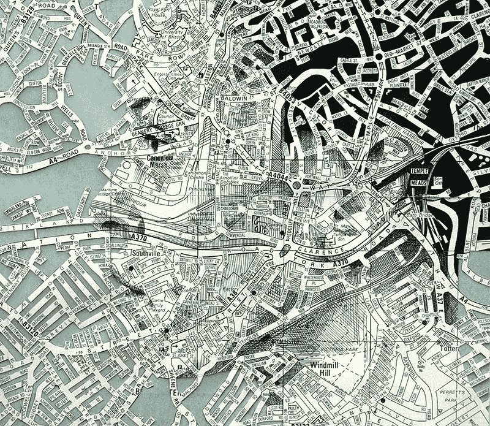
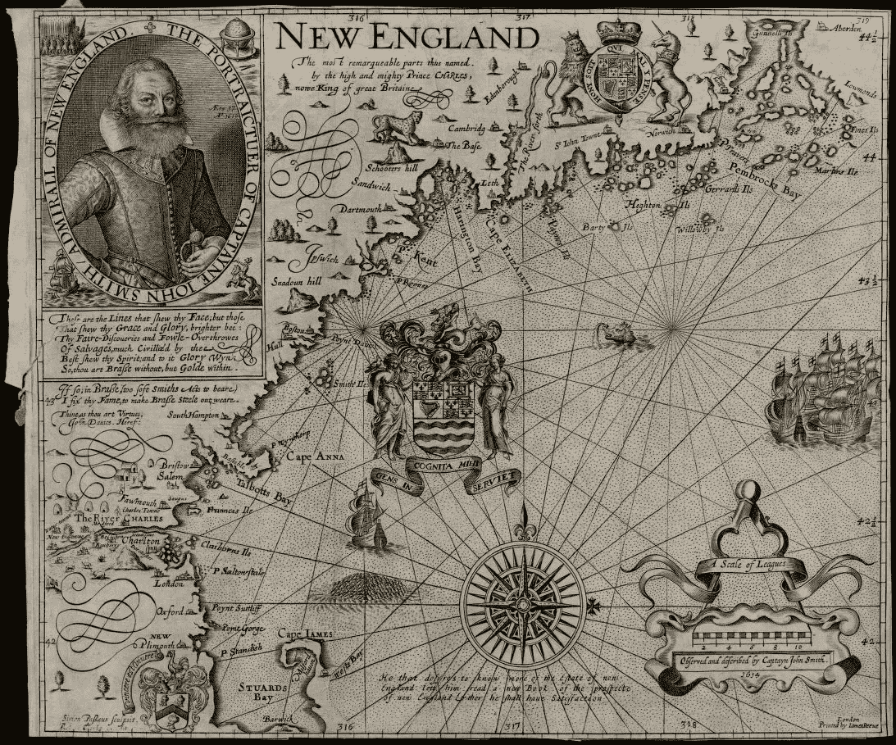
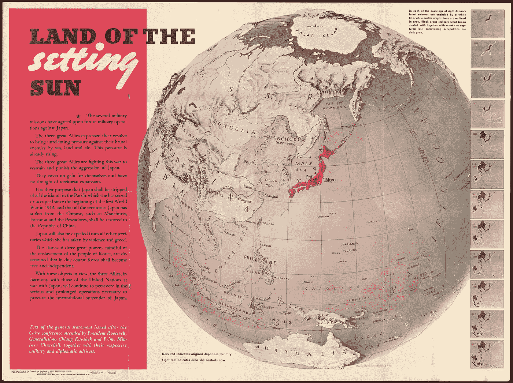
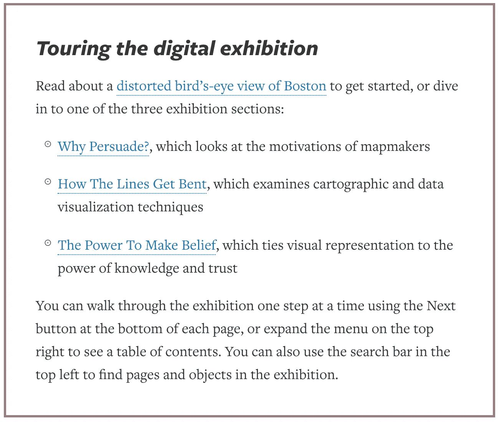
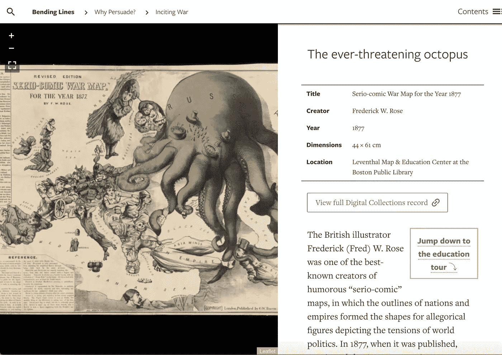
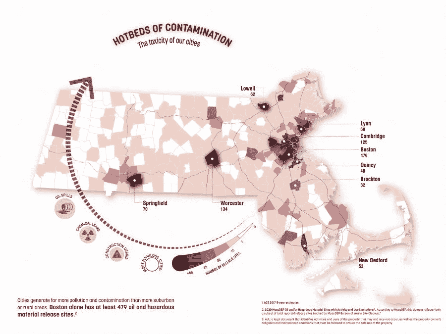
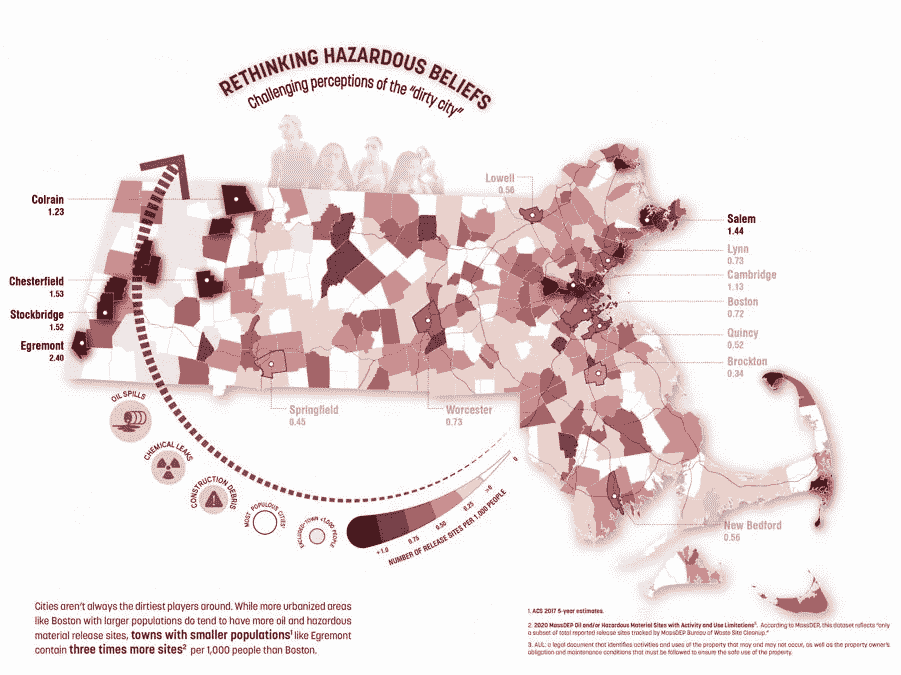
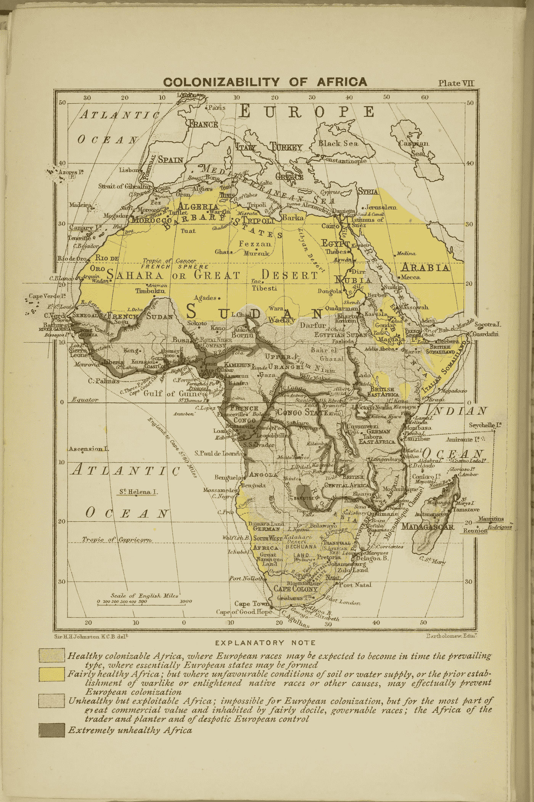
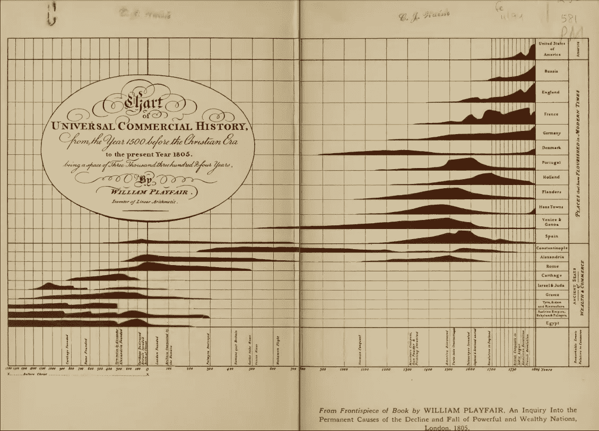

# 从制图学到数字制图:你知道真相吗？

> 原文：<https://towardsdatascience.com/from-cartography-to-digital-mapping-do-you-know-the-truth-c1440bb193dc?source=collection_archive---------40----------------------->

## [公平和偏见](https://towardsdatascience.com/tagged/fairness-and-bias)

## 一个在线展览反思了说服制图学的历史是如何教会我们发现视觉数据中的偏见的

《布里斯托尔信封》作者埃德·费尔伯恩([乔布森](https://www.thisiscolossal.com/2014/01/new-portraits-drawn-on-maps-by-ed-fairburn/))

在疫情之前，我们已经看到了数字化的趋势。特别是像美术馆、博物馆、图书馆和档案馆这样的文化机构面临着通过数字媒体来获取其物品的批评。这些机构可以将当前的疫情危机转化为变革的机会。适应将允许以可持续的方式为任何地方的每个人保存、展示和消费遗产，迎合“期望稳定性和灵活性”的当代观众[1]。

引诱欧洲人在新英格兰定居([弯线](https://www.leventhalmap.org/digital-exhibitions/bending-lines/why-persuade/1.1.1/))

当代观众还期待什么？展览提供遗产消费的方式，也应该提供研究历史的方法，作为一个重要的工具。用来思考当前的挑战，这个工具会非常方便。数字对象可以占据的“空间”是没有限制的，所以为什么不利用这种自由呢？[2]

## “弯曲的线条”——一个关于“弯曲”现实的展览

波士顿公共图书馆的 Leventhal 地图中心目前正在策划一个为期一年的在线展览，名为“ [*弯曲的线条:从扭曲到欺骗的地图和数据*](https://www.leventhalmap.org/digital-exhibitions/bending-lines/)”[3]。它通过为学生提供互动材料来挑战传统的在线展示。这个想法源于“说服制图学”——地图和视觉数据如何为主观议程操纵现实的历史[3]。如果你认为你从未听说过这个，相信我，你已经*看过*了。新闻中的国家宣传和政治活动地图、广告或统计图表如何？

利文塔尔中心的地图策展人 Garret Dash Nelson 解释说，这个展览指导观众如何成为一个负责任的地图读者[4]:

> "每张地图都注入了制作者的决策，最终呈现出一种模式、一个故事或一个论点."

1943 年《新闻地图》中的《落日之地》(弯线)

他不仅提到了中世纪的普鲁士地图或二战时期的日本帝国地图，还强调了“在一个数据和数字工具丰富的时代”，地图学的历史是多么有说服力。我们可能认为“现代”工具带来了客观性和准确性，但数据与真相的关系仍然模糊不清——无论是书面还是数字。

"你怎么知道什么是真实的，什么是扭曲的？"加勒特问道。

## 参观数字展览

展览的互动形式带你经历三个部分:*为什么要说服？*、*线条如何弯曲*、*让信念产生的力量*。有照片，描述，解释，身临其境的内容，迷你旅游等等。这迫使我们问是谁制作了这些地图，它们的动机和信念有什么意义，它们是如何“扭曲”现实的？

“参观数字展览”菜单([弯曲线条](https://www.leventhalmap.org/digital-exhibitions/bending-lines/intro/))

[第一部分](https://www.leventhalmap.org/digital-exhibitions/bending-lines/why-persuade/)将审查引向某人创建地图背后的意图，例如民族主义和帝国主义地图的爱国主义。例如，“永远具有威胁性的章鱼”是一幅被广泛认可的 17 世纪俄土战争地图，使用章鱼的视觉主题来代表和夸大威胁。

永远有威胁的章鱼

[第二部分](https://www.leventhalmap.org/digital-exhibitions/bending-lines/how-to-bend/)深入研究了分类和量化数据的许多技术，包括交流和符号化信息的代表性选择。作为其中的一部分，Garret 解释说他们委托了一个名为 [*相同的数据，不同的故事*](https://www.leventhalmap.org/digital-exhibitions/bending-lines/how-to-bend/data-stories/) 的项目来展示同一组数据如何产生不同的视觉效果。

一个例子来自马萨诸塞州跨环境、基础设施和人口统计类别的地理数据。由此，制图者被要求制作一对结论相反的地图。分析师 Maggie Owens 创建了一个显示全州有毒物质危害的地图对。一幅可视地图显示城市受污染影响最大，而另一幅显示农村地区受污染影响最大。

(左/右)*马萨诸塞州的有毒污染表明城市受影响最大/* 马萨诸塞州的有毒污染表明农村地区受 Margaret Owens ( [弯线](https://www.leventhalmap.org/digital-exhibitions/bending-lines/how-to-bend/data-stories-contamination/))影响最大

> “我们愿意认为数字本身就能说明问题，但是每当我们使用数据时，解释者都有一个至关重要的角色，人们绘制这些地图的方式真的会影响他们带入任务中的假设，”Garret 说[4]。

[最后一节](https://www.leventhalmap.org/digital-exhibitions/bending-lines/power-belief/)讲的是真理与权力的关系；以及它在视觉上是如何表现的，触及到包括种族、语言和领土在内的主题。以特殊的教育活动结束，这让年轻的学生要求更多。

《白人至上的气候学》([弯曲线条](https://www.leventhalmap.org/digital-exhibitions/bending-lines/power-belief/3.5.4/))

## 为什么要关心 Covid 世界中的地图？

在一个信息无止境的时代，或者说“信息时代”，了解哪些数据的可视化表示是可信的是至关重要的[5]。在新闻中，当你看到关于新冠肺炎的选举地图或统计数据时，它们会受到偏见的影响。鉴于疫情的背景，*弯曲线*有一个更大的目标，如 Garret 所解释的[4]:

> “我们也想将此视为促进数据素养的一种方式，这是对媒体和数据可视化的一种批判态度，以汇集地图如何产生我们的真实感的悠久历史。”

威廉·普莱费尔——图表和图形的视觉简史

加勒特是对的。而“网络上充斥着无数复杂的可视化项目”[6]；看到错误信息像蜂巢爆炸一样传播，我们需要学习如何成为负责任的数据读者。视觉数据和地图的主要缺点之一是不成比例的简化论。数字、线条、点、形状和颜色声称代表了物体和它们之间的关系，“不管这些是人、它们的社会关系、股票价格、国家收入、失业统计还是其他任何东西”[6]。

在网络和新闻中，新冠肺炎地图倾向于强调一些因素，而隐藏其他因素。例如，它们通常只显示确诊病例，而不是所有的病例。这意味着，虽然声称显示一个国家的疫情状态，但他们实际上代表了该国对该疾病的测试规模和水平[8]。

冠状病毒图表如何误导我们

如果不将视觉数据与地理、社会人口统计、文化和政治决策联系起来，错误信息就会继续传播。

## 超越地图的天真

为什么误传会通过可视化地图持续传播？他们拥有某种力量，使人们信任他们，并倾向于“天真地”接受他们是真的[5]。视觉语言在很大程度上与科学客观性的范式有关。作为一个观众，我们往往会忘记，我们看到的数据从来没有脱离上下文、解释或说明[9]。

> “数据经常以被精心制作来讲述一个特定故事的视觉化形式来传达，而在简化数据的过程中，上下文经常会丢失；类似地，数据经常被吹捧为客观的、固有的事实信息，不受人为干扰”[9]。

数据来自人民([弯线](https://www.leventhalmap.org/digital-exhibitions/bending-lines/how-to-bend/2.4.4/))

视觉数据受制于它所处的位置，就像所有的交流行为一样。因此，我们每天看到的新冠肺炎地图和图表并不是他们所声称的“客观”表现。我们将它们与“逻辑论证和科学启蒙”[7]联系在一起，却忘记了它们的社会、文化和政治背景。

*弯线*是一个强大的展览，无论是形式还是内容。它试图以新的方式利用数字自由来互动地展示历史，同时允许观众从批判的角度参与和反思历史。在一个“真理”比以往任何时候都更加遥远的时代，我们学会了辨别什么是可信的数据，什么是不可信的数据。

**参考书目**

[1] *创新&文化遗产研究:2018 年 3 月 20 日，布鲁塞尔皇家艺术与历史博物馆:会议报告。*出版处，2018。*DOI.org【CSL JSON】，[https://data.europa.eu/doi/10.2777/303242](https://data.europa.eu/doi/10.2777/303242)。*

[2]卡恩，丽贝卡。“封锁而不是封锁——评估博物馆对新冠肺炎的数字反应”。*社会科学的影响*，2020 年 5 月 8 日，[https://blogs . LSE . AC . uk/Impact of Social Sciences/2020/05/08/locked-down-not-lock-out-assessing-the-digital-response-of-museums-to-新冠肺炎/](https://blogs.lse.ac.uk/impactofsocialsciences/2020/05/08/locked-down-not-locked-out-assessing-the-digital-response-of-museums-to-covid-19/) 。

【3】*弯曲的线条:从扭曲到欺骗的地图和数据*。[*www.leventhalmap.org*，](http://www.leventhalmap.org,)[https://www . leventhalmap . org/digital-exhibitions/bending-lines/](https://www.leventhalmap.org/digital-exhibitions/bending-lines/)。于 2020 年 9 月 21 日访问。

[4]布利斯，劳拉。关于地图的偏见，历史教会了我们什么。[城市实验室](https://medium.com/u/40ddd7a6f79a?source=post_page-----c1440bb193dc--------------------------------)，*Bloomberg.Com*，2020 年 5 月 28 日。[*www.bloomberg.com*，](http://www.bloomberg.com,)[https://www . Bloomberg . com/news/articles/2020-05-28/how-to-解构-解读-地图](https://www.bloomberg.com/news/articles/2020-05-28/how-to-deconstruct-and-interpret-maps)。

[5]穆尼、彼得和莱文特·胡哈斯。新冠肺炎地图:基于网络的地图如何对信息时代做出贡献。*人文地理对话*，第 10 卷第 2 期，SAGE 出版，2020 年 7 月，第 265–70 页。*贤者期刊*，doi:[10.1177/2043820620934926](https://doi.org/10.1177/2043820620934926)。

[6]马诺维奇，列夫。什么是观想？*视觉研究*，第 26 卷第 1 期，Routledge 出版社，2011 年 3 月，第 36–49 页。*泰勒和弗朗西斯+奈吉姆*，doi:[10.1080/1472586 x . 2011.548488](https://doi.org/10.1080/1472586X.2011.548488)。

[7]多恩，萨拉。歪曲新冠肺炎:在数据设计的第二个黄金时代用图表撒谎。*商业和技术交流杂志*，SAGE 出版公司，2020 年 9 月，第 1050651920958392 页。*贤者期刊*，doi:[10.1177/1050651920958392](https://doi.org/10.1177/1050651920958392)。

[8] *冠状病毒图表如何误导我们*。2020. *Vox* ，【https://www.youtube.com/watch?v=O-3Mlj3MQ_Q】T4。

[9]雷切尔·阿泽顿。“缺失/未指明”:新冠肺炎疫情期间的人口数据可视化。*商业和技术交流杂志*，SAGE 出版公司，2020 年 9 月，第 1050651920957982 页。*贤者期刊*，doi:[10.1177/1050651920957982](https://doi.org/10.1177/1050651920957982)。

*编辑自*[*MoM*](http://mastersofmedia.hum.uva.nl/blog/2020/09/27/from-cartography-to-digital-mapping-do-you-know-the-truth/)*中的原始出版物，作为 MA 新媒体&数字文化@阿姆斯特丹大学作业的一部分，2020 年 9 月 27 日*