# 从圆形到 ML 通过蝙蝠侠:第一部分

> 原文：<https://towardsdatascience.com/from-circle-to-ml-via-batman-part-i-51ab4cf2db66?source=collection_archive---------36----------------------->

## 美丽的方程式不仅仅是艺术！

“M”、“L”和蝙蝠侠符号都是单个不等式的结果。[查看图表](https://www.desmos.com/calculator/7ffauhrnx6)

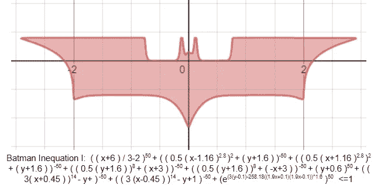

蝙蝠侠不等式一:[查看图](https://www.desmos.com/calculator/7ffauhrnx6)

# 简介:

这个圆圈本身很漂亮，不是吗？但是，带着一些好奇心，你可以超越一个圈子。它不需要任何微积分或任何先进的概念，只是用我们最喜欢的 10 级数学和一些美丽的想法，我们可以超越圆，甚至创建蝙蝠侠不等式。这篇文章是关于为我们想要的任何形状创建不等式。在第二部分，我们将看到如何改进和推广这个框架，并派生出机器学习中常用的函数。

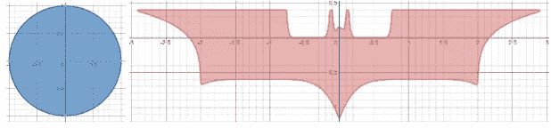

这是一个从左边的曲线到右边的曲线的旅程

这里创建的所有可视化都是在公开可用的软件中生成的，如 Desmos 和 Geogebra。我建议读者继续使用这些工具玩这些方程，自己探索其中的美妙之处。

# 一圈之势！

谦逊的圆描述了与给定中心点等距的多个点。让我们以各种形式来看看我们熟悉的朋友。当所有的点都位于给定的距离时，让我们考虑 1 个单位，我们得到一个圆。距离小于 1 的点位于圆内，距离大于 1 的点位于圆外。在三维空间中，方程为 z = x+y–1 的抛物面与 XY 平面相交时形成我们的圆。

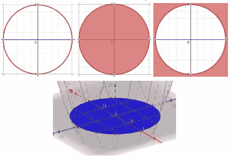

圆的不同视图

我们都知道圆通常采用 x +y =1 的形式。如果我们超越 2 的幂，你认为会发生什么？这就是神奇之处。让我们取 2 到 10 的值，观察会发生什么。

从 3 到 10 的幂

对于偶次幂，我们看到圆开始看起来像一个正方形，在无穷次幂时它确实变成了一个正方形。但是为什么它会这样做，尤其是在偶数倍的情况下？我们将首先试图理解曲线上的点(x^n+y^n=1)是如何表现的，然后研究曲线内的点的本质和属性(x^n+y^n<=1).

先来了解一下奇幂。如果幂是奇数，假设 x 是负的，那么 x^n 项的结果也是负的，因此 y^n 项取一个大于 1 的值，所以和仍然是 1。对于大功率，随着功率的增加，2 个数的差异变得无关紧要。让我们举个例子，如果 x⁵是-100，000，那么 y⁵的值应该是 100，001，以满足等式。但是，我们绘制的是 x 和 y，所以证明该等式正确的 x 和 y 的值是(-10，10.0000199..).这非常接近 y=-x 线。这也适用于负 y 和正 x 的情况。另请注意，功率越高，与 y=-x 的偏差越小。这在负 y 和负 x 的情况下是不可能的，这就是为什么我们在该象限中看不到函数的一部分。当 x 和 y 都是正数时，我们看到类似正方形的一部分。这是因为如果 x 明显小于 1，比如 0.7，那么 x⁵会很快变得非常小(这里是 0.168)。因此，y⁵必须是 1-x⁵，也就是 0.832，这意味着 y 将非常接近 1，但这里稍小(0.9638)。同样的逻辑反过来也适用。因此，对于远离 1 的 x 值，y 取接近 1 的值(像水平边)，对于接近 1 的 x 值，y 快速下降到 0(像垂直边)。这使得曲线看起来像正方形的一部分。这可以从下面看出:

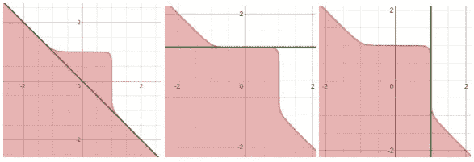

用 n=9 演示自然。

一旦理解了奇幂，理解偶幂就变得容易多了。负值的情况现在不存在了，所以整个函数在所有象限看起来都像一个正方形。这点可以从下面看出来。这是我们从现在开始要关注的。

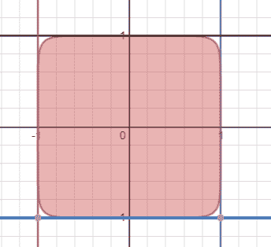

n=10 的图表

最后，圆和方并不矛盾，他们的力量相当。希望你能接受这些观点，不要被怀疑所困扰，我们不走捷径地回到数学。

等等！！！数学宝库中还有很多东西。我们也知道如何移动坐标。左减右加。所以我们不仅可以生成一个正方形，还可以把它放在任何我们想放的地方。不仅如此，我们还可以重新缩放，从而拉伸正方形，使之成为矩形。让我们来试试:

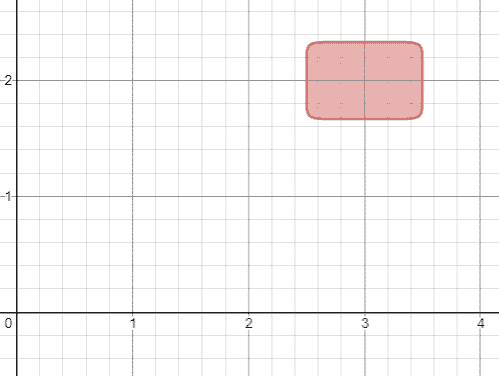

改为矩形:(2(x-3)) ⁰+(3(y-2)) ⁰ <=1; [查看图形](https://www.desmos.com/calculator/7ffauhrnx6)

到现在为止，你们中熟悉更深层次数学的人应该能够明白这与[闵可夫斯基距离](https://en.wikipedia.org/wiki/Minkowski_distance)和[F-范数](https://en.wikipedia.org/wiki/F-space)中的概念有什么联系，但是我们将把它们留到将来。

# 超越圈子

除了圆形和矩形，我们还必须从稍微不同的角度来看待这些图表。这次我们从不等式的角度来看曲线上和小于 1 的点。如果两个正数之和小于 1，那么这两个数字都必须小于 1。类似地，如果有很多这样的项，那么所有的项都必须尽可能小，以使总和不超过 1。即使其中一项大于 1，不等式也不成立。这不是很像交集的思想吗？所选点应位于所有集合中(即所有不等式应给出接近 0 的值)，如果它们甚至不在其中一个集合中，则它们不被选择(即使其中一项大于 1，不等式也不成立)。因此，上面制作的正方形可以被视为两个术语的交集区域，x^(2n) <1 and y^(2n)<1 (referred to as trenches for their shape) as shown below. Higher values of n allow the terms to be as small as possible.

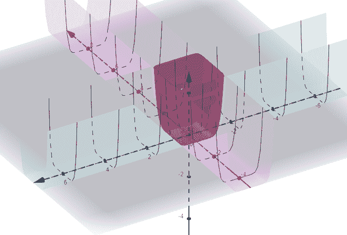

The squares(z = x¹⁰+y¹⁰) as the intersection of 2 trenches made by z=x¹⁰ and z=y¹⁰

And now we have taken a humongous step. We can make very complex figures which emerge from such intersections and take our designing skills to the next level.

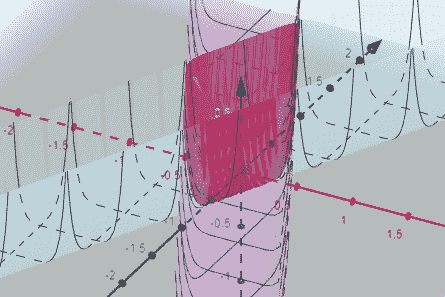

A diamond as the intersection of diagonal trenches: z = (y-2x)¹⁰+(y+2x)¹⁰

We can get back our graph by just making z=1:

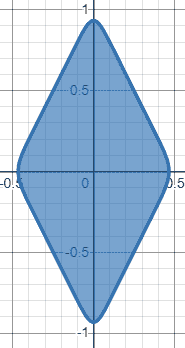

The same figure in 2D: (y-2x)¹⁰+(y+2x)¹⁰<=1\. Higher the power, better is the approximation of intersection. [视图图](https://www.desmos.com/calculator/7ffauhrnx6)

让我们在一些简单的事情上试试这个策略:

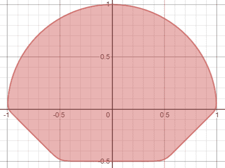

这是一个简单的形状，有三条边和一个圆弧，所以很容易制作。表情:((y+x-1)/2)⁵⁰+((y-x-1)/2)⁵⁰+(y-0.5)⁵⁰+(x+y)⁵⁰<=1; [查看图表](https://www.desmos.com/calculator/7ffauhrnx6)

请记住，我们制作的沟槽在以下位置有壁:y — f(x)=1 和 y — f(x)= -1。这是因为所有小于 1 的绝对值趋于零，因此是沟槽的一部分，而所有大于 1 的绝对值增加得非常快，因此形成了壁。所以我们可以使用下图所示的沟渠。

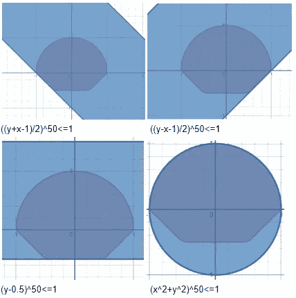

我们现在已经完全准备好制作蝙蝠侠标志，并且已经走了一半以上的路程。策略不仅仅是相交，还包括从曲线中消除区域以雕刻出形状。这是通过一个接一个地提取曲线，并对它们和它们的位置进行精炼以匹配形状来完成的。在某些地方，曲线必须反转，即大于 1 的区域必须小于 1，反之亦然。这是通过改变曲线功率的符号来实现的。请注意，这种策略可以应用于许多形状。所有这些曲线都具有一边大于 1(远离符号)而另一边小于 1(朝向符号)的性质。因此，每个部分都有自己的曲线，然后使用前面描述的大偶次幂的和来组合这些曲线。

使用以下表达式(根据曲线形状选择):

*   f1(x,y):(0.5(x-1.16)^(2.8))^(2)+(y+1.6):右翼下边缘
*   f2(x,y):(0.5(x+1.16)^(2.8))^(2)+(y+1.6):左翼下边缘
*   f3(x,y):(0.5(y+1.6))^(8)+(x+3):左翼的左边缘
*   f4(x,y):(0.5(y+1.6))^(8)+(-x+3):右翼的右边缘
*   f5(x，y):y+0.6:上水平线
*   f6(x,y):(3(x+0.45))^(14)-y+1:头部和翅膀之间的左曲
*   头部和翅膀之间的 f7(x,y):(3(x-0.45))^(14)-y+1:右曲线
*   f8(x,y):e^((3(y-0.1)-258.18((1.9x+0.1)(1.9x-0.1))^(1.6))):形成了头和耳朵

当所有这些曲线组合在一起时，得到下图:

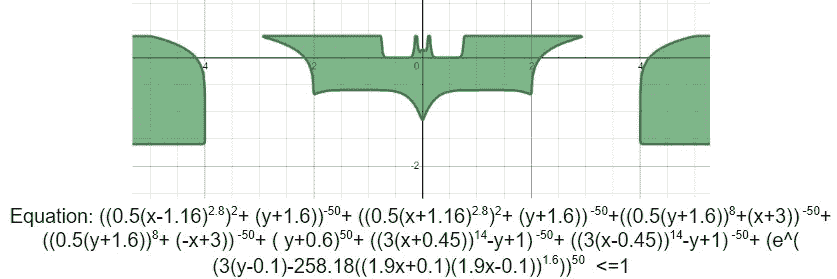

请注意，边上有额外的位，但原始功能是完整的。

为了去除多余的位，通过添加另一项来清理函数，该项在我们想要的形状附近给出接近 0 的值，而在我们不想要的位置给出大于 1 的值。这使得最终数字为:

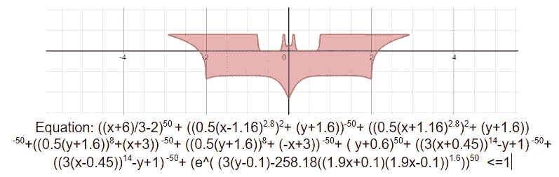

上图经过清洗，有如下等式(第一项多余)；[查看图形](https://www.desmos.com/calculator/7ffauhrnx6)；第一学期做什么？它不会杀死我们的曲线，所以它只是使它更强(通过消除不需要的部分)。

我们可以分别识别曲线的所有部分，如下所示:

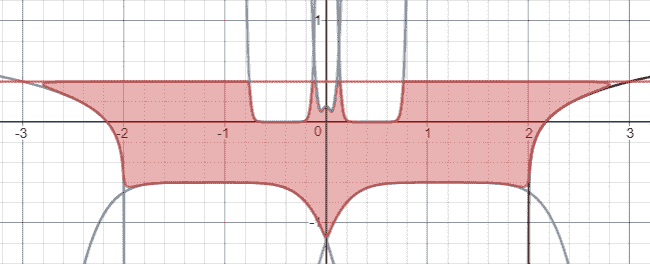

用不等式表示的 f(x，y)=1 形式的所有曲线

# 结论和下一步

我们刚刚获得了对圆和类似的高偶次幂不等式的深刻理解。我们理解了为什么他们的行为像不等式的交集，并通过创造我们自己的蝙蝠侠不等式掌握了这一点。除非有人去做，否则一切都是不可能的。嗯，蝙蝠侠方程式是十年前创立的，所以我们尝试了蝙蝠侠不等式。但是，我们仍然不得不与大国打交道，不得不削减我们的规模，这个过程似乎仍然很复杂。本博客的第二部分将消除所有这些挑战，并简化一切。它还将以 Softmax(我们的分类朋友)、Softplus(众所周知的激活函数)、log-sum-exp(常用函数和 Softmax 之父)和其他相关方向的形式解释这些思想如何与机器学习相关。

数学在申请前是最重要的。而且我向你保证，申请来了！

# 参考

[1] J.S. Grover，[代数表达式的可微集合运算](https://arxiv.org/ftp/arxiv/papers/1912/1912.12181.pdf)(2019)；Arxiv 符号计算。

[2] K.M .肯丁，[单方程可以画图](https://www.tandfonline.com/doi/abs/10.1080/07468342.1991.11973370) (1991)。大学数学杂志 22.2:134–139。