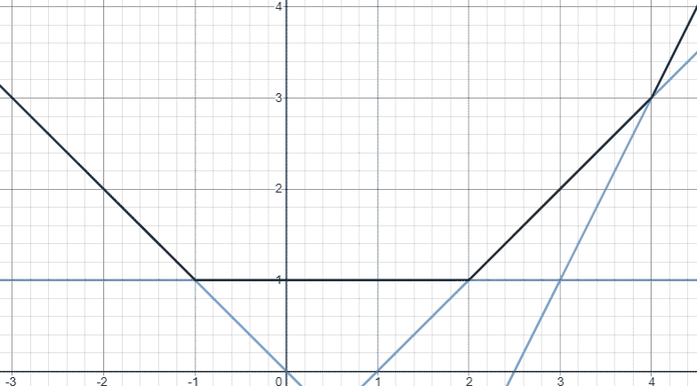

# 从圆形到 ML 通过蝙蝠侠:第二部分

> 原文：<https://towardsdatascience.com/from-circle-to-ml-via-batman-part-ii-699aa5de4a66?source=collection_archive---------42----------------------->

## 更多的艺术！在 ML 中衍生美。

“M”、“L”和蝙蝠侠符号都是单个不等式的结果。[查看图表](https://www.desmos.com/calculator/7ffauhrnx6)

[查看图表](https://www.desmos.com/calculator/9qvj2pgjdd)

# 背景

等等！上面的等式和我们上次发现的不一样吗？是的，非常不同，但看起来还是一样的，或者更好一点。万一你想知道我在说什么，请参考本系列的第一部分。这里陈述的许多观点都来自那篇文章，并且解释得非常清楚。主要的问题是:为什么圆变得像正方形，我们如何把它看作是沟渠的交叉点，以及我们如何通过交叉这些沟渠来构建我们自己的图形和方程。

# 挑战

我们之前用来制作图表的沟渠(左边)在我们的蝙蝠侠(右边)中造成了额外的区域

在战壕里工作并不是一件快乐的事情，不是吗？老实说。他们有两面墙，而我们通常只用一面。另一个只是徘徊，有时会产生不必要的区域。记住，我们也因为同样的原因不得不修剪我们的蝙蝠侠。接下来，我们只能执行战壕的交集和否定(翻转力量的符号),但它们的联合仍然有点挑战性，但非常有用。强大的能力带来了巨大的计算困难。将我们的输入提升到非常高的幂是不常见的，并且在计算上也不是非常有效。因此，我们先前所获得的范围受到了我们设计技巧的限制。

数学的宇宙集合是无限的，我们永远无法将它表达为我们有限思想的结合。所以，让我们开始寻找应对挑战的解决方案吧！

# 从战壕到边界

请记住，每当权力变得太大，无法控制，对数和指数来拯救。有壕沟的根本原因是当使用大的偶次幂时，会形成两堵墙。一个在 y-f(x)=1(我们一般用这个)，另一个在 y-f(x)=-1(我们一般弃用这个)。因此，我们必须做一些改变，使每个沟槽只有一面墙(这使它只是一面墙)。我们可以很容易地做到这一点。只是用 e^(nx).代替 x^(2n)一切正常的主要原因是，对于大于 1 的绝对输入值，我们的函数会快速增加到 1 以上，而对于小于 1 的输入值，我们的值接近于零。在 e^(nx 的情况下)对于正 x，我们的输出值很快超过 1，而对于负 x，它们接近于零。第一个挑战解决了！指数是常用的，并且有快速的实现。这是一个很好的财产，不是吗？

一堵墙总是比一条沟好，尤其是当没有人需要为此付钱的时候(至少在我们的例子中不是计算上)。

# 补集、交集和并集

一旦我们有了这个合适的工具，我们就能明白我们能用它做什么伟大的事情。我们刚刚定义的边界对于负 x 有接近于零的值，对于正 x 趋向于无穷大，那么让我们来理解什么是集合。这里的集合本质上是一个类似 y≤x 或 x +y -1≤0 的不等式。这些集合的边界就是我们想要表现的。因此，我们可以乘以大的 n，并对两边取幂来得到我们的边界。因此，y-x≤0 将看起来像 e^(50(y-x))≤1，类似于(y-x)⁵⁰≤1(我们以前的一个战壕边界)。我们前面看到的逻辑同样适用于这两种情况。

让我们看看集合的补集，我们可以像上次一样，通过简单地改变幂的符号来得到它。

[查看图表](https://www.desmos.com/calculator/c0uv8c4buy)

接下来，让我们看看我们最喜欢的十字路口。这和我们之前推导的一样，因为小数字之和小于 1 的逻辑没有什么不同。这可以从以下几个方面来看:

[查看图表](https://www.desmos.com/calculator/zcv5swv5cv)

最后是我们的新人，尤宁。我们来推导一下。根据德-摩根定律，我们知道 AUB = (A'∩B ')'。因此，这意味着集合的逆和的逆。啊啊！这就像你如何评估并联电阻的电阻(1/Rt=1/R1+1/R2)。或者，对于熟悉的人来说，是调和平均数而不是总和。让我们看看:

[查看图表](https://www.desmos.com/calculator/su86gumxpr)

还有一个很重要的观察。集合内点的值趋于零，集合外点的值趋于无穷大的性质也适用于上述集合运算的结果。因此，这些集合运算也是可重复的，无需再次求幂。这意味着我们可以通过逐一应用上述集合运算来计算更复杂的运算，如 AU(B∩(CUD))。

代数和集合论中各种想法的结合引导我们通过数学和创造性艺术的狭窄交叉。总结我们所有的高能量想法，我可以说与我们目标的差异将很快趋于零。还有最后一项活动，我想对其进行指数运算，我们将为机器学习的应用做好准备。

# 让我们做点什么吧！

让我们制作下面的拼图:

[查看图表](https://www.desmos.com/calculator/lbnpmet4hf)

上面的等式可以通过首先创建一个正方形，然后与两个圆(突出的那些)合并，接着与另外两个圆(移除的那些)的补集相交来获得。设正方形的 4 条边分别表示为 A、B、C、d，每条边是一条直线。进行并的圆被表示为 E 和 F，而被去除的圆被表示为 G 和 H，因此上图为:((A ∩ B ∩ C ∩ D) U E U F) ∩ G' ∩ H '。

让我们来代表这些集合:

*   答:e^(50(x-1)
*   B: e^(-50(x+1))减号来改变集合的方向(使其面向图内)
*   丙:e^(50(y-1))
*   D: e^(-50(y+1))减号来改变集合的方向
*   E: e^(50((x+1) +y -0.25))
*   F: e^(50((x) +(y-1) -0.25))
*   G: e^(50((x-1) +(y) -0.25))
*   H: e^(50((x) +(y+1) -0.25))

表演(A ∩ B ∩ C ∩ D)给出:(e^(50(x-1))+e^(-50(x+1))+e^(50(y-1))+e^(-50(y+1)))

接下来是与圆结合，从而给出:

((e^(50(x-1))+e^(-50(x+1))+e^(50(y-1))+e^(-50(y+1)))^-1+e^(-50((x+1)+y -0.25))+e^(-50((x)+(y-1)-0.25)))^-1

最后，与另外两个圆的补集相交，得到上图所示的理想方程。

所有上述操作也与我们之前所学的相一致，因此正方形可以恢复其真实的形状:x⁵⁰+y⁵⁰=1.给出了如下所示的相同图形的替代等式。注意第一项。

((x⁵⁰+y⁵⁰)^-1+e^(-50((x+1)+y -0.25))+e^(-50((x)+(y-1)-0.25)))^-1+e^(-50((x-1)+(y)-0.25))+e^(-50((x)+(y+1)-0.25))≤1

[查看图表](https://www.desmos.com/calculator/dz07bzhabx)

# 真实应用

请记住，如果我们可以创建好看的图形和它们的方程，那么我们也可以创建一些在各个领域中常用的非常有趣的函数，甚至为我们自己创建一些函数。我的背景是机器学习，因此我熟悉在我的领域中使用的一些功能。

## 导出 Log-sum-exp 和 Softmax

我们都已经学习了很多关于 max 函数的知识，它接受多个数字，然后吐出最大的一个。在机器学习的许多应用中，我们希望最大值运算不仅尽可能接近实际的最大数，而且与非最大数有某种关系。这些数字越接近最大值，它们对结果的贡献就越大。这是很重要的，因为它允许梯度在反向传播或其他训练算法期间也通过非最大值项传播。不深入 ML，我们可以说我们需要一个最大运算的近似值，它考虑了所有的项。这种固定(硬)决策函数的近似，如 max、if-else、排序等。叫做**软化**。

max 本质上是什么？它是单个函数的联合，最大的一个在输出端显示。请注意，union 运算中最大的函数下面会自动包含较小的函数。对于一维示例，max(y=1，y=2，y=3)是 y=3。我们也可以把这个写成并集的边界(y≤1，y≤2，y≤3)。联合是 y≤3，所以边界是 y=3。让我们想象一些更真实的函数:

深蓝色曲线代表 4 条输入线的最大值。因为这等同于对给定输入 x 的每个输出执行 max，所以它被称为逐点 max。

设输入函数为 f(x)，g(x)和 h(x)。我们可以把它们表示为 y-f(x)≤0，y-g(x)≤0，y-h(x)≤0。让我们执行这些边界的并集，以生成最大值函数的近似值:

(e^(-n(y-f(x))+e^(-n(y-g(x))+e^(-n(y-h(x)))^-1≤1

取边界上的点，我们得到:(e^(-n(y-f(x))+e^(-n(y-g(x))+e^(-n(y-h(x)))^-1=1

重新排列结果，使其成为 x 的函数，得到:

y = ln(e^(nf(x))+e^(ng(x))+e^(nh(x)))/n

这实质上是对数和指数的形式。1/n 通常指温度，记为 T，通常取为 1。对于多个术语，我们得到:y=ln(sum(e^xᵢ，所有 I)。由此导出其名称 log-sum-exp (LSE)。

之前说的软化和 ML 是怎么回事？请注意，log-sum-exp 始终大于实际最大值。这种差异解释了第二大项、第三大项等等。如上式所示，输出是所有项的混合，但较大项的贡献要比较小项大得多，因为我们已经逼近了最大值运算。记住！！n 的值越大，圆越接近正方形。类似地，较大的 n 意味着较大的项比较小的项贡献更大，从而使近似更精确。注意弯曲的可微角，这是我们近似的另一个好处，在 ML 中非常有用。顺便问一下，对数和指数的导数是什么？是我们共同的朋友 [Softmax](https://en.wikipedia.org/wiki/Softmax_function) (对，分类层一)。我希望现在你能明白这个著名的函数是如何得到它的名字的。是的，我知道这不是维基百科的文章，所以我会继续。

不同 n 值的图表。随着 n 值的增加，近似性提高；[查看图表](https://www.desmos.com/calculator/04gwq2oaza)

对数和指数方程的应用并不少见。它的许多属性都在它的维基百科页面上讨论过。也有论文直接用它作为架构，就像用它作为[泛凸逼近器](https://arxiv.org/abs/1806.07850)和[泛函数逼近器](https://arxiv.org/abs/1905.08503)一样。这个函数有更多的应用，因此它在从 Numpy 到 Pytorch 和 Tensorflow 的几乎所有 ML 库中都内置了有效的实现。即将到来的应用程序就像这一个的特例。

## 导出软加激活函数

软加激活是神经网络中使用的一种非线性类型。一种常见的非线性是 ReLU，其形式为 max(0，x ),非常常用。在这篇[论文](https://www.cs.toronto.edu/~fritz/absps/reluICML.pdf)中描述的许多条件下，我们需要近似 ReLU 函数。不要深究激活函数和 ML 细节，我们可以通过用我们刚刚学到的方法近似 ReLU 函数来处理这个挑战。

因此，我们必须近似 max(0，x)。为什么不直接引用我们的对数和指数的推导。需要的两个分量是 y≤0 和 y-x≤0。这将因此给联盟作为(e^(-ny)+e^(-n(y-x)))^-1≤1.这将因此给我们以下等式:y = ln(1+e^(nx))/n.当 n 是 1 时，这被称为软加激活函数。除了最初的论文，这个函数还被用于其他激活函数，如 [swish](https://arxiv.org/pdf/1710.05941.pdf) 、 [mish](https://arxiv.org/ftp/arxiv/papers/1908/1908.08681.pdf) 和 [soft++](https://www.sciencedirect.com/science/article/pii/S0925231219317163) 。

随着 n 的增加，近似性提高；[查看图表](https://www.desmos.com/calculator/crjddxsx8g)

我们甚至可以超越并创造出我们自己的 softplus 变种，称之为 leaky-softplus。本质上是使用相同程序的 leaky-ReLU ( max(0.05x，x))的近似值。该函数采用以下形式:y = ln(e^(0.05nx)+e^(nx))/n.，根据通常的惯例，我们设 n=1。结果如下所示。测试和实验留给读者。；-)

不同 n 下的漏软加；[查看图表](https://www.desmos.com/calculator/1q4zupgbbt)

## 推导对数损耗

在许多回归任务中，使用被称为绝对损失的损失函数，其本质上是误差的平均绝对值。这种损失在零处是不可微的，并且对于使用高阶导数的训练算法也没有二阶导数。Log-cosh 通过对其进行近似处理很好地处理了这些问题，因此看起来像接近零的均方误差和远离它的绝对损失。更多信息可在这篇文章中了解。因此，我们必须近似|x|,它本质上是 max(x，-x)。我们可以用同样的老把戏得到:y=ln(e^nx+e^-nx)/n.我们还没有达到我们的目标。我们现在可以加减 ln(2)/n，给我们:ln((e^nx+e^-nx)/2)/n+ln(2)/n.下一步是使 n=1，忽略常数，因为它不影响训练过程。这给了我们:ln((e^x+e^-x)/2)也就是 ln(cosh(x))。这是我们的对数损失函数。

注意与 0 附近的抛物线相似。这就是我们进行 ln(2)调整的原因。[查看图表](https://www.desmos.com/calculator/u8zw0ymkp0)

# 结论

纯粹出于好奇的简单想法可以有非常广泛的应用。好奇心和它能给我们的东西没有上限。希望这些文章为您提供了新的工具和视角，您可以将其应用于科学、工程和艺术等不同的领域。对于好奇的人，我想留下一个很好的资源来提高您对这一思想的理解:[代数表达式的可微集合运算](https://arxiv.org/ftp/arxiv/papers/1912/1912.12181.pdf)。

# 挑战

用一个不等式得出这个数字:

[解决方案！](https://www.desmos.com/calculator/0e3hydc8uw)

用一个不使用模函数的不等式制作这个图形:

这个图形向四面八方无限延伸。[解决方案。](https://www.desmos.com/calculator/6ul7lu9o5p)