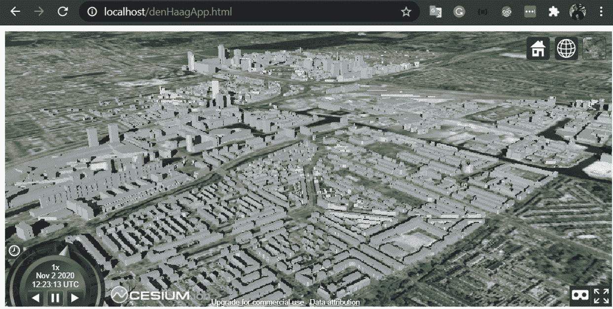
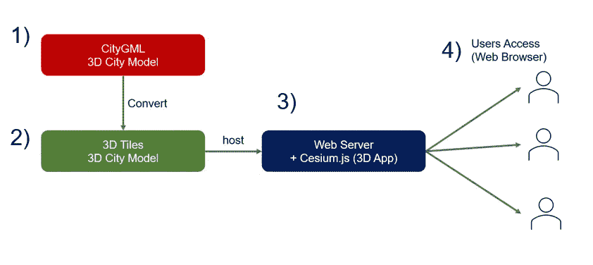
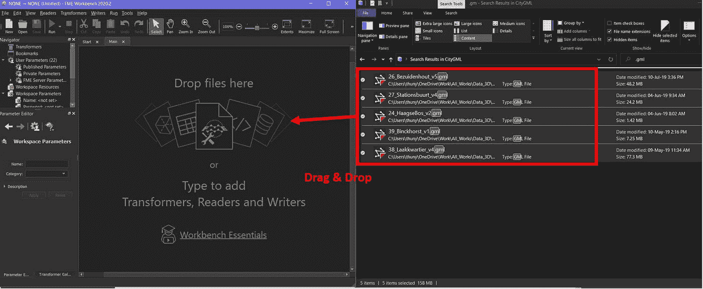
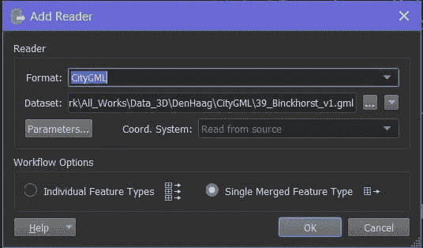
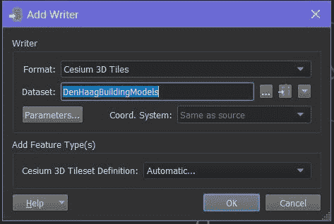
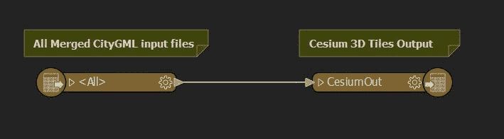
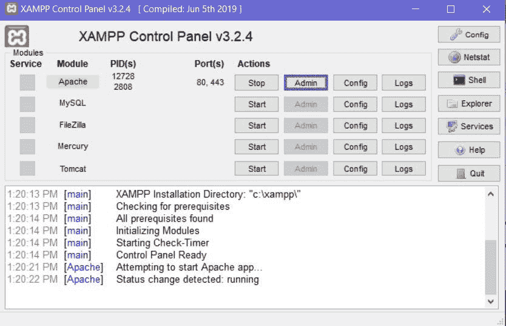
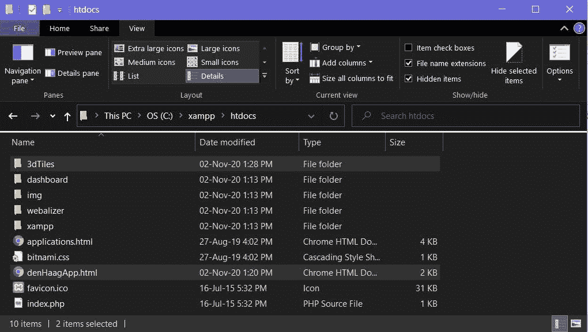

# 从 CityGML 三维城市模型到三维网络应用

> 原文：<https://towardsdatascience.com/from-citygml-3d-city-model-to-3d-web-application-829eb8e90514?source=collection_archive---------20----------------------->

## [实践教程](https://towardsdatascience.com/tagged/hands-on-tutorials)

## 在 Web 应用程序上可视化 CityGML 的分步指南——荷兰海牙市的一个示例区域。



**本教程的预期输出截图——在海牙地区使用 3D 语义建筑模型的 3D 网络应用**(作者)

基于虚拟地球的 3D 可视化最新技术是一个独特的机会，可以促进各种应用领域的高级分析和可视化任务，如城市规划、室内/室外步行导航、环境模拟、文化遗产或设施管理。让这个概念成为现实的一个核心数据是由开放地理空间联盟(https://www.ogc.org/ OGC—)开发的 CityGML 模型。CityGML 是用于描述 3D 地理空间化城市模型的全球数据模型模式。公开提供开源 CityGML 模型的城市越来越多。

本文将指导您如何基于这些 CityGML 3D 城市模型数据集使用 CesiumJS 创建交互式 3D web 地图。本指南材料最初是(由作者)特别为 2020 年荷兰大地测量和地理信息中心(NCG) [研讨会](https://ncgeo.nl/index.php/en/actueelgb/nieuwsgb/item/2814-ncg-symposium-2020)的[研讨会](https://pengdlzn.github.io/events/interactive-online-maps/)制作的。

# 架构和工作流程



**基于这些 CityGML 3D 城市模型使用 CesiumJS 创建交互式 3D 网络地图的工作流程**(作者)

3D 网络 app 的整体系统架构如上图所示。它包括四个主要组件:CityGML 数据集、3D Tiles 数据集、Web 服务器和用户。

*   **组件 1) CityGML 3D 城市模型**
*   **组件 2) 3D 瓦片城市模型**
*   **组件 3)网络服务器**
*   **组件 4)用户**

## 因此，让我们开始一起创建每个组件💻

# 组件 1) CityGML 3D 城市模型

我们可以下载 CityGML 格式的 3D 城市模型。在这篇文章中，我选择了海牙地区的 3D 城市模型，因为它是一个紧凑的模型。

*   从下载部分的[https://den haag . data platform . nl/#/data/36049 d1a-4a 0f-4c 5d-8 ADB-21 dbfb 7252 F9](https://denhaag.dataplatform.nl/#/data/36049d1a-4a0f-4c5d-8adb-21dbfb7252f9)下载 CityGML 数据集。

当然，您也可以自由探索其他 CityGML 数据集。越来越多的城市公开提供数据集，如下文所列:

[](/open-source-3d-semantical-building-models-in-2020-f47c91f6cd97) [## 2020 年开源 3D 语义建筑模型

### 开源 3D 城市模型的完整列表(2020 年 10 月更新)

towardsdatascience.com](/open-source-3d-semantical-building-models-in-2020-f47c91f6cd97) 

# 组件 2) 3D 瓦片城市模型

为了优化 3D web 可视化，必须将 CityGML 转换为 3D 切片格式。有几种工具可以执行这种转换。在这篇文章中，我们将使用 FME，它有一个[开放免费许可证](https://www.safe.com/free-fme-licenses/)至少可以免费使用一年，供家庭、研究人员等使用。

## **用 FME 将 CityGML 模型转换成 3D 瓦片**

*   从打开 FME 工作台开始，将所有 CityGML 模型拖放到 FME 窗口。



*   选择输入格式“CityGML”和工作流选项“单一合并要素类型”。



*   点击“添加一个新的作家”按钮，并选择格式“铯三维瓷砖”



*   工作流应该如下图所示。单击运行，然后等待转换完成。然后，最终的 3D 平铺城市模型将位于您输入的目标文件夹中。



# 组件 3) Web 服务器

## 使用 CesiumJS 库准备 3D Web 应用程序

在这一步中，我们将使用 CesiumJS 库创建一个包含 3D Web Globe 的 HTML web 文档。你可以使用任何你喜欢的代码空闲或编辑器。我的选择是 VS 代码。然后，创建一个名为“denHaagApp.html”的文件。您可以使用自己喜欢的名称创建文档，并遵循下面的示例 HTML 代码。

*   CesiumJS 查看器(第 13 行)是构建具有灵活设置的 3D globe 的主要组件(如本例中的第 14 到 21 行)。您可以查看 [CesiumJS API 文档](https://cesium.com/docs/cesiumjs-ref-doc/Viewer.html)了解更多可用设置。
*   3D Tiles 数据可以作为 tileset 加载到 CesiumJS 查看器中(第 23 到 25 行)。不要忘记在第 24 行指定目标 Tileset.json 的 URL。您可以查看文档 [CesiumJS API 文档](https://cesium.com/docs/cesiumjs-ref-doc/Viewer.html)了解更多关于 3D Tiles 数据集的设置。

## 在 Web 服务器上托管 3D Web 应用程序

这一步，我们将在 Web 服务器上托管第 2 步中的 Web 应用程序和第 1 步中的 3D Tiles 城市模型。你可以自由使用任何你喜欢的网络服务器。在这个例子中，我们使用 XAMPP 开源 web 服务器。(可以从[https://www.apachefriends.org/index.html](https://www.apachefriends.org/index.html)那里得到)

*   安装 XAMPP。打开 XAMPP 控制面板并启动 APACHE web 服务器。或者，您可以通过*C:\ xampp \ Apache \ bin \ httpd . exe 手动启动 Apache。*



**用 XAMPP 控制面板启动 Apache web 服务器。**(作者)

*   在 macOS 和 Linux 中，您可以使用终端输入以下命令来触发 Apache HTTP 服务。

```
**$ sudo apachectl -k start** // start Apache **$ sudo apachectl -k stop** // stop Apache **$ sudo apachectl -k restart** // restart Apacheor **$ sudo /usr/sbin/apachectl -k start** // start Apache **$ sudo /usr/sbin/apachectl -k stop** // stop Apache **$ sudo /usr/sbin/apachectl -k restart** // restart Apache
```

*   将最后一节中的 web 文档(【denHaagApp.html】)和组件 2)中的 output 3D Tiles city models 文件夹放在 C:\xampp\htdocs 目录中。



**复制并粘贴 3D 瓷砖模型和 web 文档。**(作者)

*   在 HTML web 文档中，将 URL 值更新到 *htdocs* 文件夹中 3D Tiles 模型的 tileset.json 文件。例如，如果您的 3D Tiles 目录位于 C:\ xampp \ htdocs \ 3D tile \ tileset . JSON .您应该将 URL 值设置为"*。/3dtile/tileset.json* "或"*http://localhost/3d tile/tileset . JSON*"因为 APACHE 将为相对于" *http://localhost* "的 *htdocs* 目录中的所有内容提供服务。

# 组件 4)用户

前三个组件完成后，我们可以通过 Web 服务器测试 3D Web 应用程序。您可以在您的 web 浏览器上访问您的 3D web 应用程序可视化 3D 城市模型，网址为[http://localhost/denhaagapp . html](http://localhost/denHaagApp.html)


**用本地主机测试 3D Web App。**(作者)

# 结论

本文提供了从 CityGML 语义 3D 城市模型创建 3D 基于 web 的应用程序的分步教程。该指南首先介绍了 CityGML 数据模型。然后，引入 FME 作为从 CityGML 到 3D 瓦片格式的转换工具。最终的 3D web 应用程序由 CesiumJS 库创建，托管在 Apache HTTP web 服务器上。

# 作者

**Thunyathep Santhanavanich(JOE)**博士候选人
地理信息、计算机科学和数学系，
应用科学大学，斯图加特，Schellingstr。24、D-70174 斯图加特
[thunyathep . santhanavanich @ hft-Stuttgart . de](mailto:thunyathep.santhanavanich@hft-stuttgart.de)

⭐需要我协助你的项目吗？在这里找到我[⭐](https://www.fiverr.com/joe_ths)

# 引用

[1]吴，何，何，龚等(2010).公众参与城市规划过程的基于虚拟地球的三维可视化和交互式框架。计算机，环境和城市系统，34(4)，291–298。[https://doi.org/10.1016/j.compenvurbsys.2009.12.001](https://doi.org/10.1016/j.compenvurbsys.2009.12.001)

喜欢这篇文章吗？成为 [*中等会员*](https://medium.com/@joets/membership) *继续无限制学习。如果你使用下面的链接，我会收到你的一部分会员费，不需要你额外付费。*

[](https://medium.com/@joets/membership) [## 通过我的推荐链接加入 Medium-Joe t . Santhanavanich

### 作为一个媒体会员，你的会员费的一部分会给你阅读的作家，你可以完全接触到每一个故事…

medium.com](https://medium.com/@joets/membership)