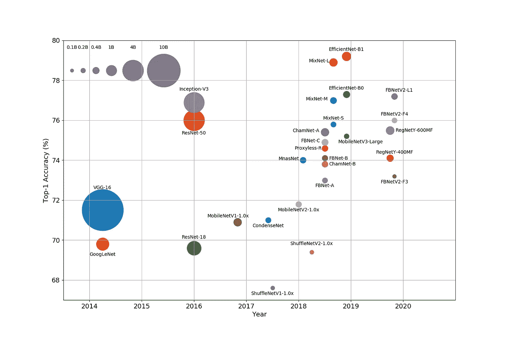

# 从云到设备

> 原文：<https://towardsdatascience.com/from-cloud-to-device-the-future-of-ai-and-machine-learning-on-the-edge-78009d0aee9?source=collection_archive---------40----------------------->

在 [Unsplash](https://unsplash.com/s/photos/cliff?utm_source=unsplash&utm_medium=referral&utm_content=creditCopyText) 上 [trail](https://unsplash.com/@trails?utm_source=unsplash&utm_medium=referral&utm_content=creditCopyText) 拍摄的照片

## 人工智能和机器学习的未来在边缘

*在设备上训练 ML 模型的最新技术的简要概述。要进行更全面的调查，请阅读我们关于本主题* 的 [*全文。*](https://arxiv.org/abs/1911.00623)

我们被智能设备包围着:从手机、手表到眼镜、珠宝，甚至衣服。但是，虽然这些设备小巧而强大，但它们仅仅是计算冰山的一角，这个冰山始于你的指尖，终于遍布世界各地的巨大数据和计算中心。数据从设备传输到云，在云上用于训练模型，然后再传输回来部署到设备上。除非用于学习简单的概念，如唤醒词或识别你的脸来解锁你的手机，否则机器学习在计算上是昂贵的，数据在转化为有用的信息之前别无选择，只能传播数千英里。

这种从设备到数据中心再回到设备的旅程有其缺点。用户数据的隐私和安全性可能是最明显的，因为这些数据需要传输到云中并存储在那里，通常是无限期的。用户数据的传输容易受到干扰和捕获，存储的数据也有可能遭到未经授权的访问。但是还有其他明显的缺点。基于云的 AI 和 ML 模型具有更高的延迟，实施成本更高，缺乏自主性，并且根据模型更新的频率，通常更不个性化。

随着设备变得越来越强大，通过将部分或全部模型开发转移到设备本身来解决云模型的缺点成为可能。将模型开发转移到设备上通常被称为边缘学习或设备上学习。进行边缘学习的最大障碍是模型训练，这是模型开发过程中计算量最大的部分，尤其是在深度学习时代。通过向设备添加更多资源或者更有效地使用这些资源或者两者的某种组合，可以加速训练。

> 将模型开发转移到设备上通常被称为边缘学习或设备上学习。

图 1:边缘/设备上学习的各种方法的分层视图。灰色方框是本文和相应论文中涉及的主题。作者图片

图 1 给出了改进设备上的模型训练的方法的分层视图。左边是与实际芯片组一起工作的硬件方法。该领域的基础研究旨在改进现有的芯片设计(通过开发具有更多计算和内存、更低功耗和更小尺寸的芯片)或开发具有新型架构的新设计，以加快模型训练。虽然硬件研究是改善设备上学习的有效途径，但它是一个昂贵的过程，需要大量的资本支出来建立实验室和制造设施，并且通常涉及长时间的开发。

软件方法包含了该领域当前工作的很大一部分。每种机器学习算法都依赖于一小组计算库来高效执行一些关键操作(如神经网络中的乘法-加法)。支持这些操作的库是硬件和算法之间的接口，并允许不基于任何特定硬件架构的算法开发。然而，这些库被大量调整到执行操作的硬件的独特方面。这种依赖性限制了新库所能获得的改进。当涉及到在边缘上改进 ML 时，软件方法的算法部分得到了最多的关注，因为它涉及到机器学习算法本身的开发和改进。

最后，理论方法有助于指导最大似然算法的新研究。这些方法提高了我们对现有技术的理解，以及它们对新问题、环境和硬件的可推广性。

这篇文章集中在算法和理论方法的发展。虽然硬件和计算库同等重要，但考虑到新硬件的长交付周期以及硬件和库之间的相互依赖性，算法和理论空间的最新发展变化更快。

# 算法

设备上 ML 的大部分工作都是部署模型。部署侧重于使用模型量化和模型压缩等技术来提高模型大小和推理速度。对于设备上的训练模型，需要在模型优化和超参数优化(HPO)等领域取得进展。但是，这些领域的进步提高了准确性和收敛速度，通常是以计算和内存使用为代价的。为了改进设备上的模型训练，重要的是具有知道这些技术将在其中运行的资源约束的训练技术。

> 为了改进设备上的模型训练，重要的是具有知道这些技术将在其中运行的资源约束的训练技术。

进行这种资源感知模型训练的主流方法是设计满足代理软件中心资源约束而不是标准损失函数的 ML 算法。这种替代测量被设计成通过渐近分析、资源剖析或资源建模来近似硬件约束。对于给定的以软件为中心的资源约束，最先进的算法设计采用以下方法之一:

**轻量级 ML 算法** —现有算法，如线性/逻辑回归或支持向量机，具有较低的资源占用，并且不需要对资源受限的模型构建进行额外的修改。这种低占用空间使得这些技术成为构建资源受限学习模型的简单而明显的起点。但是，如果可用设备的资源小于所选轻量级算法的资源占用，这种方法将会失败。此外，在许多情况下，轻量级 ML 算法导致模型复杂度低，可能无法完全捕捉底层过程，从而导致拟合不足和性能不佳。

**降低模型复杂性** —控制学习算法的大小(内存占用)和计算复杂性的更好方法是通过约束模型架构(例如，通过选择更小的假设类)。这种方法具有额外的优势，即这些模型可以使用传统的优化例程来训练。除了模型构建，这是为模型推理部署资源高效模型的主要方法之一。最重要的是，这种方法甚至可以扩展到深度神经网络(DNNs ),如图 2 所示，这是朝着更小、更快、更精简架构的缓慢但稳定的进展。这一进展得益于神经结构搜索(NAS)技术的使用增加，该技术显示出对更小、更有效的网络的偏好。与轻量级 ML 算法方法相比，模型复杂性降低技术可以适应更广泛的 ML 算法类别，并且可以更有效地捕获底层过程。

图二。模型复杂性按时间顺序演变的球形图。最高精度是在 ImageNet 数据集上测量的。模型复杂性由 FLOPS 表示，并由球的大小反映。精确度和误差来自模型的原始出版物。模型的时间是相关联的出版物首次在线可用的时间。郭俊耀图片。

**修改优化例程** —算法上最重要的进步是专门针对资源高效模型构建的优化例程的设计，其中在模型构建(训练)阶段纳入了资源约束。这些方法不是预先限制模型架构，而是可以调整优化例程以适应任何给定模型架构(假设类)的资源约束。

资源受限的以模型为中心的优化例程关注于通过随机舍入、权重初始化或通过将量化误差引入梯度更新来提高将在训练后量化的模型的性能。分层训练和用计算换取内存的技术也很流行，这两种技术都试图减少与训练 dnn 相关的计算需求。在某些情况下，这种方法还可以动态地修改架构以适应资源约束。尽管这种方法提供了更广泛的模型类别选择，但设计过程仍然依赖于特定的问题类型(分类、回归等)。)并取决于所选择的方法/损失函数(线性回归，回归问题的岭回归)。

资源受限的通用优化例程，如 Buckwild！SWALP 致力于通过使用低精度算法进行梯度计算来减少模型训练的资源占用。另一条工作路线涉及实现定点二次规划(QP ),例如用于求解线性模型预测控制(MPC)的 QSGD 或 QSVRG。这些算法中的大多数涉及修改凸优化的快速梯度方法，以在资源受限的设置下在有限次迭代中获得次优解。

**数据压缩** —数据压缩不是限制模型的大小/复杂性，而是在压缩数据的基础上构建模型。目标是通过固定的每样本计算成本来减少数据存储和计算，从而限制内存使用。一种更通用的方法包括采用高级学习设置，以适应样本复杂度更小的算法。然而，这是一个更广泛的研究课题，不仅仅局限于设备上的学习。

**数据观察的新协议** —最后，完全改变传统数据观察协议的全新方法是可能的(如在批处理或在线设置中 i.i.d .数据的可用性)。这些方法由潜在的资源约束学习理论指导，该理论根据泛化能力捕捉资源约束和模型的良好性之间的相互作用。与上述方法相比，该框架提供了一种通用机制来设计资源受限算法，用于更广泛的学习问题，适用于针对该问题类型的任何方法/损失函数。

**挑战**如果没有恰当地抽象出硬件依赖性，相同的模型和算法在不同的硬件上可能会有非常不同的性能特征。虽然新的损失函数可以考虑这种依赖性，但它仍然是一个相对较新的研究领域。在许多情况下，假设可用于培训的资源预算不会改变，但通常情况下不会。我们的日常设备通常是多任务的——查看电子邮件、社交媒体、给人发消息、播放视频……不胜枚举。这些应用和服务在任何给定时刻都在不断争夺资源。将这种不断变化的资源状况考虑在内，对于有效的边缘模型训练来说是一个重要的挑战。

最后，需要改进的模型分析方法来更准确地计算算法的资源消耗。这种测量的当前方法是抽象的，并且集中于应用软件工程原理，例如渐近分析或像 FLOPS 或 MACs(乘加计算)这样的低级测量。这些方法都没有给出资源需求的整体概念，并且在许多情况下代表学习期间系统所需的总资源的微不足道的一部分。

# 理论

每一种学习算法都是基于一种保证其性能某些方面的基本理论。该领域的研究主要集中在*可学性*——开发框架来分析算法的统计方面(即错误保证)。虽然传统的机器学习理论是大多数当前方法的基础，但开发包含资源约束的新的可学习性概念将有助于我们更好地理解和预测算法在资源受限的环境下将如何表现。大多数现有的资源受限算法可以分为两大类理论

**传统学习理论** —大多数现有的资源受限算法是根据传统的机器学习理论(如 PAC 学习理论、错误界限、统计查询)设计的。这种方法的局限性在于，这些理论主要是为分析用于模型估计的算法的误差保证而建立的。资源约束对算法泛化能力的影响没有通过这样的理论直接解决。例如，使用降低模型复杂性的方法开发的算法通常采用两步方法。首先，假设类的大小被预先限制为那些使用较少资源的假设类。接下来，设计一种算法来保证该假设类中的最佳模型。这种框架所缺少的是错误保证和资源约束之间的直接相互作用。

**资源受限的学习理论** —更新的学习理论试图克服传统理论的缺点，特别是因为新的研究表明，在资源受限的设置下，学习假设类可能是不可能的。早期的大多数算法假设新的数据观察协议都属于资源受限理论的范畴。通常，这种方法修改了以批处理或流式方式呈现的 i.i.d .数据的传统假设，并引入了限制该方法所使用的存储器/空间占用的数据可观察性的特定协议。这些理论提供了一个平台，在内存受限的设置下，利用现有的计算高效的算法来建立具有强错误保证的机器学习模型。著名的资源受限学习理论包括有限注意力焦点(RFA)、基于新的统计查询(SQ)的学习范式，以及将假设类建模为假设图的基于图的方法。分支程序在资源约束(记忆)下以矩阵的形式(与图相反)翻译学习算法，其中在矩阵范数的稳定性(以其最大奇异值的上界的形式)和具有有限记忆的假设类的可学习性之间存在联系。虽然这种理论驱动的设计提供了一个通用框架，通过该框架可以为广泛的学习问题设计算法，但是迄今为止，基于这些理论开发的算法非常少。

**挑战**

# 结论

当我们把第一代 iPhones 放进口袋时，充满智能设备的未来还是科幻小说中的东西。13 年后，设备变得更加强大，现在承诺人工智能和人工智能的力量就在我们的指尖。然而，这些新发现的能力是由大规模计算资源(数据中心、计算集群、4G/5G 网络等)支撑的门面，这些资源将人工智能和人工智能带入了生活。但是，只有当设备能够切断它们和云之间的生命线时，它们才能真正强大。这需要在这些设备上而不是在云中训练机器学习模型的能力。

迄今为止，在设备上训练 ML 模型仍然是一种学术追求，但随着智能设备数量的增加和硬件的改进，人们对在设备本身上执行学习产生了兴趣。在行业中，这种兴趣主要是由硬件制造商推动的，这些硬件制造商推广针对特定数学运算进行优化的人工智能专用芯片组，以及主要在计算机视觉和物联网领域为特定利基领域提供特别解决方案的初创公司。从 AI/ML 的角度来看，大部分活动位于两个领域——开发可以在资源约束下训练模型的算法，以及开发为这种算法的性能提供保证的理论框架。

在算法层面，很明显，当前的努力主要针对利用已经轻量级的机器学习算法，或者以减少资源利用的方式修改现有算法。在我们能够在边缘上一致地训练模型之前，存在许多挑战，包括需要将算法与硬件解耦，以及设计捕捉资源约束的有效损失函数和度量。同样重要的是，扩展对具有低样本复杂度的传统以及高级 ML 算法的关注，并且处理资源预算是动态的而不是静态的情况。最后，提供一种简单可靠的方法来分析资源约束下的算法行为将会加快整个开发过程。

资源受限算法的学习理论关注的是算法在资源受限情况下的不可学性质。自然的下一步是找出能够保证算法可学性和相关估计误差的技术。现有的理论技术也主要关注这些算法的空间(存储)复杂性，而不是它们的计算要求。即使在可以确定满足资源限制的理想假设类别的情况下，也需要进一步的工作来从该类别中选择最佳模型。

尽管有这些困难，边缘机器学习的未来是令人兴奋的。即使是深度神经网络，模型规模也一直在下降。苹果的 Core/CreateML 等主要平台都支持设备上模型的再训练。虽然模型的复杂性和训练制度继续增长，但出于隐私和安全、成本、延迟、自主性和更好的个性化的原因，我们可能会继续看到将计算从云卸载到设备的趋势。

本文由 Sauptik Dhar、Junyao Guo、Samarth Tripathi、Jason Liu、Vera Serdiukova 和 Mohak Shah 供稿。

*如果你有兴趣对边缘学习进行更全面的调查，请阅读我们关于这个话题的* [*全文*](https://arxiv.org/abs/1911.00623) 。