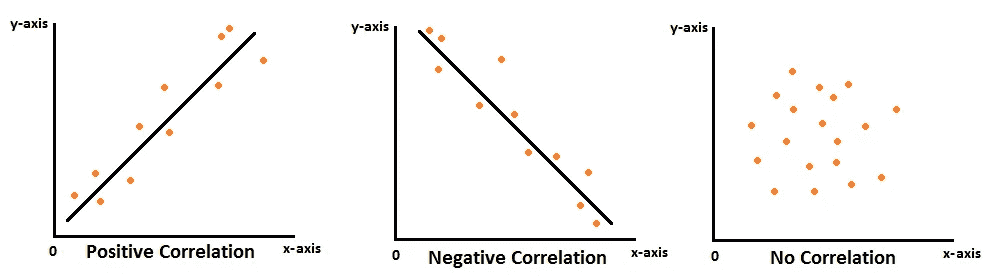
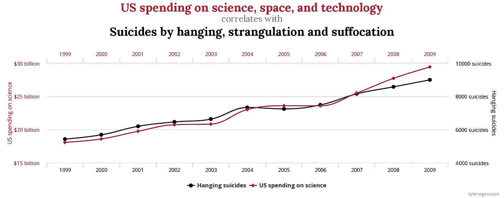

# 从相关到因果

> 原文：<https://towardsdatascience.com/from-correlation-to-causation-49f566eea954?source=collection_archive---------18----------------------->

## 如何避免常见的陷阱，并从相关性到因果关系？

在现实生活和商业中，我们经常想知道具体行为的偶然联系。我们想知道新的政府政策是否在减少贫困，上私立大学是否会增加我们未来的收入，或者我们在应用程序中推出的新功能是否会增加销售额。

# 基本术语

**相关性**是指一对变量线性相关的程度。

**因果关系**暗示了两个变量之间的因果关系，意味着一个变量的变化会引起另一个变量的变化。

# 相关性并不意味着因果关系

相关性并不意味着因果关系一定是你听说过的。那到底是什么意思？如果 A 与 B 相关，这可能意味着 A 导致 B(因果关系)。但它也可能意味着所有这些其他事情——B 导致 A(反向因果关系)，两者可以互为因果(双向因果关系)，C 导致 A 和 B(共同的因果变量)或只是 A 和 B 之间的巧合关系(虚假相关)。下面是一个来自有趣的[网站](https://www.tylervigen.com/spurious-correlations)的虚假关联的例子，它收集了一些荒谬的关联。

虚假相关的一个例子

在美国，一所精英私立四年制大学比公立大学要贵得多。在本州上公立大学的人通常每年要少付 20，000 美元。那可是一大笔钱啊！但是私立大学可能更好，因为它有更杰出的教师、更好的设施和更聪明的同龄人，这导致了一个合理的假设，即它可以给你未来的收入带来显著的增长。如果你比较两个群体之间的收入，那些上私立大学的和那些上公立大学的，它确实揭示了一个有利于私立大学的巨大差距。

**其他条件不变**的意思是“所有其他事情都一样”，这是因果推理的核心思想。这里的比较是其他条件不变吗？私立大学通常更具选择性，要求更高的 SAT 分数，让更聪明的学生去那里。此外，事实上他们花费更多，使得去那里的普通学生更富有。通常来说，经济背景较好的聪明人比其他人挣得多，不管他们上的是什么大学。这里的因果关系问题是，如果一个学生在“其他条件相同”的情况下去了公立大学和私立大学，那么收入会有什么不同？当然，我们不能在同一个学生身上观察到两者。

> 观察行为的平均差异=平均因果效应+选择偏差

为了从观察到的差异中获得偶然效应，你需要消除选择偏差。这方面的黄金标准是随机对照试验(RCT)。随机分配一些人，给他们应用程序中的新功能，称他们为治疗组。将他们与另一组随机分配的没有新特征的人进行比较，称他们为控制组。当你比较两组之间的销售差异时，你会发现你的新功能对销售的因果影响。随机分配确保了选择偏差在平均水平上相互抵消，并且假设你的群体代表了你的真实群体，它留给你因果效应。

媒体经常忽略这一点，用吸引人的标题暗示因果关系。看看《赫芬顿邮报》这篇题为[狗能帮你活得更久](https://www.huffingtonpost.in/entry/dogs-help-live-longer_l_5d9cceeee4b02c9da03fd45c)的文章。这是基于一项[研究](https://www.ahajournals.org/doi/10.1161/CIRCOUTCOMES.119.005554)得出的结论，养狗可以降低 24%的全因死亡率。然而，它也提到“一个可能的限制是分析没有针对混杂因素进行调整”。这意味着这是一项没有考虑选择偏差的观察性研究。养狗的人比不养狗的人更富有、更快乐、锻炼更多，这可能是他们活得更久的真正原因。

有时影响更可怕——研究表明，接受激素替代疗法(HRT)的女性患冠心病(CHD)的几率更低。这导致医生建议用激素替代疗法来治疗冠心病。后来的随机对照试验表明，HRT 的使用导致冠心病风险的小幅增加。原来，最初进行 HRT 分析的妇女更有可能来自更高的社会经济背景，可能有更好的饮食和更多的锻炼，这是 CHD 发病率较低的原因。下次你看到一篇声称“吃这种新时尚饮食的人更长寿”或“服用特定的维生素补充剂会让你更聪明”的文章时，花点时间想想这是否真的是其他因素不变。

# 缺乏随机分配的因果关系

随机分配并不总是可能的。你不能让一群学生随机加入特定的大学。我肯定学生和大学都会反对。如果你仔细控制选择偏差，我们仍然可以在实践中获得真实实验的偶然力量。

我们可以通过对 SAT 分数和性别(通常是容易获得的数据)进行控制，首次发现这种因果关系。在 SAT 分数相近、性别相同的人群中，我们还能看到收入上的差异吗？我们仍然看到了积极的影响。这是否意味着你应该选择私立大学？收入的影响远不止这些——家庭背景、学生志向和人脉都可能影响收入。可能性是无穷无尽的，有些很难量化。我们如何解释这些可能导致选择偏差的省略变量？

Stacy Berg Dale 和 Alan Krueger 的一项聪明的研究使用了一种捷径来捕捉这些效应。关键的假设是，申请类似的选择性大学并被类似的选择性大学录取的学生应该是相似的(基于 Barron 的方案，该方案将大学分为 6 类，从最具竞争力到无竞争力)。通过对此进行控制的回归分析，他们发现上私立大学似乎与未来收入无关。

当然，可能有一些隐藏的变量，我们没有数据，因此无法控制。例如，这里我们没有家庭规模的数据。但是我们知道较小的家庭平均收入较高。此外，私立学校的学生一般来自较小的家庭。因此，我们可以对这个被忽略的变量的可能影响进行有根据的猜测——也就是说，控制这个变量可能会对私立学校收入优势的假设产生更大的影响。这让我们对原来的结论更有信心。这种对省略变量的仔细推理通常是因果分析的重要部分。在添加了几个关键控件之后，添加更多的控件应该不会对我们的结果产生太大的影响。在这里，在添加了对申请和录取选择性的控制后，添加更多的控制，如 SAT 分数，不会对结果产生太大影响。这也让我们对结果更有信心。

让我们以另一个假设的商业例子来结束。假设你去年在社交网络应用中推出了一项新功能，即加入当地社区的能力。你想知道它是否让用户对应用程序有了更多的参与。如果你比较加入社区的人和没有加入社区的人，并比较他们的参与度，你会发现加入社区的人参与度更高。但是那些已经对你的应用有更多参与的人很可能是加入你的社区的人。如果你看看在过去一年中有类似参与并加入社区的人，也许你会意识到社区减少了他们之间的参与。这可能是因为这些社区中有很多仇恨或垃圾邮件，这使得用户不太喜欢这个应用程序。

揭示隐藏的变量和有一个强有力的潜在原因表明因果关系，直到它可以被证明不是这样。

# 最后的想法

好的比较总是能解释选择偏差。对于许多业务应用程序，这在实践中通常就足够了。对于更重要的政策，在使用更复杂的方法之前，这可以是一个很好的基准，如使用工具变量或 T2 回归不连续设计。尽可能使用随机分配。

## 参考

*   黛比·A·劳洛尔，乔治·戴维·史密斯，沙·易卜拉欣，评论:激素替代-冠心病难题:这是观察流行病学的死亡吗？https://doi.org/10.1093/ije/dyh124[，*国际流行病学杂志*，第 33 卷，第 3 期，2004 年 6 月，第 464–467 页](https://doi.org/10.1093/ije/dyh124)
*   Joshua d . ang rist & jrn-Steffen Pischke，2014 年。“掌握‘度量’:从原因到结果的路径”，经济学书籍，普林斯顿大学出版社，第 1 版
*   史黛西·伯格·戴尔和克鲁格(2002)。估算上一所更好的大学的回报:选择在可观察和不可观察上的应用。*《经济学季刊》，* *第 117 期* (4)，1491–1527 页。于 2020 年 5 月 10 日从[www.jstor.org/stable/4132484](http://www.jstor.org/stable/4132484)检索