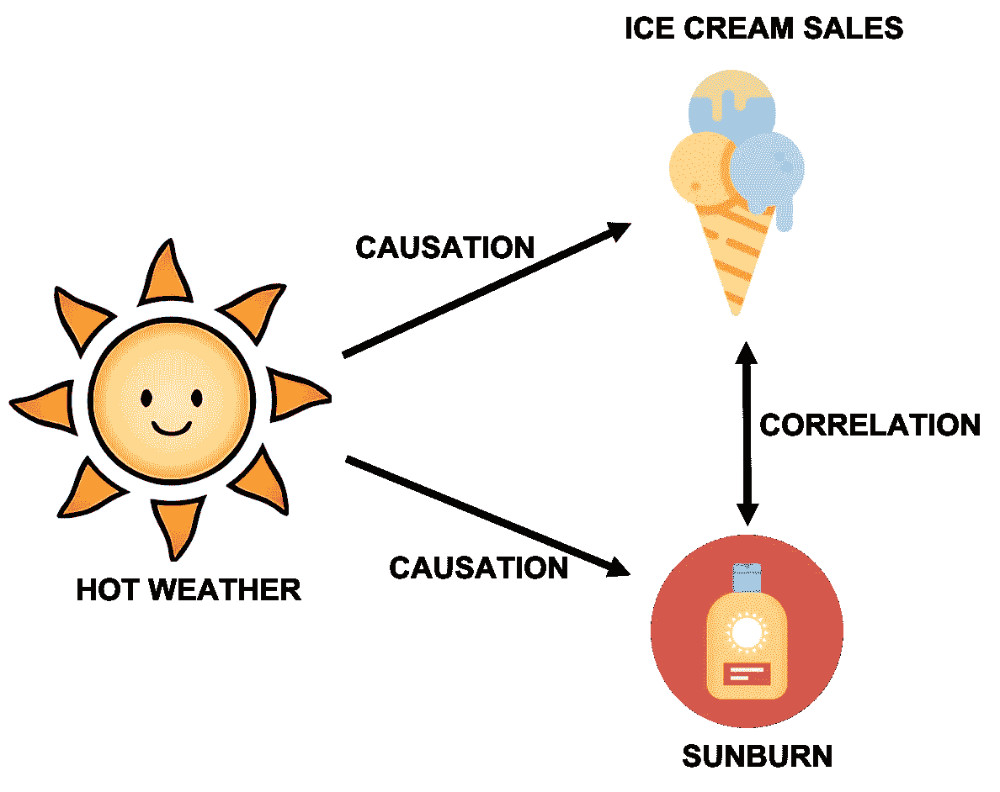
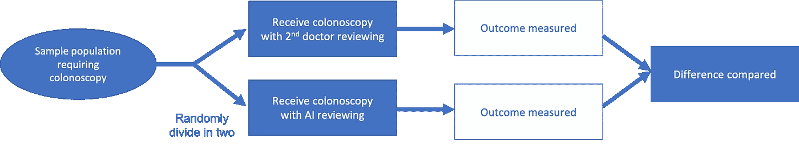
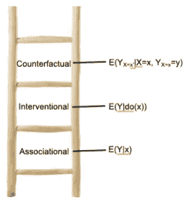

# 机器学习中从相关性到因果性:为什么和如何

> 原文：<https://towardsdatascience.com/from-correlation-to-causation-in-machine-learning-why-and-how-4485bca8d145?source=collection_archive---------10----------------------->

## *为什么我们的人工智能需要理解因果关系*

[乌列尔 SC](https://unsplash.com/@urielsc26?utm_source=unsplash&utm_medium=referral&utm_content=creditCopyText) 在 [Unsplash](https://unsplash.com/s/photos/link?utm_source=unsplash&utm_medium=referral&utm_content=creditCopyText) 上的照片

# **相关性怎么了？**

2016 年 5 月，COMPAS 算法被标记为种族偏见[1]。这种算法被美国用来通过预测再次犯罪的可能性来指导刑事判决。据估计，在其他背景因素相同的情况下，黑人比白人更有可能再次犯罪。

问题是，该算法将相关性(过去的犯罪模式)与因果关系(黑人更有可能犯罪)混淆了。

这在医学上也是一个问题。请考虑以下情况:

100 名患者因肺炎入院，其中 15 名还患有哮喘。医生知道哮喘使他们更容易生病，所以给他们更积极的治疗。正因为如此，哮喘患者实际上恢复得更快。

如果我们使用这些数据来训练一个模型，并且不小心的话，这个模型可能会得出哮喘实际上可以改善恢复的结论。因此，它可能会建议减少治疗的力度。当然，我们可以看到这是错误的——但对于一个人工智能模型来说，这并不那么明显。

# **从统计学到机器学习**

这个没有因果关系的相关问题是机器学习中的一个重要问题。

正如 ryx，r 博客指出的那样，统计学和机器学习的一个关键区别是我们关注的焦点。在统计中，重点是**模型中的参数**。例如，对于预测房价的模型，我们希望了解每个参数以及它如何影响预测。

另一方面，在机器学习中，重点是**更少关于参数，更多关于预测**。参数本身的重要性仅在于它们预测感兴趣的结果的能力。

机器学习非常擅长在大量数据中识别复杂、微妙的关系，以高精度预测结果。问题是:这些关系是相关性，而不是因果关系。

# 相关性和因果性有什么区别？

**简而言之:**

关联是一个**关联**。当一个事物上升时，另一个事物下降。或者向上。其实无所谓，只要他们一起改变就好。

但是我们不知道第一次变化*是否引起了*第二次变化。或者即使第二个导致了第一个。还可能有第三个因素，它实际上独立地改变了这两点。

假设我们注意到晒伤和冰淇淋销售之间的相关性。人们被晒伤后会买更多的冰淇淋吗？还是人们买了冰淇淋，然后在太阳下晒了太久？

也许吧，但这与相关性的真正原因相比微不足道。两者都有一个共同的原因。晴朗的天气。在这里，太阳是一个**“混杂因素”——**同时影响两个感兴趣的变量(导致相关性)。

由[dinosoftlab](https://www.flaticon.com/authors/dinosoftlabs)制作的图标。经许可使用。受[安东尼·菲格罗亚](https://medium.com/u/7c78b9326a4d?source=post_page-----66b6cfa702f0--------------------------------)的启发[相关性不是因果关系](/correlation-is-not-causation-ae05d03c1f53)

因此，总而言之，从相关性到因果关系，我们需要排除所有可能的混淆因素。如果我们控制所有的混杂因素(并考虑随机机会)，我们仍然观察到一种联系，我们可以说有因果关系。

# 那么，我们如何去除混杂因素呢？

金标准是**随机对照试验(RCT)** 。

这里，我们完全随机地将样本人口分成两部分。一半接受一种治疗，另一半接受另一种治疗。因为这种分裂(至少在理论上)是完全随机的，结果之间的任何差异都是由于不同的治疗方法造成的。

来源:[人工智能在医疗保健中的作用是什么？目前的证据表明了什么。](https://www.youtube.com/watch?v=NdL6RW7Aa30)[原纸](https://www.thelancet.com/pdfs/journals/langas/PIIS2468-1253(19)30411-X.pdf)。

但有时我们不能跳 RCT。也许我们已经收集了数据。或者，也许我们正在调查一个我们无法改变的变量(比如遗传或天气的影响)。我们能做什么？

这里有一个简洁的数学方法，叫做**‘分层混杂’**。我不会在这里深入讨论细节，但是本质上它通过对它们的值的每一个可能的组合求和来去除混杂因素。(如果感兴趣，朱迪亚·珀尔是这一领域的先驱，并在这里概述了方法论。费伦茨·胡萨尔[分享了一个更简短的描述。](https://www.inference.vc/untitled/)

# **因果关系:机器学习的未来？**

将因果关系引入机器学习可以使模型输出更加稳健，并防止前面描述的错误类型。

但是这看起来像什么呢？我们如何将因果关系编码到模型中？

确切的方法取决于我们试图回答的问题和我们可用的数据类型。

最近的一个例子是[巴比伦健康](https://www.nature.com/articles/s41467-020-17419-7)的这篇论文。他们使用因果机器学习模型，根据患者的症状、风险因素和人口统计数据对可能的疾病进行排序。

他们训练模型问“如果我治疗这种疾病，哪些症状会消失？”以及“如果我不治疗这种疾病，会留下哪些症状？”。他们将这些问题编码成两个数学公式。使用这些问题带来了因果关系:如果治疗疾病导致症状消失，那么这就是因果关系。

他们将他们的因果模型与只关注相关性的模型进行了比较，发现它表现更好——特别是对于更罕见的疾病和更复杂的病例。

# **展望未来**

尽管机器学习潜力巨大，令人兴奋，但我们不能忘记我们的核心统计原则。

我们必须超越相关性(关联)来看待因果关系，并将其构建到我们的模型中。

我们可以通过去除混杂因素来做到这一点；通过随机对照试验或智能数学操作。

这对于确保我们作为一个社会能够受益于机器学习而不屈服于其缺陷至关重要。

*原载于 2020 年 10 月 31 日*[*chrislovejoy . me*](https://chrislovejoy.me/correlation-causation/)*。*

# **参考文献**

(1) [刑事量刑中的机器偏见——Pro Publica](https://www.propublica.org/article/machine-bias-risk-assessments-in-criminal-sentencing)

(2) [统计学中的因果推断:初级读本，第 3 章:干预的效果](http://bayes.cs.ucla.edu/PRIMER/primer-ch3.pdf)

(3) [ML 超越曲线拟合-推理博客](https://www.inference.vc/untitled/)

(4) [从统计学到机器学习— ryx，r 博客](https://ryxcommar.com/2019/07/14/on-moving-from-statistics-to-machine-learning-the-final-stage-of-grief/)

(5) [用因果机器学习提高医疗诊断的准确性【研究论文】巴比伦健康](https://www.nature.com/articles/s41467-020-17419-7)

## **其他关于相关性和因果关系的文章:**

*   [数据科学中的相关性与因果关系](https://medium.com/@sundaskhalid/correlation-vs-causation-in-data-science-66b6cfa702f0)
*   如果相关性不意味着因果关系，那么什么意味着因果关系？

# **附录:因果推理层级(朱迪亚·珀尔的因果阶梯)**

朱迪亚·珀尔描述了因果推理的阶梯。

*来源:*[*chrislovejoy . me*](http://www.chrislovejoy.me)

当超越联想推理时，他考虑了两种主要类型:**介入因果推理**和**反事实因果推理。**

***介入式因果推理*** 问“如果我把 A 设为值 X，B 会怎么样？”如果将 A 的值设置得更高导致 B 的值更高(没有混杂因素)，我们说这种关系是因果关系。

***反事实因果推断*** 有点小技巧。我们问“假设 A 是值 X，这导致 B 等于 Y，如果 A 实际上是一个更高的值，会发生什么？”(即。它在事件已经发生之后询问这个*。如果不同的 A 会导致不同的 B 值，我们说这种关系是因果关系。*

如果有兴趣了解这些区别，请查看以下资源:

*   [统计中的因果推理:朱迪亚·珀尔的初级读本](http://bayes.cs.ucla.edu/PRIMER/):*对该主题的一个伟大的数学介绍*
*   朱迪亚·珀尔的《为什么》一书:*一个伟大的门外汉对这个主题的介绍，有历史和更广泛的背景*
*   [因果关系推理博客系列](https://www.inference.vc/causal-inference-3-counterfactuals/)