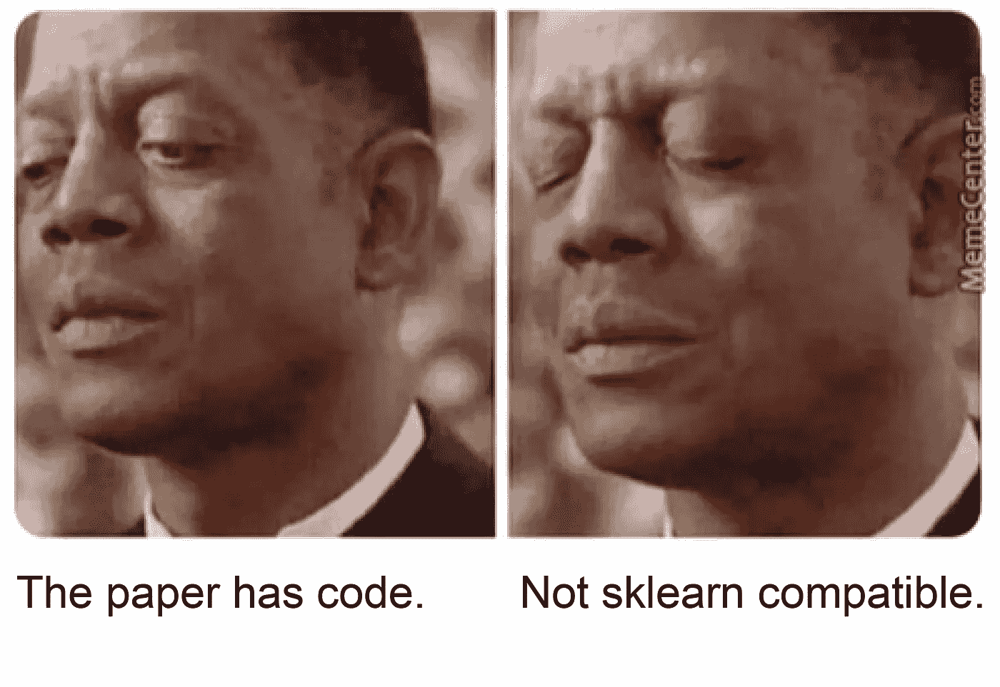
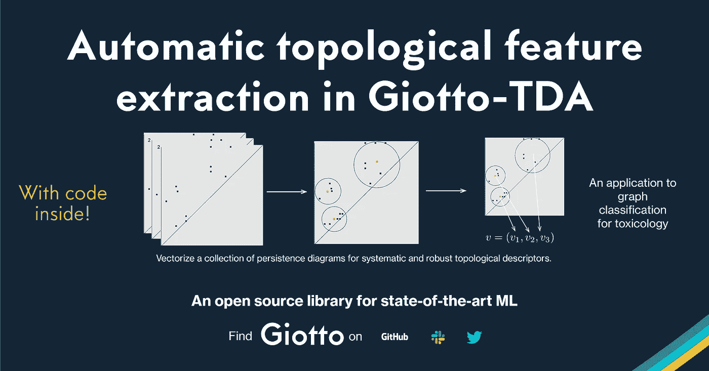
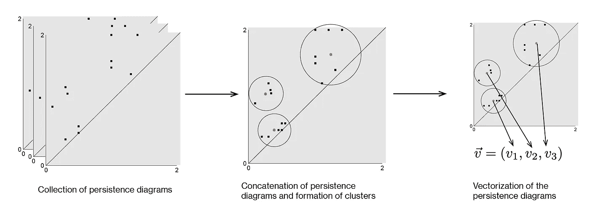
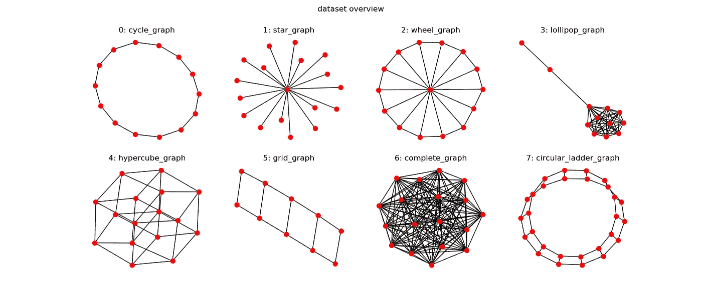

# 从尖端研究到 Giotto 的工业应用

> 原文：<https://towardsdatascience.com/from-cutting-edge-research-to-industrial-applications-with-giotto-c5657a4450de?source=collection_archive---------27----------------------->

## 为拓扑机器学习创建自己的转换器指南。

> 由迭戈·费奥里、[托马斯·波伊斯](https://towardsdatascience.com/@t.boys_87095)、[路易斯·汤斯顿](https://towardsdatascience.com/@lewis.c.tunstall)、[翁贝托·卢波](https://medium.com/@umberto.lupo)和[弗朗切斯科·帕尔马](https://medium.com/@lapalmafrancesco)编剧

如果你是一名企业数据科学家，你最好能接触到最前沿的研究，因为这个领域发展如此之快。其中一个挑战是，与 PyData 堆栈和 scikit-learn 等机器学习框架的集成很难做到简单。

> 从前沿研究到工业应用需要什么？

目前，机器学习的大多数研究都是以文章的形式发表的，在某些情况下，还会以[伴随代码](https://paperswithcode.com)的形式发表。通过设计，这些代码库针对特定的研究应用进行了优化，将这些工具与更广泛的生态系统集成并不总是那么简单。

在 [L2F](https://www.l2f.ch) ，我们启动了 [Giotto](https://giotto.ai) 开源项目，其愿景是让更广泛的数据科学社区可以使用先进的机器学习技术。我们目前开发了两个库:

*   [*giotto-time*](https://github.com/giotto-ai/giotto-time) ，用于时间序列预测、
*   [*giotto-tda*](https://github.com/giotto-ai/giotto-tda) ，用于拓扑机器学习。

在这篇文章中，我们的目的是展示如何使用最先进的技术进行图形分类，并将其与 *giotto-tda* 集成。具体来说，我们将把最近 GUDHI/Inria 的 Royer 等人的[研究](https://hal.archives-ouvertes.fr/hal-02296513)和[开源代码](https://github.com/martinroyer/atol)整合到 giotto-tda 管道中。

> [GitHub repo](https://github.com/giotto-ai/graph_classification_with_atol) 用于图形拓扑特征的自动提取(以下分子毒理学分类示例)

在 [Github](https://github.com/giotto-ai) 、 [Twitter](https://twitter.com/giotto_ai) 和 [Slack](https://slack.giotto.ai/) 上关注 Giotto 的最新动态

Royer *等人*引入的算法被称为 ATOL，用于自动面向拓扑的学习。它解决了拓扑数据分析(TDA)中的一个关键问题，即从所谓的*持久性图*中自动提取特征。持久性图是一个数据集的全局拓扑的表示，以其同时在所有尺度上的连通性表示，它是通过逐渐连接相邻点并记录结构“同源性”的演变而获得的。这是一种理解、可视化和从数据中提取特征的新方法。

对于拓扑机器学习、持续同源/持续图以及如何在 ML 管道中使用 giotto-tda 的一般介绍，您可以参考这篇[博客文章](/getting-started-with-giotto-learn-a-python-library-for-topological-machine-learning-451d88d2c4bc)。

# 在 giotto-tda 中推出您自己的评估工具

与 scikit-learn 的紧密集成是 giotto-tda 背后的关键设计原则之一。这使得为您自己的项目实现与 scikit-learn 管道、元估算器和网格搜索等模型选择工具交互的定制组件变得简单。

让我们通过考虑 scikit-learn 提供的 transformer 模板来热身。从模板中，我们可以看到，要创建一个定制的转换器，我们需要实现三个基本组件:构造函数“_init_”、“fit”和“transform”。

scikit-learn 中的 transformer 方法模板

变压器是特殊类型的**估算器**。估计器是基于一些训练数据来拟合模型的对象。所有估计器都实施“拟合”方法，该方法将估计模型存储在公共或私有属性中:

拟合方法的模板

创建对象时，您会希望定义一个实例化方法，该方法定义了对象的默认参数。`__init__`方法应该只定义独立于训练数据的模型的超参数。

_init_ 方法的模板

变压器与一般估算器的不同之处在于，它们还应该实现一种用于过滤或修改数据的“转换”方法。传递给“transform”的数据可能与用于拟合模型的数据不同，在“fit”中学习到的信息可以用于“transform”中—通常情况下，这是监督或非监督统计学习的情况！

转换方法的模板

## 从纸张到代码

在 ATOL 的例子中，原始代码的作者已经定义了一个 transformer 类*、Atol* 、T2(检索于 2020 年 1 月 21 日)。如您所见，它实现了“fit”和“transform”方法。“fit”的主要作用是将 KMeans 算法的运行所计算的聚类中心存储在一组持久性图中，而“transform”可以应用于一个*单个*不可见的持久性图，以产生一个向量表示。

这个 *Atol* 类接近于在机器学习框架中直接使用，但是它有一个关键的缺点:如果你的数据问题产生了持久性图的集合，你可能会希望“transform”方法也能够作用于持久性图的*集合*。这是 scikit-learn transformers 的典型特征，也是模型验证等工作的关键。

这一点，加上其他旨在使 *Atol* 转换器更符合 scikit-learn 的[贡献指南](https://scikit-learn.org/stable/developers/contributing.html)的小变化，就是为什么我们在这里放在一起这个类[的一个稍微修改的版本。下面是新的转换方法。它通过在集合的每个元素上调用“transform_single_diag”方法来作用于图的集合 *X* 。](https://github.com/giotto-ai/graph_classification_with_atol/blob/master/atol.py)

专家将注意到另一个技术差异，这与 *giotto-tda* 向用户单独展示不同“同源维度”的独特能力相关(因此将 *Atol* 独立应用于每个*)。*

## 拓扑特征自动生成

将持久性图与机器学习集成的一个常见挑战是需要将图矢量化为特征向量。多年来，提出了各种各样的建议。几个*特别的*矢量化方法被社区广泛使用，其中许多都在 [*giotto-tda*](https://docs.giotto.ai/#module-gtda.diagrams) 中实现！然而，找到自动*学习特定于任务的向量表示的鲁棒方法仍然是一个具有挑战性的研究问题。*

为了解决这个问题， [Royer 等人](https://arxiv.org/pdf/1909.13472.pdf)最近提出了一种新的
算法来自动矢量化持久性图。ATOL 基于以下步骤:

ATOL 算法的不同宏步骤

1.  为目标向量空间选择一个嵌入维数 d。
2.  将一组持久性图连接成一系列点。
3.  在这些点上运行聚类算法以获得 d 个聚类中心
    c₁,…,d.
4.  对于每个聚类中心 cᵢ，计算所谓的拉普拉斯对比度
    函数(将其视为从 2D 平面到真实直线的特殊映射)。
5.  连接拉普拉斯函数以形成一个向量(v₁，…，v_d ),该向量
    从持久性图中捕获基本的拓扑信息。

# 用 Giotto-learn 对分子进行毒理学分类

图分类是一项核心的机器学习任务，可用于确定分子的毒性，或将社交网络的成员分为一个或多个类别。观察结果是完整的图表，目标是预测它们属于哪一类。

> 化学和图形，它们有点像手和手套:天生一对。有趣的事实是，图形这个术语本身首次出现在 1878 年[的《自然》杂志论文](https://www.nature.com/articles/017284a0)，将代数的应用庸俗化为……化学。

> [GitHub repo](https://github.com/giotto-ai/graph_classification_with_atol) 用于 TDA 毒理学分类

## 图上的机器学习

为了发挥它们的魔力，机器学习算法要求输入是数字形式的。为了学习图形，我们需要一种方法来用数字编码它们的结构。

> 图编码了实体之间关系的一个非常基本的概念，这使它们成为非常灵活的对象。然而，只有在它们的数值表示中，我们才能对它们进行机器学习。

两张看起来非常相似的图实际上可能有很多不同之处。图与图之间的距离表示我们认为图与图之间的差异很小的程度，并且是根据它们的数值表示来计算的。

> 图可以通过其路径网络的鲁棒性来表征。

路径网络移除一条或两条边的弹性是根据不连通区域的创建来衡量的。移除图 0 和图 1 中的一条或两条随机边会限制您从一个节点到另一个节点自由移动的能力，因为一些点会与其余的点不相交，而在图 4 或图 6 中不会发生这种情况。

## 用 TDA 实现图形矢量化:HKS +阿托尔

> 在你能想到的所有数据结构中，图是最有可能有一些拓扑概念的。

HKS 算法[(热核签名)](https://arxiv.org/pdf/1904.09378.pdf)研究当您在图中添加或删除边时，图的组件如何合并。在固定了参数 t 之后，它为每个 H₀和 H₁.输出两个持久性图我们对 t=0.1 和 t=10 运行 HKS，并有 8 个图表来描述该图。

ATOL 算法然后基于 N 个持续图的集合产生特征向量。在固定了多个聚类 b 之后，Atol 输出大小为 N*b 的特征向量。我们对 b=2 运行 HKS，这产生了 8*2=16 个坐标。

基于标记为安全或有毒的 1478 个分子的集合(分类比率为 93:7 ),我们使用 ATOL 从持久性图中构建描述性特征。

# 结果

数据集上的现有基准在 AUC 中通过称为 TextCNN 的单一深度学习模型达到 0.995。利用分子的特征和我们管道中产生的特征，我们达到了非常可观的 0.976。

更具体地说，我们最终的 XgBoost 模型具有以下特性:

1.  分子中存在的化学物质(17 个特征)
2.  关于键取向的化学特征(3 个特征)
3.  环礁特征(16 个特征)

有趣的是，仅环礁特征(没有化学信息)在 AuRoc 上的得分为 0.72。

# 更多带代码的文章:

**图形嵌入**

*   [入门](/getting-started-with-giotto-learn-a-python-library-for-topological-machine-learning-451d88d2c4bc)，预测分子键的例子，[其笔记本](https://github.com/giotto-ai/molecule_bond_prediction)
*   [化学函数的形状](/the-shape-of-chemical-functions-d1e1568d020)及其[笔记本](https://github.com/giotto-ai/the-shape-of-chemical-functions):图形嵌入[图形波](http://snap.stanford.edu/graphwave/)

**时间序列**

*   [检测股灾](/detecting-stock-market-crashes-with-topological-data-analysis-7d5dd98abe42)及其[笔记本](https://github.com/giotto-ai/stock-market-crashes):TDA 股灾时间序列分析
*   [噪音背后的形状](/the-shape-that-survives-the-noise-f0a2a89018c6)及其[笔记本](https://github.com/giotto-ai/noise-to-signal):与 TDA 一起进行时间序列分析，以创建对大量噪音具有鲁棒性的信号

**可视化**

*   [Mapper 入门，](/visualising-high-dimensional-data-with-giotto-mapper-897fcdb575d7)可视化高维数据以找到其粗略结构
*   [美国大选结果的社会经济](/the-shape-of-the-united-states-presidential-elections-c336d80e4ddf)研究([笔记本)](https://github.com/giotto-ai/us-election-tda):使用制图仪。

**坚持**

*   [足球的形状](/the-shape-of-football-games-1589dc4e652a)和它的[笔记本](https://github.com/giotto-ai/football-tda):带有持续性图表的团队表现特征

**乔托**

*   [Github 上的 Giotto-tda 库](https://github.com/giotto-ai/giotto-learn)
*   更多学习资料请访问[网站](https://giotto.ai/)
*   [推特](https://twitter.com/giotto_ai)
*   [松弛](https://slack.giotto.ai/)用于支撑

# 参考

*   马丁·罗耶、弗雷德里克·夏萨尔、池宇一、梅田裕平。自动面向拓扑的学习。2019. [⟨hal-02296513⟩](https://hal.archives-ouvertes.fr/hal-02296513)
*   *ATOL:python 3 package for ATOL:Automatic topological-Oriented Learning*，[开源代码](https://github.com/martinroyer/atol)作者 Martin Royer，版权:Inria。