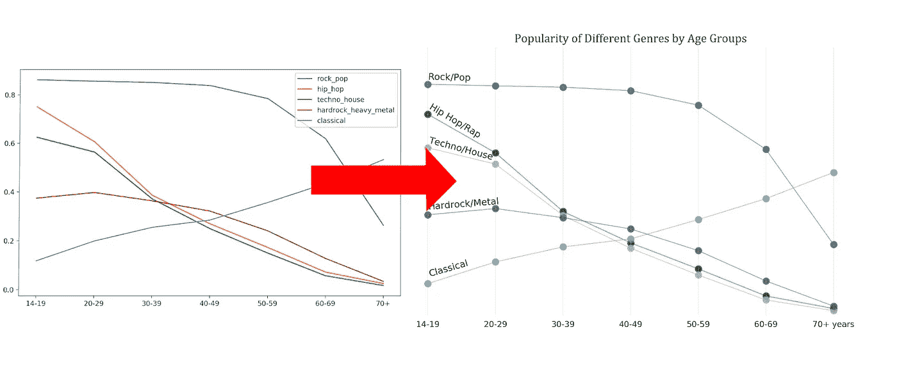
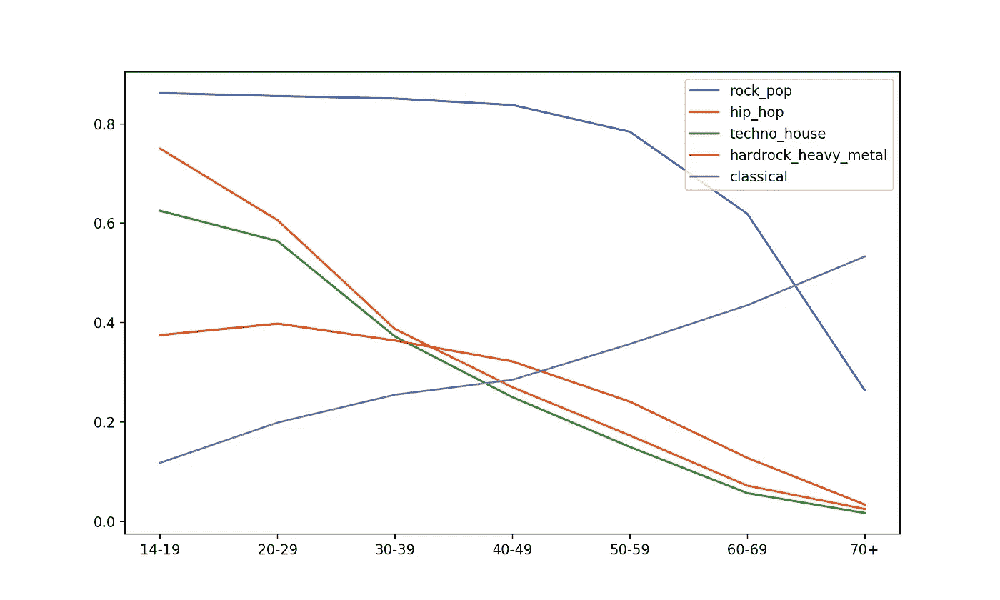
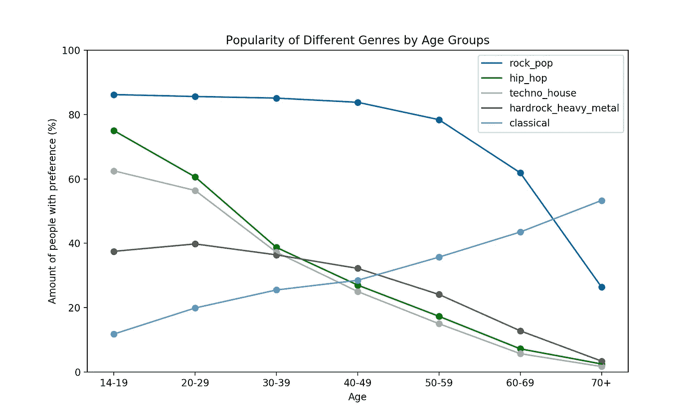
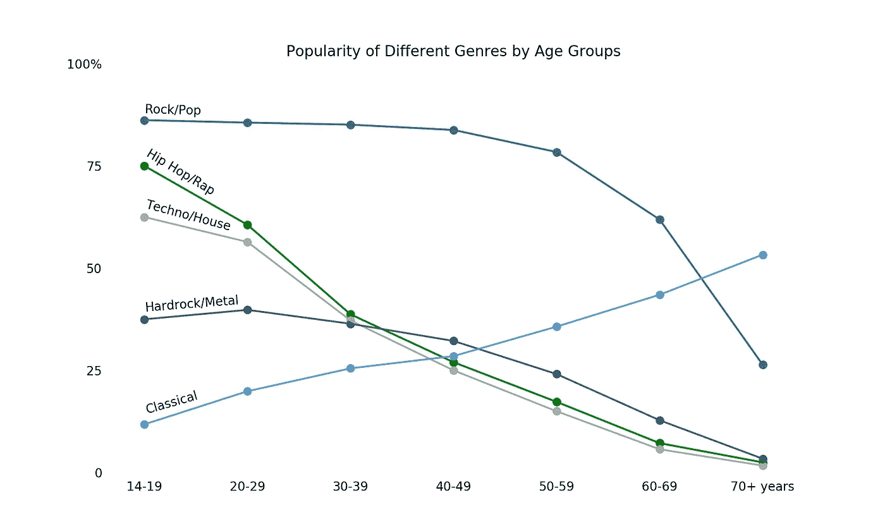
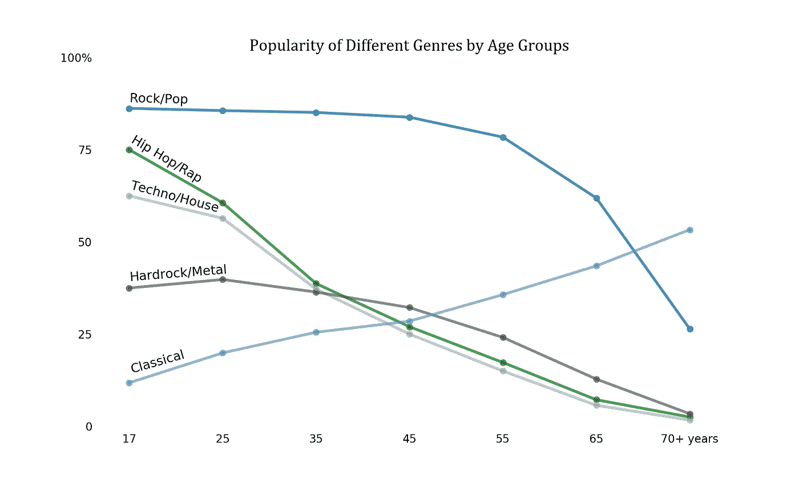
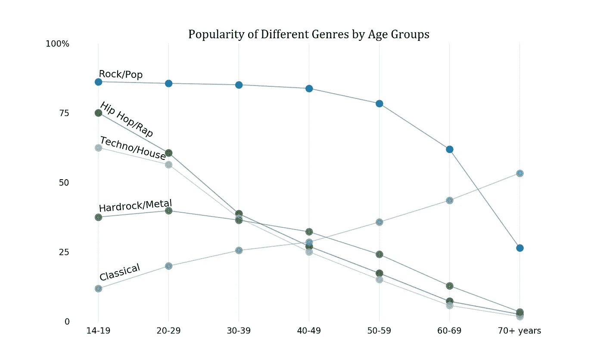

# 从数据分析师到数据故事讲述者只需 3 步

> 原文：<https://towardsdatascience.com/from-data-analyst-to-data-storyteller-in-3-steps-54b56815b567?source=collection_archive---------8----------------------->

## 使用 Matplotlib 中的这个简单过程改进您的数据可视化



**为什么你需要学习这个**

众所周知，各种形式的数据准备构成了[数据科学家工作](https://www.forbes.com/sites/gilpress/2016/03/23/data-preparation-most-time-consuming-least-enjoyable-data-science-task-survey-says/#12422df56f63)的 80%以上。鉴于进入该领域的新人似乎认为这一切都是关于昂贵的计算机和复杂的深度学习模型，这是一条有价值的信息。你也许可以用这些东西给数据团队的同事留下深刻印象，但是你的经理和客户通常不太关心技术细节。然而，让这些人注意到并正确理解你的工作是至关重要的。**这就是为什么你需要学习数据可视化！**

对某些人来说，数据可视化只是困扰着烦人的利益相关者。这是一种非生产性的思维方式，也是错误的！请这样想:

> 如果你不能可视化你的结果，你就不知道你的结果。

每个人和他们的祖母都可以创建一些单行散点图，并称之为数据可视化。然而，要将基本的可视化转化为一个故事，让您的经理和客户不仅能够理解，还会感到兴奋和受到鼓舞，这需要一个充满激情和技能的数据科学家。在这篇文章中，我将帮助你把你的技能提升到一个新的水平！你所需要做的就是遵循一个简单的三步程序，这个程序可以应用到你的每一个视觉化形象中。你的经理、客户和未来的雇主会感谢你努力阅读这个故事！

**糟糕的视觉效果是什么样的？**

试着想象一些你的第一个 matplotlib 可视化。很可能，它们看起来像图 1。我在这里尝试做的是将不同年龄组的各种音乐类型的流行程度形象化。



图 1 —我们的基本图

该线图由以下代码生成:

```
fig, ax = plt.subplots(figsize =(10,6))# Loop through the genres
for i, g in enumerate(genres):

 # Define x and y
 x = np.arange(7)
 y = music_pref_2019[g]

 # Plot lines
 ax.plot(x, y, label = g)

 # X axis
 ax.set_xticks(x)
 ax.set_xticklabels([“14–19”, “20–29”, “30–39”, “40–49”, “50–59”, “60–69”, “70+”])

ax.legend()plt.show()
```

这个情节有很多问题。我们将通过以下三个步骤来改进它:

1.  **添加**信息
2.  **减少**信息
3.  **强调**信息

> 信噪比描述了与不必要的信息量相比有价值的信息量。在任何创造性的产品(文章、视觉化图像、音乐作品)中，我们应该以最大化这个比率为目标。

我们可以通过添加有用信息来提高信噪比，也可以通过删除无用信息来提高信噪比。在理想的可视化中，所有重要的信息都被呈现和强调，而没有任何实际价值的东西都被删除。

# 步骤 1—添加信息

让我们集思广益，看看图 1 中缺少了什么。以下是我的观察。我们需要补充:

1.  一个标题
2.  轴标签
3.  y 轴的刻度和刻度标签
4.  直接从行中读取不同年龄组的单个值的方法

我们可以通过在完整的可视化代码中包含以下代码行来实现这一点:

```
# 1
ax.set_title("Popularity of Different Genres by Age Groups")
# 2
ax.set_xlabel("Age")
ax.set_ylabel("Amount of people with preference (%)")
# 3
ax.set_ylim(0,1)
ax.set_yticklabels(int(i*100) for i in ax.get_yticks()) # Turns the # decimals into percent values
# 4
ax.scatter(x, y) # adds points at every tick of x
```

最重要的是，我为我们的系列选择了不同的颜色。matplotlib 标准颜色对于色盲的人(比如我)来说很难处理。因此，我在下图中只使用了 tableau 色盲调色板中的颜色。



图 2 —增强图

我们可以清楚地看到，从图 1 到图 2，在给出的信息量方面有所改进！通过添加相关信息，我们提高了信噪比。我们需要不惜一切代价保护相关信息！因为我们需要的一切都以某种形式包含在可视化中，所以很容易就把它留在那里。然而，这就是奇迹发生的地方。第 2 步和第 3 步将保留所有相关信息，但使用某些技术使整个图表更加清晰易读。

# 第二步——减少信息

减少信息并不总是意味着删除标签、图例或记号等信息。有时，它只是意味着减少信息对读者的阻碍程度。这里有一些关于如何处理这个情节的想法:

我们可以:

1.  移除蜱
2.  移除脊椎
3.  去掉大图例，直接把标签写在每一行上
4.  仅在 y 轴上留下 4 个刻度
5.  去掉 x 和 y 标签，直接在最后一个刻度上标出

```
# 1
ax.tick_params(bottom = False, top = False,
                  left = False, right = False)
# 2
for key, spine in ax.spines.items():
    spine.set_visible(False)
# 3
ax.text(0,.875, "Rock/Pop", rotation = -1.5)
ax.text(0,.144, "Classical", rotation = 16)
ax.text(0,.395, "Hardrock/Metal", rotation = 4.5)
ax.text(0,.679, "Hip Hop/Rap", rotation = -31)
ax.text(0,.592, "Techno/House", rotation = -15)
# 4
ax.set_yticks([0,0.25,0.5,0.75,1])
# 5
ax.set_xticklabels(["14-19", "20-29", "30-39", "40-49", "50-59", "60-69", "70+ years"])
ax.set_yticklabels([0, 25, 50, 75, "100%"])
```



图 3 —简化图

# 第三步——强调信息

现在我们已经添加了所有相关信息，并删除了所有不相关的信息，我们仍然可以优化我们的可视化。也许我们可以做些什么来强调某些方面。这里有一些关于这个特定情节的想法:

1.  更改标题的字体、字号和粗细
2.  强调数据的连续质量

要改变标题字体，我们可以创建一个 font_dict，在 ax.set_title()函数中调用。

```
title_font= {"family" : "Cambria",
             "size" : 16,
             "color" : "black",
             "weight" : "roman"}
# LATER IN THE CODE
ax.set_title("Popularity of Different Genres by Age Groups", fontdict = title_font)
```

为了强调数据的连续质量，我们需要去掉类别标签，改用平均年龄。对于分类变量，我们不知道任何年龄组参与者的平均年龄是多少。然而，我们可以使用类别中可能年龄的四舍五入平均值。任何 c 类的平均年龄 m 为:

```
m = int(c_start + c_end)
```

现在，我们可以用这些平均年龄作为 y 轴标签:

```
ax.set_xticklabels(["17", "25", "35", "45", "55", "65", "70+ years"])
```

为了进一步强调数据的连续性，我们可以减小点的大小和透明度，同时增加线的大小:

```
ax.scatter(x, y, c = cb_colors[i], label = mapping_dict[g], marker = ".", linewidth = 3, alpha = 0.8)ax.plot(x,y, c = cb_colors[i], linestyle = "-", linewidth = 2.5, alpha = 0.8) # lowering alpha is also good here, as it gives more attention to the annotations and labels
```

我还将注释大小增加到了 12pt。

这将给出我们的最终输出(图 4)。



图 4 —最终图

在这里，我们可以清楚地看到，线开始有意义。虽然这不完全是数据告诉我们的(毕竟这是绝对的)，但我们的平均年龄允许我们讲述一个真实的故事。通过这种可视化，我们可以预测偏好如何随年龄变化，而不仅仅是比较它们在不同年龄之间的差异。这些点仍然允许我们针对特定的年龄，并看到它的准确值，同时也揭示了点之间的联系是线性预测，而不是实际数据。

我们也可以走另一条路，强调数据的分类特征。图 5 是这种方法的一个例子。



图 4 —备选最终图

在这里，我强调了点，并在背景中添加了一个网格。我还保留了原来的类别标签。

# 结论

在本文中，我向您展示了如何使用三步公式来改进 matplotlib 可视化。这篇文章要带回家的一个关键点是，魔力不在于你添加的信息，而在于你删除或转换的信息。请看图 1，并将其与我们的最终结果进行比较。然后检查你自己最近的想象，看看你是否能利用三步公式使它们变得更好！

**感谢阅读！**