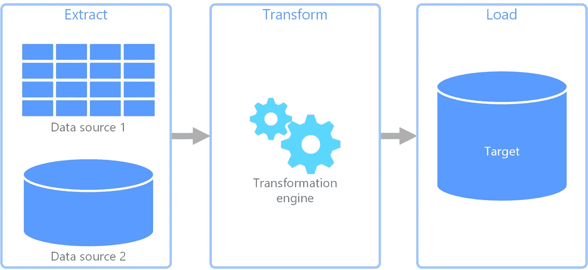
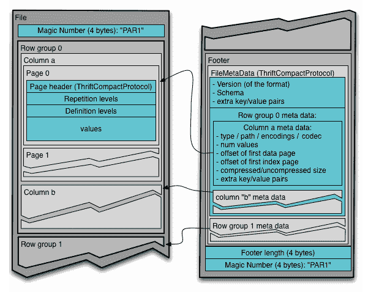
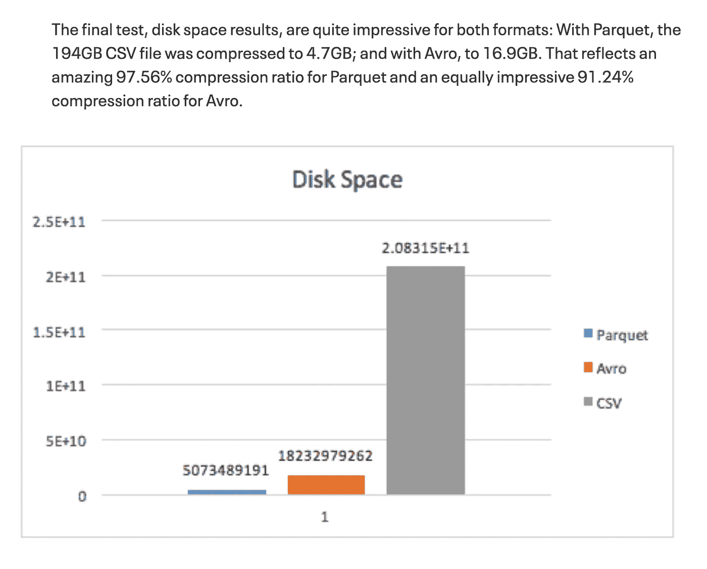
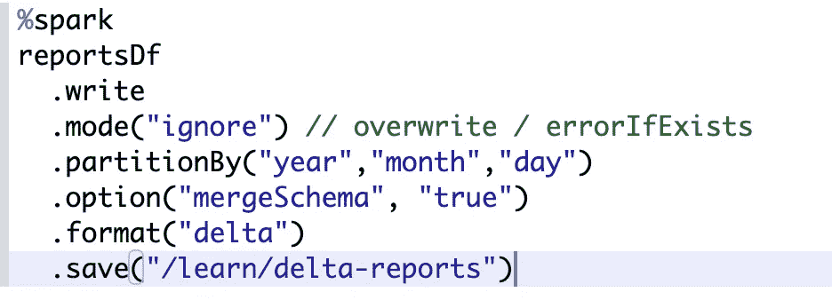
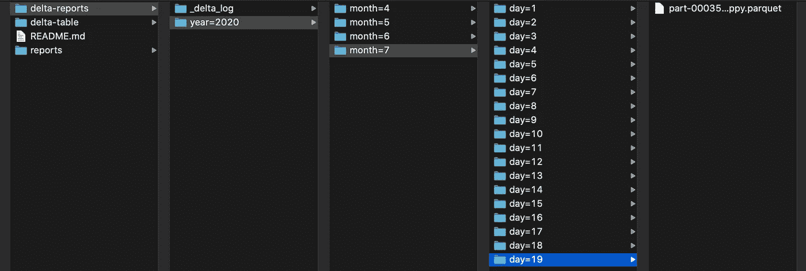
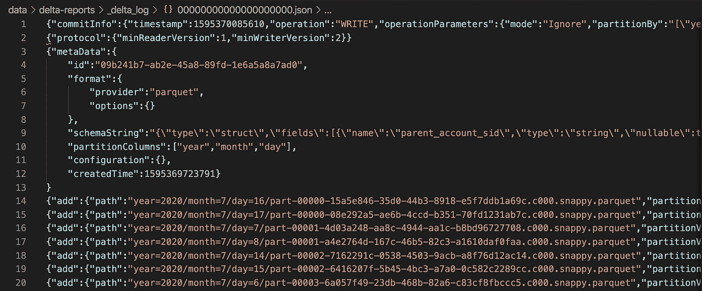
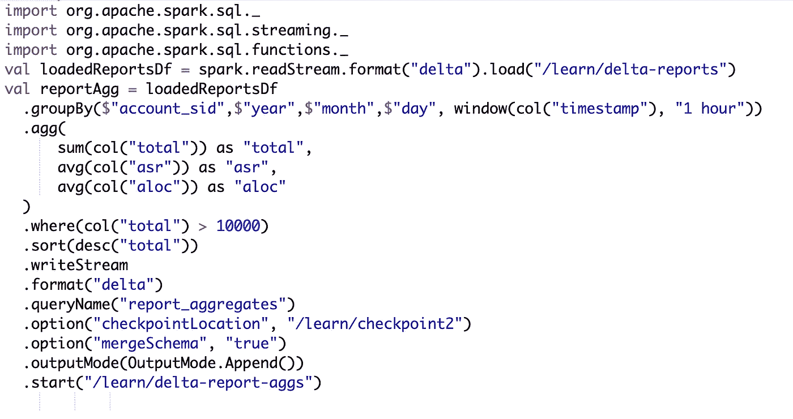
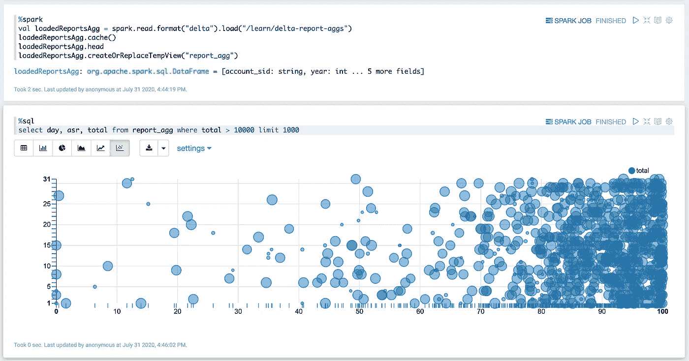

# 从数据湖到数据水库

> 原文：<https://towardsdatascience.com/from-data-lakes-to-data-reservoirs-aa2efebb4f25?source=collection_archive---------22----------------------->

## 使用 Apache Spark 和 Delta Lake 创建干净、美观、受保护的数据资源

混乱中有美。图片来源:Unspalsh [@powwpic](https://unsplash.com/photos/_HHjiseEuGw)

## 数据以各种形状和大小出现

有趣的是，当我们谈论数据时，最好的类比通常植根于水。为了*理解*数据的概念，这是有意义的——数据以各种形状和大小出现——人们倾向于接受抽象。可以说，单个数据记录可以被比作一滴水，许多相同种类(记录类型)的水滴聚集并结合成孤立的数据池(表/目录)，而正是这些池驻留在更大的构造中，该构造是数据湖的主体。

数据湖是一个生态系统，它支持多种类型的记录在无数用例中共存，但从足够高的角度看，它似乎是一个简单的容器，用于存储几乎无限量的数据。

## 拥抱抽象

作为工程师，我们所做的大部分事情都遵循这样的路线:将一个大的概念或者可能是一个更松散的组合“想法”分解成更小的组成部分，以便理解构建一个系统或框架的方法，该系统或框架的*“行为就像】*那个东西。

同样的策略可以应用于您的数据建模方法[中，更一般地说，可以应用于您如何定义表示*事件*、*指标和实体*的结构化数据，甚至更具体地说，可以应用于您希望从您的数据存储中涌现出来的*行为*和*趋势*。这些数据是你对过去发生了什么，现在正在发生什么的时间点镜头，可以作为一个参考框架来预测未来“可能”发生什么。](/storytelling-with-data-40708c129f37)

然而，存储在不完美系统中的完美数据可能会导致大规模甚至灾难性的失败。我喜欢把这看作是*污染了数据湖*。没有人希望这样，过去几年发布了许多新的框架，试图解决与大规模(甚至小规模)运营数据生态系统密切相关的许多陷阱和未知的未知问题。

所以我们来了。我们知道以下为真

1.  数据可以是**复杂的*和*狂野的**。
2.  存储的数据“可以”用于 ***解决未来的问题*** 并提供对过去发生的事情的洞察。
3.  ***数据随时间变化*** 。这可能导致历史数据损坏。不要往井里投毒！
4.  基于水的数据类比几乎和糟糕的双关语一样有趣！

鉴于上述各点。除了第四点，我真的想*深入* *进入*这篇文章的核心，它围绕着将你所知道的*数据湖*转换成我所认为的*数据库*的概念，我还将介绍一些目前正在使用的框架，它们可以帮助你的数据湖增加结构和吸引力，例如 Apache Parquet、Apache Spark、 [*DeltaLake*](https://delta.io/)

## 数据湖的意义是什么？

数据湖。它看起来很有条理，但却建立在一个破碎的想法之上。图片来源:[法比奥哈](https://unsplash.com/@fabioha)Unsplash

数据湖有一个主要目标。这个目标是充当一个廉价的、水平可伸缩的(或无限可伸缩的)集中式筒仓，存储基于文件系统布局“最佳实践”松散组织的原始、半结构化或结构化数据。例如，一些众所周知的最佳实践集中在 a)限制基于单个目录的文件总数，以便快速列出操作，以及 b)遵循可用于将数据分组到可理解的实体中的目录方案。

> 例如 HDFS://insights/*hive/tableName/year = 2020/month = 7/day = 30*。这两种最佳实践相结合，允许使用文件系统快速跳过不相关的数据，而不使用索引，并轻松列出目录中文件的总数。

## 廉价存储

云计算是变革性的，因为它使各种规模的公司能够将服务器和网络的管理工作交给几家真正擅长运行服务器的云提供商。这些相同的云供应商(亚马逊、微软等)随后开始提供基于他们云产品的其他服务，如亚马逊的 S3 和微软的 Blob 存储。这花了一段时间，但最终达成了普遍共识，云足够安全，可以存储宝贵的数据，而不会因为糟糕的备份、糟糕的硬件、糟糕的机架/交换机等而丢失数据，这一新颖的想法开始兴起。公司意识到，他们可以存储所有数据，而成本只是目前内部解决方案的一小部分。

> “如果我们可以存储我们所有*的数据，而成本与我们目前只在所有数据的一小部分上花费的成本相同，那会怎么样”

## 更简单的开发人员操作

这一想法导致了从更昂贵的 [Hadoop](https://hadoop.apache.org/) 集群和为大型企业扩展 Hadoop 的开发-运营团队到**商用存储**和几乎无限的可扩展性的概念的转变。

数据湖采用这种集中式数据存储层的形式，可用作*公司或组织内所有数据的统一暂存平台，通过提取转换加载(ETL) [管道](https://medium.com/97-things/pipe-dreams-78cc50e46dd0)/流程将数据送入更严格、更标准化的数据仓库；传统上运行 SQL 的一些变体(Oracle、MySQL、Postgres、SQL Server ),由于这些 OLAP(在线分析处理)引擎的分析性质，这些变体产生了好几个数量级的响应时间。

本质上，你可以在准备好了的时候 ***解冻你的旧数据*** ，重新读取它并重塑它来解决许多问题，但这并不是典型的情况。

数据湖解决了数据孤岛问题。ETL 为王:图片来源:[微软](https://docs.microsoft.com/en-us/azure/architecture/data-guide/relational-data/etl)

## 白日梦

真正的白日梦是数据湖还可以用来解决未来尚未确定的问题。这到底是什么意思？在缺乏可靠想法的情况下，许多公司会存储数据，希望最终能够使用这些数据。然而，大约 73%的公司存储的数据从未被访问用于分析,我愿意打赌，对于许多公司来说，超过 50%的存储数据从未被访问过一次。

> 公司存储的 73%的数据从未被用于分析…

许多公司围绕如何将数据输入这些数据湖制定了自己的政策，目的是通过提前设计时间并考虑 1 / 3 / 5 年后如何访问数据来保留其数据的未来处理能力。虽然这可能感觉像是不可思议的想法，但也有许多公司决定即兴将半结构化数据或非结构化数据(也称为 JSON 或 CSV)写入许多单独的文件或大的换行(\n)分隔的文件，以便在批量操作期间读取。但是如果没有模式、读/写策略，治理最终会陷入混乱…

## 对许多公司来说，这是蛮荒的西部

就像许多事情一样，那些从最美好的意图开始的事情往往会在没有规则和标准的情况下转变并呈现出新的形态。数据湖很容易变成廉价的、水平可伸缩的、集中式的数据混乱，它的运行没有任何规则或秩序，就像“狂野西部”一样。虽然我们都可以支持牛仔，有时可能会梦想没有规则和条例的生活，但在我们的内心深处，我们最有可能得出类似的结论

> ***“没有规则，就没有秩序感或平衡感”。***

那么，我们如何解决潜在的混乱呢？

# 结构化数据湖:政策、框架和治理

结构化数据湖的出现正在引领一场新的数据革命！图片来源: [sortino](https://unsplash.com/@sortino) 经 [Unsplash](https://unsplash.com/photos/LqKhnDzSF-8)

## 标准的出现

好主意一旦形成，就会像野火一样迅速传播。最近，数据社区已经标准化了至少一种足够好的核心数据格式。这就是文件存储格式 Parquet，我们将进一步了解为什么它是静态数据的绝佳选择。*静态数据只意味着它当前不在活动内存中。*

## 感谢谷歌赠送的拼花地板。

拼花拼花是什么做的？信用: [Apache Parquet](http://parquet.apache.org/documentation/latest/) docs

虽然看起来像某种巫术，但实际上它只是一个执行得非常好的柱状数据存储原语。

当你分解文件格式时，你会看到有行、列和类型。

这允许通过通用格式(模式)封装的大量记录被有效地压缩或压缩到更小的空间中。

例如，如果我有 4000 万条记录存储为 JSON，每条记录的开销在 1-2kb 之间，那么我大概有 40gb 的文件。

现在，如果您使用 JSON 并将其转换为 parquet，您可以预期在文件开销方面节省大约 50–80%。但是除了节省成本之外，还可以轻松地对数据进行分区，并使用 snappy、gzip、lz4 或任何[二进制可拆分压缩](https://dzone.com/articles/compressing-your-big-data-tips-and-tricks)格式进一步压缩。

> 根据经验，我可以说每天大约有 4000-8000 万条中等复杂程度的记录(例如，超过 20 个字段)可以被分解到 128 个分区中，并且存储在 12-24gb 之间！这包括作为快速压缩分区的拼花页眉和页脚，并支持数据集的分布式读取，这非常适合我们的许多用例，这些用例都以 Spark 为中心的数据平台为中心。

Cloudera 基准测试(parquet/avro/csv)。图片来源: [Cloudera](https://blog.cloudera.com/benchmarking-apache-parquet-the-allstate-experience/) :拼花赢了

然而，减小磁盘大小并不是唯一的重大胜利。一旦您的数据被存储为 parquet，您就能够在数据中进行行或列级别的高效跳转—因此，在 4000 万条记录中检索 1-2 条记录可能只需要大约 5 秒钟。在读取实际内容之前，Parquet 能够只读取页脚来检查某些内容是否存在于 parquet 块中。它使用列统计来帮助加速这一直观的行/列级提取和过滤过程。如果你想看看它与 Avro 相比如何，你可以从 [Cloudera](https://medium.com/u/89133b725092?source=post_page-----aa2efebb4f25--------------------------------) 看到这个[基准。](https://blog.cloudera.com/benchmarking-apache-parquet-the-allstate-experience/)

最后，parquet 已经成为当今许多最广泛使用的数据工程和数据分析框架和平台的事实上的标准，如 [Apache Spark](http://spark.apache.org/) (SparkSQL 与 Parquet 进行开箱即用的本地互操作) [Presto](https://prestodb.io/) 、 [DeltaLake](https://delta.io/) 和 [Apache 胡迪](https://hudi.apache.org/)等等。

## Apache Spark 是数据催化剂

Apache Spark 的出现应该感谢它在组织和统一整个数据从业者社区方面接过了接力棒并引领了前进的步伐。 [Databricks](https://medium.com/u/5ae67e7eecef?source=post_page-----aa2efebb4f25--------------------------------) ，Spark 社区背后的公司已经付出了很多努力来保持社区的参与，并继续生产在 Spark 生态系统中运行的令人惊叹的新技术。核心 SparkSQL 引擎的一个较新的补充是一个名为 [DeltaLake](https://delta.io) 的框架，它将原子操作、更新(插入或更新)、合并、删除和附加的条件 SQL 逻辑直接添加到 Spark DSL 中。为与现有数据湖体系结构一起工作而编写的这一微妙的增强带来了最佳实践，包括文件系统布局、操作可观察性以及对增量表中现有记录所做操作的良好审计跟踪支持。

三角洲湖泊生态系统:图片来源:[数据块/三角洲](https://delta.io/)

还记得之前我提出的问题吗:*毒害了数据湖*,以及事物如何需要某种*秩序和治理*才能进化成更伟大的东西。我称之为**数据库**，我相信 DeltaLake 已经准确地标准化了一个数据湖应该如何工作，并在适当的位置设置正确的安全防护，以确保数据湖随着时间的推移保持干净和美丽。让我们深入探讨这是如何可能的。

## 增量模式和文件布局

从第一次写入增量表开始，Spark 就使用与它正在写入数据湖的数据帧相关联的底层 *StructType* 来确保模式将被保留，并且新的写入符合那个*严格模式*或者在写操作时执行一个 *"mergeSchema=true"* 。下面是一个将数据帧写入 Delta 的示例。

以批处理模式将数据帧写入增量。

此操作将与原子提交日志一起存储。

上面操作中的 _delta_log 示例。

DeltaLake 表的其余部分。按年、月、日划分。

这个模式和文件位置元数据存储在所谓的 ***_delta_log*** 中，它存在于你的 **Delta 表**的根中。这个小目录存在于封装您的“表”的文件系统层次结构的根目录旁边。

增量提交日志的示例。信用:自我

现在，对增量表进行的任何附加操作都将具有关于变异的文件、当前表的版本、与该表相关联的模式的信息。这为您提供了观察应用于存储在这个数据湖(DeltaLake)中的数据的操作的机会。

## 在三角洲湖读书轻而易举

借助 Delta，读取和转换用于分析的数据变得非常简单。信用:自我

从上面的代码片段可以看出。从 delta 读取很简单。有趣的是，在上面的查询中，我们没有引用数据的 **load** 命令中的特定路径，我们可以使用所谓的**分区下推**来跳过目录，只扫描六月 *(col("month ")的内容。在上面的 where 子句中，equalTo(6)* 。这利用了文件系统的优势，因此您不必将所有的表实体加载到位。节省时间和金钱。

## 支持批量写入和完全连续流写入

Delta 处理批量读/写和流读/写。太好了。信用:自我

上面是一个从我们之前用批处理创建的增量表创建 readStream 的例子。Delta 带来的新奇事物是批量读/写、流读/写流的混合用例支持。想想 [Airflow](https://airflow.apache.org/) 解决了一些困难的用例——air flow 基本上只是在父作业完成时触发子作业，然而 DeltaLake 允许您生成 spark 作业的复杂**流 DAGS** (有向无环图),如果您喜欢 Spark，这会让您有点流口水。Spark to the rescue 解决您所有与 Spark 相关的需求。

[Zeppelin](https://zeppelin.apache.org/) 视图:展示了如何使用批处理查询从流表中读取数据(参见上面的查询以查看窗口写流)

你可能有一些上游作业需要完成，以便下游作业能够继续工作，就像传统的数据传送带一样。现在，您可以利用完整的端到端流系统来编排这种体验——把它视为您的数据传承管道——您的数据工程工作变得越来越简单。

鉴于当今数据生态系统中的数据湖需要能够进行近乎实时的插入/上插/合并、准确的历史分析、高效的 ETL 到机器学习作业和更快的在线特征存储中，并且还需要成为可靠可信数据的支柱，那么单独使用 DeltaLake 就可以解决所有这些用例。我认为这是数据工程和分析的瑞士军刀，是 ETL 到更快的内存数据存储(如 Redis 或 ElasticSearch，取决于您的数据检索 SLA)的坚实基础。

## 结论

传统的数据湖通常是非结构化或半结构化的，数据的质量与向数据湖发布数据的团队一样好。随着时间的推移，这个过程很容易被污染和破坏，导致可怕的数据湖中毒。

您可以通过依赖您可能已经在使用的系统(S3、Apache Spark，也许 parquet 已经出现或者您已经在使用 Parquet)来解决您未来的未知问题，DeltaLake 只是让您更容易以标准和结构化的方式快速移动。在整个组织中处理数据时，将快乐带回桌面。

干杯。