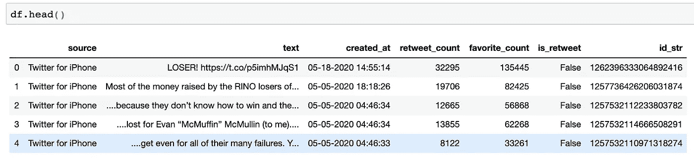
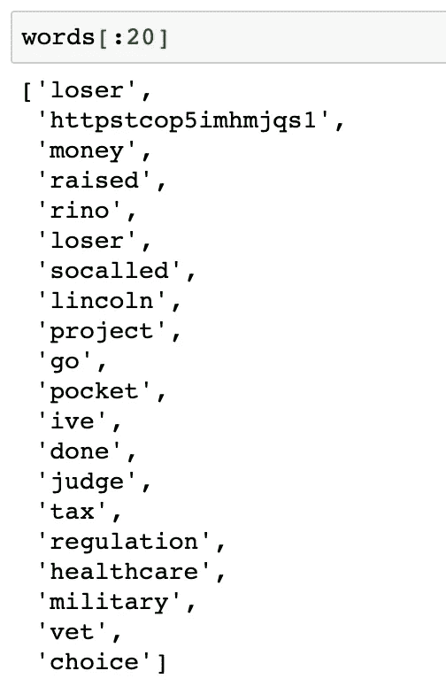
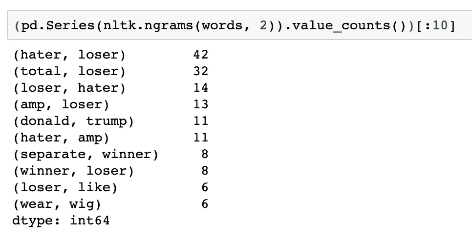
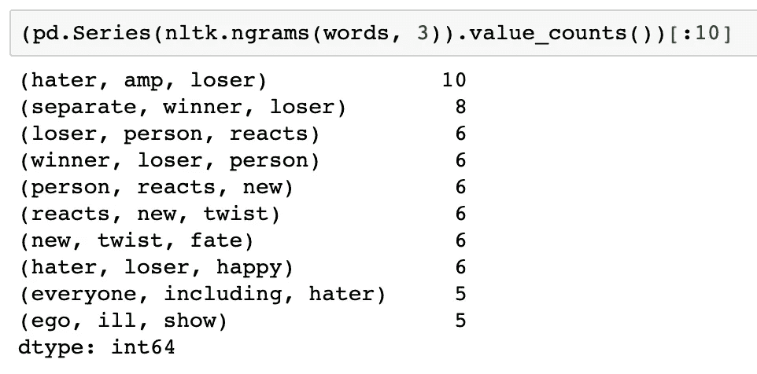
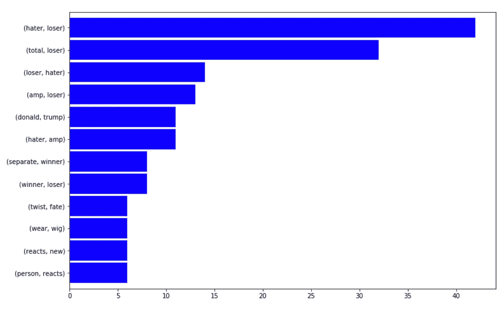
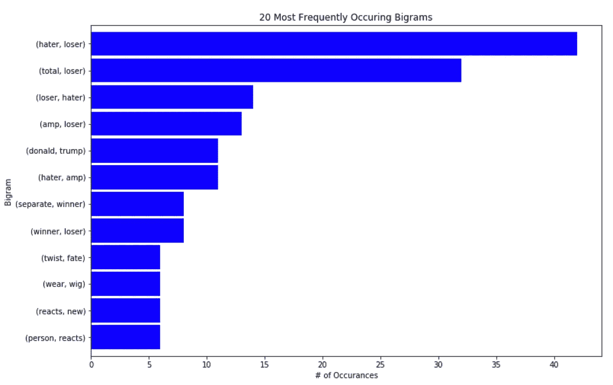

# 从数据框架到 N 元语法

> 原文：<https://towardsdatascience.com/from-dataframe-to-n-grams-e34e29df3460?source=collection_archive---------5----------------------->

## 数据科学/ Python NLP 片段

## 使用 nltk 为自然语言处理创建和可视化 n 元语法排序的快速入门指南。


坦纳·马迪斯在 Unsplash[拍摄的照片](https://unsplash.com/s/photos/texts?utm_source=unsplash&utm_medium=referral&utm_content=creditCopyText)

*当我第一次开始学习 NLP 的时候，我记得我被信息过载弄得沮丧或害怕，所以我决定写一篇涵盖最基本内容的帖子。你知道他们说什么，“先走后跑！”*

这是一个非常温和的介绍，所以我们不会在这里使用任何花哨的代码。

简而言之，自然语言处理或 NLP 简单地指使用计算机阅读和理解书面或口头语言的过程。举个最简单的例子，我们可以用电脑来阅读一本书，并计算每个单词被使用了多少次，而不是我们手动去做。

NLP 是一个很大的话题，已经有很多关于这个主题的文章，所以我们在这里不做介绍。相反，我们将关注如何快速实现 NLP 中最简单但有用的技术之一:N 元语法排序。

# n 元语法排序

简单地说，一个 n-gram 是一个由 *n* 个字组成的序列，其中 *n* 是一个范围从 1 到无穷大的离散数字！例如，单词“cheese”是 1-gram (unigram)。单词“奶酪味”的组合是一个 2 克(双字母)。同样，“奶酪风味小吃”是一个 3 克(三元组)。而“终极芝士味零食”是 4 克(qualgram)。如此等等。

在 n-gram 排名中，我们只是根据 n-gram 在文本主体中出现的次数对其进行排名，无论是一本书、一组推文还是贵公司客户留下的评论。

我们开始吧！

# 获取数据

首先，让我们获取数据并将其加载到 dataframe 中。你可以在这里下载样本数据集或者从[特朗普推特档案](http://www.trumptwitterarchive.com/archive)创建你自己的数据集。

```
import pandas as pddf = pd.read_csv('tweets.csv')
```

使用`df.head()`我们可以快速熟悉数据集。



特朗普总统的推文样本。

# 导入包

接下来，我们将导入包，以便正确设置我们的 Jupyter 笔记本:

```
# natural language processing: n-gram ranking
import re
import unicodedata
import nltk
from nltk.corpus import stopwords# add appropriate words that will be ignored in the analysis
ADDITIONAL_STOPWORDS = ['covfefe'] import matplotlib.pyplot as plt
```

在上面的代码块中，我们导入了熊猫，这样我们就可以用各种不同的奇妙方式来塑造和操作我们的数据！接下来，我们为 regex 导入了`re`，为 Unicode 数据导入了`unicodedata`，并导入了`nltk`来帮助解析文本并稍微清理一下。然后，我们指定了我们想要忽略的额外的停用词。这有助于降低噪音。最后，我们导入了`matplotlib` matplotlib，这样我们可以在以后可视化我们的 n 元排序的结果。

接下来，让我们创建一个执行基本数据清理的函数。

# 基本清洁

```
def basic_clean(text):
  """
  A simple function to clean up the data. All the words that
  are not designated as a stop word is then lemmatized after
  encoding and basic regex parsing are performed.
  """
  wnl = nltk.stem.WordNetLemmatizer()
  stopwords = nltk.corpus.stopwords.words('english') + ADDITIONAL_STOPWORDS
  text = (unicodedata.normalize('NFKD', text)
    .encode('ascii', 'ignore')
    .decode('utf-8', 'ignore')
    .lower())
  words = re.sub(r'[^\w\s]', '', text).split()
  return [wnl.lemmatize(word) for word in words if word not in stopwords]
```

上面的函数接受一列单词或文本作为输入，并返回一组更清晰的单词。该函数执行规范化、编码/解码、小写和词汇化。

让我们使用它！

```
words = basic_clean(''.join(str(df['text'].tolist())))
```

上面，我们只是简单地调用函数`basic_lean()`来处理我们的数据帧`df`的`'text'`列，并使它成为一个带有`tolist()`的简单列表。然后我们将结果分配给`words`。



已经清理、规范化和词条化的单词列表。

# N-grams

有趣的部分来了！在一行代码中，我们可以找出哪些二元模型在这个特定的 tweets 样本中出现得最多。

```
(pd.Series(nltk.ngrams(words, 2)).value_counts())[:10]
```



我们可以很容易地将数字 2 替换为 3，这样我们就可以得到前 10 个三元模型。

```
(pd.Series(nltk.ngrams(words, 3)).value_counts())[:10]
```



瞧啊。我们给自己开了个好头。但是为什么现在停止呢？让我们尝试一下，做一个小眼睛糖果。

# 奖励回合:可视化

为了让事情变得简单一点，让我们将 n 元语法的结果赋给具有有意义名称的变量:

```
bigrams_series = (pd.Series(nltk.ngrams(words, 2)).value_counts())[:12]trigrams_series = (pd.Series(nltk.ngrams(words, 3)).value_counts())[:12]
```

我用`[:12]`替换了`[:10]`,因为我希望结果中有更多的 n-grams。这是一个任意值，因此您可以根据自己的情况选择对您最有意义的值。

让我们创建一个水平条形图:

```
bigrams_series.sort_values().plot.barh(color='blue', width=.9, figsize=(12, 8))
```



让我们通过添加标题和轴标签来美化一下:

```
bigrams_series.sort_values().plot.barh(color='blue', width=.9, figsize=(12, 8))
plt.title('20 Most Frequently Occuring Bigrams')
plt.ylabel('Bigram')
plt.xlabel('# of Occurances')
```



就是这样！通过几行简单的代码，我们很快从一个熊猫数据帧中制作了一个 n-grams 的排序，甚至制作了一个水平条形图。

我希望你喜欢这个。自然语言处理是一个很大的话题，但是我希望这个温和的介绍将鼓励你探索更多并扩展你的技能。

*在下一篇文章中，我们将* [*可视化一个 n-gram 在 Power BI*](/create-an-n-gram-ranking-in-power-bi-b27ba076366) *中的排名，只需简单地点击几下鼠标和一小段 Python！*

*敬请期待！*

你可以通过推特或 T2【LinkedIn】联系我。