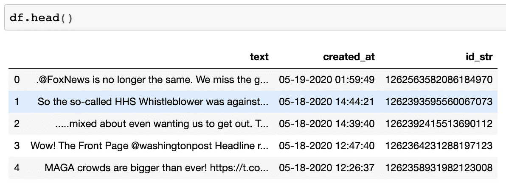
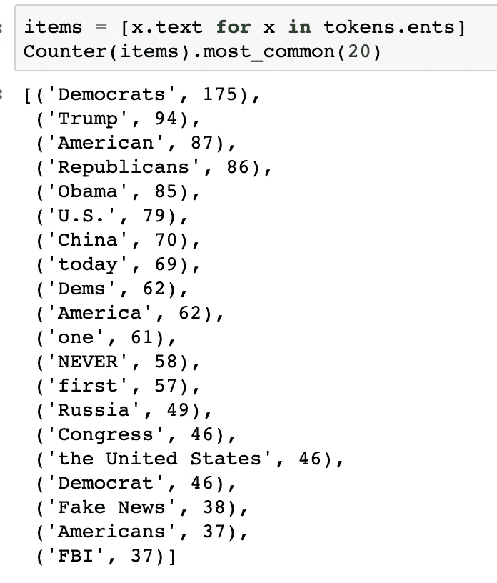
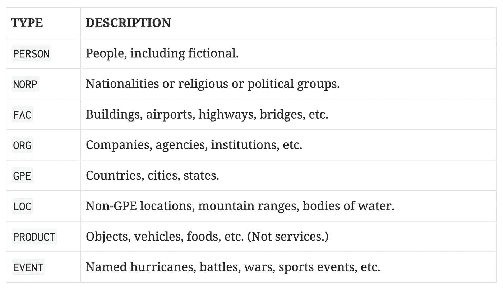
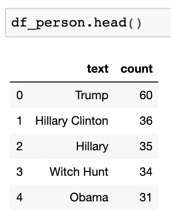
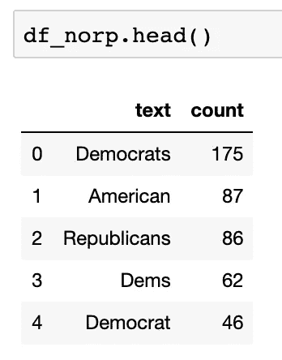
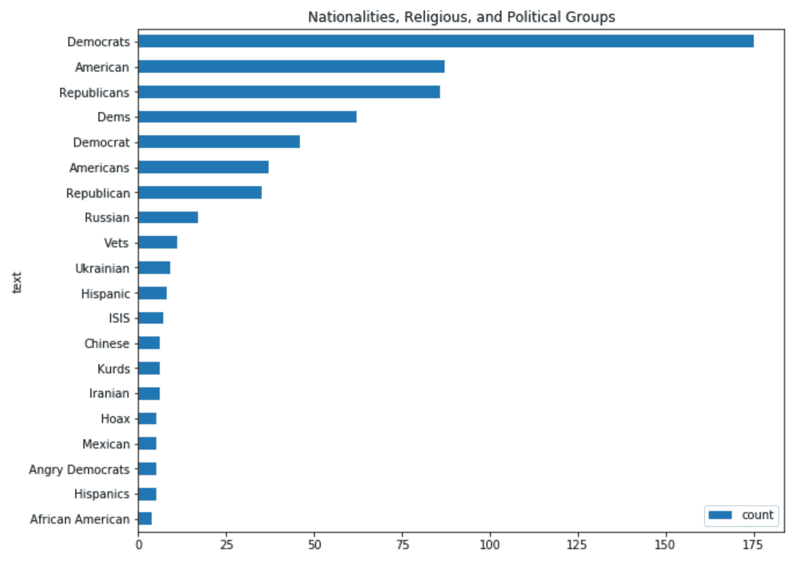

# 从数据帧到命名实体

> 原文：<https://towardsdatascience.com/from-dataframe-to-named-entities-4cfaa7251fc0?source=collection_archive---------15----------------------->

## 数据科学/ Python NLP 片段

## 使用 spaCy 从 Pandas 数据帧中提取命名实体的快速入门指南。


由[韦斯利·廷吉](https://unsplash.com/@wesleyphotography?utm_source=unsplash&utm_medium=referral&utm_content=creditCopyText)在 [Unsplash](https://unsplash.com/s/photos/organizations?utm_source=unsplash&utm_medium=referral&utm_content=creditCopyText) 上拍摄的照片

很久以前，在一个遥远的星系，我在分析客户留下的评论时，注意到他们似乎更多地提到了特定的公司。这给了我一个想法。也许有一种方法可以从评论中提取公司的名称，我可以量化它们并进行进一步的分析。

有！输入:*命名实体识别*。

# 命名实体识别

根据维基百科，命名实体识别或 NER“是信息提取的子任务，旨在定位非结构化文本中提到的命名实体并将其分类为预定义的类别，如人名、组织、位置、医疗代码、时间表达式、数量、货币值、百分比等。”换句话说，NER 试图提取归类为专有名词甚至数字实体的单词。

在这篇文章中，我将分享让我们使用 spaCy 从 Pandas 数据帧中提取命名实体的代码，spaCy 是一个开源库，提供 Python 中工业级的自然语言处理，是为生产使用而设计的。

首先，让我们使用以下 pip 命令安装 spaCy:

```
pip install -U spacy
```

之后，让我们下载英语的预训练模型:

```
python -m spacy download en
```

解决了这个问题，让我们打开 Jupyter 笔记本，开始吧！

# 进口

将下面的代码块运行到一个单元格中，以将所有必需的导入内容导入到我们的 Python 环境中。

```
# for manipulating dataframes
import pandas as pd# for natural language processing: named entity recognition
import spacy
from collections import Counter
import en_core_web_sm
nlp = en_core_web_sm.load()# for visualizations
%matplotlib inline
```

这个块中重要的一行是`nlp = en_core_web_sm.load()`,因为这是我们稍后将用来从文本中提取实体的。

# 获取数据

首先，让我们获取数据并将其加载到 dataframe 中。如果你想跟进，请在这里下载样本数据集或从 [Trump Twitter 档案](http://www.trumptwitterarchive.com/archive)创建你自己的数据集。

```
df = pd.read_csv('ever_trump.csv')
```

在单元中运行`df.head()`将使我们快速熟悉数据集。



# 获取代币

其次，让我们创建将作为 spaCy 输入的令牌。在下面一行中，我们创建了一个变量`tokens`，它包含了`df`数据帧的`'text'`列中的所有单词。

```
tokens = nlp(''.join(str(df.text.tolist())))
```

第三，我们要提取实体。我们现在只能提取最常见的实体:

```
items = [x.text for x in tokens.ents]
Counter(items).most_common(20)
```



作者截图

# 提取命名实体

接下来，我们将根据类别提取实体。我们有几个选择，从人到事件甚至组织。要获得 spaCy 提供的所有内容的完整列表，请查看他们关于[命名实体](https://spacy.io/api/annotation#named-entities)的文档。



作者截图

首先，我们将使用`PERSON`类型提取人(真实的和虚构的)。

```
person_list = []for ent in tokens.ents:
    if ent.label_ == 'PERSON':
        person_list.append(ent.text)

person_counts = Counter(person_list).most_common(20)df_person = pd.DataFrame(person_counts, columns =['text', 'count'])
```

在上面的代码中，我们用`person_list = []`创建了一个空列表。

然后，我们利用一个 for 循环来遍历在带有`tokens.ents`的令牌中找到的实体。之后，我们创建了一个条件，如果实体标签等于`PERSON`类型，它将追加到先前创建的列表中。

我们想知道某个`PERSON`类型的实体在令牌中出现了多少次，所以我们对`person_counts = Counter(person_list).most_common(20)`进行了处理。这一行将给出这种类型的前 20 个最常见的实体。

最后，我们创建了`df_person`数据帧来存储结果，这是我们得到的结果:



作者截图

我们将为识别国籍、宗教和政治团体的`NORP`类型重复相同的模式。

```
norp_list = []for ent in tokens.ents:
    if ent.label_ == 'NORP':
        norp_list.append(ent.text)

norp_counts = Counter(norp_list).most_common(20)df_norp = pd.DataFrame(norp_counts, columns =['text', 'count'])
```

这是我们得到的结果:



作者截图

# 奖励回合:可视化

让我们创建一个`df_norp`数据帧的水平条形图。

```
df_norp.plot.barh(x='text', y='count', title="Nationalities, Religious, and Political Groups", figsize=(10,8)).invert_yaxis()
```



作者截图

瞧，就是这样！

我希望你喜欢这个。自然语言处理是一个巨大的话题，但是我希望这个温和的介绍将鼓励你探索更多，扩展你的技能。

*敬请期待！*

你可以在 Twitter 或 LinkedIn 上找到我。

[1]:维基百科。(2020 年 5 月 22 日)。*命名实体识别*[https://en.wikipedia.org/wiki/Named-entity_recognition](https://en.wikipedia.org/wiki/Named-entity_recognition)

[2]: spaCy。(2020 年 5 月 22 日)。【https://spacy.io/】工业级自然语言处理中的 PythonT23