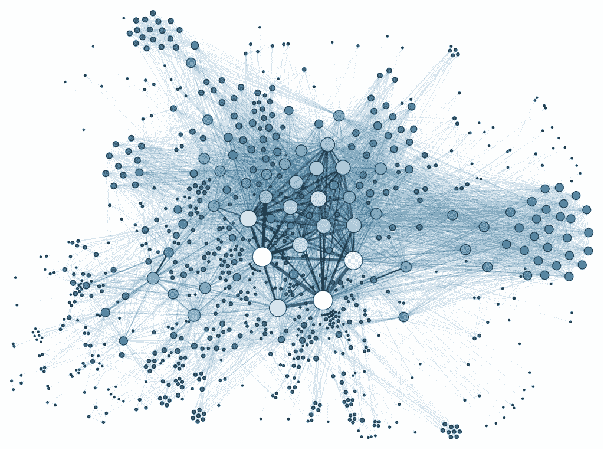

# 从数据框架到网络图

> 原文：<https://towardsdatascience.com/from-dataframe-to-network-graph-bbb35c8ab675?source=collection_archive---------1----------------------->

## 数据科学/ Python 代码片段

## 使用 networkx 和 matplotlib 可视化熊猫数据帧的快速入门指南。


照片由 [Alina Grubnyak](https://unsplash.com/@alinnnaaaa?utm_source=unsplash&utm_medium=referral&utm_content=creditCopyText) 在 [Unsplash](https://unsplash.com/s/photos/networks?utm_source=unsplash&utm_medium=referral&utm_content=creditCopyText) 上拍摄

*我非常偶然地发现了如何从 JIRA 导出数据，于是我开始想办法将信息可视化，并从数据集中收集一些见解。我偶然发现了网络图的概念，这个想法很快抓住了我的想象力。我意识到我不仅可以用它来讲述人与人之间的关系，还可以用它来讲述单词之间的关系。但是 NLP 是个大话题，我们先走后跑怎么样？！*

这只是一个非常温和的介绍，所以我们不会在这里使用任何花哨的代码。

网络图“显示了一组实体之间的互连”，其中实体是`nodes`，它们之间的连接通过链接或`edges`来表示。在下图中，点是节点，线称为边。



马丁·格兰让/CC BY-SA([https://creativecommons.org/licenses/by-sa/3.0](https://creativecommons.org/licenses/by-sa/3.0))

在这篇文章中，我将分享一些代码，这些代码将让我们使用一个流行的网络图包来快速可视化熊猫数据帧: [networkx](https://networkx.github.io/) 。

首先，让我们获取数据并将其加载到 dataframe 中。你可以在这里下载样本数据集[。](https://github.com/ecdedios/networkx-quick-start)

```
import pandas as pddf = pd.read_csv('jira_sample.csv')
```

其次，让我们裁剪数据帧，只包含我们想要检查的列。在这种情况下，我们只需要“受托人”和“报告人”列。

```
df1 = df[['Assignee', 'Reporter']]
```

第三，是时候创建图形将要存在的世界了。如果你还没有安装，通过快速的`pip install networkx`来安装 networkx 包。

```
import networkx as nxG = nx.Graph()
```

然后，让我们用来自`df1`数据帧的`'Assignee'`和`'Reporter'`列填充图表。

```
G = nx.from_pandas_edgelist(df1, 'Assignee', 'Reporter')
```

接下来，我们将在 matplotlib 的帮助下具体化我们创建的图表以进行格式化。

```
from matplotlib.pyplot import figurefigure(figsize=(10, 8))
nx.draw_shell(G, with_labels=True)
```

上面这个块中最重要的一行是`nx.draw_shell(G, with_labels=True)`。它告诉计算机使用打开实体标签的 shell 布局来绘制图形`G`。

瞧啊。我们得到了一个网络图:


马上，我们可以告诉有一个来自三个主要玩家的台词高度集中，“芭比娃娃”，“苏珊·李”和“乔·苹果籽”。当然，为了保险起见，用一些硬数字来证实我们的“目测”总是一个好主意。

**奖励回合**

让我们看看“芭比娃娃”。

```
G['barbie.doll']
```


要查看“芭比娃娃”有多少联系，让我们使用`len()`:

```
len(G['barbie.doll'])
```

接下来，让我们创建另一个显示节点及其连接数的数据框架。

```
leaderboard = {}for x in G.nodes:
 leaderboard[x] = len(G[x])s = pd.Series(leaderboard, name='connections')df2 = s.to_frame().sort_values('connections', ascending=False)
```

在上面的代码块中，我们首先初始化了一个名为“leaderboard”的空字典，然后使用一个简单的 for 循环将名称和连接数填充到字典中。然后，我们从字典中创建了一个系列。最后，我们从使用`to_frame()`创建的系列中创建了另一个数据帧。

要显示数据框，我们只需使用`df2.head()`，我们就有了自己的排行榜！


就是这样！通过几行简单的代码，我们很快就从熊猫的数据帧中制作了一个网络图，甚至显示了一个带有名称和连接数的表格。

我希望你喜欢这个。网络图分析是一个大话题，但我希望这个温和的介绍将鼓励你探索更多和扩大你的曲目。

*在下一篇文章中，我将通过 Power BI 的自定义可视化工具“网络导航器”到* [*创建一个网络图*](/create-a-network-graph-in-power-bi-be232991ee06) *，只需简单地点击几下鼠标。*

*敬请期待！*

你可以在 Twitter 或 LinkedIn 上找到我。

[1]:数据到即(2020 年 5 月 15 日)。【https://www.data-to-viz.com/graph/network.html】网络图网络图[网络图](https://www.data-to-viz.com/graph/network.html)