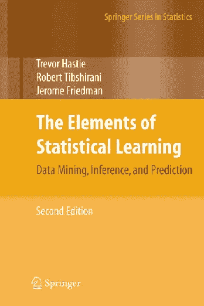
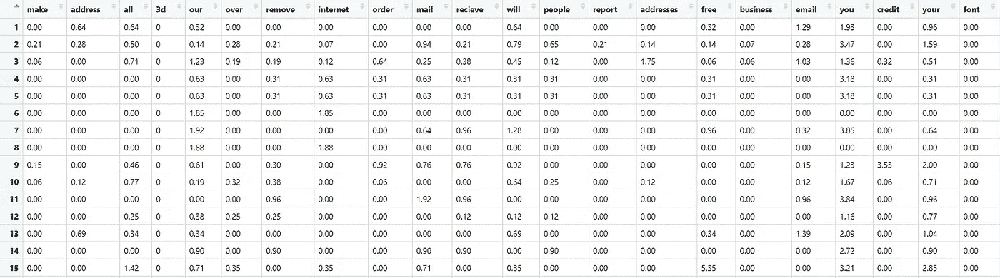
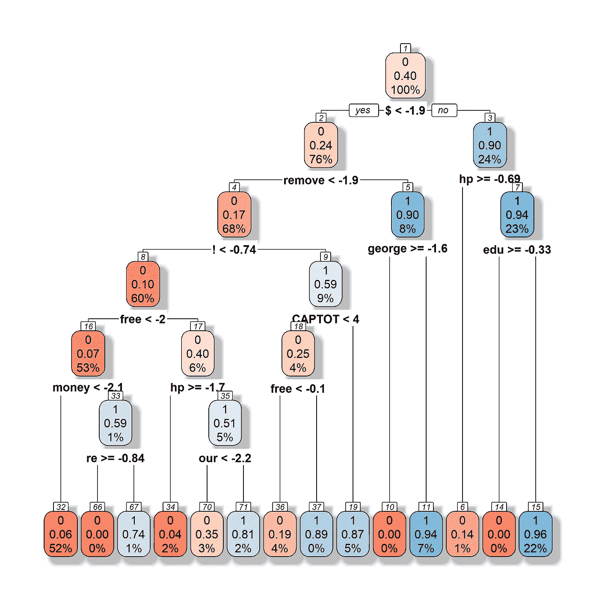
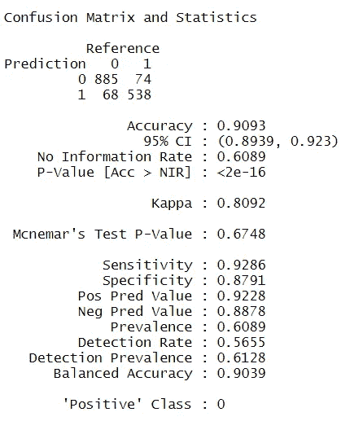
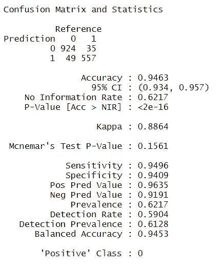
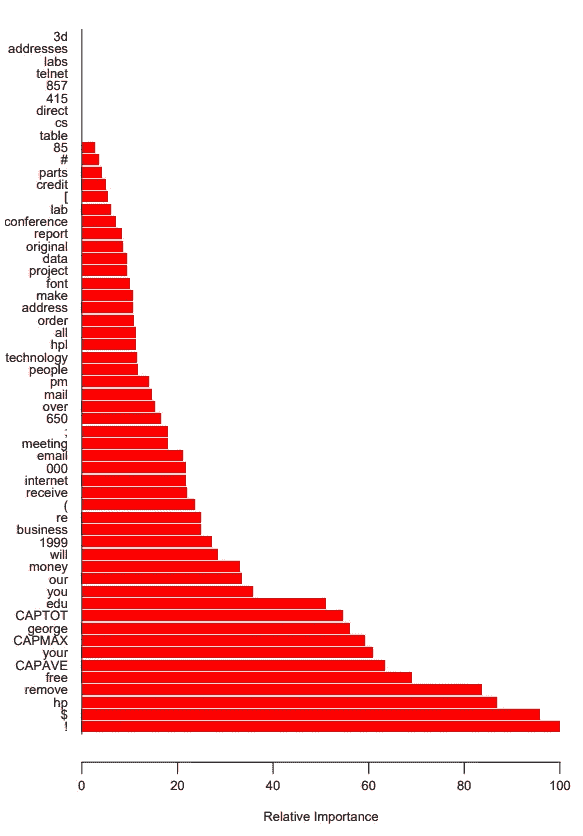
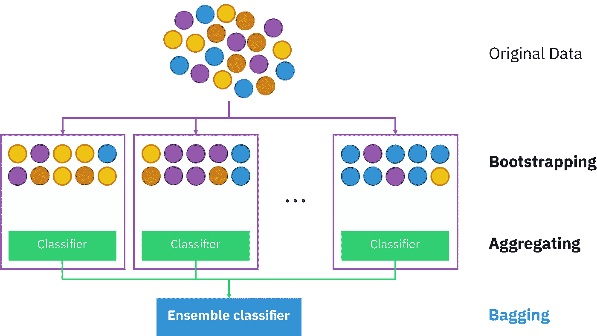
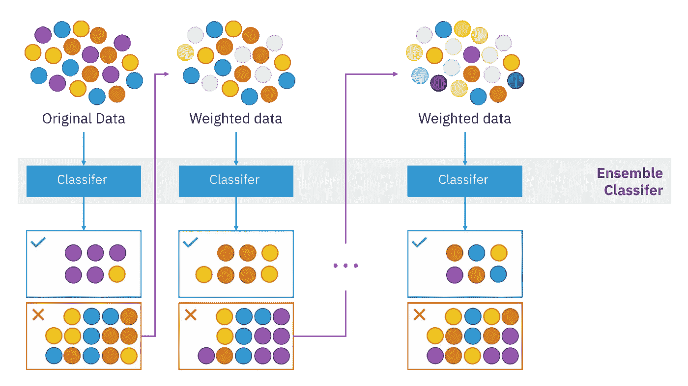
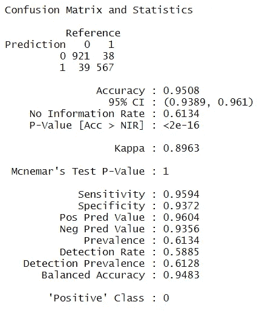

# 从决策树和随机森林到梯度推进

> 原文：<https://towardsdatascience.com/from-decision-trees-and-random-forests-to-gradient-boosting-6c7dabc516c3?source=collection_archive---------26----------------------->

## 在垃圾邮件数据集上回顾机器学习中的关键概念

图 1:图片引用:Brett Jordan 在 Unsplash 上的照片。

假设我们希望对分类问题执行监督学习，以确定传入的电子邮件是垃圾邮件还是非垃圾邮件。 [*垃圾邮件数据集*](https://archive.ics.uci.edu/ml/datasets/spambase) 由 4601 封电子邮件组成，每封都被标记为真实(或非垃圾邮件)(0)或垃圾邮件(1)。该数据还包含大量预测值(57)，每个预测值或者是字符数，或者是某个单词或符号的出现频率。在这篇短文中，我们将简要介绍基于树的分类的主要概念，并比较和对比最流行的方法。

在[统计学习的要素，第二版](https://web.stanford.edu/~hastie/ElemStatLearn/datasets/spam.info.txt)中详细介绍了这个数据集和几个工作示例。

图 2:统计学习的要素第二版。图片引用:[https://web.stanford.edu/~hastie/ElemStatLearn/](https://web.stanford.edu/~hastie/ElemStatLearn/)

# 数据:

垃圾邮件数据集由 4601 个观察值组成，响应为 **Y** ，不是垃圾邮件(0)也不是垃圾邮件(1)。该数据还包括 57 个预测值 **x** 。每个预测值反映了电子邮件中某个单词或字母或某个符号的频率。例如大写字母的总数，符号“$”的频率等。看一看原始数据的样本。

图 3:垃圾邮件数据集的前 15 个观察值和前几列。图片来自作者。

请注意，预测值非常小，似乎有许多零数据点。在拟合模型来帮助处理这个问题之前，我们对预测值进行对数变换。我们将ε0.1 添加到我们的日志中，以确保我们不会试图取 0 的日志。

我们还将数据集随机分为训练集和测试集。稍后我们将使用测试集来评估我们的模型性能。

# **决策树:**

用于分类的决策树是最古老和最简单的机器学习算法之一。由于直观的解释，它们很受欢迎。然而，在实践中，他们倾向于*过度拟合*训练数据，这导致在试图进行预测时表现不佳(也称为高方差问题)。r 允许我们很容易地用 *rpart* 函数来拟合决策树。有几种方法来决定什么是“好”或“最好”的树，但通常我们使用 [*基尼杂质*](https://www.geeksforgeeks.org/gini-impurity-and-entropy-in-decision-tree-ml/) *。理想情况下，一个终端节点应该只包含一个类。混合得越多，就越不“纯粹”,树在新数据上的表现就越差。*

该函数构建了几棵树，在每个点上，我们根据预测值向左或向右移动。我们可以看到，在我们的训练数据中,“$”似乎是确定电子邮件是否为垃圾邮件的最重要特征。根据' $ '的不同，我们要么向左，在这一点上检查' remove '，要么向右，在这一点上查看' hp '。不管我们的路径如何，我们最终会到达一个终端节点，在那里我们的电子邮件被分类为垃圾邮件(1)或非垃圾邮件(0)。在我们的根节点，我们有 100%的训练样本。根据 log 的值($+0.1)，我们要么向左(76%的情况下发生)，要么向右(24%的情况下发生)。中间的数字代表那个节点的‘杂质’。我们的根节点有大约 40%的杂质，因为我们的训练数据包含大约 40%的垃圾邮件。

图 4:适合垃圾邮件数据的简单决策树。符合对数(预测值+0.1)。在每次分割时，我们查看预测器来确定我们下一步要去哪一侧。作者使用 r。

一旦我们将模型拟合到我们的训练数据，我们就可以看到它在我们的测试数据上的表现。这是通过把我们的新例子放入树中并遵循指示的路径来完成的。为了评估性能，我们检查混淆矩阵。我们获得了相当高的 91%的测试准确度。

图 5:我们混淆矩阵的总结。我们使用一个简单的决策树获得了低于 91%的准确率。图片来自作者。

# 随机森林和装袋:

在决策树中，我们的算法构建了几棵树，并选择了一棵我们认为是“最好”的树。然后，我们用这一棵树对新邮件进行预测。 *Brieman* 通过引入两个关键概念，对这些简单模型进行了大幅改进。首先是**装袋或引导聚集**，最后是**随机森林**。这些组合了许多(数百或数千)树，我们从我们的观察和预测中随机抽取样本来形成新的树。

随机森林通过对多棵树进行平均，极大地减少了过度拟合的可能性(即减少了方差)，这有时被称为*群体智慧。*

Hastie 在一次演讲中描述了以下内容(参考资料链接):

*   Bagging (Breiman，1996):“*将许多大树拟合到训练数据的自助重采样版本，并通过多数投票进行分类。”*
*   *(布雷曼 1999) *:“更好的装袋版本”**

*本质上，随机森林利用套袋形成数百棵树。由于 bagging 的定义排除了一些模型中的某些观察值，我们可以使用不包含某个观察值的树来获得“超出 bagging 误差”的估计值。我们还可以通过观察哪些预测因子在许多树中始终是重要的，来获得对最重要特征的估计。注意，自举聚合通常会导致预测值的去相关。因此，如果我们有一些基本相同的预测器，随机森林应该能够梳理出这些预测器，并且只保留一个副本。*

**

*图 6:使用 randomForest 函数的测试数据的混淆矩阵。图片来自作者。*

*我们使用 R 中的 randomForest 包来拟合一个模型。我们还可以保留我们的树中包含最多的变量，这允许我们可视化“变量重要性”。我们将准确率从不到 91%提高到了 94.6%。*

**

*图 7:可变的重要性。统计学习的要素，第二版。[https://web.stanford.edu/~hastie/ElemStatLearn/](https://web.stanford.edu/~hastie/ElemStatLearn/)*

*随机森林的一个伟大之处在于，它们还允许我们保留预测者的“相对重要性”。图 7 总结了在确定垃圾邮件时哪些符号/单词是重要的，哪些是不重要的。*

# *梯度提升:*

*   *Boosting (Freund & Shapire，1996): *“使许多大树或小树适合训练数据的重新加权版本。按加权多数票分类。”——*哈斯蒂。*

*梯度推进是对随机森林的一种改进(如果你调整好超参数的话)。现在，我们不再仅仅拟合引导聚合树，而是考虑中间树的表现。使用这些中间树，我们调整未来树的权重(我们对某些树的权重大于其他树)。这可以认为是*重复拟合我们模型的残差。*我们从一个基本模型开始，看看它如何预测新的观察结果。残差是我们在预测方面做得不好的地方，所以我们将我们的下一棵树拟合到这些残差，以此类推，以说明我们做得不好的地方(我们也不使用 bagging，而是用替换进行采样)。梯度推进也倾向于创建许多“浅”树。也就是说，它们包含一个根节点和少量的后续分割。通常，他们只包含一个单一的分裂，这些被称为“树桩”或“弱学习者”。*

*   **“梯度提升继承了树的所有好的特征(变量选择、缺失数据、混合预测器)，对弱的特征进行了改进，比如预测性能。”——*特雷弗哈斯蒂*

**

*图 8:说明装袋的图像。图片引用:[知识共享。](https://commons.wikimedia.org/wiki/File:Ensemble_Bagging.svg)*

*图 8 示出了上面讨论的装袋。装袋可以被视为一种并行工作的算法。也就是说，装袋是通过选择多个同时替换的器械包来完成的。*

**

*图 9:展示了一般的增强方法。[图片引用:知识共享。](https://commons.wikimedia.org/wiki/File:Ensemble_Boosting.svg)*

*装袋和助推是不一样的。如图 8 所示，Bagging 是并行完成的，用于形成几组观察值来构建模型。Boosting 实际上使用中间树来调整计算最终预测时使用的权重。如图 9 所示，boosting 不是并行完成的，它会随着进程更新权重。*

*我们使用 R 包“gbm”对数据集进行梯度增强。使用梯度增强进行拟合需要*

*超参数 n.trees、interaction.depth 和 shrinkage 可以使用网格搜索和交叉验证来调整。我们将相互作用深度设置为 6，这允许六阶相互作用。*

**

*图 9:我们使用梯度增强获得了最佳精度，精度超过 95%。图片来自作者。*

*我们已经将测试数据的准确率提高到了 95%以上！*

# *总结:*

*基于树的分类仍然是当今使用的最流行的算法之一，主要是因为它易于解释并且能够处理大量的预测值。决策树是基于树的方法中最基本的，并且可以容易地解释，但是非常容易在训练数据上过度拟合。幸运的是，这些年来已经有了一些改进来解决简单决策树所面临的弱点。随机森林利用 Bagging (Bootstrap Aggregation)来获得许多树，并使用群体的*智慧来获得较低的方差预测。提升树通过考虑中间树的表现进一步改进了以前的算法，并调整树以在它们以前表现不佳的地方表现得更好(并对强大的树加权更多)。所有这些技术和方法都很容易在 R、Python 和其他编码语言中使用。尤其是梯度推进仍然是机器学习竞赛中最受欢迎的算法之一，例如 Kaggle 上举办的那些竞赛。**

*我希望这篇文章提供了这些基本 ML 技术的广泛概述和简单示例。感谢阅读！*

# *代码:*

*   *【https://github.com/Robby955/spam 号*

# *来源:*

*[1]特雷弗·哈斯蒂的演讲，*助推*，[https://www.cc.gatech.edu/~hic/CS7616/pdf/lecture5.pdf](https://www.cc.gatech.edu/~hic/CS7616/pdf/lecture5.pdf)*

*[2]利奥·布雷曼(1996 年)。打包预测值。*机器学习**

*[3]利奥·布雷曼(2001 年)。随机森林。*机器学习**

*[4] [哈斯蒂，提比拉尼，弗里德曼(2009)。统计学习的要素 2。](https://web.stanford.edu/~hastie/ElemStatLearn/)*

*[5]j . h .弗里德曼(2002 年)。随机梯度增强。*计算统计&数据分析*， *38* (4)，367–378。*

*[6] Liaw，a .，& Wiener，M. (2002 年)。randomForest 分类和回归。 *R 新闻*， *2* (3)，18–22。*

*[7]杰努尔、波吉、J. M .和图洛-马洛特(2010 年)。使用随机森林的变量选择。*模式识别字母*， *31* (14)，2225–2236。*